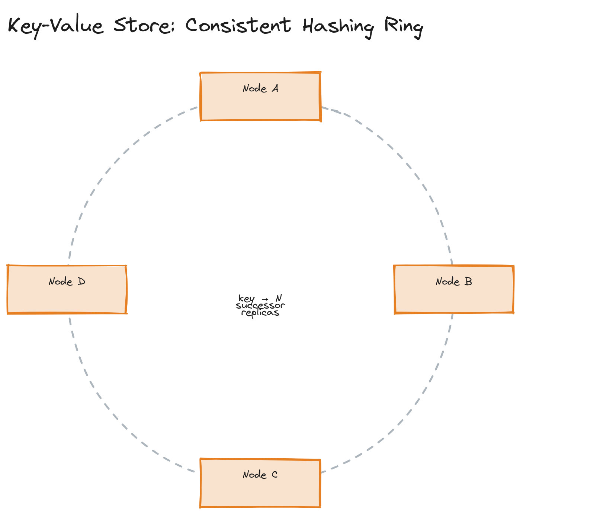

# Design a Key-Value Store

**Difficulty:** Easy
**Time:** 35–45 minutes
**Relevant Modules:** [04 — Databases](../../../modules/module-04-databases/), [06 — Scalability](../../../modules/module-06-scalability/), [12 — Distributed Systems Fundamentals](../../../modules/module-12-distributed-systems/), [13 — Consistency, Consensus & CAP Theorem](../../../modules/module-13-consistency-consensus/)

---

## Problem Statement

Design a distributed key-value store supporting `GET(key)` and `PUT(key, value)`, similar in spirit to DynamoDB or Riak. Unlike most question-bank entries, this question's "product" is the data store itself — there's no client-facing application layer, just the storage system and the distributed-systems decisions that go into it.

---

## Clarifying Questions to Ask

- What's the expected size of values — small (a few KB) or potentially large (MBs)?
- What consistency model is acceptable — strong consistency on every read, or is eventual consistency acceptable in exchange for availability?
- Do we need range queries / scans, or only exact-key lookups?
- What's the durability requirement — can we tolerate losing very recent writes on a node crash, or must every acknowledged write survive any single node failure?
- Single-datacenter or multi-region?
- Read-heavy, write-heavy, or balanced workload?

---

## Requirements

### Functional

- `PUT(key, value)` — write or overwrite a value
- `GET(key)` — retrieve the current value for a key
- `DELETE(key)` — remove a key
- Support concurrent writes from multiple clients without corrupting data

### Non-Functional

- Horizontal scalability: add nodes to increase capacity and throughput without downtime
- High availability: tolerate individual node failures without becoming fully unavailable
- Partition tolerance: continue operating, in some degraded form, during a network partition (this is non-negotiable for any real distributed system — see [Module 13](../../../modules/module-13-consistency-consensus/01-concepts/README.md))
- Tunable consistency: this design will favor **AP** (available, partition-tolerant) over strict consistency, since most key-value workloads (caching, session storage, shopping carts) tolerate brief staleness far better than they tolerate unavailability
- Scale: target millions of keys, tens of thousands of ops/sec, values up to a few hundred KB

---

## Capacity Estimation

```
Assume 10M keys, average value size 1KB → ~10GB of raw data (before replication)
With 3x replication for durability: ~30GB total stored data — small enough to fit across a handful of commodity nodes
Assume 20,000 ops/sec total, roughly balanced read/write
Per-node capacity (commodity hardware): ~5,000 ops/sec → need at least 4 nodes for throughput alone, more for headroom and replication overhead
```

At this scale, the constraint is operations-per-second and fault tolerance, not raw data volume — which shapes the design toward many small-to-medium nodes rather than fewer large ones.

---

## High-Level Architecture


*A ring of storage nodes arranged via consistent hashing, with a key being replicated to N successor nodes on the ring.*

**Components:**
- **Consistent hash ring** — maps each key to a position on the ring, and to the node(s) responsible for it; nodes joining/leaving only reshuffle a small fraction of keys instead of the whole keyspace (see [Module 04's consistent hashing deep dive](../../../modules/module-04-databases/02-deep-dive/README.md))
- **Storage nodes** — each owns a range of the ring and stores keys/values on local disk (typically using an LSM-tree-based engine for write efficiency — see [Module 09](../../../modules/module-09-storage/01-concepts/README.md))
- **Replication layer** — each key is replicated to the next N−1 nodes clockwise on the ring (N = replication factor, commonly 3)
- **Coordinator** — any node can act as the coordinator for a given request, forwarding to the responsible replica set and aggregating responses

---

## API Design

```
PUT /kv/{key}     body: { "value": <bytes>, "vectorClock": optional }   → 200 OK, returns new vector clock
GET /kv/{key}     → { "value": <bytes>, "vectorClock": "...", "version": n }  (may return multiple versions on conflict)
DELETE /kv/{key}  → 200 OK
```

> 💡 **Note:** Returning the vector clock to the client on every read/write is a real pattern (used by Riak and Dynamo-style systems) — it lets the client present "the version I last read" on a subsequent write, which the server uses to detect whether the write is based on stale data.

---

## Deep Dive: Replication, Quorums, and Conflict Resolution

With replication factor N=3, the system uses **quorum reads and writes**: a write is acknowledged once `W` replicas confirm it, and a read is considered successful once `R` replicas respond, where `R + W > N` guarantees the read and write sets always overlap by at least one node — meaning a read will see at least one copy of the most recent successful write (see [Module 12's quorum deep dive](../../../modules/module-12-distributed-systems/02-deep-dive/README.md)).

A common choice is N=3, W=2, R=2: this tolerates one node being down for both reads and writes while keeping latency lower than waiting for all 3 replicas.

The harder problem is what happens when concurrent writes to the same key reach different replicas during a network partition — each replica may end up with a different value with no way to know which is "newest" using wall-clock time alone (clocks across machines aren't reliable for ordering, see [Module 12's clocks section](../../../modules/module-12-distributed-systems/02-deep-dive/README.md)). The standard fix is **vector clocks**: each write carries a per-node version vector, and on read, if two versions are concurrent (neither vector clock dominates the other), the system returns both and pushes conflict resolution to the application (e.g., "last write wins" by a secondary timestamp, or an application-specific merge like a CRDT for counters).

> ⚠️ **Warning:** A frequent shortcut candidates take here is "just use the latest timestamp" (last-write-wins) without acknowledging that clock skew across machines can silently drop a genuinely later write. It's an acceptable trade-off to state explicitly ("I'm choosing LWW for simplicity, accepting the small risk of clock-skew-induced data loss") — but it should be a stated trade-off, not an unexamined default.

---

## Caching Strategy

A key-value store like this is itself often used *as* a cache by other systems, so caching within the store is less central — but an in-memory layer (a memtable, as in LSM-tree engines) absorbs recent writes and serves recent reads without a disk hit, which is effectively a built-in cache for hot/recent keys. See [Module 09's LSM tree deep dive](../../../modules/module-09-storage/02-deep-dive/README.md) for how memtables and SSTables interact.

---

## Handling Scale

Adding nodes is the primary scaling lever: consistent hashing means a new node takes over a contiguous slice of the ring from its neighbor, requiring only that slice of keys to be migrated — not a full reshard. At significantly higher scale, increasing virtual nodes per physical node smooths out load distribution further, since more, smaller hash ranges per node average out hot spots better than fewer, larger ranges.

---

## Trade-offs to Discuss

| Decision | Choice | Trade-off |
|---|---|---|
| Consistency model | AP (eventual consistency) | High availability under partition, at the cost of stale or conflicting reads being possible |
| Conflict resolution | Vector clocks + app-level merge | Correctly detects concurrent writes, but pushes resolution complexity onto the client |
| Replication factor | N=3, W=2, R=2 | Tolerates 1 node failure for both reads and writes; a stricter W=3 would sacrifice availability for stronger consistency |
| Partitioning scheme | Consistent hashing | Minimal data movement on node join/leave, at the cost of some implementation complexity vs. naive modulo hashing |

---

## Follow-up Questions

- How would you handle a "hot key" that gets disproportionately more traffic than others on the ring?
- How does the system detect and respond to a node failure — what's the gossip/failure-detection mechanism?
- How would you support range queries if a product requirement suddenly needed them?
- What changes if this needs to support multi-datacenter replication with cross-region latency?
- How would you bound the number of conflicting versions returned to a client when many concurrent writes race?
- How would anti-entropy (background replica synchronization) work to repair replicas that have drifted out of sync?
