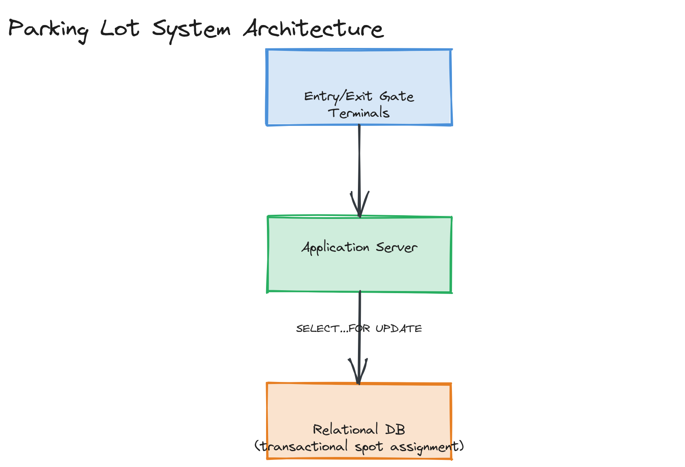

# Design a Parking Lot System

**Difficulty:** Easy
**Time:** 35–45 minutes
**Relevant Modules:** [01 — Foundations](../../../modules/module-01-foundations/), [03 — APIs](../../../modules/module-03-apis/), [04 — Databases](../../../modules/module-04-databases/)

---

## Problem Statement

Design a system that manages parking spot availability and assignment for a multi-level parking garage: vehicles enter, are assigned an available spot (possibly by vehicle size/type), pay on exit, and the system tracks real-time availability. This question leans more toward object/data modeling and concurrency correctness than distributed-systems depth, which is exactly why it's a good "easy" tier question — it tests careful thinking under simpler scale.

---

## Clarifying Questions to Ask

- Is this a single garage, or a network of many garages across a city that needs to report aggregate availability?
- Do different vehicle types (motorcycle, car, bus/oversized) need different spot types, and can a larger vehicle use a smaller spot's space (i.e., is spot sizing strict)?
- How does a vehicle "enter" — ticket dispensed at an entry gate, license plate recognition, or a pre-booked reservation?
- Is pricing flat, or time-based (and does it vary by vehicle type or duration)?
- Do we need to support reservations made in advance, or only walk-up assignment?
- How many levels and spots are we talking about — tens, hundreds, thousands?

---

## Requirements

### Functional

- Assign an available, appropriately-sized spot to an entering vehicle
- Track real-time count of available spots, per type and in aggregate
- Compute a fee on exit based on duration and vehicle type
- Display "FULL" status per level/type when no matching spot is available
- (Stretch) Support advance reservations

### Non-Functional

- Strong consistency required for spot assignment: two vehicles must never be assigned the same spot — this is the one place in this system where correctness matters more than raw throughput
- Low latency: spot assignment should be near-instant (drivers are waiting at a gate)
- Moderate scale: a single garage handles at most a few hundred entries/exits per hour — this is not a high-QPS system, so the interesting problems are concurrency correctness and clean data modeling, not horizontal scale
- Availability: the entry/exit gate system should degrade gracefully (e.g., fail open and let cars in without strict spot pre-assignment) rather than block the physical garage entrance during an outage

---

## Capacity Estimation

```
Garage size: 1,000 spots, average occupancy turnover 3x/day
→ ~3,000 entry events/day, ~3,000 exit events/day
→ peak QPS during rush hour (say, 20% of daily volume in a 1-hour window): ~600 events/hour ≈ 0.17/sec

This is an intentionally low-QPS system — the point of estimation here is to confirm that
a single, well-indexed relational database easily handles the load with enormous headroom,
and that the design challenge is correctness, not throughput.
```

---

## High-Level Architecture


*Entry/exit gate terminals connected to an application server, which performs spot assignment against a relational database using a transaction to guarantee no two vehicles get the same spot.*

**Components:**
- **Gate terminals** — entry/exit hardware (ticket dispenser or license-plate camera), calling into the application server
- **Application server** — handles spot assignment logic and fee calculation; stateless, can run multiple instances for redundancy even though throughput isn't the driver
- **Database** — stores spot inventory, current occupancy, and active tickets; the source of truth for "is this spot taken"

---

## API Design

```
POST /api/v1/entries
Request:  { "vehicleType": "car" | "motorcycle" | "bus", "licensePlate": "ABC123" }
Response: { "ticketId": "t_9f3k", "assignedSpot": "L2-014", "entryTime": "..." }

POST /api/v1/exits
Request:  { "ticketId": "t_9f3k" }
Response: { "fee": 12.50, "durationMinutes": 95, "spotReleased": "L2-014" }

GET /api/v1/availability
Response: { "car": 42, "motorcycle": 8, "bus": 0 }
```

---

## Database Schema

```sql
CREATE TABLE spots (
  spot_id      VARCHAR(20) PRIMARY KEY,
  level        INT NOT NULL,
  spot_type    VARCHAR(20) NOT NULL,      -- 'motorcycle' | 'car' | 'bus'
  is_occupied  BOOLEAN NOT NULL DEFAULT false
);

CREATE TABLE tickets (
  ticket_id     VARCHAR(20) PRIMARY KEY,
  spot_id       VARCHAR(20) NOT NULL REFERENCES spots(spot_id),
  license_plate VARCHAR(20) NOT NULL,
  entry_time    TIMESTAMP NOT NULL DEFAULT now(),
  exit_time     TIMESTAMP NULL,
  fee           DECIMAL(10,2) NULL
);
```

**Key index:** `spots(spot_type, is_occupied)` — supports the core query, "find one available spot of type X," efficiently.

---

## Deep Dive: Guaranteeing No Double-Assignment Under Concurrency

The one correctness-critical operation in this entire system is: when two cars arrive at (effectively) the same moment, they must never be assigned the same spot. A naive implementation — read an available spot, then issue a separate update to mark it occupied — has a race window between the read and the write where two concurrent requests could both read the same "available" spot before either marks it taken.

The fix is to make assignment a single atomic operation rather than read-then-write:

```sql
UPDATE spots
SET is_occupied = true
WHERE spot_id = (
  SELECT spot_id FROM spots
  WHERE spot_type = 'car' AND is_occupied = false
  LIMIT 1 FOR UPDATE SKIP LOCKED
)
RETURNING spot_id;
```

`FOR UPDATE SKIP LOCKED` (a real PostgreSQL feature) locks the selected row for the duration of the transaction and lets a concurrent transaction skip past rows already locked by another in-flight assignment, rather than blocking behind it — this is a clean way to hand out distinct available spots to concurrent requests without serializing all assignments through a single lock or queue.

> 🎯 **Interview Tip:** This is the part of the question that separates a thoughtful answer from a superficial one. Many candidates describe the schema and the happy path correctly but never address what happens with two simultaneous entries — naming `SELECT ... FOR UPDATE` (or an equivalent compare-and-swap / optimistic locking with a retry loop) explicitly is the signal the interviewer is listening for.

---

## Caching Strategy

A read-through cache for the `/availability` endpoint (aggregate counts per type) is reasonable, since that endpoint is read far more often than spots actually change state, and a few seconds of staleness on a displayed "spots available" sign is harmless. Spot *assignment* itself, however, should never go through a cache — it must always hit the database transactionally, since correctness (no double-booking) outweighs the latency savings caching would offer here.

---

## Handling Scale

If this needed to support many garages city-wide reporting into a single system, the natural extension is partitioning the database by `garage_id` — each garage's spot assignment is fully independent of every other garage's, so there's no cross-garage coordination needed, making this an easy horizontal split if it were ever necessary (though for any single garage's actual scale, it almost certainly wouldn't be).

---

## Trade-offs to Discuss

| Decision | Choice | Trade-off |
|---|---|---|
| Concurrency control | `SELECT ... FOR UPDATE SKIP LOCKED` | Correct, no double-assignment, with good throughput under concurrent requests; ties the implementation to a specific database feature |
| Spot sizing | Strict type matching (no oversize-in-undersize) | Simpler logic and guaranteed fit, at the cost of potentially leaving a large spot empty when only small vehicles are waiting |
| Caching | Cache aggregate counts only, never individual assignment | Keeps the one correctness-critical path cache-free, accepting that the read-heavy "how many spots free" display can lag by a few seconds |

---

## Follow-up Questions

- How would you handle a vehicle that loses its ticket?
- How would you support dynamic/surge pricing based on current occupancy?
- How would advance reservations interact with walk-up assignment — do you hold a spot, and for how long?
- What happens if the database is briefly unavailable when a car is at the entry gate — should the gate fail open?
- How would you extend this to support multiple garages with a shared loyalty/payment account across locations?
- How would you detect and handle a spot that's marked occupied in the database but is actually empty (e.g., due to a sensor/data error)?
