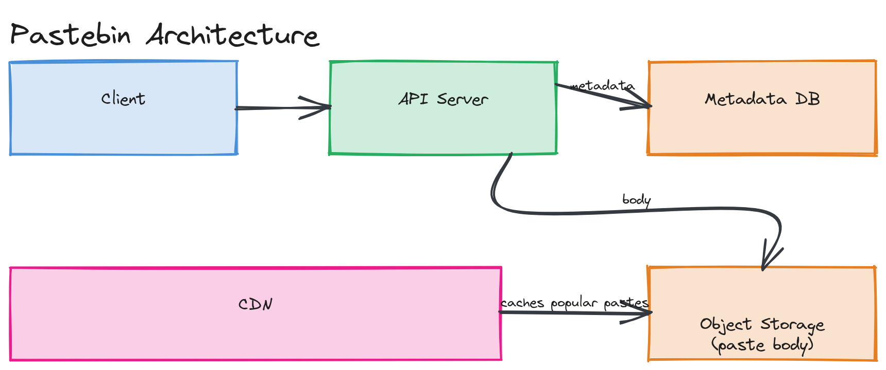

# Design a Pastebin

**Difficulty:** Easy
**Time:** 35–45 minutes
**Relevant Modules:** [01 — Foundations](../../../modules/module-01-foundations/), [03 — APIs](../../../modules/module-03-apis/), [04 — Databases](../../../modules/module-04-databases/), [09 — Storage Systems](../../../modules/module-09-storage/), [10 — CDN](../../../modules/module-10-cdn/)

---

## Problem Statement

Design a service like Pastebin: a user submits a block of text, the system stores it and returns a unique URL. Anyone with the URL can view the text. This is structurally close to a URL shortener, but the payload is large, variable-sized text rather than a fixed small mapping — which changes the storage story significantly.

---

## Clarifying Questions to Ask

- What's the maximum paste size? (This determines whether a relational text column is sufficient or object storage is needed.)
- Do pastes expire by default, or live forever?
- Can a paste be edited after creation, or is it immutable once submitted?
- Do we need syntax highlighting / language detection, or is this just plain text?
- Is there a concept of "private" pastes (unlisted vs. fully public), or user-owned paste history?
- What's the expected scale — pastes created per day, and the read:write ratio?
- Do we need versioning if a paste is edited?

---

## Requirements

### Functional

- Submit text and receive a unique shareable URL
- Retrieve and display the text given the URL
- Optional expiration (e.g., "delete after 1 day / 1 week / never")
- Optional custom URL slug

### Non-Functional

- Availability target: 99.9%
- Read-heavy: assume a 10:1 read-to-write ratio (lower skew than a URL shortener, since pastes are often shared once and viewed a handful of times, not clicked repeatedly like a bookmark)
- Paste size: support up to ~1MB of text per paste
- Latency: paste retrieval should be under ~200ms p99
- Scale: assume 1M new pastes/day, average paste size 10KB
- Immutability: once created, a paste's content does not change (treat edits as creating a new paste)

---

## Capacity Estimation

```
New pastes/day        = 1,000,000               → write QPS ≈ 12/sec avg, ~24/sec peak
Reads/day              = 10,000,000 (10:1 ratio)  → read QPS ≈ 116/sec avg, ~232/sec peak
Storage/day            = 1,000,000 × 10KB         = 10 GB/day
1-year storage         ≈ 10GB × 365               ≈ 3.65 TB
```

Both read and write QPS are modest — this system is far more storage-bound than request-bound, unlike the URL shortener's read-heavy profile.

---

## High-Level Architecture


*A client uploading text through an API server, which stores small metadata in a relational database and the paste body itself in object storage, with a CDN caching frequently-accessed paste bodies.*

**Components:**
- **API servers** — handle paste creation and retrieval, stateless
- **Metadata database** — stores `paste_id`, size, creation time, expiration, and a pointer to the body's storage location
- **Object storage (S3-style)** — stores the actual paste text bodies; appropriate because paste bodies are immutable blobs of variable size, which is exactly what object storage is optimized for (see [Module 09 — Storage Systems](../../../modules/module-09-storage/))
- **CDN** — caches paste bodies at the edge for popular/viral pastes, since content is immutable and therefore trivially cacheable

---

## API Design

```
POST /api/v1/pastes
Request:  { "content": "...", "expiresIn": "1d" | "1w" | "never", "customSlug": "optional" }
Response: { "pasteId": "k3j9Lp", "url": "https://paste.io/k3j9Lp", "expiresAt": "..." }

GET /api/v1/pastes/{pasteId}
Response: { "content": "...", "createdAt": "...", "expiresAt": "..." }
```

---

## Database Schema

```sql
CREATE TABLE paste_metadata (
  paste_id     VARCHAR(10) PRIMARY KEY,
  storage_key  VARCHAR(255) NOT NULL,   -- pointer to object storage location
  size_bytes   INT NOT NULL,
  created_at   TIMESTAMP NOT NULL DEFAULT now(),
  expires_at   TIMESTAMP NULL
);
```

> 💡 **Note:** Storing the paste body directly in the database (e.g., a `TEXT` column) would also work at this scale and is a perfectly reasonable simpler alternative — the object-storage split becomes more clearly justified once paste sizes grow (images, large logs) or you want the CDN to serve bodies directly without hitting your API tier at all.

---

## Deep Dive: Why Object Storage Instead of a Database Blob Column

A relational database is optimized for structured, queryable, frequently-updated rows with a defined schema — paste bodies are none of those things: they're immutable, variably sized, and only ever fetched by a single key with no need for SQL queries over their content. Storing large blobs directly in a relational database bloats table size, slows down backups, and pollutes the buffer cache with data that's never queried relationally.

Splitting metadata (small, structured, queryable) from body content (large, opaque, key-addressed) lets each half scale independently: the metadata database stays small and fast no matter how large paste bodies get, and object storage handles the blob volume with its own independent durability and replication model (commonly "11 nines" durability via erasure coding across multiple disks/zones).

> ⚠️ **Warning:** Object storage is typically only *eventually* consistent for some operations (e.g., overwrite-then-read in S3 has historically had consistency caveats, though this has improved). Since pastes are immutable and write-once, this is a non-issue here — but it's exactly the kind of detail that matters if you ever add paste editing.

---

## Caching Strategy

- **What to cache:** paste bodies, especially for "viral" pastes that get an unusually high number of reads in a short window.
- **Where:** a CDN in front of object storage is the strongest choice, since paste content never changes — once cached at the edge, a CDN node never needs to revalidate with the origin until the paste expires.
- **TTL:** set the CDN cache TTL to match (or be slightly shorter than) the paste's own expiration, so an expired paste doesn't serve stale content from the edge.
- **Invalidation:** not needed for updates (pastes are immutable), only for expiration — a TTL-based approach handles this without an active purge.

---

## Handling Scale

At 10× scale (10M pastes/day), the metadata database and API tier scale straightforwardly with more read replicas and horizontal API server scaling, since lookups are single-key point reads with no joins. The real growth dimension is storage volume, which object storage is designed to absorb — this is the system's biggest advantage over trying to force everything into a single relational database from the start.

---

## Trade-offs to Discuss

| Decision | Choice | Trade-off |
|---|---|---|
| Storage split | Metadata in SQL, bodies in object storage | More moving parts than a single database, but scales body storage independently and enables CDN caching directly from origin |
| Immutability | Edits create a new paste | Simpler caching and consistency story, at the cost of not supporting true "edit in place" |
| Read caching | CDN at the edge | Near-zero latency for repeat reads of viral content, but adds a TTL/expiration synchronization concern |

---

## Follow-up Questions

- How would you support a "burn after reading" paste that's deleted after the first view?
- How would you implement paste expiration cleanup without scanning the entire metadata table?
- How would you prevent abuse — e.g., someone using this as free, unlimited file hosting?
- How would syntax highlighting change the system (e.g., language detection, rendering cost)?
- What changes if pastes need to support large file uploads (10MB+) instead of just text?
- How would you add access control for "private" pastes shared only with specific users?
