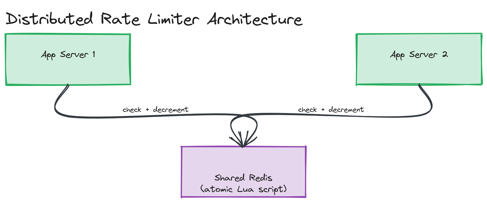

# Design a Rate Limiter

**Difficulty:** Easy
**Time:** 35–45 minutes
**Relevant Modules:** [03 — APIs](../../../modules/module-03-apis/), [05 — Caching](../../../modules/module-05-caching/), [12 — Distributed Systems Fundamentals](../../../modules/module-12-distributed-systems/)

---

## Problem Statement

Design a rate limiter that restricts how many requests a client (identified by API key, user ID, or IP) can make within a given time window, rejecting requests beyond the limit. This is deceptively "easy" — a single-process version is a 20-line algorithm, but making it work correctly across many servers is where the real interview signal comes from.

---

## Clarifying Questions to Ask

- Is this limiting requests per user, per IP, per API key, or some combination?
- What's the rate limit policy — e.g., "100 requests per minute," and is it fixed or does it vary by client tier?
- Does the limiter run on a single server, or must it be consistent across many servers behind a load balancer?
- What should happen to a rejected request — hard reject with HTTP 429, or queue and delay it?
- Does the limit need to be exact, or is some approximation acceptable in exchange for lower latency/coordination overhead?
- Where does this limiter live — embedded in each app server, or as a centralized service / API gateway component?

---

## Requirements

### Functional

- Allow a request if the client is under their limit; reject (HTTP 429) if over
- Support configurable limits per client (e.g., different tiers: free vs. paid)
- Return rate limit metadata in responses (remaining quota, reset time) — standard practice via headers
- Support at least one well-known algorithm (token bucket or sliding window)

### Non-Functional

- The limiter itself must not become the bottleneck — checking a limit must be fast, sub-millisecond ideally
- Must work correctly when requests for the same client are load-balanced across many app servers (i.e., cannot rely on in-process memory alone)
- High availability: if the rate-limiting layer is down, decide explicitly whether to fail open (allow all traffic) or fail closed (reject all traffic) — this is itself a trade-off to discuss
- Scale: support checking limits for millions of distinct clients, at tens of thousands of checks per second

---

## Capacity Estimation

```
Assume 50,000 requests/sec system-wide needing a rate-limit check
Each check: 1 read + 1 write (or 1 atomic read-modify-write) against a shared store
→ the shared store must sustain ~50,000–100,000 ops/sec

Per-client state size: ~50 bytes (tokens remaining, last refill timestamp)
For 10M distinct active clients: 10,000,000 × 50 bytes = 500 MB of state — comfortably fits in a Redis cluster's memory
```

The key estimation insight: rate limiting is an operations-per-second problem on a small amount of total state, not a storage volume problem — which is why an in-memory store (Redis) is the natural fit rather than a disk-backed database.

---

## High-Level Architecture


*Multiple app servers (or an API gateway) each calling into a shared Redis instance/cluster to atomically check and decrement a client's token count before allowing a request through.*

**Components:**
- **API gateway / app servers** — the enforcement point; calls the rate limiter before processing a request
- **Shared counter store (Redis)** — holds per-client token/window state, accessed atomically so concurrent checks from different app servers don't race
- **Lua script (executed inside Redis)** — implements the check-and-decrement as a single atomic operation, avoiding a separate read-then-write round trip that could race under concurrency

---

## API Design

This is typically an internal library/middleware call rather than a public API, but the contract looks like:

```
checkLimit(clientId: string) → { allowed: boolean, remaining: number, resetAt: epochMs }
```

Exposed to API consumers via response headers:
```
X-RateLimit-Limit: 100
X-RateLimit-Remaining: 42
X-RateLimit-Reset: 1718900000
```

---

## Deep Dive: Algorithm Choice and Distributed Correctness

**Token bucket** (see [Module 03's deep dive](../../../modules/module-03-apis/02-deep-dive/README.md)) is the most common choice: each client has a bucket that holds up to `capacity` tokens, refilling at a fixed rate; each request consumes one token, and an empty bucket rejects the request. It naturally allows brief bursts up to the bucket capacity while enforcing a steady-state average rate — a good match for typical API traffic patterns.

**Sliding window log/counter** is more precise (avoids the "double burst at window boundary" problem of fixed windows) but costs more memory per client, since it needs to track timestamps rather than a single counter.

The distributed-correctness problem is the actual interview content here: if each app server keeps its own in-memory counter, a client routed across 5 servers effectively gets 5× their real limit. The fix is a **shared, centralized store** (Redis) that every server checks against — but a naive read-then-write from the app server introduces a race condition where two concurrent requests both read "1 token left" and both decrement, over-allowing by one. The correct implementation pushes the entire check-and-decrement logic into a single atomic Redis operation, typically a Lua script, so it executes as one indivisible step from Redis's perspective.

> ⚠️ **Warning:** A common interview mistake is proposing "just use Redis" without addressing the atomicity problem. The interviewer wants to hear specifically how you prevent two concurrent checks from racing — "atomic Lua script" or "Redis `MULTI`/transactions" is the answer they're listening for.

---

## Caching Strategy

The "cache" in this design *is* the rate limiter's primary store — Redis serves both roles. There's no separate caching layer needed beyond keeping all active client counters in Redis's memory; the working set is small enough (hundreds of MB for millions of clients) that no further caching tier is justified.

---

## Handling Scale

At 10× scale (500,000+ checks/sec), a single Redis instance may become the bottleneck. The mitigation is sharding the Redis layer by `clientId` hash (Redis Cluster), since each client's rate-limit check is fully independent of every other client's — there's no cross-client coordination needed, which makes this an easy, clean horizontal scale-out.

---

## Trade-offs to Discuss

| Decision | Choice | Trade-off |
|---|---|---|
| Algorithm | Token bucket | Allows bursts up to capacity, simple state (two numbers per client), but less precise than a sliding window log |
| Store | Centralized Redis | Correct under multi-server load balancing, but adds a network round-trip per request and a new dependency that must itself be highly available |
| Failure mode | Fail open (allow traffic if Redis is down) | Protects availability of the underlying service at the cost of temporarily losing rate-limit protection |
| Atomicity | Lua script in Redis | Correct under concurrency, but couples the implementation to Redis-specific scripting rather than being store-agnostic |

---

## Follow-up Questions

- How would you rate-limit by multiple dimensions simultaneously (e.g., per-IP AND per-API-key)?
- What happens to in-flight requests if the Redis cluster fails over mid-check?
- How would you implement a "soft" limit that slows requests down (adds latency) instead of hard-rejecting them?
- How would you support different limits for different endpoints on the same client (e.g., stricter limits on a search endpoint than a read endpoint)?
- How would you test that your rate limiter behaves correctly under concurrent load from multiple servers?
- How does this design change if you need limits enforced at a CDN/edge layer, before traffic even reaches your origin servers?
