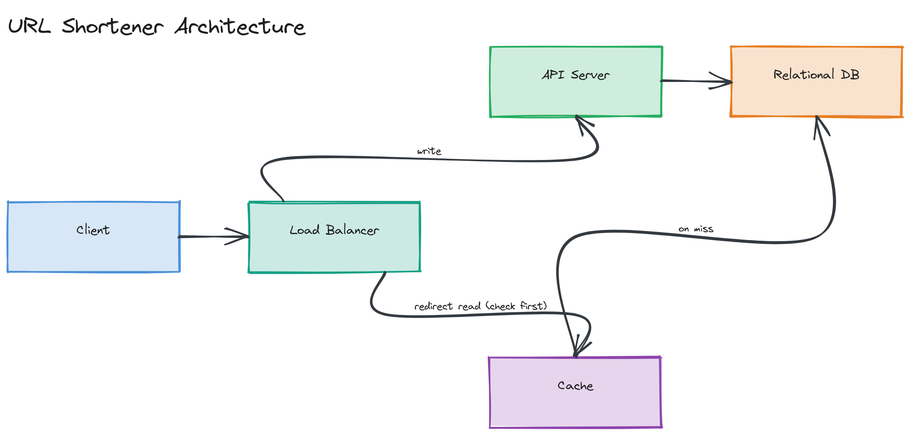

# Design a URL Shortener

**Difficulty:** Easy
**Time:** 35–45 minutes
**Relevant Modules:** [01 — Foundations](../../../modules/module-01-foundations/), [03 — APIs](../../../modules/module-03-apis/), [04 — Databases](../../../modules/module-04-databases/), [05 — Caching](../../../modules/module-05-caching/)

---

## Problem Statement

Design a service like Bitly or TinyURL: given a long URL, the system generates a short, unique alias. Visiting the short URL redirects the user to the original long URL. This is the canonical "easy" system design question precisely because it's small enough to fully solve in 45 minutes while still touching API design, data modeling, and caching.

---

## Clarifying Questions to Ask

- Can users choose a custom alias, or are all aliases system-generated?
- Do shortened links expire, or live forever?
- What's the expected scale — how many URLs created per day, and what's the read:write ratio (link creations vs. redirects)?
- Do we need click analytics (count, geography, referrer)?
- Does a given long URL always map to the same short URL, or can the same long URL produce different short codes on separate requests?
- Do we need user accounts / link ownership, or is this anonymous?
- What's the acceptable redirect latency? (Users perceive any delay on a redirect as the whole page being slow.)

---

## Requirements

### Functional

- Given a long URL, generate a unique short URL
- Given a short URL, redirect (HTTP 301/302) to the original long URL
- Support optional custom aliases
- Support optional link expiration
- (Stretch) Track click counts per link

### Non-Functional

- High availability: redirects are on the critical path of someone else's product — target 99.99%
- Low latency: redirect lookup should be well under 50ms p99
- Read-heavy: assume a 100:1 read (redirect) to write (create) ratio
- Scale: 100M new links/month, ~1,000 reads/sec sustained, bursting higher
- Short codes must not collide
- Eventual consistency on click-count analytics is acceptable; the redirect mapping itself must be strongly consistent (a link must never resolve to the wrong destination)

---

## Capacity Estimation

```
New links/month     = 100,000,000
New links/day        ≈ 3,300,000           → write QPS ≈ 38/sec (avg), ~76/sec (peak)
Reads (redirects)    = 100 × writes         → 330,000,000 redirects/day → ~3,800 QPS avg, ~7,600 QPS peak
Storage per link     ≈ 500 bytes (short code, long URL, metadata, timestamps)
Storage/day           = 3,300,000 × 500B    ≈ 1.65 GB/day
5-year storage        ≈ 1.65GB × 365 × 5    ≈ 3 TB
```

The read load dominates by two orders of magnitude — this single fact should drive the entire architecture toward aggressive caching on the read path.

---

## High-Level Architecture


*A client hitting a load balancer, which routes writes to an API server backed by a relational database, and routes redirect reads through a cache (checked first) before falling back to the database on a cache miss.*

**Components:**
- **API servers** — stateless, handle both creation (`POST /shorten`) and redirect (`GET /{code}`) requests
- **Database** — stores the `short_code → long_url` mapping durably; a relational database is more than sufficient at this scale
- **Cache (Redis)** — sits in front of the database on the read path; redirects are the hot path and almost all benefit from caching
- **ID/code generator** — produces unique short codes (see deep dive below)

---

## API Design

```
POST /api/v1/shorten
Request:  { "longUrl": "https://example.com/a/very/long/path", "customAlias": "optional", "expiresAt": "optional ISO8601" }
Response: { "shortUrl": "https://short.ly/aZ9k2x", "longUrl": "...", "expiresAt": "..." }

GET /{shortCode}
Response: HTTP 301 Location: <longUrl>
```

> 🎯 **Interview Tip:** Use a 301 (permanent) redirect only if you don't need click analytics — browsers and CDNs cache 301s aggressively, which means your server stops seeing repeat-visit traffic at all. A 302 (temporary) redirect is usually the right choice specifically *because* it forces every click through your server, which is what you want if you're counting clicks.

---

## Database Schema

```sql
CREATE TABLE urls (
  short_code   VARCHAR(10) PRIMARY KEY,
  long_url     TEXT NOT NULL,
  created_at   TIMESTAMP NOT NULL DEFAULT now(),
  expires_at   TIMESTAMP NULL,
  click_count  BIGINT NOT NULL DEFAULT 0
);
```

A single primary-key index on `short_code` covers the entire read path. No secondary indexes are needed unless you add "list all my links" (which would need an index on a `user_id` column).

---

## Deep Dive: Generating Unique Short Codes

There are three realistic strategies:

1. **Hash the long URL** (e.g., MD5, take first 7 base62 chars). Simple, but collisions are possible and must be detected and handled (append a counter, rehash). It also means the same long URL always maps to the same short code unless you add a salt — which may or may not be desired behavior.
2. **Random generation + collision check.** Generate a random 7-character base62 string, check the database for existence, retry on collision. Simple and avoids the "same input, same output" property, but adds a database round-trip per collision (rare at 7 characters: 62^7 ≈ 3.5 trillion possible codes).
3. **Counter-based encoding (recommended at this scale).** Maintain a globally unique, monotonically increasing ID (e.g., a database auto-increment, or a pre-allocated range handed out to each API server to avoid a shared counter becoming a bottleneck), then base62-encode it into a short string. This guarantees no collisions by construction and needs no existence check.

The counter-based approach is the strongest answer here: it's collision-free without a check, and pre-allocating ID ranges per server (e.g., server A gets IDs 1–1,000,000, server B gets 1,000,001–2,000,000) avoids turning a single counter into a write bottleneck or single point of failure — this is the same range-allocation idea used by [Twitter Snowflake-style ID generation](../../../modules/module-20-advanced-patterns/01-concepts/README.md).

> ⚠️ **Warning:** Base62-encoding a strictly sequential counter makes short codes guessable and sequential (`aaaaaaa`, `aaaaaab`, ...), which leaks the creation order and total link count. If that's a concern, encode `counter XOR a fixed secret` or shuffle the encoding alphabet per deployment rather than switching back to pure randomness.

---

## Caching Strategy

- **What to cache:** the `short_code → long_url` mapping, since redirects outnumber creates by ~100:1.
- **Where:** a Redis layer in front of the database, using cache-aside — on a redirect, check Redis first; on a miss, read from the database and populate the cache.
- **Eviction:** LRU is the right default; with 100M+ total links but a much smaller "hot" set (recently created/shared links get the most clicks), an LRU cache sized to hold the hot working set will absorb the vast majority of read traffic.
- **TTL:** set a TTL slightly longer than the link's own `expires_at` where applicable, or a flat default (e.g., 24 hours) for non-expiring links, refreshed on access.
- **Invalidation:** since mappings are immutable once created (a short code never changes which long URL it points to), there's no invalidation problem on update — only on deletion/expiration, which can be handled with the TTL alone.

---

## Handling Scale

At 10× the current scale (~38,000 redirect QPS), a single cache node and database may not suffice:
- **Cache:** move to a Redis Cluster, sharded by `short_code` hash, to scale read throughput horizontally.
- **Database:** the write path is light enough that a single primary with read replicas likely still works; if it doesn't, shard by a hash of `short_code` — there's no cross-shard query need since every lookup is a single-key point read.
- **Geographic distribution:** if users are global, deploy read replicas and cache nodes per region, with writes still going to a single region (or use a globally unique ID scheme that tolerates multi-region writes, as discussed above).

---

## Trade-offs to Discuss

| Decision | Choice | Trade-off |
|---|---|---|
| Code generation | Counter-based + base62 | No collisions, but codes are sequential/guessable unless obfuscated |
| Redirect type | HTTP 302 | Enables click tracking, at the cost of losing browser/CDN-level redirect caching |
| Cache eviction | LRU | Simple and effective for typical "recent links are hot" access patterns, but a sudden viral old link causes a cache-miss burst until it's repopulated |
| Database choice | Relational (PostgreSQL) | Schema is trivial and doesn't need NoSQL's flexibility; a key-value store would also work fine here and is a defensible alternative |

---

## Follow-up Questions

- How would you support custom aliases without breaking the collision-free guarantee of the counter scheme?
- How would you add click analytics (count, geography, referrer) without making every redirect synchronously wait on an analytics write?
- What happens if the same long URL is submitted twice — do you return the same short code or create a new one?
- How would you rate-limit URL creation to prevent abuse (e.g., spam link generation)?
- How would this design change if short codes needed to be globally unique across multiple independent deployment regions, each accepting writes?
- How would you safely delete or expire a link without breaking a cached redirect that's still in flight?
