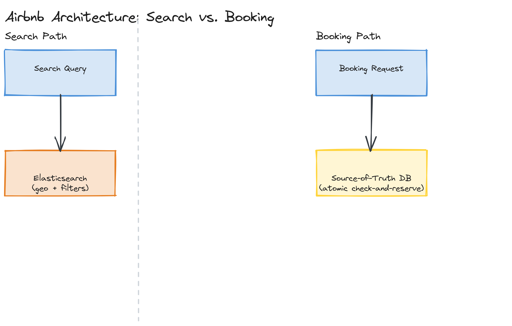

# Design Airbnb

**Difficulty:** Hard
**Time:** 35–45 minutes
**Relevant Modules:** [04 — Databases](../../../modules/module-04-databases/), [18 — Search Systems](../../../modules/module-18-search-systems/), [12 — Distributed Systems Fundamentals](../../../modules/module-12-distributed-systems/)

---

## Problem Statement

Design a marketplace platform connecting hosts (who list properties) with guests (who search for and book stays). The two genuinely hard problems are geospatial search with rich filtering (find available listings in a region, matching dates and amenity filters) and preventing double-booking of the same listing for overlapping dates under concurrent booking attempts.

---

## Clarifying Questions to Ask

- Is pricing/dynamic pricing logic in scope, or just search, listing, and booking?
- What filters must search support beyond location and dates — price range, amenities, property type, guest capacity?
- Must booking be instant-confirm, or can hosts manually approve/decline a request first? Assume instant-book for the core design, since it's the harder consistency problem; manual approval is an easier variant.
- What's the expected scale — number of listings, searches/day, bookings/day?
- Do we need to support host-side calendar management (blocking off dates manually)?

---

## Requirements

### Functional

- Hosts create and manage listings (location, price, amenities, availability calendar)
- Guests search listings by location, date range, and filters
- Guests book a listing for a specific date range, with payment
- The system must never allow two confirmed bookings for the same listing with overlapping dates

### Non-Functional

- Search must be fast even with rich geospatial and filter criteria, at reasonable latency (a few hundred ms)
- Booking correctness is non-negotiable: double-booking is a severe product and trust failure, not an acceptable edge case
- Read-heavy: searches vastly outnumber actual bookings (most searches don't convert)
- Availability: search should remain available even during partial system degradation; booking can be slightly slower if it means avoiding double-booking, since correctness matters more than speed for this specific operation
- Scale: 6M active listings, 150M searches/day, 2M bookings/day

---

## Capacity Estimation

```
Searches/day   = 150,000,000   → ~1,740/sec avg, much higher at peak (weekend/holiday booking surges)
Bookings/day   = 2,000,000      → ~23/sec avg — booking volume itself is low relative to search volume
Listings        = 6,000,000, each with a calendar of date-level availability (~365 entries/year)
Search index size: geospatial + filterable attributes per listing — needs efficient compound filtering, not just a geo radius query
```

The roughly 75:1 search-to-booking ratio confirms search is the throughput-dominant path and the natural target for heavy caching/indexing investment, while booking — though low-volume — is where correctness investment belongs, since a failure there has outsized product impact relative to its frequency.

---

## High-Level Architecture


*A search path (query → geospatial + filtered search index) and a separate booking path (selected listing + dates → an atomic availability check-and-reserve against the source-of-truth database), kept architecturally distinct.*

**Components:**
- **Listing service** — manages listing CRUD, syncing changes into the search index
- **Search service (Elasticsearch-backed)** — serves geospatial + filtered search queries; denormalized and eventually-consistent relative to the source-of-truth listing/availability data, which is an acceptable trade-off since search results are advisory, not transactional
- **Availability/booking service** — the source of truth for which dates are actually booked for a given listing; all booking writes go through here with strict consistency
- **Payment service** — handles charge authorization/capture, decoupled from the booking-correctness problem itself

---

## API Design

```
GET /api/v1/search?lat=37.77&lng=-122.41&radiusKm=10&checkIn=2026-07-01&checkOut=2026-07-05&minPrice=50&maxPrice=300
Response: { "listings": [ { "listingId": "...", "title": "...", "price": 120, "distanceKm": 2.3 }, ... ] }

POST /api/v1/bookings
Request:  { "listingId": "l_991", "guestId": "g123", "checkIn": "2026-07-01", "checkOut": "2026-07-05" }
Response: { "bookingId": "b_5521", "status": "confirmed" } | { "status": "rejected", "reason": "dates_unavailable" }
```

---

## Database Schema

```sql
CREATE TABLE listings (
  listing_id   BIGINT PRIMARY KEY,
  host_id      BIGINT NOT NULL,
  lat          DOUBLE PRECISION NOT NULL,
  lng          DOUBLE PRECISION NOT NULL,
  price        DECIMAL(10,2) NOT NULL,
  geohash      VARCHAR(12) NOT NULL       -- precomputed for geospatial query support
);

CREATE TABLE booked_dates (
  listing_id   BIGINT NOT NULL,
  date         DATE NOT NULL,
  booking_id   BIGINT NOT NULL,
  PRIMARY KEY (listing_id, date)          -- the composite key itself prevents two bookings claiming the same date
);
```

---

## Deep Dive: Preventing Double-Booking Under Concurrency

The core correctness problem: two guests might attempt to book the same listing for overlapping dates within milliseconds of each other. A naive implementation — check availability with a `SELECT`, then `INSERT` the booking if dates are free — has a race window between the check and the insert, identical in shape to [the parking lot's spot-assignment race](../easy/parking-lot.md).

The robust fix relies on the database's own constraints doing the real correctness work, not application-level check-then-write logic: each date of a booking is inserted as its own row into `booked_dates` with `(listing_id, date)` as the primary key. A booking attempt inserts one row per date in the requested range, inside a single transaction. If *any* of those dates is already taken, the primary key constraint causes that insert to fail, the whole transaction rolls back, and the booking is rejected — there is no window where two concurrent transactions can both believe a date is free, because the database itself enforces uniqueness atomically at the storage layer, rather than the application reasoning about it after an earlier read.

```sql
BEGIN;
INSERT INTO booked_dates (listing_id, date, booking_id) VALUES
  (991, '2026-07-01', 5521), (991, '2026-07-02', 5521), (991, '2026-07-03', 5521), (991, '2026-07-04', 5521);
-- if any date already exists, the whole INSERT fails on the primary key constraint, and the transaction rolls back
COMMIT;
```

> 🎯 **Interview Tip:** This is a stronger answer than reaching straight for a distributed lock (e.g., Redis `SETNX` per listing). A unique-constraint-based atomic insert achieves the same correctness guarantee using infrastructure the database already provides, with no separate locking service to build, operate, and reason about failure modes for.

---

## Deep Dive: Geospatial and Filtered Search

Search needs to efficiently answer "listings within N km of point P, available for these dates, matching these filters" — a compound query across geography, a time range, and arbitrary filter attributes. This is exactly the use case a dedicated search engine like Elasticsearch is built for: listings are indexed with a geohash (or native geo-point field) for spatial queries, plus the standard filterable attributes (price, amenities) as indexed fields, letting the search engine efficiently intersect a geo-radius filter with arbitrary attribute filters in a single query (see [Module 18's geo-search content](../../../modules/module-18-search-systems/02-deep-dive/README.md)).

Because the search index is a denormalized, eventually-consistent copy of listing/availability data, there's a small window where a search might return a listing that was *just* booked by someone else moments ago. This is an acceptable trade-off precisely because the booking service (not search) is the actual source of truth and final correctness gate — a guest who clicks through to book a no-longer-available listing simply receives a "dates unavailable" rejection at booking time, rather than the system needing search itself to be perfectly real-time consistent.

---

## Caching Strategy

Search results for popular, broad queries (e.g., "listings in Paris this weekend") are reasonable to cache briefly (seconds to low minutes), given the high search-to-booking ratio — most searches are exploratory rather than purchase-intent, so brief staleness has low product cost. Booking-path data is never cached, for the correctness reasons discussed above.

---

## Handling Scale

Search scales by adding more search-index shards/replicas, a standard Elasticsearch scaling pattern, since queries are inherently parallelizable across geographic/shard boundaries. Booking volume, being comparatively low (tens per second), scales easily on a normally-provisioned relational database with read replicas for the listing-detail read path, leaving the primary database's write capacity almost entirely free for the booking-correctness-critical inserts.

---

## Trade-offs to Discuss

| Decision | Choice | Trade-off |
|---|---|---|
| Double-booking prevention | DB unique-constraint atomic insert per date | Correct without a separate distributed lock service, at the cost of one row per booked date (slightly higher storage/row count than a single date-range row) |
| Search index | Denormalized, eventually consistent (Elasticsearch) | Fast, rich filtered geo-search, accepting that search results can be momentarily stale relative to true availability |
| Search vs. booking separation | Architecturally distinct paths | Lets search be cached/denormalized aggressively while booking stays strictly consistent — avoids forcing one consistency model onto both very different access patterns |

---

## Follow-up Questions

- How would you implement dynamic pricing based on demand, seasonality, and local events?
- How would you handle a host updating a listing's availability or price while a guest is mid-checkout?
- How would you extend booking to support host-approval flows instead of instant-book?
- How would you rank search results (not just filter them) by relevance/quality?
- How would you handle cancellations and the resulting need to re-open previously booked dates?
- How would you detect and prevent fraudulent listings or fake reviews at this scale?
