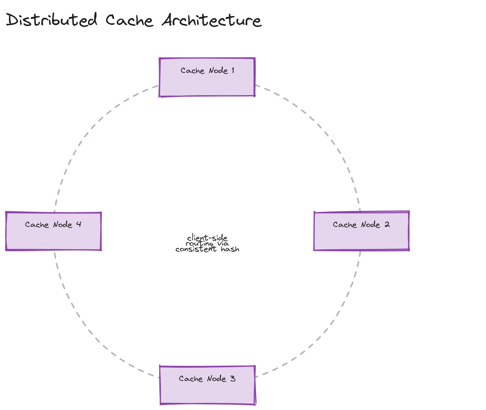

# Design a Distributed Cache (like Redis)

**Difficulty:** Hard
**Time:** 35–45 minutes
**Relevant Modules:** [05 — Caching](../../../modules/module-05-caching/), [04 — Databases](../../../modules/module-04-databases/), [12 — Distributed Systems Fundamentals](../../../modules/module-12-distributed-systems/)

---

## Problem Statement

Design the caching system itself — the infrastructure behind something like Redis Cluster or Memcached — rather than a system that merely uses a cache. The core problems are partitioning keys across many nodes, handling node failure without losing too much cached data or availability, and keeping lookups fast (sub-millisecond) at every step.

---

## Clarifying Questions to Ask

- Is persistence required (surviving a full cluster restart), or is this a pure, ephemeral, in-memory cache where losing everything on a crash is acceptable?
- What data structures need support — simple key-value strings only, or richer types (lists, sets, sorted sets)? Assume simple key-value for the core design; richer types are a natural extension.
- What consistency model is acceptable — is briefly serving a stale value after a write acceptable, or must every read see the latest write immediately?
- What eviction policy is needed when memory is full — LRU, LFU, TTL-based, or a combination?
- What's the expected scale — total keys, total data size, ops/sec?

---

## Requirements

### Functional

- `GET(key)`, `SET(key, value, ttl?)`, `DELETE(key)`
- Automatic eviction when memory limits are reached (LRU by default)
- TTL-based expiration
- Data is partitioned ("sharded") across many nodes so total capacity exceeds any single machine's memory

### Non-Functional

- Extremely low latency: sub-millisecond per operation is the entire point of using a cache instead of a database
- High throughput: hundreds of thousands of ops/sec aggregate
- Horizontal scalability: adding nodes increases total capacity and throughput
- Availability: tolerate individual node failure without the entire cache becoming unavailable, accepting that the failed node's specific keys may be temporarily or permanently lost (this is a cache, not a system of record — some data loss on failure is an acceptable, even expected, trade-off)
- Even load distribution: no single node should become a hot spot under normal access patterns

---

## Capacity Estimation

```
Target: 500,000 ops/sec aggregate, average value size 1KB
Total data: 100M keys × 1KB = 100GB — needs to be spread across multiple nodes' memory
Per-node capacity (commodity instance, e.g., 32GB RAM, leaving headroom for overhead): ~20GB usable
  → need at least 5 nodes for capacity alone, more for throughput headroom and replication
Per-node throughput (in-memory key-value ops): commonly 50,000–100,000+ ops/sec per node
  → 500,000 ops/sec needs at least 5–10 nodes for throughput, consistent with the capacity-driven count above
```

---

## High-Level Architecture


*A consistent hash ring of cache nodes, with a client (or client-side routing library) mapping each key to its owning node via the ring.*

**Components:**
- **Cache nodes** — each holds an in-memory hash table of keys to values, owning a contiguous slice of the hash ring
- **Consistent hashing layer** — maps each key to the node(s) responsible for it, minimizing data movement when nodes join or leave (see [Module 04's consistent hashing deep dive](../../../modules/module-04-databases/02-deep-dive/README.md) — the same technique underlies [the key-value store question](../easy/key-value-store.md))
- **Client-side routing (or a thin proxy layer)** — determines which node owns a given key before issuing the request, avoiding an extra network hop through a central router for every operation
- **Replication (optional, for higher durability tolerance)** — each key's data replicated to one or more additional nodes, so a single node failure doesn't immediately lose that data

---

## API Design

```
GET key                  → value | nil
SET key value [TTL]      → OK
DEL key                  → OK
```

The protocol is typically a simple, low-overhead binary or text protocol (Redis uses RESP — REdis Serialization Protocol) specifically because parsing overhead matters when the target latency is sub-millisecond and the actual operation is otherwise nearly free.

---

## Deep Dive: Partitioning, Hot Keys, and Rebalancing

**Partitioning** uses consistent hashing (with virtual nodes, as covered in [Module 04](../../../modules/module-04-databases/02-deep-dive/README.md)): each physical node owns many small, non-contiguous slices of the hash ring rather than one large contiguous range, which smooths out load distribution and means that when a node joins or leaves, only a small, evenly-distributed fraction of keys need to move — not a large contiguous block that could overload whichever specific neighbor inherits it.

**Hot keys** are this system's most distinctive hard problem: because cache access patterns are often extremely skewed (a small number of keys — e.g., a viral post's data, or a globally shared configuration value — receive a disproportionate share of all traffic), the single node owning a hot key can become overloaded even though the cluster's *aggregate* capacity is far from exhausted. Mitigations include: detecting hot keys via access frequency tracking and replicating just those specific keys to multiple nodes (so reads can be served from any of several replicas, distributing the hot key's load); or maintaining a small, local, client-side cache of the very hottest keys to avoid hitting the cluster at all for the most extreme cases.

> ⚠️ **Warning:** "Just add more nodes" does not fix a hot key problem — if one key is responsible for 30% of all traffic, no amount of horizontal scaling of the *cluster* helps, because that key still lives on exactly one node (or a fixed replica set) under standard consistent hashing. This is the detail interviewers are checking for when they ask "what if one key gets way more traffic than the others?"

---

## Deep Dive: Eviction and Memory Management

When a node's memory limit is reached, it must evict something before accepting a new write. **LRU (Least Recently Used)** is the standard default, implemented per-node using the same hashmap + doubly-linked-list structure as [the LRU cache coding exercise](../../../modules/module-05-caching/04-exercises/coding-challenges/challenge-01/) — O(1) eviction and O(1) access-time updates, critical given the sub-millisecond latency target. TTL-based expiration runs alongside LRU: keys past their TTL are eligible for removal regardless of recency, either checked lazily (on access) or via a periodic background sweep.

---

## Caching Strategy

This system *is* the caching layer for other systems — its own internal "caching strategy" is really just its eviction and replication policy, covered above. There's no additional cache in front of a cache.

---

## Handling Scale

Adding nodes is the primary lever, and consistent hashing with virtual nodes means this is a low-disruption operation — only the keys whose hash falls in the newly-claimed ranges need to move, which a background rebalancing process can copy over without taking the cluster offline (new writes for moved keys go directly to the new owner once rebalancing for that range completes, with reads briefly checking both old and new owner during the transition window).

---

## Trade-offs to Discuss

| Decision | Choice | Trade-off |
|---|---|---|
| Partitioning | Consistent hashing with virtual nodes | Minimal data movement on scale-out, at the cost of more complex routing logic than naive modulo hashing |
| Durability stance | Accept data loss on node failure (no required persistence) | Maximizes simplicity and speed, appropriate since this is explicitly a cache, not a system of record |
| Hot key mitigation | Per-key replication for detected hot keys | Solves the single-node-overload problem for skewed access patterns, at the cost of extra complexity in detecting and managing which keys need this treatment |
| Eviction policy | LRU | Simple, O(1), and effective for typical access patterns; less effective than LFU for some workloads with infrequent-but-bursty access patterns |

---

## Follow-up Questions

- How would you add optional persistence (e.g., periodic snapshotting) without compromising the in-memory latency profile?
- How would you implement cache invalidation across the cluster when an underlying database value changes?
- How would you detect a hot key in real time, before it causes a node to become a bottleneck?
- How would you support atomic multi-key operations (e.g., a transaction across two keys that might live on different nodes)?
- How would client-side routing stay correct and up to date as nodes join, leave, or fail?
- How would you bound memory fragmentation over long node uptimes with constantly changing key sizes?
