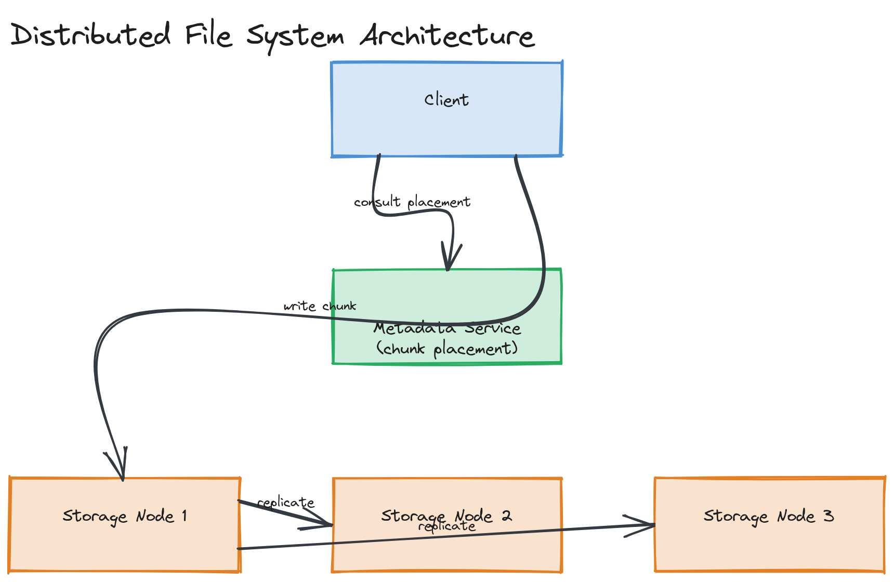

# Design a Distributed File System (like S3)

**Difficulty:** Hard
**Time:** 35–45 minutes
**Relevant Modules:** [09 — Storage Systems](../../../modules/module-09-storage/), [12 — Distributed Systems Fundamentals](../../../modules/module-12-distributed-systems/), [13 — Consistency, Consensus & CAP Theorem](../../../modules/module-13-consistency-consensus/)

---

## Problem Statement

Design the storage infrastructure behind an object storage service like S3, or a distributed file system like GFS/HDFS: store and retrieve large amounts of unstructured data (objects/files) reliably across many machines, surviving individual disk and node failures without losing data or significant availability. This is the infrastructure that systems like [Instagram](../medium/instagram.md) and [Pastebin](../easy/pastebin.md) assume already exists — here, you're building it.

---

## Clarifying Questions to Ask

- Object storage model (flat namespace, immutable objects identified by key, like S3) or hierarchical file system model (directories, mutable files, like HDFS)? Assume the object storage model — it's the more broadly applicable and commonly asked variant.
- Are objects ever updated in place, or only created and replaced wholesale (no partial in-place writes)? Assume whole-object replace, which is how S3-style systems actually work.
- What durability target — "11 nines" (effectively never losing an object) is the typical bar for this class of system?
- What's the expected object size distribution — many small objects, a few huge ones, or a mix?
- Is strong read-after-write consistency required, or is eventual consistency (briefly not seeing a just-written object) acceptable?

---

## Requirements

### Functional

- `PUT(bucket, key, data)` — store an object
- `GET(bucket, key)` — retrieve an object
- `DELETE(bucket, key)` — remove an object
- `LIST(bucket, prefix)` — list objects matching a key prefix
- Objects can range from a few bytes to many gigabytes

### Non-Functional

- Extremely high durability: target "11 nines" — losing data should be an effectively never-observed event, achieved through replication/erasure coding, not a single durable disk
- High availability: 99.99%+, tolerating multiple simultaneous node and even rack/datacenter-zone failures
- Horizontal scalability: capacity scales by adding storage nodes, with no theoretical upper bound
- Read-after-write consistency for new object creation (a `PUT` followed immediately by a `GET` for the same key should reliably return the new data) — though this guarantee may be relaxed for overwrites/deletes depending on design
- Scale: exabytes of total stored data system-wide, across an enormous number of objects

---

## Capacity Estimation

```
Target: 100 PB of logical (pre-replication) data
With 3x replication: 300 PB of raw disk capacity needed
Per-node raw capacity (commodity storage server, e.g., 24 × 16TB disks): ~384TB/node
→ ~780 storage nodes needed for raw capacity alone, well before accounting for growth headroom
Average object size assumption: 1MB → 100 billion objects total, each needing metadata tracked somewhere
```

The estimation insight: at this scale, durability strategy (replication factor or erasure coding ratio) directly multiplies your total hardware footprint, making it one of the most consequential cost decisions in the entire design.

---

## High-Level Architecture


*A metadata service mapping object keys to the storage nodes holding their data chunks; a client consults metadata for chunk placement, then writes chunks directly to assigned storage nodes, which replicate to additional nodes per the durability policy.*

**Components:**
- **Metadata service** — maps each object key to its storage locations (which nodes hold which chunks/replicas); this is the system's brain and must itself be highly available and consistent, often built on a strongly-consistent distributed store or consensus-backed service (see [Module 13's Raft/ZooKeeper content](../../../modules/module-13-consistency-consensus/02-deep-dive/README.md))
- **Storage nodes** — hold the actual object data (or chunks of large objects) on local disk; large objects are split into fixed-size chunks (e.g., 64MB, as in GFS/HDFS) so individual chunks can be distributed and replicated independently
- **Client library / gateway** — handles splitting large objects into chunks on write, consulting metadata for placement, and reassembling chunks on read
- **Background replication/repair process** — continuously verifies that every chunk has its required number of healthy replicas, and re-replicates from a surviving copy if a node failure drops a chunk below its target replication count

---

## API Design

```
PUT /bucket/{key}    body: <object bytes>           → 200 OK, { "etag": "..." }
GET /bucket/{key}    → <object bytes>
DELETE /bucket/{key} → 200 OK
GET /bucket?prefix=photos/2024/  → { "keys": ["photos/2024/a.jpg", "photos/2024/b.jpg", ...] }
```

---

## Deep Dive: Chunking, Replication Placement, and Failure Recovery

Large objects are split into fixed-size **chunks**, each replicated independently across multiple storage nodes (typically 3 replicas, placed deliberately on different physical failure domains — different racks, power circuits, or availability zones — so that a single rack or power failure can't simultaneously take out every replica of a chunk). The metadata service tracks, for every chunk, exactly which nodes currently hold a healthy copy.

When a client writes a new object, the metadata service first selects which nodes will hold each chunk (placement decisions consider current load, available capacity, and failure-domain diversity), then the client (or a coordinating node) streams chunk data directly to those nodes — often using a pipelined write where the first node forwards the chunk to the second while still receiving it from the client, and so on, rather than the client uploading the same bytes three separate times sequentially.

**Failure recovery** runs continuously in the background: storage nodes send periodic heartbeats to the metadata service; a node that misses heartbeats is presumed failed, and every chunk it held is now under-replicated. The metadata service identifies these under-replicated chunks and instructs a healthy replica to copy the chunk to a new node, restoring the target replication count — this self-healing process is what allows the system to tolerate continuous, ongoing hardware failures (expected and routine at this scale) without ever losing data, as long as failures don't happen faster than re-replication can repair them.

> ⚠️ **Warning:** A subtle but important detail: replicating 3 copies of every chunk costs 3x raw storage. **Erasure coding** (splitting data into N fragments plus M parity fragments, where any N of the N+M fragments can reconstruct the original) achieves comparable durability at significantly less storage overhead than full replication, at the cost of more expensive reconstruction (CPU work) when a fragment is lost. Naming this trade-off — and that real systems like S3 use erasure coding specifically to reduce the replication-factor storage tax — is a strong signal in this question.

---

## Caching Strategy

Frequently accessed ("hot") objects benefit from being cached closer to where they're read — in practice, this role is usually filled by a CDN sitting in front of the storage system entirely (exactly the architecture in [Instagram's design](../medium/instagram.md)), rather than caching being a concern internal to the storage system itself. Internally, storage nodes rely on the OS page cache for recently-written or recently-read chunks, similar to the message queue's reliance on page cache for hot reads.

---

## Handling Scale

Adding storage nodes increases both capacity and aggregate throughput, since chunks are already distributed and independent — there's no central bottleneck on the data path itself. The metadata service is the part that requires more careful scaling, since it's consulted on every object operation; sharding metadata by a hash of the object key (or bucket) keeps any single metadata shard's load bounded as total object count grows.

---

## Trade-offs to Discuss

| Decision | Choice | Trade-off |
|---|---|---|
| Durability mechanism | 3x replication (vs. erasure coding) | Simpler implementation and faster recovery, at roughly 3x the storage cost versus a comparable-durability erasure-coding scheme |
| Chunking | Fixed-size chunks for large objects | Enables parallel, distributed storage and repair of a single large object, at the cost of added metadata tracking per chunk |
| Consistency | Read-after-write for new objects, looser for overwrites | Matches real-world usage patterns (overwrites are rarer and less latency-sensitive), avoiding the cost of strict consistency everywhere |
| Replica placement | Failure-domain-aware (different racks/zones) | Tolerates correlated failures (a rack losing power), at the cost of more complex placement logic than naive random placement |

---

## Follow-up Questions

- How would you implement multipart/resumable uploads for very large objects over unreliable connections?
- How would erasure coding change the read path compared to straightforward replication?
- How would you handle a "split-brain" scenario where the metadata service itself partitions?
- How would you implement versioning (keeping prior versions of an object after an overwrite)?
- How would you detect silent data corruption (bit rot) on a chunk that reports as healthy but has actually degraded?
- How would you balance storage load as nodes are added with very different available capacities (heterogeneous hardware)?
