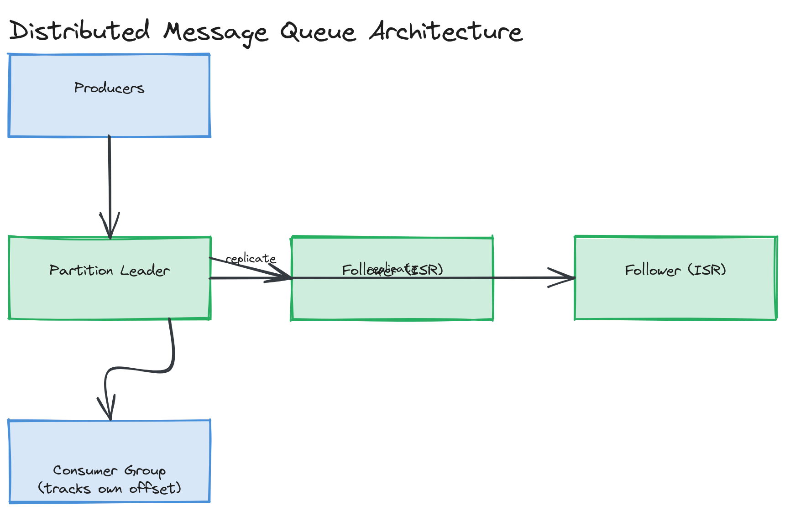

# Design a Distributed Message Queue

**Difficulty:** Hard
**Time:** 35–45 minutes
**Relevant Modules:** [08 — Message Queues](../../../modules/module-08-message-queues/), [12 — Distributed Systems Fundamentals](../../../modules/module-12-distributed-systems/), [13 — Consistency, Consensus & CAP Theorem](../../../modules/module-13-consistency-consensus/)

---

## Problem Statement

Design the message queue infrastructure itself — something like Kafka or SQS — rather than a system that merely *uses* one. Producers publish messages; consumers read them; the system must guarantee durability, ordering (within some scope), and a chosen delivery semantic, all while distributed across many nodes that can individually fail.

---

## Clarifying Questions to Ask

- Queue semantics (each message consumed once, removed after ack — SQS-style) or log semantics (messages retained and replayable, multiple independent consumer groups — Kafka-style)? Assume log semantics, since it's the richer and more commonly asked variant.
- What ordering guarantee is required — global ordering, or ordering only within a partition/key?
- What delivery semantic — at-most-once, at-least-once, or exactly-once? Assume at-least-once is the target, with idempotent consumers handling the rest, as is standard practice.
- What's the durability requirement — must an acknowledged write survive the loss of any single node?
- What's the expected scale — messages/sec, number of topics/partitions, retention period?

---

## Requirements

### Functional

- Producers publish messages to named topics
- Topics are split into partitions for parallelism; messages within a partition are strictly ordered
- Consumers read messages from partitions, tracking their own offset (position) in the log
- Multiple independent consumer groups can read the same topic at their own pace
- Messages are retained for a configurable period (or until a size limit), not deleted immediately on consumption

### Non-Functional

- Durability: an acknowledged write must survive the failure of any single broker node, via replication
- High throughput: must sustain very high sustained write rates per partition
- Ordering: guaranteed only within a partition, not globally across partitions — a deliberate, necessary trade-off for parallelism
- Availability: the system continues accepting writes and serving reads even if a minority of replica nodes are down
- Scale: millions of messages/sec system-wide, partitioned across many topics

---

## Capacity Estimation

```
Target: 1,000,000 messages/sec system-wide, average message size 1KB
→ raw write throughput needed: 1,000,000 × 1KB = 1 GB/sec
With replication factor 3: 3 GB/sec of total disk write bandwidth across the cluster
If a single partition sustains ~10MB/sec of writes (a realistic single-disk sequential-write bound),
  1 GB/sec requires at least 100 partitions spread across many broker nodes to achieve in parallel
```

The key estimation insight: a single partition's throughput is bounded by one disk's sequential write speed, so reaching high aggregate throughput is fundamentally a partitioning/parallelism problem, not a "buy faster disks" problem.

---

## High-Level Architecture


*Producers writing to a specific partition on its leader broker, which replicates to a configurable number of follower brokers (the ISR), with consumer groups independently tracking their own offset per partition.*

**Components:**
- **Broker nodes** — each holds some partitions' data on local disk, append-only, sequentially written for speed
- **Partition leader/follower replication** — each partition has one leader (handles all reads/writes) and N−1 followers that replicate the leader's log; a follower can be promoted to leader if the current leader fails
- **Coordination service (e.g., ZooKeeper/etcd-equivalent)** — tracks which broker leads which partition, detects broker failures, and triggers leader re-election
- **Consumer group coordinator** — tracks each consumer group's committed offset per partition, and rebalances partition assignment when consumers join/leave a group

---

## API Design

```
publish(topic: string, key: string | null, payload: bytes) → { partition: number, offset: number }
  — key (if provided) determines partition via hash, ensuring same-key messages stay ordered relative to each other

poll(topic: string, partition: number, fromOffset: number, maxMessages: number) → Message[]
commitOffset(consumerGroup: string, topic: string, partition: number, offset: number) → void
```

---

## Deep Dive: Replication, Leader Election, and In-Sync Replicas

Each partition's data is replicated to N brokers (commonly N=3) for durability. One replica is the **leader**, handling all reads and writes for that partition; the others are **followers**, continuously pulling new entries from the leader's log to stay in sync. A follower that is fully caught up is called an **in-sync replica (ISR)**.

A write is acknowledged to the producer only once it's been replicated to a configurable minimum number of ISRs (not just written to the leader's local disk) — this is what prevents data loss if the leader fails immediately after acknowledging a write: at least one other replica already has the data and can take over. This directly mirrors the [quorum write concept](../../../modules/module-12-distributed-systems/02-deep-dive/README.md) from general distributed systems theory, applied specifically to log replication.

If the leader fails, the coordination service detects this (via missed heartbeats) and promotes one of the remaining ISRs to be the new leader. Followers that were *not* in-sync at the time of failure (i.e., lagging behind) are excluded from leader candidacy — promoting a lagging replica would silently lose any writes it hadn't yet replicated, which would violate the durability guarantee already given to producers.

> ⚠️ **Warning:** A common mistake is conflating "replicated to a follower" with "safely durable." If a write is acknowledged after reaching only the leader's disk, a leader crash before any follower catches up loses that write entirely — the acknowledgment must wait for the configured minimum ISR count, which is the actual lever controlling the durability/latency trade-off.

---

## Deep Dive: Consumer Groups and Partition Assignment

Multiple consumers can form a **consumer group** to collectively process a topic's partitions in parallel — each partition is assigned to exactly one consumer within the group at a time, so messages within a partition are processed by a single consumer (preserving per-partition ordering for that group), while different partitions are processed concurrently by different group members. Multiple independent consumer groups can read the same topic at completely independent paces, each tracking its own committed offset — this is what enables, e.g., one group consuming in real time and another doing slower batch analytics off the same data stream without interfering with each other.

When a consumer joins or leaves a group, partitions are rebalanced among the remaining members — a process that briefly pauses consumption for affected partitions while assignment is recomputed.

---

## Caching Strategy

Brokers rely heavily on the OS page cache rather than an application-level cache: because writes are sequential, append-only, and reads (especially from consumers near the head of the log) are usually for very recently written data, recently-written pages tend to still be in the OS's page cache when read back, making most "hot" reads effectively memory-speed without any custom caching logic in the broker itself. This is a deliberate, well-known design choice in real log-based systems (notably Kafka).

---

## Handling Scale

Increasing partition count is the primary scaling lever for both throughput and consumer parallelism — more partitions allow more concurrent writers and more concurrent consumers within a group. The trade-off is that very high partition counts per broker increase coordination and metadata overhead, and can increase end-to-end latency during leader elections (more partitions to potentially re-elect leaders for).

---

## Trade-offs to Discuss

| Decision | Choice | Trade-off |
|---|---|---|
| Ordering scope | Per-partition only | Enables massive parallelism, at the cost of no global ordering guarantee across partitions |
| Durability | Acknowledge after min-ISR replication | Protects against data loss on leader failure, at the cost of added write latency vs. acknowledging immediately at the leader |
| Delivery semantic | At-least-once + idempotent consumers | Simpler, more robust broker-side logic, pushing deduplication responsibility to consumers |
| Consumer model | Consumer groups with partition assignment | Enables parallel, independent consumption patterns, at the cost of rebalancing pauses when group membership changes |

---

## Follow-up Questions

- How would you implement exactly-once semantics on top of an at-least-once foundation?
- How would you handle a "poison pill" message that repeatedly crashes every consumer that attempts to process it?
- How would log compaction (retaining only the latest value per key, rather than every historical message) change the storage model?
- How would you reduce the latency cost of waiting for multi-replica acknowledgment for latency-sensitive producers?
- How would you rebalance partitions across brokers when adding new broker capacity to the cluster?
- How would you bound unbounded log growth for a topic with retention requirements measured in years?
