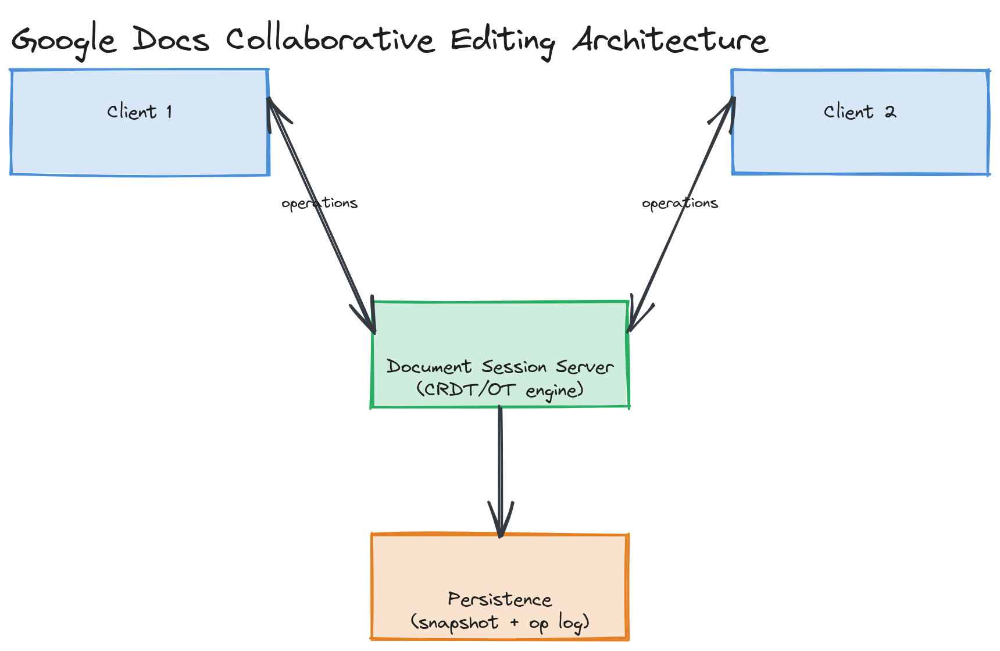

# Design Google Docs (Collaborative Editing)

**Difficulty:** Hard
**Time:** 35–45 minutes
**Relevant Modules:** [12 — Distributed Systems Fundamentals](../../../modules/module-12-distributed-systems/), [13 — Consistency, Consensus & CAP Theorem](../../../modules/module-13-consistency-consensus/), [16 — Real-Time Systems](../../../modules/module-16-real-time-systems/)

---

## Problem Statement

Design a real-time collaborative document editor: multiple users edit the same document simultaneously, with every user's changes appearing on everyone else's screen within a second or two, and the document converging to the same final content for everyone regardless of the order edits actually happened in. This is the canonical "hard" question because naive approaches (e.g., last-write-wins on the whole document) catastrophically destroy concurrent work, and the correct solution requires real distributed-systems machinery.

---

## Clarifying Questions to Ask

- Is rich formatting (bold, headings, embedded images) in scope, or plain text editing? Assume plain text for the core design — formatting adds representation complexity but not fundamentally new distributed-systems problems.
- How many concurrent editors per document are we designing for — a handful, or hundreds?
- Do we need offline editing support (a user edits while disconnected, then reconnects and merges)?
- What's the acceptable propagation latency between one user's keystroke and another user seeing it?
- Do we need full edit history / version recovery?
- Is conflict resolution allowed to require any user-facing merge UI, or must it be fully automatic and invisible?

---

## Requirements

### Functional

- Multiple users can edit the same document concurrently
- Each user's edits are visible to all other connected editors in near real time
- The document converges to an identical final state for all users, with no manual conflict resolution required
- Support undo/redo per user without corrupting others' concurrent edits
- Persist the document durably

### Non-Functional

- Low propagation latency: edits should appear on other clients within ~1 second
- Convergence guarantee: regardless of network delay or message reordering, all clients must eventually agree on the same document content
- Availability: an editor should be able to keep typing even during a brief network hiccup, with changes syncing once connectivity returns
- Scale: not enormous in raw throughput (most documents have a handful of concurrent editors), but the correctness requirements are unusually strict

---

## Capacity Estimation

```
Assume 10M documents actively edited concurrently at peak, average 3 concurrent editors each
→ 30M concurrent WebSocket connections (similar order of magnitude to the chat system's connection-handling problem)
Each keystroke generates a small operation (~50–100 bytes): character, position, author, timestamp/version vector
At ~5 keystrokes/sec per active editor during a burst of typing: 30M × 5 ≈ 150M operations/sec system-wide at theoretical peak
  — in practice, most editors are idle/reading most of the time, so sustained load is far lower; the connection count, not the operation rate, is the dominant resource constraint
```

This estimation's purpose is to show that, unlike most question-bank entries, raw throughput isn't the hard part here — connection count and correctness under concurrency are.

---

## High-Level Architecture


*Multiple clients holding WebSocket connections to a document session server, broadcasting small operations to every other connected client editing the same document, with a persistence layer periodically snapshotting the converged state.*

**Components:**
- **Document session server** — for a given document, coordinates all connected editors' operations (could be a single server per document for a moderate number of concurrent editors, or a more distributed scheme for very high concurrency)
- **Operation broadcast layer** — propagates each user's edit operation to every other connected client editing the same document, similar in spirit to [the chat system's pub/sub routing](../medium/whatsapp.md)
- **CRDT / OT engine** — the core correctness component; transforms or merges concurrent operations so every client converges to the same final document regardless of arrival order (see deep dive)
- **Persistence layer** — periodically snapshots the converged document state to durable storage, plus an operation log for history/undo

---

## API Design

This is WebSocket-driven, similar to the chat system, with operations rather than chat messages as the payload:

```
WebSocket message (client → server):
{ "type": "operation", "docId": "d_991", "op": { "type": "insert", "pos": 42, "char": "x", "clientId": "c1", "version": [...] } }

WebSocket message (server → other clients):
{ "type": "operation", "docId": "d_991", "op": { ...transformed/merged operation... } }
```

---

## Deep Dive: Operational Transformation vs. CRDTs

This is the question's central problem: when two users type at the same position in the document at nearly the same time, naive last-write-wins would silently discard one user's keystrokes. Two established approaches solve this correctly:

**Operational Transformation (OT):** each operation (insert/delete at a position) is "transformed" against any concurrent operations it conflicts with, adjusting its position so the intent of both edits is preserved. For example, if user A inserts a character at position 5 and user B concurrently inserts at position 3, B's insertion shifts A's intended position by one — OT formalizes exactly how to compute that shift so both edits land correctly regardless of which one a given client applies first. OT requires a central server (or an agreed-upon serialization point) to apply transformations in a consistent order across all clients.

**CRDTs (Conflict-free Replicated Data Types):** rather than transforming operations relative to each other, each character/element is given a globally unique, totally-ordered identifier (often derived from a counter plus client ID) at creation time. Merging two replicas' states becomes a deterministic operation based on these identifiers — any two replicas that have seen the same set of operations converge to the same result, regardless of the order they were received in, with no central coordination required (see [Module 13's CRDT content](../../../modules/module-13-consistency-consensus/02-deep-dive/README.md)). This makes CRDTs naturally suited to fully decentralized or offline-tolerant editing, at the cost of typically more memory overhead per character (each needs a unique, persistent identifier, not just its current position).

Google Docs historically used an OT-based approach; many newer collaborative editors (and tools built for strong offline support) favor CRDTs specifically because they don't require a single coordinating server to apply transforms in a fixed order — which makes offline editing and later merging substantially simpler.

> ⚠️ **Warning:** Don't present OT or CRDTs as interchangeable without trade-offs. OT is generally more memory-efficient but needs a server-mediated, ordered application of operations; CRDTs decentralize naturally and tolerate offline editing well but carry more per-character metadata overhead. Naming this trade-off explicitly is what separates a strong answer from one that's just heard both terms.

---

## Caching Strategy

The "live" document state for an actively-edited document lives in memory on its session server (or distributed among the CRDT replicas) — there's no separate cache needed for active editing, since the in-memory state *is* the authoritative live copy, with durable storage serving only as the persisted snapshot/backup, not the hot path.

---

## Handling Scale

For documents with unusually high concurrent editor counts (hundreds, e.g., a company all-hands doc), the broadcast fan-out of every keystroke to every other editor becomes the bottleneck — similar to a chat system's large-group-fan-out problem. Batching small, rapid operations into slightly larger update packets, and/or limiting real-time granularity for extremely large editor counts (showing presence/cursor updates less frequently than every keystroke), are practical mitigations.

---

## Trade-offs to Discuss

| Decision | Choice | Trade-off |
|---|---|---|
| Conflict resolution | CRDTs | Naturally supports offline editing and decentralized merging, at the cost of higher per-character metadata overhead |
| Conflict resolution (alternative) | Operational Transformation | More memory-efficient, but requires a server-mediated consistent operation order, complicating offline support |
| Persistence | Periodic snapshot + operation log | Enables history/undo and fast reload, at the cost of needing to replay or reconcile the log against the latest snapshot |

---

## Follow-up Questions

- How would you implement undo/redo per-user without undoing another user's concurrent edits?
- How would you support rich text formatting (bold, headings) within either an OT or CRDT model?
- How would you handle a user who edits entirely offline for an extended period, then reconnects?
- How would you implement cursor presence (seeing where other users' cursors currently are) without it competing for bandwidth with the actual edit operations?
- How would you bound the metadata overhead of a CRDT-based document that's been heavily edited over years (many deleted characters still needing identifiers)?
- How would you scale a single, extremely large document (e.g., a multi-thousand-page shared spec) that no longer fits comfortably in one server's memory?
