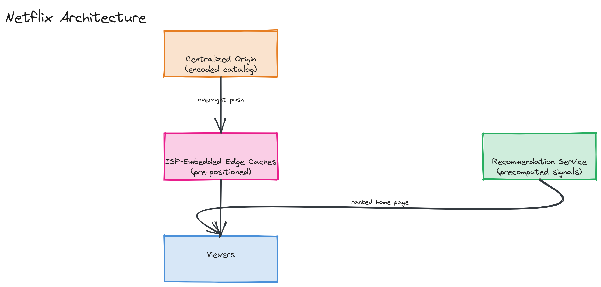

# Design Netflix

**Difficulty:** Hard
**Time:** 35–45 minutes
**Relevant Modules:** [10 — CDN](../../../modules/module-10-cdn/), [09 — Storage Systems](../../../modules/module-09-storage/), [19 — ML Systems](../../../modules/module-19-ml-systems/), [17 — Data Pipelines](../../../modules/module-17-data-pipelines/)

---

## Problem Statement

Design a global video streaming platform: a content catalog is encoded and stored once, then streamed smoothly to hundreds of millions of users worldwide across wildly varying devices and network conditions, with a personalized recommendation feed driving what each user sees first. This builds directly on [the YouTube question](../medium/youtube.md)'s transcoding/CDN foundation, adding global-scale content distribution strategy and recommendations as the new "hard" tier components.

---

## Clarifying Questions to Ask

- Is this a fixed catalog (professionally produced content, encoded once and reused across millions of views) or user-generated content with constant new uploads? Assume fixed catalog — this changes the storage/encoding economics significantly versus YouTube's constant-upload model.
- Is live content (live sports/events) in scope, or video-on-demand only? Assume on-demand only for the core design.
- How deep should the recommendation system go — just "is personalization needed" at a conceptual level, or a detailed ranking pipeline? Assume a moderate deep dive, comparable to [the news feed ranking discussion](../medium/news-feed.md).
- What's the expected global distribution of users — concentrated in a few regions, or truly global?
- What playback quality range must be supported — up to 4K, requiring multiple high-bitrate variants?

---

## Requirements

### Functional

- Stream on-demand video content, adapting quality to network conditions (same adaptive bitrate streaming as YouTube)
- Personalized home page: a ranked list of content recommendations per user
- Track viewing progress (resume where you left off, across devices)
- Search the catalog by title/genre/actor

### Non-Functional

- Massive, sustained streaming bandwidth: this is the platform's dominant cost and infrastructure driver
- Low playback start latency and zero rebuffering under normal network conditions
- Global low latency: users worldwide need fast access to the same, relatively small (compared to YouTube) catalog
- Scale: 250M subscribers, average 2 hours watched/day/active user, a catalog of ~15,000 titles (vastly smaller than YouTube's open-upload catalog, but each title encoded into many more variants and watched far more repeatedly)

---

## Capacity Estimation

```
Concurrent streams at peak (assume 10% of subscribers streaming simultaneously during peak hours) ≈ 25,000,000 concurrent streams
Average stream bitrate ≈ 5 Mbps (HD)
Peak aggregate bandwidth ≈ 25,000,000 × 5 Mbps = 125 Tbps — an enormous, CDN-dominated number
Catalog storage: 15,000 titles × ~10 quality/bitrate variants × ~5GB average per variant ≈ 750 TB total
  — this is a remarkably small number relative to the bandwidth figure, which is the core insight of this question
```

The contrast between a comparatively tiny catalog (750TB, fits easily on a handful of storage racks) and an almost incomprehensibly large sustained bandwidth requirement (125 Tbps) is the single most important number in this question — it means the entire architecture should be optimized around *distributing a small amount of data to an enormous number of concurrent viewers as cheaply and locally as possible*, not around storage scale.

---

## High-Level Architecture


*A small, centralized origin holding the fully-encoded catalog, a purpose-built CDN with caching appliances pre-positioned deep inside ISP networks worldwide, and a recommendation service producing each user's ranked home page from precomputed signals.*

**Components:**
- **Encoding pipeline** — transcodes each title into many resolution/bitrate variants once (offline, not per-request), identical in concept to [YouTube's transcoding pipeline](../medium/youtube.md) but run far less frequently relative to total views, since the catalog changes slowly compared to view volume
- **Origin storage** — the durable, canonical copy of every encoded variant of every title
- **Purpose-built CDN with ISP embedding** — Netflix's real-world approach (Open Connect) places caching appliances physically inside ISP networks, pre-filled with the most popular content during off-peak hours, so the overwhelming majority of streaming traffic never leaves the ISP's own network, let alone reaches Netflix's origin
- **Recommendation service** — generates a personalized, ranked catalog ordering per user, structurally similar to [the news feed's offline-signal + online-scoring split](../medium/news-feed.md)
- **Viewing progress service** — a small, frequently-written, frequently-read store tracking exact playback position per user per title, synced across devices

---

## API Design

```
GET /api/v1/home?userId=u123
Response: { "rows": [ { "title": "Continue Watching", "items": [...] }, { "title": "Recommended for You", "items": [...] } ] }

GET /api/v1/playback/{titleId}/manifest
Response: adaptive bitrate manifest (HLS/DASH), same mechanism as YouTube

POST /api/v1/progress
Request:  { "userId": "u123", "titleId": "t_991", "positionSeconds": 1820 }
```

---

## Deep Dive: Content Distribution at the Edge — Predictive Pre-Positioning

Unlike most CDN use cases (where content is cached reactively, on first request, as in [Instagram](../medium/instagram.md) and [YouTube](../medium/youtube.md)), a catalog of this size and predictability allows for a fundamentally different, *proactive* strategy: since the catalog is small (~750TB) and viewing patterns are reasonably predictable (new releases and existing popular titles dominate viewership), the system can **pre-position** — push the most likely-to-be-watched content to edge caching appliances *before* any user requests it, typically during off-peak overnight hours when bandwidth between origin and edge is cheap and uncontended.

This inverts the typical cache-miss-then-fetch CDN pattern: by the time a real user requests a popular new release, it's often already sitting on the caching appliance physically inside their own ISP's network, meaning the request never has to leave the ISP at all — dramatically reducing both latency and the cost/congestion of inter-network data transfer. Less popular, "long tail" catalog titles are still served reactively (fetched to the edge on first request, then cached), but the bulk of total viewing hours concentrate on a relatively small, predictable set of titles that benefit enormously from pre-positioning.

> 💡 **Note:** This strategy is only viable *because* the catalog is small and slow-changing relative to YouTube's constant stream of new, unpredictable uploads — it's a direct consequence of the "small catalog, enormous bandwidth" estimation insight above, not a generically superior CDN strategy. Naming this connection explicitly is a strong signal in this question.

---

## Deep Dive: Recommendations as Candidate Generation Plus Ranking

The personalized home page follows the same two-phase structure as [the news feed's ranking](../medium/news-feed.md): a **candidate generation** phase narrows the full ~15,000-title catalog down to a few hundred plausible candidates per user (e.g., via collaborative filtering — "users similar to you watched X" — or content-based filtering on genre/actor similarity to viewing history), computed largely offline/in batch since it doesn't need to react to a single click in real time. A **ranking** phase then scores and orders just those few hundred candidates per row (e.g., "Continue Watching," "Recommended for You," "Trending") using precomputed signals, similar in cost profile to the news feed's lightweight online scoring step — this keeps home-page load fast despite personalization, because the expensive modeling work (similarity computation across the whole catalog and user base) happens offline, not synchronously per page load.

---

## Caching Strategy

This entire question is, in a sense, about caching strategy at an unusually large scale: pre-positioned content at ISP-embedded edge caches (proactive), reactively-cached long-tail content at more traditional CDN edges, and precomputed recommendation candidates (the "cache" for what would otherwise be an expensive real-time similarity computation).

---

## Handling Scale

Because the architecture already pushes nearly all bandwidth-heavy traffic to the edge, "scaling" in this system is largely about increasing edge-cache footprint (more appliances, deeper into more ISPs) rather than scaling origin infrastructure — origin only needs to serve the relatively rare cache misses and the periodic pre-positioning pushes, not live viewer traffic directly.

---

## Trade-offs to Discuss

| Decision | Choice | Trade-off |
|---|---|---|
| Edge strategy | Proactive pre-positioning (vs. reactive-only caching) | Dramatically reduces live request latency and inter-network transfer cost, but only works because the catalog is small and viewing patterns are predictable |
| Recommendation architecture | Offline candidate generation + lightweight online ranking | Fast personalized home-page loads at scale, at the cost of recommendations being based on signals that are slightly stale relative to a user's most recent click |
| CDN ownership | Purpose-built, ISP-embedded (vs. third-party CDN) | Maximum control over placement and cost at Netflix's scale, at the cost of having to build and operate physical infrastructure deals with ISPs worldwide — only justified at this volume |

---

## Follow-up Questions

- How would you decide which titles to pre-position at a given edge location, and how often to refresh that decision?
- How would you handle a brand-new, highly anticipated release causing a massive simultaneous demand spike on day one?
- How would you A/B test a new recommendation algorithm without risking a broad regression in engagement?
- How would you support multiple profiles per account with independently personalized recommendations?
- How would you measure and reduce rebuffering events across a global, highly heterogeneous network of viewers?
- How would offline/downloaded viewing change the architecture for users without reliable connectivity?
