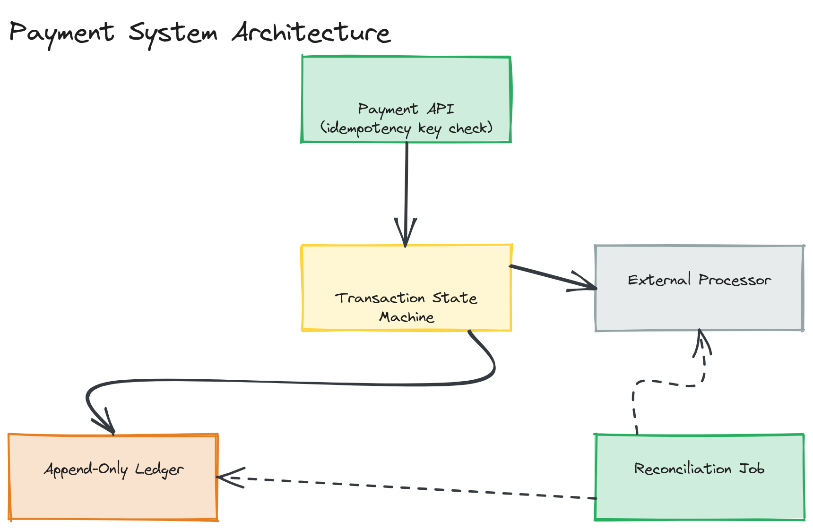

# Design a Payment System

**Difficulty:** Hard
**Time:** 35–45 minutes
**Relevant Modules:** [12 — Distributed Systems Fundamentals](../../../modules/module-12-distributed-systems/), [08 — Message Queues](../../../modules/module-08-message-queues/), [11 — Microservices](../../../modules/module-11-microservices/), [15 — Security](../../../modules/module-15-security/)

---

## Problem Statement

Design a payment processing system that moves money between accounts (e.g., a checkout flow charging a customer and paying out a merchant), integrating with external payment networks/banks. The defining constraint, shared with [the stock trading system](./stock-trading-system.md), is that correctness is non-negotiable — a double charge, a lost payment, or an incorrectly applied refund has direct financial and legal consequences, not just a degraded user experience.

---

## Clarifying Questions to Ask

- Are we designing the full payment processor (talking to card networks/banks), or a payment orchestration layer sitting in front of an existing processor (e.g., Stripe)? Assume an orchestration layer — it's the more commonly intended scope and still contains the hard distributed-systems problems.
- What payment methods are in scope — cards only, or also bank transfers/wallets?
- Do we need to support refunds and partial refunds?
- What's the consistency requirement on balance/ledger updates — must they be visible immediately, or is brief eventual consistency on read-side reporting acceptable while the ledger write itself stays strict?
- What's the expected transaction volume, and what's the acceptable latency for payment confirmation (checkout flows are latency-sensitive)?

---

## Requirements

### Functional

- Initiate a payment: charge a customer's payment method and credit a merchant
- Support refunds (full and partial)
- Maintain an accurate, auditable ledger of every balance-affecting event
- Handle asynchronous confirmation from external payment networks (a charge isn't always instantly final)
- Idempotent retries: a client retrying a failed-looking request must never result in a duplicate charge

### Non-Functional

- Correctness above all: this system would rather reject or delay a payment than risk double-charging or losing money — it explicitly favors consistency over availability when forced to choose
- Idempotency: every payment request carries a client-supplied idempotency key; retrying the same key must never charge twice
- Auditability: every state transition (initiated, authorized, captured, failed, refunded) must be durably logged with enough detail to reconstruct what happened, often for regulatory/dispute purposes
- Durability: a confirmed payment record must never be lost
- Scale: tens of thousands of transactions/sec at large scale, though correctness requirements matter far more than raw throughput in this question

---

## Capacity Estimation

```
Target: 20,000 transactions/sec at peak (e.g., a major sale event)
Each transaction record: ~1KB (payment method token, amounts, status history, timestamps)
Write volume: 20,000 × 1KB = 20MB/sec — modest in raw bytes
Ledger entries: each transaction generates at least 2 ledger entries (debit customer, credit merchant) → 40,000 ledger writes/sec
```

The estimation insight here: raw throughput is comfortably achievable on well-provisioned infrastructure; the actual engineering difficulty is entirely about correctness under failure and retry, not scale in the traditional sense.

---

## High-Level Architecture


*A payment API recording an idempotency-keyed transaction intent, a state machine tracking each transaction's lifecycle, an append-only ledger recording every balance-affecting event, and a reconciliation job checking external processor state against internal records.*

**Components:**
- **Payment API** — accepts payment requests, enforces idempotency, and orchestrates the transaction lifecycle
- **Transaction state machine** — tracks each payment through well-defined states (`initiated → authorized → captured → settled`, or `→ failed`/`→ refunded`), rejecting invalid state transitions
- **External processor integration** — calls out to the actual card network/bank rail, handling both synchronous responses and asynchronous webhooks/callbacks for final confirmation
- **Ledger service** — an append-only, immutable record of every balance-affecting event (debits and credits); the system's ultimate source of truth for "what actually happened financially"
- **Reconciliation job** — a periodic background process comparing internal transaction records against the external processor's own records, flagging and resolving discrepancies (e.g., a payment the processor confirmed but an internal callback was missed)

---

## API Design

```
POST /api/v1/payments
Headers:  Idempotency-Key: <client-generated UUID>
Request:  { "amount": 4999, "currency": "USD", "customerId": "c123", "merchantId": "m456", "paymentMethodToken": "..." }
Response: { "paymentId": "p_77123", "status": "authorized" }

POST /api/v1/payments/{paymentId}/refund
Request:  { "amount": 4999 }   // omit for full refund
Response: { "refundId": "r_551", "status": "processing" }
```

> 🎯 **Interview Tip:** The `Idempotency-Key` header is the single most important detail in this API. If a client's request times out (network failure, not knowing if the server actually processed it), retrying with the *same* idempotency key must return the original result rather than creating a second charge — this is the concrete mechanism behind the "no double charges" requirement.

---

## Deep Dive: Idempotency and the Transaction State Machine

A payment request can fail to return a response to the client for reasons that have nothing to do with whether the payment actually succeeded — a network timeout, a load balancer hiccup, a client crash before reading the response. Without idempotency, a client's natural response (retry) risks creating a second, duplicate charge for a payment that may have already gone through.

The fix: every payment request carries a client-generated idempotency key. Before processing, the payment API checks whether this key has been seen before; if so, it returns the previously recorded result instead of processing the request again — this check-and-record step must itself be atomic (typically enforced via a unique constraint on the idempotency key in the transaction table, the same database-enforced-uniqueness pattern used in [Airbnb's double-booking prevention](./airbnb.md)) to avoid a race between two near-simultaneous retries both believing they're the first.

The **transaction state machine** is what makes partial failures recoverable rather than ambiguous: a payment moves through explicit states (`initiated` → `authorized` → `captured`), and each transition is durably recorded before the next step is attempted. If the system crashes between `authorized` and `captured`, on recovery it can inspect the transaction's last known state and either resume from there or query the external processor to determine the true outcome — rather than being left in an unknown, unrecoverable state. This is conceptually similar to the [outbox pattern](../../../modules/module-08-message-queues/02-deep-dive/README.md): durably recording intent *before* acting on it, so a crash mid-operation leaves a clear, recoverable trail instead of silence.

> ⚠️ **Warning:** A subtle but critical detail: the external payment processor's confirmation is often asynchronous (a webhook arriving seconds or minutes later), meaning the system must handle "I don't yet know the final outcome" as a real, durable state — not just synchronous success/failure. Treating every payment as resolved within a single request/response cycle is a common and serious modeling mistake in this question.

---

## Deep Dive: The Ledger as Source of Truth

Account balances should never be computed by mutating a single "current balance" number directly — doing so makes it nearly impossible to audit or reconstruct how a balance arrived at its current value, and creates the same lost-update race conditions seen elsewhere in this question bank. Instead, the **ledger** records an immutable, append-only sequence of individual debit/credit entries; a balance is always the sum of relevant ledger entries (often supplemented by periodically computed and cached running totals for query performance, recomputed/verified against the ledger rather than treated as independently authoritative). This makes every balance change traceable to a specific, timestamped, auditable event — essential for both regulatory compliance and resolving customer disputes.

---

## Caching Strategy

Computed account balances (derived from the ledger) are a reasonable caching target for fast reads in account dashboards, refreshed on each new ledger entry or via periodic recomputation — but the cache is explicitly a read-optimization derived from the ledger, never the system of record itself, and any balance-affecting decision (e.g., "does this customer have sufficient funds") should consult the ledger directly or a guaranteed-fresh balance, not a potentially-stale cached value.

---

## Handling Scale

Sharding the ledger and transaction tables by `customerId` or `merchantId` is a natural horizontal scaling axis, since most operations (a single payment, a single account's balance) are scoped to one customer/merchant and don't require cross-shard transactions. Cross-account operations (e.g., platform-wide financial reporting) are handled by separate, asynchronous aggregation pipelines reading from the ledger, rather than by the transactional hot path itself.

---

## Trade-offs to Discuss

| Decision | Choice | Trade-off |
|---|---|---|
| Idempotency | Client-supplied key + unique constraint | Prevents duplicate charges on retry, at the cost of requiring every client integration to generate and persist idempotency keys correctly |
| Consistency stance | Strong consistency, favoring correctness over availability | Matches the financial correctness requirement, at the cost of the system needing to explicitly handle (not paper over) processor unavailability as a real failure state |
| Balance representation | Append-only ledger + derived/cached balance | Fully auditable and recoverable, at the cost of more storage and computation than simply mutating a single balance field |

---

## Follow-up Questions

- How would you handle a payment that the external processor confirms as successful, but whose webhook callback is delayed by hours?
- How would you implement multi-currency support and currency conversion within the ledger model?
- How would you detect and respond to fraud patterns without adding unacceptable latency to the checkout flow?
- How would you support partial refunds while keeping the ledger consistent and auditable?
- How would you reconcile internal records against the external processor's records when they disagree, and who/what resolves the discrepancy?
- How would you test this system's correctness under simulated network failures and partial outages without risking real financial transactions?
