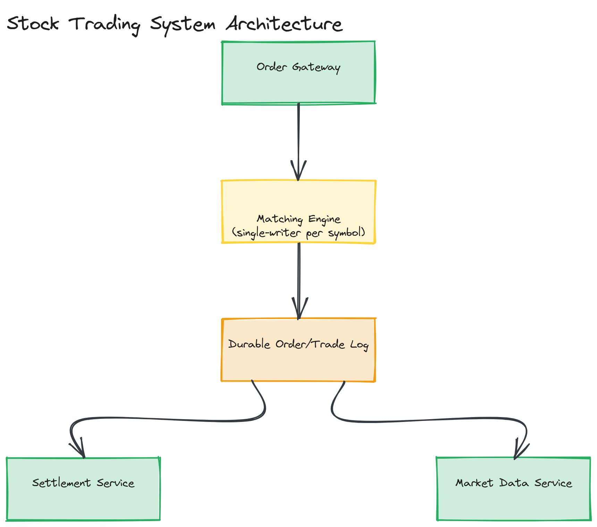

# Design a Stock Trading System

**Difficulty:** Hard
**Time:** 35–45 minutes
**Relevant Modules:** [12 — Distributed Systems Fundamentals](../../../modules/module-12-distributed-systems/), [13 — Consistency, Consensus & CAP Theorem](../../../modules/module-13-consistency-consensus/), [08 — Message Queues](../../../modules/module-08-message-queues/), [14 — Observability](../../../modules/module-14-observability/)

---

## Problem Statement

Design the core of a stock trading platform: users submit buy/sell orders, the system matches compatible orders (an order book), executes trades, and reliably updates account balances/positions. Unlike most question-bank entries, this system explicitly cannot trade correctness for availability or latency under load — an incorrectly executed trade, a lost order, or a double-counted balance has direct financial and regulatory consequences.

---

## Clarifying Questions to Ask

- Are we matching orders in real time (a live order book) or is this a simpler batch-settlement system? Assume real-time matching — it's the more interesting and commonly intended version.
- What order types must be supported — market orders, limit orders, or more exotic types (stop-loss, etc.)? Assume market and limit orders as the core scope.
- Must ordering of trade execution be strictly fair (price-time priority), and is this auditable/regulatorily required? Assume yes — this is standard for real exchanges.
- What's the acceptable latency for order acknowledgment and matching?
- Is this a single exchange for one set of symbols, or must it support many symbols/exchanges independently?
- Do we need to model account balance/margin checks before accepting an order?

---

## Requirements

### Functional

- Submit a buy or sell order (market or limit) for a given symbol
- Match compatible buy/sell orders according to price-time priority
- Execute matched trades, updating both parties' positions and balances atomically
- Cancel an unmatched (resting) order
- Provide real-time order book / market data (best bid/ask) to clients

### Non-Functional

- Strict correctness: no lost orders, no double-executed trades, no incorrect balance updates — this system favors consistency and auditability over availability when the two conflict
- Low latency: order acknowledgment and matching should complete in low milliseconds for a competitive trading platform
- Strict ordering: orders for a given symbol must be processed in a well-defined, consistent sequence — price-time priority requires knowing the true relative order of arrival
- Auditability: every order, match, and balance change must be durably logged and reconstructable after the fact (often a regulatory requirement, not just an engineering nice-to-have)
- Scale: tens of thousands of orders/sec system-wide across many symbols, with some individual symbols receiving disproportionate volume

---

## Capacity Estimation

```
Target: 50,000 orders/sec system-wide across ~5,000 actively traded symbols
Average symbol load: 10 orders/sec, but with a long tail — the most active symbols may see thousands/sec during volatile periods
Each order: ~200 bytes (symbol, side, price, quantity, account, timestamp)
Order log volume: 50,000 × 200B = 10MB/sec sustained, easily within a single well-provisioned append-only log's throughput
```

The estimation insight: aggregate volume is modest by big-data standards, but it's heavily skewed per-symbol, and the correctness/ordering requirements — not raw throughput — are what make this system hard.

---

## High-Level Architecture


*Orders routed by symbol to a dedicated, single-writer matching engine instance per symbol, which maintains an in-memory order book and publishes trade events to a durable log consumed by settlement and market-data services.*

**Components:**
- **Order gateway** — validates incoming orders (basic checks: balance/margin sufficiency, valid symbol) and routes each order to the matching engine instance responsible for that symbol
- **Matching engine (per symbol, single-writer)** — holds the live order book for one symbol in memory and applies price-time priority matching; deliberately single-writer per symbol to make ordering trivially correct without distributed coordination
- **Durable order/trade log** — every accepted order and resulting trade is appended here before being considered final, providing both durability (recoverable after a crash) and auditability
- **Settlement service** — consumes trade events from the log and updates account balances/positions, structurally similar to [the outbox-pattern-driven event processing](../../../modules/module-08-message-queues/02-deep-dive/README.md) used elsewhere in the curriculum
- **Market data service** — publishes real-time best-bid/ask and recent trade data derived from the same trade log, to traders and external data consumers

---

## API Design

```
POST /api/v1/orders
Request:  { "accountId": "a123", "symbol": "ACME", "side": "buy" | "sell", "type": "limit" | "market", "price": 102.50, "quantity": 100 }
Response: { "orderId": "o_55123", "status": "accepted", "sequenceNumber": 9981234 }

DELETE /api/v1/orders/{orderId}
Response: { "status": "cancelled" | "already_filled" }

GET /api/v1/marketdata/{symbol}
Response: { "bestBid": 102.45, "bestAsk": 102.55, "lastTradePrice": 102.50 }
```

> 🎯 **Interview Tip:** Notice the order response includes a `sequenceNumber` — making the deterministic ordering of every accepted order explicit and queryable is exactly the kind of detail that signals you understand why ordering matters here, beyond just "the matching engine handles it somehow."

---

## Deep Dive: Why a Single-Writer Matching Engine Per Symbol

The most important, and most often under-justified, decision in this design is making each symbol's matching engine a **single logical writer** — all orders for symbol ACME are processed by exactly one matching engine instance, strictly in arrival order, with no concurrent writers to that symbol's order book.

This is a deliberate trade against horizontal write-scaling *within a symbol*, made because price-time priority is fundamentally a strict-ordering requirement: matching correctness depends on knowing, unambiguously, which of two orders arrived first. A naively distributed, multi-writer order book for the same symbol would require a consensus protocol (e.g., Raft) to agree on order sequencing before every single match — adding meaningful latency to the system's most latency-sensitive path. By instead pinning each symbol to one matching engine instance (in memory, for speed), ordering is correct by construction with zero coordination overhead per order.

This works because **symbols are independent of each other** — ACME's order book has no correctness dependency on GOOG's. Horizontal scale is therefore achieved across symbols (different symbols' matching engines run on different machines/processes), not within a single symbol's matching path. A symbol experiencing unusually high volume (a single matching engine instance becoming a bottleneck) is the one case this doesn't trivially solve — mitigated in practice by ensuring matching engines run on hardware with significant per-core headroom, since the operation itself (comparing prices, updating an in-memory book) is computationally cheap; the real constraint is usually input/output handling, not the matching logic itself.

> ⚠️ **Warning:** If asked "how do you scale this?", resist the instinct to say "shard the order book." Sharding a single symbol's order book across multiple writers reintroduces exactly the distributed-ordering problem the single-writer design avoids. The correct scaling axis is across symbols, not within one.

---

## Caching Strategy

The in-memory order book itself functions as a purpose-built cache of "current market state" for its symbol — there's no separate caching layer in the matching path. Market data (best bid/ask, recent trades) consumed by external clients is a much more natural caching candidate, since many readers want the same recent snapshot and slight staleness (sub-second) is generally acceptable there, unlike in the order-matching path itself.

---

## Handling Scale

Scaling across more symbols is straightforward — each symbol's matching engine is independent, so adding machines to host more matching engine instances scales linearly. The harder scaling question is an individual hot symbol exceeding one engine instance's throughput; this is generally addressed by maximizing single-instance efficiency (in-memory data structures, minimizing I/O on the hot path) rather than distributing the symbol's order book, for the ordering reasons discussed above.

---

## Trade-offs to Discuss

| Decision | Choice | Trade-off |
|---|---|---|
| Matching engine model | Single-writer per symbol | Correct, low-latency ordering with no coordination overhead, at the cost of capping per-symbol throughput to what one instance can handle |
| Consistency stance | Strong consistency, favoring correctness over availability | Matches the financial/regulatory correctness requirement, at the cost of needing to handle the rare case of a matching engine instance being unavailable as a real outage, not something to paper over with eventual consistency |
| Durability | Append-only order/trade log before considering an order final | Strong auditability and crash recovery, at the cost of every order needing a durable write before acknowledgment |

---

## Follow-up Questions

- How would you recover a matching engine's in-memory order book state after a crash, without losing or duplicating any pending orders?
- How would you implement circuit breakers/trading halts for a symbol experiencing extreme volatility?
- How would you handle partial fills (an order matched against multiple smaller counter-orders)?
- How would you support margin/short-selling, where balance checks are more complex than simple sufficient-funds validation?
- How would you provide a consistent, auditable record for regulators reconstructing exactly what happened during a specific trading window?
- How would you test a matching engine's correctness under extreme concurrent order volume without risking real financial impact?
