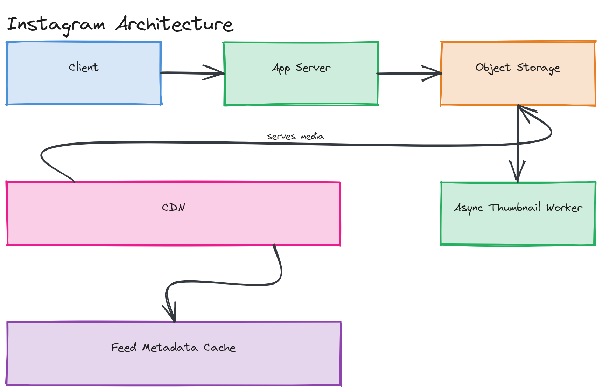

# Design Instagram

**Difficulty:** Medium
**Time:** 35–45 minutes
**Relevant Modules:** [09 — Storage Systems](../../../modules/module-09-storage/), [10 — CDN](../../../modules/module-10-cdn/), [05 — Caching](../../../modules/module-05-caching/), [04 — Databases](../../../modules/module-04-databases/)

---

## Problem Statement

Design a photo-sharing service: users upload photos (with captions), follow other users, and view a feed of posts from accounts they follow. Structurally similar to Twitter's timeline problem, but the dominant new challenge is media — large binary blobs that need durable storage and fast, globally distributed delivery, not just text.

---

## Clarifying Questions to Ask

- Are we designing for photos only, or also video (Stories, Reels)? Assume photos only unless stated otherwise — video adds transcoding/streaming complexity covered in [Module 10](../../../modules/module-10-cdn/).
- What resolutions/sizes need to be served — original upload plus multiple thumbnail sizes for different contexts (feed, profile grid, full view)?
- Is the feed chronological or ranked? Assume chronological for this version.
- What's the expected upload volume and read (feed view) volume?
- Do we need likes/comments, or just post + follow + feed?
- Any geographic distribution requirements — is the user base global?

---

## Requirements

### Functional

- Upload a photo with a caption
- Follow / unfollow other users
- View a home feed of posts from followed accounts
- View a user's profile grid of their own posts
- Like and comment on a post

### Non-Functional

- Read-heavy: feed views vastly outnumber uploads (assume 100:1)
- Upload latency: users expect feedback within a couple of seconds, even though full processing (thumbnail generation) can happen asynchronously
- Media delivery latency: images should load near-instantly worldwide — this is a CDN-driven requirement, not a database one
- Scale: 500M DAU, each viewing ~10 feed refreshes/day, 1 upload per 20 active users per day, average original photo size 2MB
- Durability: an uploaded photo must never be lost — target "11 nines" durability via the storage backend, same guarantee object storage providers like S3 advertise

---

## Capacity Estimation

```
Uploads/day      = 500M / 20                                 = 25,000,000 photos/day  → ~290 writes/sec avg
Feed reads/day   = 500M × 10                                  = 5,000,000,000/day      → ~57,900 reads/sec avg, ~115,800 peak
Storage/day       = 25M photos × 2MB (original) × ~1.3 (thumbnails overhead) ≈ 65 TB/day
5-year storage     ≈ 65TB × 365 × 5                                                     ≈ 118 PB
```

The read load is enormous, but critically, almost all of it is **media delivery**, not database queries — this points directly at a CDN-first architecture rather than trying to scale a database to serve image bytes.

---

## High-Level Architecture


*An upload path (client → app server → object storage + async thumbnail generation) and a separate, dominant read path (client → CDN, falling back to object storage origin only on cache miss).*

**Components:**
- **App servers** — handle uploads, feed metadata queries, follows, likes/comments
- **Object storage (S3-style)** — stores original photos and generated thumbnails durably
- **Async thumbnail/processing pipeline** — a queue-driven worker pool that generates multiple resolutions after upload, without blocking the upload response
- **CDN** — serves all image bytes from edge caches; this absorbs the overwhelming majority of read traffic before it ever reaches origin storage
- **Feed metadata store + cache** — stores/serves the list of post IDs in a user's feed, structurally identical to [Twitter's timeline problem](./twitter.md)

---

## API Design

```
POST /api/v1/posts
Request:  multipart upload (image bytes) + { "caption": "...", "userId": "u123" }
Response: { "postId": "p_77123", "status": "processing", "imageUrl": "<placeholder until thumbnails ready>" }

GET /api/v1/feed?userId=u123&cursor=<postId>&limit=20
Response: { "posts": [ { "postId": "...", "authorId": "...", "thumbnailUrl": "...", "caption": "...", "createdAt": "..." }, ... ] }
```

---

## Database Schema

```sql
CREATE TABLE posts (
  post_id      BIGINT PRIMARY KEY,         -- Snowflake-style, time-sortable
  author_id    BIGINT NOT NULL,
  caption      VARCHAR(2200),
  storage_key  VARCHAR(255) NOT NULL,       -- pointer to original in object storage
  created_at   TIMESTAMP NOT NULL DEFAULT now()
);

CREATE TABLE follows (
  follower_id  BIGINT NOT NULL,
  followee_id  BIGINT NOT NULL,
  PRIMARY KEY (follower_id, followee_id)
);
```

Image bytes are never stored in this table — only a `storage_key` pointer, for the same reasons discussed in [the Pastebin question](../easy/pastebin.md): large immutable blobs belong in object storage, not relational rows.

---

## Deep Dive: Upload Pipeline and Multi-Resolution Delivery

A photo needs to be served at several different sizes — a small thumbnail in the feed grid, a medium size in the main feed, and potentially the full original on tap. Generating all of these synchronously during upload would make the user wait several seconds for a response, which is a poor experience.

The standard pattern: the upload endpoint stores the original image to object storage and immediately returns success, while publishing an event to a queue. A pool of worker processes consumes that event, generates each required resolution (resize, compress), and writes each as a separate object in storage with a predictable naming scheme (`{postId}_thumbnail.jpg`, `{postId}_medium.jpg`). The client polls or receives a push notification once processing completes, or simply requests the post a few seconds later by which point thumbnails exist.

> 💡 **Note:** This is the same async-processing pattern as [Module 08's message queue content](../../../modules/module-08-message-queues/01-concepts/README.md) — decoupling a fast, must-succeed-quickly operation (the upload) from a slower, can-happen-in-the-background operation (resizing) is one of the most broadly reusable patterns in system design.

Once generated, every resolution is fronted by a CDN. A request for an image hits the nearest edge PoP; on a cache miss, the edge fetches from the object storage origin once and caches it for all subsequent nearby requests — meaning only the very first request for any given image, from any given region, ever touches origin storage at all.

---

## Caching Strategy

- **Media bytes:** cached at the CDN edge, keyed by URL — images are immutable once generated, so cache entries never need invalidation, only eventual expiration/eviction by the CDN's own LRU policy.
- **Feed metadata:** cached the same way as [Twitter's timeline](./twitter.md) — a precomputed, per-user list of post IDs in a Redis layer, populated via fan-out-on-write for typical accounts and fan-out-on-read for high-follower accounts.

---

## Handling Scale

At 10× scale, the CDN architecture already absorbs almost all the additional read load by design — CDNs are built precisely to scale read throughput for static content without the origin noticing. The remaining bottleneck becomes the thumbnail-generation worker pool during upload bursts (e.g., a viral moment causing many uploads at once); this scales horizontally by adding worker instances consuming from the same queue, since each job is fully independent.

---

## Trade-offs to Discuss

| Decision | Choice | Trade-off |
|---|---|---|
| Thumbnail generation | Asynchronous, post-upload | Fast upload response, at the cost of a brief delay before all resolutions are available |
| Media storage | Object storage + CDN | Scales media delivery almost for free, but adds eventual-consistency considerations between "upload acknowledged" and "fully processed" |
| Feed assembly | Hybrid fan-out (same as Twitter) | Handles celebrity accounts without write amplification, at the cost of more complex read-time merge logic |

---

## Follow-up Questions

- How would you handle a photo that fails thumbnail generation (e.g., corrupted upload)?
- How would you implement Stories (ephemeral, 24-hour content) differently from permanent posts?
- How would you detect and prevent duplicate/spam uploads at scale?
- How would you extend this design to support short-form video (Reels)?
- How would you serve users in regions far from your primary storage region with low latency on first-ever access to a new photo?
- How would you implement a "delete my account" flow that must remove all associated media from both the database and the CDN/object storage?
