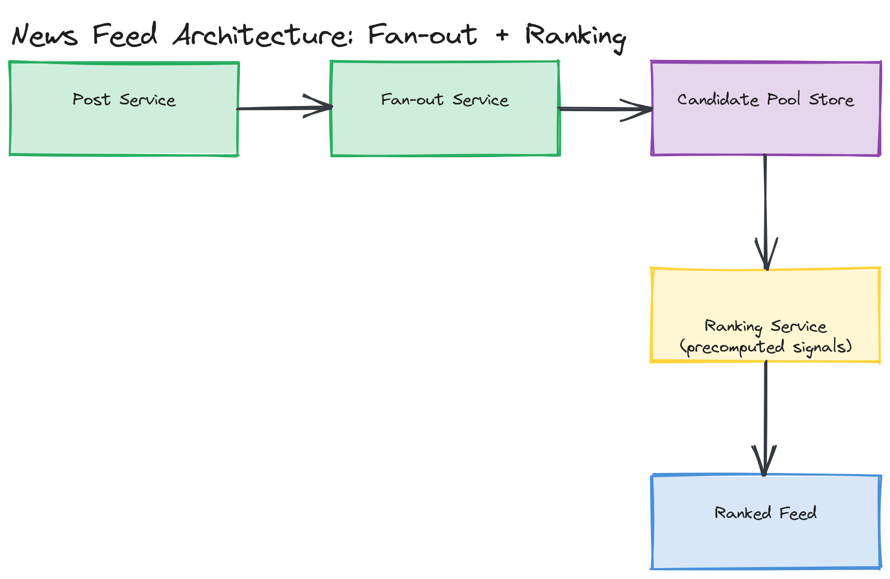

# Design a News Feed

**Difficulty:** Medium
**Time:** 35–45 minutes
**Relevant Modules:** [05 — Caching](../../../modules/module-05-caching/), [06 — Scalability](../../../modules/module-06-scalability/), [08 — Message Queues](../../../modules/module-08-message-queues/), [19 — ML Systems](../../../modules/module-19-ml-systems/)

---

## Problem Statement

Design a generalized news feed system (Facebook-style): users see a feed of posts from friends/followed entities, but unlike [Twitter's chronological timeline](./twitter.md), the feed here is **ranked** — ordered by predicted relevance rather than strictly by recency. This question is best framed as "the Twitter timeline problem, plus a ranking layer," since it's directly comparable but adds a genuinely new system component.

---

## Clarifying Questions to Ask

- Is ranking required, or is chronological acceptable? (If chronological, this collapses into [the Twitter question](./twitter.md) — assume ranking is required, since that's what differentiates this question.)
- What signals should ranking consider — recency, post engagement (likes/comments), relationship strength with the poster, content type?
- Is this a social-graph feed (friends/follows) or could it also surface content from outside the user's direct graph (e.g., recommended posts)? Assume social-graph-driven for the core design.
- What's the acceptable feed-load latency, and how fresh must it be (can a brand-new post take a minute to appear, or must it be near-instant)?
- What's the expected scale — DAU, average feed size, average posts/user/day?

---

## Requirements

### Functional

- Create a post (text, photo, etc. — content type itself isn't the focus here)
- Friend/follow another user
- View a ranked feed of posts from friends/followed entities
- Like/comment/react to a post, which feeds back into future ranking signals

### Non-Functional

- Read-heavy: feed views vastly outnumber post creations
- Low latency: feed load under ~200ms p99, despite needing to rank candidates, not just retrieve them in stored order
- Freshness vs. ranking trade-off: a brand-new, highly relevant post should surface quickly, but ranking computation shouldn't block on expensive real-time scoring for every single candidate on every request
- Scale: 300M DAU, average 300 friends/follows per user, 10 feed loads/day/user

---

## Capacity Estimation

```
Feed loads/day      = 300M × 10                = 3,000,000,000/day → ~34,700/sec avg, ~69,400 peak
Candidate posts per feed load: with ~300 friends each posting ~1x/day, a user has ~300 candidate posts/day to rank from,
though only the most recent window (e.g., last 48 hours) is realistically considered ≈ a few hundred to low thousands of candidates per ranking pass
```

The estimation insight that matters here: ranking a few hundred to a couple thousand candidate posts per request, on every one of tens of thousands of requests per second, must be cheap per-candidate — which rules out anything resembling a full ML model inference pass per post at request time, and points toward precomputed signals plus a lightweight scoring function.

---

## High-Level Architecture


*A write path (post creation → fan-out into per-follower candidate pools) and a read path that pulls each user's candidate pool, applies a ranking function using precomputed engagement/affinity signals, and returns the top-N posts.*

**Components:**
- **Post service** — handles post creation, similar to [Twitter's tweet service](./twitter.md)
- **Fan-out service** — pushes new posts into each follower's candidate pool (same hybrid fan-out-on-write / fan-out-on-read approach as Twitter, since the high-follower-count problem is identical)
- **Candidate pool store** — holds, per user, the unranked set of recent candidate posts from their graph — structurally like a precomputed timeline, but treated as raw input to ranking rather than the final feed order
- **Ranking service** — at read time, scores each candidate in the pool using a combination of precomputed signals (post engagement so far, recency decay, user-specific affinity score with the poster) and returns the top-N
- **Affinity/engagement signal store** — precomputed, periodically updated scores (e.g., "how often does this user engage with this poster's content") that the ranking service reads cheaply rather than computing live

---

## API Design

```
POST /api/v1/posts
Request:  { "authorId": "u123", "content": "...", "type": "text" | "photo" }
Response: { "postId": "p_5512", "createdAt": "..." }

GET /api/v1/feed?userId=u123&cursor=<token>&limit=20
Response: { "posts": [ { "postId": "...", "authorId": "...", "rankScore": 0.87, "content": "..." }, ... ], "nextCursor": "..." }
```

---

## Deep Dive: Ranking Without Blowing the Latency Budget

The core tension: ranking needs *some* signal about quality/relevance per candidate post, but computing a rich, real-time score (e.g., running a full ML model per post per request) for hundreds of candidates across tens of thousands of requests per second is far too expensive to do synchronously on every feed load.

The practical answer splits the work into two phases, mirroring the same offline/online split used in [the autocomplete question](./search-autocomplete.md):

1. **Offline/near-real-time signal computation:** engagement counts (likes, comments) on each post, and affinity scores between each pair of users (how often A engages with B's content), are computed and updated incrementally as events happen — not recomputed from scratch per feed load. These become cheap-to-read precomputed inputs.
2. **Online, lightweight scoring at read time:** when a feed is requested, the ranking service pulls the user's candidate pool (a few hundred posts) and applies a comparatively cheap scoring formula — e.g., a weighted combination of `recency_decay × engagement_score × affinity_score` — over just that small candidate set. This is fast enough to run per-request because it's arithmetic over precomputed numbers, not model inference or aggregation over raw event logs.

This is the same pattern as a recommendation system's "candidate generation, then ranking" split (see [Module 19](../../../modules/module-19-ml-systems/01-concepts/README.md)) — the expensive part (turning raw behavior into a useful number) happens offline and infrequently; the cheap part (combining a handful of numbers into a final order) happens online and on every request.

> ⚠️ **Warning:** A common weak answer here says "use a machine learning model to rank the feed" with no further detail. The interviewer is listening for *how* you keep that affordable per-request — separating signal computation from request-time scoring is the answer that demonstrates real understanding, not just name-dropping ML.

---

## Caching Strategy

- **Candidate pools:** cached the same way as a Twitter timeline — a per-user, periodically refreshed list of recent candidate post IDs.
- **Affinity/engagement scores:** cached aggressively, since they change slowly relative to how often they're read (read on every feed load, updated incrementally on each new engagement event) — a write-through or async-update pattern keeps these fresh without making every like/comment block on a synchronous recompute of every affected score.

---

## Handling Scale

At 10× scale, the fan-out tier scales the same way as Twitter's (async, queue-driven, hybrid for high-follower accounts). The ranking service scales horizontally and independently, since scoring one user's feed is fully independent of scoring any other user's — there's no cross-user coordination needed, making this an easy dimension to add capacity to under load.

---

## Trade-offs to Discuss

| Decision | Choice | Trade-off |
|---|---|---|
| Ranking architecture | Offline signal computation + cheap online scoring | Keeps per-request cost low at scale, at the cost of ranking signals being slightly stale relative to the very latest engagement |
| Candidate pool size | Bounded recent window (e.g., 48 hours) | Keeps ranking fast and relevant, at the cost of potentially missing an older but still-relevant post |
| Fan-out | Hybrid (same as Twitter) | Solves high-follower-count write amplification, at the cost of more complex read-time merge logic for celebrity-followed users |

---

## Follow-up Questions

- How would you A/B test a new ranking formula without risking a broad regression in feed quality?
- How would you handle "feed staleness" complaints — a user who reports that a recent, important post from a close friend didn't surface near the top?
- How would you incorporate negative signals (a user who consistently hides or skips a particular poster's content)?
- How would you rank content from outside the user's direct graph (e.g., recommended posts), and how would that change candidate generation?
- How would you bound ranking latency if a user's candidate pool unexpectedly grows very large (e.g., they follow thousands of pages)?
- How would you detect and down-rank spam or engagement-bait content without an explicit user report?
