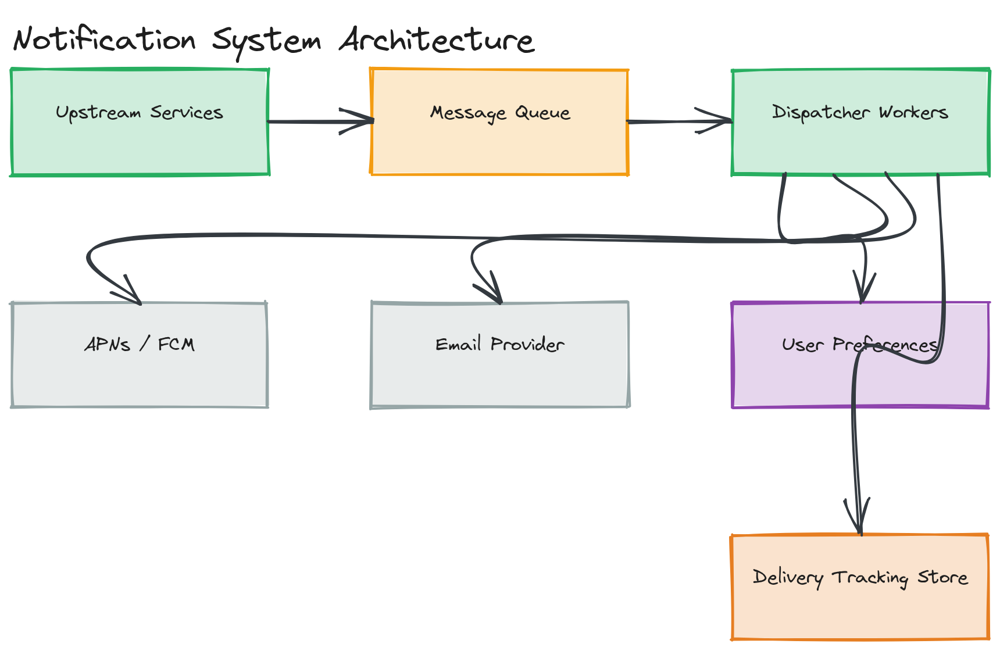

# Design a Notification System

**Difficulty:** Medium
**Time:** 35–45 minutes
**Relevant Modules:** [08 — Message Queues](../../../modules/module-08-message-queues/), [11 — Microservices](../../../modules/module-11-microservices/), [16 — Real-Time Systems](../../../modules/module-16-real-time-systems/)

---

## Problem Statement

Design a system that sends notifications to users across multiple channels — push notifications (mobile), email, SMS, and in-app — triggered by events from many different upstream services (e.g., "order shipped," "someone liked your post," "payment failed"). The core problem is building a single, reliable, reusable notification platform that many unrelated services can plug into, rather than every service implementing its own ad hoc sending logic.

---

## Clarifying Questions to Ask

- Which channels are in scope — push, email, SMS, in-app, or all of them?
- Is this a single product's notifications, or a shared platform other internal services call into? Assume the latter — it's the more interesting and realistic version.
- Do users have channel preferences (e.g., "email me for security alerts, push only for everything else")?
- What's the delivery guarantee — is it acceptable to occasionally drop a low-priority notification under extreme load, or must every notification be attempted until delivered?
- Do we need to support rate-limiting/batching (e.g., "don't send more than 1 email digest per hour" instead of one email per like)?
- What's the expected volume — events/sec from upstream services?

---

## Requirements

### Functional

- Accept a notification request from any internal service, specifying recipient, channel(s), template, and content
- Deliver via push (APNs/FCM), email, SMS, and in-app, based on user preference and channel availability
- Respect per-user notification preferences and opt-outs
- Support templating so callers send structured data, not pre-rendered text
- Track delivery status (sent, delivered, failed) per notification

### Non-Functional

- High throughput: must absorb bursty event volume from many upstream services without becoming their bottleneck
- At-least-once delivery attempt, with retries and exponential backoff on transient provider failures (see [Module 20's backoff content](../../../modules/module-20-advanced-patterns/01-concepts/README.md))
- Decoupling: a slow or failing notification channel must never slow down or fail the upstream service that triggered the notification
- Idempotency: a retried send must not result in duplicate notifications reaching the user
- Scale: 500M notifications/day across all channels combined, bursty (e.g., a viral post can spike "someone liked your post" events by 100× momentarily)

---

## Capacity Estimation

```
Notifications/day  = 500,000,000              → ~5,800/sec avg, but bursty — provision for 10x burst: ~58,000/sec peak
Average payload     ≈ 1KB (template data + metadata)
Storage/day (logs)  ≈ 500M × 1KB              ≈ 500 GB/day
30-day retention     ≈ 500GB × 30              ≈ 15 TB
```

The defining estimation insight is the gap between average and peak — a notification system's load is driven by *other systems'* spikes (a viral post, a mass payment-failure event), so the queue-based architecture must absorb bursts the producers themselves didn't smooth out.

---

## High-Level Architecture


*Upstream services publishing notification requests onto a message queue, consumed by dispatcher workers that look up user preferences and call out to channel-specific providers, with delivery status written back to a tracking store.*

**Components:**
- **Notification API** — the single entry point upstream services call to request a notification; validates the request and publishes it onto a queue, returning immediately
- **Message queue (Kafka/SQS)** — absorbs bursty producer volume and decouples request acceptance from actual delivery
- **Dispatcher workers** — consume from the queue, resolve user channel preferences, render the templated content, and call the appropriate channel provider
- **User preference service** — stores per-user, per-notification-type channel opt-ins/opt-outs
- **Channel providers** — external integrations: APNs/FCM for push, an email-sending provider (SES/SendGrid), an SMS provider (Twilio)
- **Delivery tracking store** — records the outcome (sent/delivered/failed) of every notification attempt

---

## API Design

```
POST /api/v1/notifications
Request:
{
  "recipientId": "u123",
  "type": "order_shipped",
  "templateData": { "orderId": "o_991", "carrier": "UPS" },
  "priority": "normal" | "high"
}
Response: { "notificationId": "n_8821", "status": "queued" }

GET /api/v1/notifications/{notificationId}/status
Response: { "status": "delivered", "channel": "push", "deliveredAt": "..." }
```

> 🎯 **Interview Tip:** Notice the API returns immediately with `"status": "queued"` rather than waiting for actual delivery — this is the decoupling requirement made concrete. The calling service (e.g., the order service) should never block on whether an email provider is slow or down.

---

## Database Schema

```sql
CREATE TABLE notification_preferences (
  user_id           BIGINT NOT NULL,
  notification_type VARCHAR(50) NOT NULL,
  channel           VARCHAR(20) NOT NULL,  -- 'push' | 'email' | 'sms' | 'in_app'
  enabled            BOOLEAN NOT NULL DEFAULT true,
  PRIMARY KEY (user_id, notification_type, channel)
);

CREATE TABLE notification_log (
  notification_id  VARCHAR(20) PRIMARY KEY,
  recipient_id      BIGINT NOT NULL,
  type              VARCHAR(50) NOT NULL,
  channel           VARCHAR(20) NOT NULL,
  status            VARCHAR(20) NOT NULL,  -- 'queued' | 'sent' | 'delivered' | 'failed'
  created_at        TIMESTAMP NOT NULL DEFAULT now(),
  delivered_at      TIMESTAMP NULL
);
```

---

## Deep Dive: Idempotency and Reliable Delivery Under Retries

Because the system promises at-least-once delivery attempts, a dispatcher worker might process the same queued notification twice — for example, if it crashes after successfully calling the email provider but before acknowledging the message off the queue, the message will be redelivered to another worker and processed again.

The fix is the same **idempotency key** pattern used throughout distributed systems (see [Module 03's idempotency section](../../../modules/module-03-apis/02-deep-dive/README.md)): every notification request carries a unique `notificationId` (generated by the caller or the API layer at intake). Before actually dispatching to a channel provider, the dispatcher checks the delivery tracking store for that ID — if it's already marked `sent` or `delivered`, the duplicate is dropped rather than re-sent. This requires the "check status" and "mark as sent" operations to be effectively atomic (or for the channel provider call to itself be idempotent, which most push/email/SMS providers support via a client-supplied idempotency token).

Retries on transient failures (a provider timeout, a momentary 5xx) should use **exponential backoff with jitter** rather than immediate or fixed-interval retries — immediate retries from many workers simultaneously can synchronize into a "retry storm" that makes a struggling provider's situation worse; jitter spreads retries out in time to avoid this.

> ⚠️ **Warning:** Without the idempotency check, a worker crash-and-redeliver scenario can result in a user receiving the same push notification or email twice — a small but real product-quality bug that's entirely avoidable with the pattern above, and exactly the kind of detail interviewers probe for in this question.

---

## Caching Strategy

User preferences are read on every single notification dispatch, so they're a strong caching candidate: cache `(userId, notificationType) → enabled channels` with a moderate TTL (a few minutes), refreshed on preference change via cache invalidation or simply allowed to expire naturally — a brief staleness window (a user's just-changed preference taking a minute to apply) is a reasonable trade-off for avoiding a database round-trip on every dispatch.

---

## Handling Scale

At 10× burst volume, the queue is what absorbs the spike — dispatcher worker count scales horizontally and independently of producer volume, since workers just keep draining the queue at whatever rate they can sustain; the queue's depth grows temporarily during a burst and drains back down once the spike passes, rather than the burst causing failures. Per-channel rate limits (e.g., an email provider's API quota) may still require backpressure — slowing dispatch to that specific channel rather than dropping notifications.

---

## Trade-offs to Discuss

| Decision | Choice | Trade-off |
|---|---|---|
| Decoupling | Async via message queue | Upstream services are never blocked by slow channel providers, at the cost of the API only promising "queued," not "delivered," synchronously |
| Idempotency | Dedup via notificationId check | Prevents duplicate sends under retry, at the cost of an extra read before every dispatch |
| Retry strategy | Exponential backoff with jitter | Avoids retry storms against a struggling provider, at the cost of slower eventual delivery for a failing notification |
| Preference caching | Cached with short TTL | Fast dispatch path, accepting a brief staleness window after a preference change |

---

## Follow-up Questions

- How would you implement digesting/batching (e.g., "you have 5 new likes" instead of 5 separate notifications)?
- How would you prioritize high-priority notifications (e.g., security alerts) ahead of lower-priority ones during a queue backlog?
- How would you handle a channel provider being completely down for an extended period — circuit breaker, dead-letter queue, or something else?
- How would you support A/B testing different notification copy/timing?
- How would you prevent a single misbehaving upstream service from flooding the queue and starving notifications from other services?
- How would you measure and report delivery/open rates back to the services that triggered the notifications?
