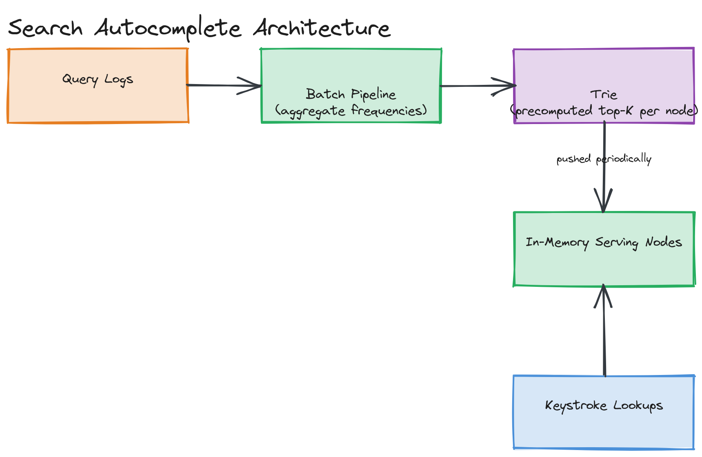

# Design a Search Autocomplete (Type-Ahead) System

**Difficulty:** Medium
**Time:** 35–45 minutes
**Relevant Modules:** [18 — Search Systems](../../../modules/module-18-search-systems/), [05 — Caching](../../../modules/module-05-caching/), [17 — Data Pipelines](../../../modules/module-17-data-pipelines/)

---

## Problem Statement

Design a type-ahead system: as a user types into a search box, the system suggests the top-k most likely completions in real time, updating with every keystroke. The defining requirement is latency — suggestions need to appear within tens of milliseconds of each keystroke, or the feature feels broken rather than helpful.

---

## Clarifying Questions to Ask

- Are suggestions based on global query popularity, personalized to the individual user, or both?
- How fresh must suggestions be — should a suddenly-trending query appear in suggestions within minutes, or is daily freshness acceptable?
- What's the maximum prefix length and suggestion-list size (top-k, e.g., top 5 or top 10)?
- Do we need typo tolerance/fuzzy matching, or exact-prefix matching only? Assume exact-prefix for the core design.
- What's the expected query volume — how many keystrokes/sec system-wide need a suggestion lookup?
- Should suggestions be scoped (e.g., per-language, per-region), or global?

---

## Requirements

### Functional

- Given a prefix (partial query typed so far), return the top-k most likely full queries starting with that prefix
- Suggestions ranked by historical query frequency/popularity
- Update suggestion data periodically as query patterns shift (e.g., trending topics)

### Non-Functional

- Extremely low latency: well under 100ms per keystroke, ideally under 50ms, since this directly gates perceived UI responsiveness
- High read QPS: every keystroke from every active user triggers a lookup
- Read-heavy by an enormous margin: the underlying suggestion data updates relatively infrequently (batch, periodic) compared to how often it's read
- Scale: 500M searches/day, average query length ~20 characters → roughly 20 keystroke-triggered lookups per search

---

## Capacity Estimation

```
Searches/day        = 500,000,000
Lookups/day (≈20 keystrokes/search) ≈ 10,000,000,000/day  → ~115,700 lookups/sec avg, much higher at peak
Total distinct queries tracked ≈ tens of millions, each needing frequency count + top-k structure
```

The lookup volume is enormous relative to the update volume — query popularity data is typically rebuilt on a periodic batch cycle (e.g., hourly or daily), not updated per-search in real time, which is the key insight that shapes this system's architecture toward a read-optimized serving structure built offline.

---

## High-Level Architecture


*A batch pipeline aggregating historical query logs into a trie with precomputed top-k suggestions per node, periodically pushed to a fleet of in-memory serving nodes that handle live prefix lookups with no per-keystroke database access.*

**Components:**
- **Query log aggregation pipeline** — a batch job (see [Module 17](../../../modules/module-17-data-pipelines/01-concepts/README.md)) that processes historical search query logs into frequency counts
- **Trie builder** — constructs a prefix tree from aggregated query frequencies, precomputing the top-k most frequent completions at every node so no runtime ranking is needed at serve time
- **Serving layer** — a fleet of stateless servers holding the precomputed trie entirely in memory, answering prefix lookups with no disk or database access on the hot path
- **Trending/real-time layer (optional)** — a lighter-weight, faster-updating structure that boosts rapidly-emerging queries before they've accumulated enough historical volume to surface through the batch pipeline alone

---

## API Design

```
GET /api/v1/autocomplete?prefix=syst&limit=5
Response: { "suggestions": ["system design", "systemd", "system32", "system error", "systematic review"] }
```

> 🎯 **Interview Tip:** Note this is a single, simple GET endpoint — the complexity in this question lives entirely in the offline data structure and serving architecture, not the API surface. Don't over-invest interview time describing the API; the interviewer is listening for the trie/ranking deep dive.

---

## Deep Dive: Trie Construction with Precomputed Top-K

A **trie** (prefix tree) is the natural data structure for prefix lookups: each node represents one character, and a path from the root spells out a prefix; all queries sharing a prefix share the corresponding path. A naive trie lookup would find the node for a given prefix and then need to search the entire subtree beneath it to find the most frequent completions — which is slow if a popular prefix has a huge subtree.

The standard optimization is **precomputing and caching the top-k most frequent completions directly at each trie node** during the offline build phase. When the trie is constructed from aggregated query-frequency data, every node stores its own top-k list (e.g., the 5 most frequent full queries in its subtree), computed bottom-up. At serve time, a lookup simply walks down to the node matching the typed prefix and returns its precomputed list — O(prefix length) work, with no subtree search at all. This trades a more expensive (but infrequent, offline, batch) build step for an extremely cheap (and extremely frequent) read step, which is exactly the right trade given the 100,000:1+ read-to-update ratio in this system.

The whole trie, for a reasonably bounded vocabulary (tens of millions of distinct queries), is small enough to fit entirely in memory on a single server, and is typically replicated across many stateless serving nodes behind a load balancer — each node is a read-only replica of the same precomputed structure, rebuilt and redistributed on each batch cycle.

> 💡 **Note:** See [Module 18's trie autocomplete coding exercise](../../../modules/module-18-search-systems/04-exercises/coding-challenges/challenge-01/) for a hands-on implementation of exactly this precomputed-top-k trie structure.

---

## Caching Strategy

In a meaningful sense, the entire serving layer *is* a cache — a read-optimized, precomputed structure that's rebuilt periodically rather than queried live against a database. There's no additional caching tier needed in front of it, since the structure is already designed to be served entirely from memory with no further lookups. The interesting "cache invalidation" equivalent here is the rebuild cadence: how often the trie is regenerated from fresh query logs and redistributed to serving nodes (commonly hourly to daily).

---

## Handling Scale

Because every serving node holds a full, identical, read-only copy of the trie, scaling read throughput is simply adding more stateless serving nodes behind a load balancer — there's no data partitioning or coordination needed between them at all, making this one of the more straightforward horizontal-scaling stories in the entire question bank, provided the trie itself fits comfortably in memory on each node.

---

## Trade-offs to Discuss

| Decision | Choice | Trade-off |
|---|---|---|
| Ranking computation | Precomputed top-k per trie node | Near-zero-cost reads, at the cost of a more expensive, periodic offline rebuild rather than instantaneous updates |
| Update freshness | Batch rebuild (hourly/daily) | Simple, scalable serving model, at the cost of missing rapidly-trending queries until the next rebuild — addressed by an optional faster-updating trending layer |
| Serving architecture | Fully replicated, in-memory, stateless nodes | Trivial horizontal scaling and no per-request coordination, but requires the entire structure to fit in memory per node, bounding total vocabulary size per deployment |

---

## Follow-up Questions

- How would you incorporate personalization (a user's own search history influencing their suggestions)?
- How would you support typo-tolerant/fuzzy prefix matching without abandoning the trie's O(prefix length) lookup speed?
- How would you detect and rapidly surface a suddenly trending query (e.g., breaking news) before it has historical volume?
- How would you handle the trie outgrowing a single server's memory as vocabulary grows?
- How would you filter out offensive or low-quality suggestions from the precomputed top-k lists?
- How would you measure whether your autocomplete suggestions are actually useful (e.g., click-through rate on suggestions)?
