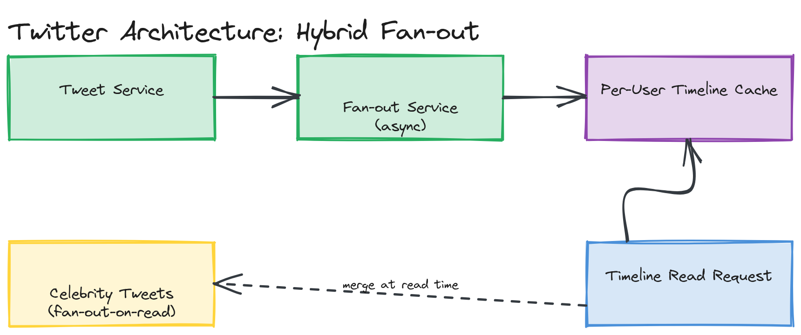

# Design Twitter

**Difficulty:** Medium
**Time:** 35–45 minutes
**Relevant Modules:** [04 — Databases](../../../modules/module-04-databases/), [05 — Caching](../../../modules/module-05-caching/), [06 — Scalability](../../../modules/module-06-scalability/), [08 — Message Queues](../../../modules/module-08-message-queues/)

---

## Problem Statement

Design the core of Twitter: users post short text messages ("tweets"), follow other users, and view a timeline composed of tweets from the people they follow. The interesting system design problem here is not posting a tweet — it's efficiently assembling a personalized timeline for hundreds of millions of users without recomputing it from scratch on every page load.

---

## Clarifying Questions to Ask

- Is the timeline strictly reverse-chronological, or does it need ranking/relevance (ranking is a much bigger problem — assume chronological unless told otherwise)?
- What's the follower distribution — are there "celebrity" accounts with tens of millions of followers, or is the graph more uniform?
- What's the read:write ratio for timeline views vs. tweet creation?
- Do we need retweets, likes, and replies, or just the core post/follow/timeline loop?
- Is there a character limit, and can tweets contain media (images/video)?
- What's the acceptable staleness for a timeline — must a new tweet appear within seconds, or is up to a minute acceptable?

---

## Requirements

### Functional

- Post a tweet (text, optionally media)
- Follow / unfollow another user
- View a home timeline: a reverse-chronological feed of tweets from followed accounts
- View a single user's tweets (profile timeline)
- Like and retweet a tweet

### Non-Functional

- Massive read skew: timeline views vastly outnumber tweet creations (assume 1000:1 read-heavy)
- Low latency: timeline load should be well under 200ms p99 — users expect instant feed loads
- High availability: 99.99%, since this is the core product surface
- Scale: 200M DAU, average 5 timeline loads/day, average follower count ~200 but with a long tail of celebrity accounts with 50M+ followers
- Eventual consistency is acceptable: a tweet appearing a few seconds late in a follower's timeline is an acceptable trade-off for availability and performance

---

## Capacity Estimation

```
Tweets/day        ≈ 200M users × 0.5 tweets/day/user (assume most users mostly read)  ≈ 100M tweets/day → ~1,160 writes/sec avg
Timeline reads/day ≈ 200M users × 5 loads/day                                          ≈ 1B reads/day    → ~11,600 reads/sec avg, ~23,200 peak
Average tweet size ≈ 280 bytes text + metadata ≈ 1KB
Storage/day         ≈ 100M × 1KB                                                       ≈ 100 GB/day
5-year storage       ≈ 100GB × 365 × 5                                                  ≈ 182 TB (tweets alone, before media)
```

The ~10:1 read:write ratio on raw counts understates the real skew, because a single tweet from a popular account is read by every one of that account's followers — this fan-out effect is the central design problem.

---

## High-Level Architecture


*A write path (tweet creation → fan-out service → per-user timeline cache) and a read path (timeline request → precomputed cache, falling back to on-the-fly assembly for celebrity-heavy timelines).*

**Components:**
- **Tweet service** — handles tweet creation, writes to a durable store, and publishes a "new tweet" event
- **Social graph service** — stores the follower/followee relationships
- **Fan-out service** — consumes new-tweet events and pushes the tweet into each follower's precomputed timeline
- **Timeline cache (Redis)** — stores each user's precomputed, ready-to-serve timeline (a sorted list of tweet IDs)
- **Tweet storage** — the durable source of truth for tweet content, keyed by tweet ID

---

## API Design

```
POST /api/v1/tweets
Request:  { "userId": "u123", "text": "...", "mediaUrl": "optional" }
Response: { "tweetId": "t_98231", "createdAt": "..." }

GET /api/v1/timeline?userId=u123&cursor=<tweetId>&limit=20
Response: { "tweets": [ { "tweetId": "...", "authorId": "...", "text": "...", "createdAt": "..." }, ... ], "nextCursor": "..." }
```

> 🎯 **Interview Tip:** Use cursor-based pagination (a tweet ID or timestamp as the cursor), not offset-based — a timeline is constantly being prepended with new tweets, and offset pagination would shift under the user as they scroll, causing duplicate or skipped items. See [Module 03's pagination deep dive](../../../modules/module-03-apis/02-deep-dive/README.md).

---

## Database Schema

```sql
CREATE TABLE tweets (
  tweet_id    BIGINT PRIMARY KEY,    -- Snowflake-style ID, sortable by creation time
  author_id   BIGINT NOT NULL,
  content     VARCHAR(280) NOT NULL,
  media_url   TEXT NULL,
  created_at  TIMESTAMP NOT NULL DEFAULT now()
);

CREATE TABLE follows (
  follower_id  BIGINT NOT NULL,
  followee_id  BIGINT NOT NULL,
  created_at   TIMESTAMP NOT NULL DEFAULT now(),
  PRIMARY KEY (follower_id, followee_id)
);
-- secondary index on (followee_id, follower_id) to support "who follows X" for fan-out
```

Using a Snowflake-style ID for `tweet_id` (see [Module 20](../../../modules/module-20-advanced-patterns/01-concepts/README.md)) means tweet IDs are both globally unique and naturally sortable by creation time, which lets timeline assembly sort by ID instead of needing a separate timestamp index.

---

## Deep Dive: Fan-out-on-Write vs. Fan-out-on-Read

This is the single most important decision in the system.

**Fan-out-on-write:** when a tweet is created, the fan-out service immediately pushes the tweet ID into the precomputed timeline cache of every follower. Reading a timeline becomes a trivial cache lookup — fast and simple. The cost is write amplification: one tweet from a user with 10 million followers becomes 10 million cache writes.

**Fan-out-on-read:** timelines are assembled on demand by querying the tweets of everyone a user follows, merging, and sorting at read time. This avoids the write-amplification problem entirely, but makes every timeline read expensive — potentially fetching from hundreds of followees per request.

The standard production answer is a **hybrid**: fan-out-on-write for the vast majority of accounts (whose follower counts are small enough that pushing to every follower's cache is cheap), and fan-out-on-read for celebrity accounts above some follower-count threshold — their tweets are fetched and merged into a requesting user's timeline at read time instead of being pushed everywhere. A user's final timeline is the merge of their precomputed cache (covering normal accounts they follow) plus a live query against any celebrity accounts they follow.

> ⚠️ **Warning:** Don't present fan-out-on-write as a complete answer on its own — an interviewer who asks "what if someone with 50 million followers tweets?" is testing whether you know this breaks naive fan-out-on-write, and the hybrid approach is the expected response.

---

## Caching Strategy

- **What to cache:** each user's precomputed timeline (a sorted list of tweet IDs, with tweet content fetched separately or denormalized into the cache entry).
- **Where:** Redis, sharded by `userId`, holding the most recent ~800 tweet IDs per user's timeline (older tweets fall off, requiring a read-through to storage on deep pagination — a rare access pattern).
- **Invalidation:** not really an invalidation problem — new tweets are appended via fan-out, not invalidated; unfollowing a user would require removing their tweets from the cached timeline, which can be deferred and corrected lazily rather than done synchronously.

---

## Handling Scale

At 10× scale, the fan-out service itself becomes the next bottleneck — it's processing every tweet × every follower as a write. The mitigation is treating fan-out as fully asynchronous via a message queue (tweet creation publishes an event; a pool of fan-out workers consumes it and performs the cache writes), decoupling tweet creation latency from fan-out completion latency entirely, and allowing the fan-out workforce to scale independently of the tweet-write path.

---

## Trade-offs to Discuss

| Decision | Choice | Trade-off |
|---|---|---|
| Timeline assembly | Hybrid fan-out (write for most, read for celebrities) | Solves the celebrity write-amplification problem, at the cost of more complex timeline-merge logic at read time |
| Tweet ID scheme | Snowflake-style IDs | Globally unique and time-sortable without a central counter, but requires every ID-generating node to have a synchronized clock/worker ID |
| Fan-out execution | Asynchronous via message queue | Tweet creation stays fast regardless of follower count, at the cost of followers seeing the tweet with a small, eventually-consistent delay |

---

## Follow-up Questions

- How would you rank a timeline instead of showing it in strict chronological order?
- How would you handle a user unfollowing someone — does their cached timeline need immediate cleanup?
- How would retweets propagate through the fan-out system differently than original tweets?
- How would you implement search over tweet content at this scale?
- What happens to fan-out if the message queue backs up significantly during a traffic spike?
- How would you shard the `follows` table if the social graph alone grew to billions of edges?
