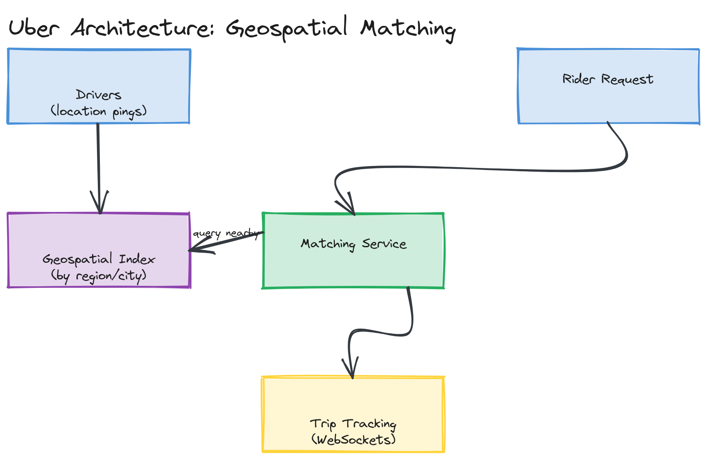

# Design Uber (Ride-Sharing App)

**Difficulty:** Medium
**Time:** 35–45 minutes
**Relevant Modules:** [06 — Scalability](../../../modules/module-06-scalability/), [16 — Real-Time Systems](../../../modules/module-16-real-time-systems/), [18 — Search Systems](../../../modules/module-18-search-systems/), [08 — Message Queues](../../../modules/module-08-message-queues/)

---

## Problem Statement

Design the core of a ride-sharing platform: riders request a trip, the system matches them with a nearby available driver in real time, and both parties track the trip's progress live. The central, genuinely hard problem is efficient geospatial matching at scale — finding the best nearby driver among millions of constantly-moving location updates, fast enough that a rider isn't waiting tens of seconds for a match.

---

## Clarifying Questions to Ask

- Is pricing/surge calculation in scope, or just the matching and trip-tracking core?
- How frequently do driver locations update — every few seconds via GPS ping?
- What does "nearby" mean for matching — strict nearest-driver, or a balance of distance, driver rating, and ETA?
- Do we need to support ride-sharing/pooling (multiple riders per trip), or only 1 rider per driver?
- What's the expected scale — concurrent active drivers and ride requests per city, and how many cities/regions?
- Do drivers and riders need live trip tracking (continuously updated position on a map) during the ride itself?

---

## Requirements

### Functional

- Rider requests a trip from pickup to destination
- System matches the rider with a nearby, available driver
- Driver accepts/declines the match
- Both parties see live location updates during the trip
- Trip completion and fare calculation

### Non-Functional

- Low matching latency: a rider should be matched within a few seconds, not tens of seconds
- High write volume: every active driver sends a location ping every few seconds, continuously
- Geospatial query performance: "find available drivers within 2km of this point" must be fast even with millions of drivers citywide
- Availability: 99.99% — a failed match request directly costs the business a ride
- Scale: 5M concurrent active drivers globally, location pings every 4 seconds, 1M ride requests/hour at peak in aggregate across cities

---

## Capacity Estimation

```
Location pings/sec   = 5,000,000 drivers / 4 sec interval        ≈ 1,250,000 pings/sec globally
Ride requests/sec     = 1,000,000 / 3,600                         ≈ 278/sec avg, higher at peak in dense cities
Each ping size         ≈ 100 bytes (driverId, lat, lng, timestamp, heading)
Ping bandwidth          ≈ 1,250,000 × 100B                          ≈ 125 MB/sec globally
```

The location-ping volume (1.25M/sec) dwarfs the actual ride-request volume by three orders of magnitude — this should immediately signal that the geospatial index update path, not the matching logic itself, is the system's primary throughput challenge.

---

## High-Level Architecture


*Drivers continuously streaming location pings into a geospatial index service, and a matching service querying that index for nearby available drivers, with a separate trip-tracking path streaming live position updates via WebSockets.*

**Components:**
- **Location ingestion service** — receives high-frequency driver pings and updates each driver's position in the geospatial index
- **Geospatial index (geohash-based)** — a fast, queryable structure mapping location buckets to currently-available drivers within them (see [Module 18's geohashing content](../../../modules/module-18-search-systems/02-deep-dive/README.md))
- **Matching service** — given a rider's pickup location, queries the geospatial index for nearby available drivers and selects one, considering distance, ETA, and rating
- **Trip service** — manages trip state (requested → matched → in-progress → completed) and fare calculation
- **Real-time tracking** — WebSocket connections push live position updates to the rider and driver apps during an active trip, structurally similar to [the chat system's connection-handling layer](./whatsapp.md)

---

## API Design

```
POST /api/v1/drivers/{driverId}/location
Request:  { "lat": 37.7749, "lng": -122.4194, "heading": 90, "timestamp": ... }
Response: 200 OK

POST /api/v1/trips
Request:  { "riderId": "r123", "pickup": { "lat": ..., "lng": ... }, "destination": { "lat": ..., "lng": ... } }
Response: { "tripId": "t_5521", "status": "matching" }

GET /api/v1/trips/{tripId}/status   (or pushed via WebSocket)
Response: { "status": "matched", "driverId": "d_991", "driverLocation": { ... }, "etaSeconds": 240 }
```

---

## Deep Dive: Geospatial Indexing for Real-Time Matching

A naive approach — scanning every driver's lat/lng and computing distance to the rider — is O(N) per match request and falls apart entirely at millions of drivers. The standard solution is **geohashing**: encode latitude/longitude into a string where geographically nearby points share string prefixes, then bucket drivers by geohash cell. Finding "drivers near point X" becomes "look up the geohash cell containing X, plus its 8 neighboring cells" — a small, bounded set of lookups instead of a scan over every driver on the planet.

Each driver's location ping updates their entry in the bucket corresponding to their *current* geohash cell, and removes them from their *previous* cell if they've moved into a new one. This index needs to support extremely high write throughput (1.25M updates/sec globally) with low-latency reads for matching — an in-memory store like Redis (which has native geospatial commands, `GEOADD`/`GEORADIUS`, built on this exact geohash-bucketing idea) is the natural fit, sharded by region so that a city's worth of driver updates and matching queries stay local to one shard.

Once a small candidate set of nearby available drivers is retrieved, the matching service ranks them by a combination of distance, estimated time to pickup, and driver rating, and either auto-assigns the best match or offers the request to drivers in ranked order until one accepts.

> ⚠️ **Warning:** A common gap is proposing geohashing for the *index* but not addressing that available-driver status changes extremely frequently (a driver who just accepted a trip must be removed from "available" sets immediately, or two riders could be matched to the same driver). The index update on status change must be fast and consistent enough to avoid this race — at minimum, an atomic "claim" operation when assigning a match, similar in spirit to the [parking lot's spot-assignment locking](../easy/parking-lot.md).

---

## Caching Strategy

The geospatial index itself functions as a specialized, purpose-built cache — driver positions are inherently ephemeral and don't need durable storage beyond the most recent ping (older pings can be discarded or sent separately to an analytics pipeline if trip-history/heatmap features are needed). There's no separate caching layer required on top of it; the index *is* the hot-path data structure.

---

## Handling Scale

Sharding the geospatial index by city/region is the natural horizontal scaling axis, since matching is inherently local — a rider in São Paulo is never matched with a driver in Tokyo, so there's no cross-shard query need. At 10× driver density in a single dense city, finer-grained geohash precision (smaller cells) keeps the candidate-set size per matching query bounded, rather than degrading into scanning an oversized single cell.

---

## Trade-offs to Discuss

| Decision | Choice | Trade-off |
|---|---|---|
| Geospatial indexing | Geohash buckets in Redis | Fast nearby-driver queries at scale, at the cost of needing careful cell-boundary handling (a nearby driver just across a cell edge requires checking neighbor cells too) |
| Index sharding | By city/region | Matches the inherently local nature of ride matching, but requires routing logic to direct each request to the correct regional shard |
| Driver status updates | High-frequency pings, in-memory index | Enables near-real-time matching, at the cost of high sustained write throughput that must be engineered for from day one |

---

## Follow-up Questions

- How would you implement surge pricing based on real-time supply/demand imbalance in a geographic area?
- How would you handle a driver going offline mid-trip (app crash, connectivity loss)?
- How would you extend matching to support ride-pooling, where one driver serves multiple riders with overlapping routes?
- How would you compute accurate ETAs that account for real road networks and traffic, not just straight-line distance?
- How would you prevent a single extremely dense event (e.g., a stadium emptying out) from overwhelming the matching service for that geohash cell?
- How would you design the fare calculation to be auditable and consistent even if a trip is interrupted partway through?
