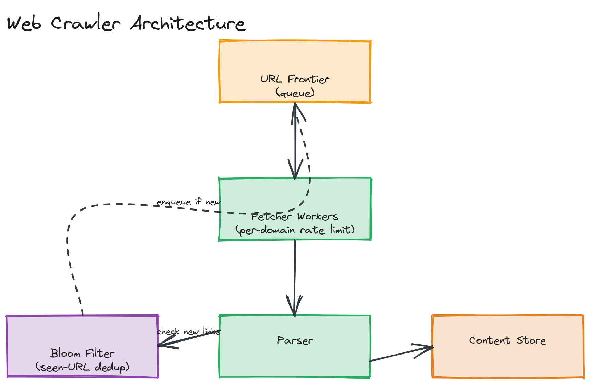

# Design a Web Crawler

**Difficulty:** Medium
**Time:** 35–45 minutes
**Relevant Modules:** [08 — Message Queues](../../../modules/module-08-message-queues/), [06 — Scalability](../../../modules/module-06-scalability/), [12 — Distributed Systems Fundamentals](../../../modules/module-12-distributed-systems/)

---

## Problem Statement

Design a system that crawls the web: starting from a set of seed URLs, it fetches pages, extracts links, and recursively fetches those too, storing page content for downstream use (e.g., search indexing). Unlike most question-bank entries, the bottleneck here isn't your own infrastructure scaling — it's politely and efficiently dealing with millions of independent, uncontrolled external servers.

---

## Clarifying Questions to Ask

- What's the crawl's purpose — feeding a search index, archiving, monitoring for changes? This affects how content is processed downstream, though the crawling core is similar regardless.
- How large is the target crawl — a focused crawl of a few thousand sites, or open-ended web-scale crawling?
- Do we need to respect `robots.txt` and crawl-rate politeness per domain? (Always yes in practice — assume required.)
- How fresh must content be — is this a one-time crawl, or does it need periodic re-crawling to detect changes?
- What content types matter — HTML only, or also PDFs, images, etc.? Assume HTML for the core design.
- Is there a depth or page-count limit per domain, or unbounded?

---

## Requirements

### Functional

- Given seed URLs, fetch each page's content
- Extract outbound links from each page and queue them for crawling
- Avoid re-crawling the same URL redundantly within a crawl cycle
- Respect `robots.txt` rules and per-domain crawl-rate limits
- Store fetched content for downstream consumption

### Non-Functional

- Politeness: must not overwhelm any single domain with concurrent requests — this is a hard constraint, not an optimization, since aggressive crawling can be indistinguishable from a denial-of-service attack on the target site
- Scalability: support crawling billions of URLs total
- Fault tolerance: a single failed fetch (timeout, 404, server error) must not stall the rest of the crawl
- Avoid infinite loops: the web graph contains cycles (A links to B links to A) and must be handled without re-crawling indefinitely
- Throughput: maximize overall crawl rate while respecting per-domain politeness limits

---

## Capacity Estimation

```
Target: crawl 1 billion pages over 30 days
→ ~33,000,000 pages/day → ~385 pages/sec average fetch rate needed
Average page size (HTML) ≈ 100KB
Storage for raw pages     ≈ 1B × 100KB = 100 TB
URL frontier (queue) size: at any time, likely tens to hundreds of millions of discovered-but-not-yet-fetched URLs
```

385 fetches/sec sounds modest in isolation, but the real constraint is *distribution* across domains: that rate must be spread across millions of distinct domains, each individually rate-limited, rather than concentrated — which is the actual engineering problem this system solves.

---

## High-Level Architecture


*A URL frontier feeding a pool of fetcher workers, each respecting a per-domain rate limit, with fetched content passed to a parser that extracts new links back into the frontier through a dedup/seen-URL filter.*

**Components:**
- **URL frontier** — a prioritized queue of URLs waiting to be crawled, partitioned in a way that supports per-domain rate control (see deep dive)
- **Fetcher workers** — pull URLs from the frontier, check `robots.txt` and domain politeness limits, fetch the page, and hand it off for parsing
- **Parser** — extracts outbound links and any content of interest (text, metadata) from fetched HTML
- **Dedup/seen-URL filter** — prevents the same URL from being queued and fetched redundantly
- **Content store** — durable storage (object storage, similar to [other media-heavy systems](./instagram.md)) for fetched page content, consumed by downstream systems like a search indexer

---

## API Design

This system is largely internal/batch-oriented rather than externally API-driven, but the key internal contract is the frontier interface:

```
enqueue(url: string, priority: number): void
dequeue(): { url: string, domain: string } | null    // respects domain rate limits internally
markFetched(url: string, status: "success" | "failed", extractedLinks: string[]): void
```

---

## Deep Dive: Politeness and Per-Domain Rate Limiting

The single requirement that most distinguishes this from a generic distributed-fetch system is politeness: the crawler must never hammer one domain with many concurrent requests just because it has the aggregate throughput to do so. The standard approach partitions the URL frontier by domain — conceptually, each domain gets its own sub-queue — and a scheduling layer enforces a minimum delay between consecutive fetches to the same domain (commonly informed by the `Crawl-delay` directive in that domain's `robots.txt`, or a sensible default like 1 request/second per domain if unspecified).

This is structurally the same problem as [the rate limiter question](../easy/rate-limiter.md), applied per-domain instead of per-API-client: a shared, fast-access store (e.g., Redis) tracks the last-fetch-time per domain, and a fetcher worker checks (and atomically updates) this before issuing a request, skipping/delaying if the domain was fetched too recently. With potentially many fetcher workers operating concurrently, this check-and-update must be atomic for the same reason the rate limiter's token check must be — otherwise two workers could both decide it's safe to fetch the same domain simultaneously.

> ⚠️ **Warning:** A crawler that ignores `robots.txt` or politeness limits isn't just impolite — at scale, it's functionally a distributed denial-of-service tool against whichever sites it crawls aggressively. Any answer to this question should treat politeness as a correctness requirement, not a nice-to-have.

---

## Handling Duplicate and Already-Seen URLs

Because the web graph contains cycles and many pages link to the same popular destinations repeatedly, the system needs an efficient way to check "have I already queued/fetched this URL?" across potentially billions of URLs without keeping the full set in memory naively. A **Bloom filter** (see [Module 05's bloom filter content](../../../modules/module-05-caching/02-deep-dive/README.md)) is the standard tool here: it answers "definitely not seen" or "possibly seen" using a small, fixed memory footprint regardless of how many URLs have been checked, with a tunable, small false-positive rate (occasionally skipping a URL that was actually new) traded for massive memory savings versus storing every URL exactly.

---

## Caching Strategy

DNS resolution and `robots.txt` contents are both worth caching aggressively per domain — re-resolving DNS or re-fetching `robots.txt` on every single page fetch to the same domain would multiply network overhead for no benefit, since both change infrequently. A short-to-medium TTL cache (minutes to hours) for each is a clear win with minimal correctness risk.

---

## Handling Scale

The frontier and fetcher pool both scale horizontally by partitioning work by domain hash — since politeness constraints are inherently per-domain, work for any given domain only ever needs to be coordinated within that domain's partition, not globally, which keeps the rate-limiting check cheap even as the total worker fleet grows.

---

## Trade-offs to Discuss

| Decision | Choice | Trade-off |
|---|---|---|
| Dedup mechanism | Bloom filter | Massive memory savings at billions-of-URLs scale, at the cost of a small, tunable false-positive rate (rarely skipping a genuinely new URL) |
| Politeness enforcement | Per-domain rate limiter | Prevents the crawler from harming target sites, at the cost of capping how fast any single domain can be crawled regardless of available crawler capacity |
| Frontier partitioning | By domain hash | Keeps politeness checks local and cheap, but can create uneven load if a small number of domains dominate the URL volume |

---

## Follow-up Questions

- How would you prioritize which URLs to crawl first when the frontier has more discovered URLs than capacity to fetch them all promptly?
- How would you detect and avoid crawler traps (e.g., infinitely generated URLs from a calendar widget)?
- How would you handle re-crawling pages periodically to detect content changes, without re-crawling the entire web graph from scratch each cycle?
- How would you extend this to respect `noindex` meta tags and other content-level crawling directives, not just `robots.txt`?
- How would you scale the dedup filter itself if a single Bloom filter no longer fits on one machine?
- How would you handle pages that require JavaScript execution to reveal their actual content/links?
