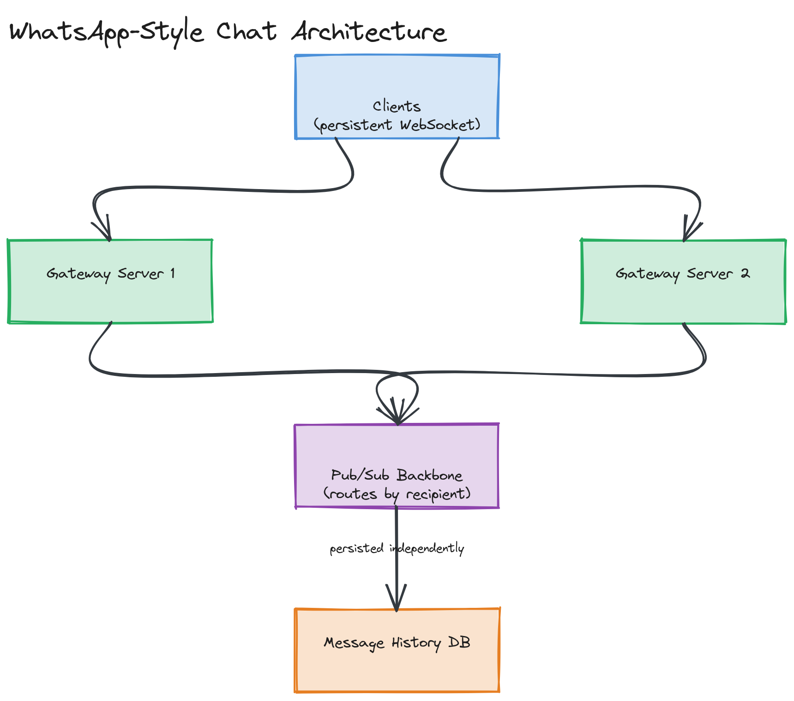

# Design WhatsApp (Chat System)

**Difficulty:** Medium
**Time:** 35–45 minutes
**Relevant Modules:** [16 — Real-Time Systems](../../../modules/module-16-real-time-systems/), [08 — Message Queues](../../../modules/module-08-message-queues/), [02 — Networking](../../../modules/module-02-networking/), [04 — Databases](../../../modules/module-04-databases/)

---

## Problem Statement

Design a real-time messaging system supporting 1:1 and group chat, with message delivery guarantees, read receipts, and online presence — the core of WhatsApp/Messenger/Slack-style products. The central system design problem is maintaining millions of persistent, stateful connections and reliably routing messages between them, which is fundamentally different from the stateless request/response systems in most other question-bank entries.

---

## Clarifying Questions to Ask

- Do we need group chat, or just 1:1 to start? Assume both are in scope, since group chat changes the fan-out story.
- What delivery guarantee is required — at-least-once (a message might rarely be delivered twice) is almost always acceptable; exactly-once is far harder and rarely truly required if clients de-duplicate by message ID.
- Do we need read receipts and "last seen" presence?
- Does the system need to support offline delivery (message arrives once the recipient comes back online)?
- Is end-to-end encryption in scope? (It changes what the server can and cannot see/index, but assume it's out of scope for architecture purposes unless asked to go deep there.)
- What's the expected scale — concurrent connected users, messages/day?

---

## Requirements

### Functional

- Send a 1:1 message; recipient receives it in real time if online, or on next connect if offline
- Group chat: a message sent to a group is delivered to all members
- Read receipts (delivered, read)
- Online/offline presence ("last seen")
- Message history persisted and retrievable on a new device login

### Non-Functional

- Massive concurrent connection count: tens of millions of simultaneously connected clients, each holding an open, persistent connection
- Low latency: message delivery to an online recipient should feel instant (well under 1 second)
- At-least-once delivery with client-side deduplication by message ID
- High availability: 99.99%+ — this is core, always-on infrastructure for users
- Scale: 100M DAU, average 40 messages/day/user

---

## Capacity Estimation

```
Messages/day        = 100M × 40                      = 4,000,000,000/day  → ~46,300 messages/sec avg, ~92,600 peak
Concurrent connections ≈ 100M × (fraction online at once, say 30%)         ≈ 30,000,000 concurrent WebSocket connections
Average message size ≈ 100 bytes (text) + metadata    ≈ 200 bytes
Storage/day           ≈ 4B × 200B                                          ≈ 800 GB/day
1-year storage         ≈ 800GB × 365                                       ≈ 292 TB
```

30 million concurrent persistent connections is the number that should immediately drive the architecture toward many connection-handling servers, each holding a manageable slice of total connections (e.g., 50,000–100,000 per server, requiring ~300–600 servers just for connection handling).

---

## High-Level Architecture


*Clients holding persistent WebSocket connections to a fleet of gateway servers, which use a pub/sub backbone to route messages to whichever gateway currently holds the recipient's connection, with message history persisted independently of the real-time delivery path.*

**Components:**
- **Connection/gateway servers** — each holds tens of thousands of open WebSocket connections, mapping `userId → local connection` for connected clients
- **Pub/sub backbone (Redis Pub/Sub or Kafka)** — the critical piece that lets a message sent by a client connected to gateway server A reach a recipient connected to a completely different gateway server B
- **Presence service** — tracks online/offline state via heartbeats; backed by a fast key-value store with TTL-based expiry
- **Message store** — durable, append-mostly storage of message history per conversation
- **Push notification service** — delivers offline notifications via APNs/FCM when the recipient isn't connected

---

## API Design

This system is primarily WebSocket-driven rather than REST, but the message envelope and a couple of REST endpoints look like:

```
WebSocket message (client → server):
{ "type": "message", "to": "u456", "clientMsgId": "uuid-v4", "content": "hey", "timestamp": ... }

WebSocket message (server → client):
{ "type": "message", "from": "u123", "messageId": "m_9981", "content": "hey", "timestamp": ... }
{ "type": "read_receipt", "messageId": "m_9981", "readBy": "u456" }

REST: GET /api/v1/conversations/{conversationId}/messages?before=<messageId>&limit=50
```

> 💡 **Note:** Every message carries a client-generated `clientMsgId` (a UUID generated on the sending device). This is what enables safe at-least-once delivery — if a message is delivered twice due to a retry, the client recognizes the duplicate `clientMsgId` and discards the second copy instead of showing it twice.

---

## Deep Dive: Routing Messages Across Many Connection Servers

The hardest problem in this system is not sending a message — it's that the sender and recipient are very likely connected to *different* physical gateway servers, and a gateway server only knows about connections it personally holds.

The solution is a **pub/sub backbone** sitting behind the gateway fleet. When a client connects, its gateway server registers `userId → gatewayServerId` in a shared, fast-access registry (e.g., Redis). When a message arrives for delivery, the sending gateway looks up which gateway server currently holds the recipient's connection, and publishes the message to a channel that specific gateway subscribes to (or, more commonly, every gateway subscribes to a sharded set of channels, and the message is published to the shard owning the recipient). The recipient's gateway receives it from the pub/sub layer and pushes it down the recipient's live WebSocket connection.

For **group chat**, the same mechanism fans out to every group member's respective gateway — for small/medium groups this is a straightforward multi-publish; very large groups (thousands of members) start to resemble the [Twitter fan-out problem](./twitter.md) and may warrant similar fan-out-on-write treatment for the group's message history.

> ⚠️ **Warning:** A common gap in candidate answers is describing the WebSocket connection layer correctly but never explaining how a message actually crosses from one gateway server to another. If the interviewer asks "the sender and recipient are on different servers — then what?", the pub/sub backbone is the answer they're checking for.

---

## Caching Strategy

- **Presence state:** kept in an in-memory store (Redis) with short TTLs refreshed by client heartbeats — a user is considered offline once their heartbeat TTL expires without renewal, which is cheap to check and self-healing if a client disconnects ungracefully.
- **Recent message history:** the most recent messages in an active conversation are cached, since users overwhelmingly scroll back only a short distance; older history falls through to the durable message store.

---

## Handling Scale

At 10× scale, the connection-handling tier scales by adding more gateway servers, each independently capped by available memory/file-descriptors per machine — this is an embarrassingly parallel scaling dimension since connections are independent. The pub/sub backbone itself becomes the next bottleneck; sharding it (e.g., partitioning Kafka topics or Redis Cluster slots by a hash of `userId`) keeps message routing throughput scaling with the number of shards.

---

## Trade-offs to Discuss

| Decision | Choice | Trade-off |
|---|---|---|
| Delivery guarantee | At-least-once + client dedup | Simple, robust server-side logic, pushing a small amount of complexity (deduplication) to the client |
| Connection protocol | WebSockets | Enables true server push for low-latency delivery, at the cost of holding millions of stateful, long-lived connections that complicate load balancing and deployments |
| Cross-server routing | Pub/sub backbone | Decouples sender and recipient gateway servers cleanly, at the cost of an extra hop and a new infrastructure dependency |
| Group fan-out | Direct multi-publish for most groups | Simple for typical group sizes; needs fan-out-on-write treatment for unusually large groups |

---

## Follow-up Questions

- How would you handle a gateway server crashing — what happens to the connections it was holding, and how do clients recover?
- How would you implement "typing..." indicators without flooding the pub/sub layer with high-frequency, low-value events?
- How would end-to-end encryption change what the server can do (e.g., can it still implement server-side search over message content)?
- How would you deploy a new version of the gateway service without dropping millions of active connections at once?
- How would you support multi-device sync (the same account logged in on phone and desktop simultaneously)?
- How would you design message ordering guarantees within a single conversation when messages can arrive at the server out of order due to network conditions?
