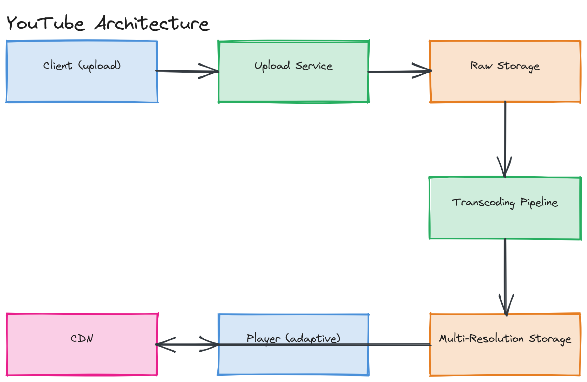

# Design YouTube

**Difficulty:** Medium
**Time:** 35–45 minutes
**Relevant Modules:** [09 — Storage Systems](../../../modules/module-09-storage/), [10 — CDN](../../../modules/module-10-cdn/), [17 — Data Pipelines](../../../modules/module-17-data-pipelines/)

---

## Problem Statement

Design a video-sharing platform: users upload videos, the platform processes and stores them at multiple quality levels, and viewers stream video smoothly regardless of their device or network conditions. The defining system design challenge — beyond what [Instagram](./instagram.md) already covers for media storage/delivery — is video transcoding and adaptive streaming, which photo systems don't need.

---

## Clarifying Questions to Ask

- Is live streaming in scope, or only pre-recorded, on-demand video? Assume on-demand only — live streaming is a substantially different problem (low-latency ingest pipelines).
- What range of devices/network conditions must playback support — does this require adaptive bitrate streaming?
- What's the expected video length distribution — mostly short clips, or are multi-hour uploads common (affects transcoding cost and time)?
- Do we need recommendations/search, or just upload + playback? Assume just upload + playback, with search as a stretch/follow-up topic.
- What's the upload and view volume at scale?

---

## Requirements

### Functional

- Upload a video file
- Process the video into multiple resolutions/bitrates for adaptive playback
- Stream video to viewers, adapting quality to their bandwidth in real time
- View a video's metadata (title, description, view count)

### Non-Functional

- Massive read skew: views vastly outnumber uploads (assume 10,000:1 — a single popular video can be watched millions of times)
- Playback must start quickly (low startup latency) and adapt smoothly to changing network conditions without stalling
- Upload-to-available latency: a few minutes of processing delay between upload and the video being watchable is acceptable
- Durability: an uploaded video must never be lost once upload is acknowledged
- Scale: 5M uploads/day, average original file size 200MB; 5 billion views/day

---

## Capacity Estimation

```
Uploads/day        = 5,000,000 × 200MB                         = 1,000,000,000 MB/day ≈ 1 PB/day of raw uploads
After transcoding to ~5 quality levels (roughly 2x storage overhead vs. original) ≈ 2 PB/day stored
Views/day            = 5,000,000,000                              → ~57,900 views/sec avg, much higher at peak
Average view bandwidth ≈ 5 Mbps (a moderate-quality stream) sustained for an average watch duration
```

The storage volume is dominated by transcoding overhead (multiple resolutions stored per video), while the read path is dominated by sheer concurrent streaming bandwidth — both point toward the same answer: object storage for durability, and a CDN as the only thing capable of absorbing this much sustained streaming bandwidth.

---

## High-Level Architecture


*An upload path (client → upload service → raw storage → transcoding pipeline → multi-resolution storage), and a playback path (client video player → CDN, serving segmented video chunks at the resolution matching current bandwidth).*

**Components:**
- **Upload service** — accepts the raw video file, stores it in object storage, and enqueues a transcoding job
- **Transcoding pipeline** — a pool of workers (often GPU-accelerated) that converts the raw upload into multiple resolution/bitrate variants and segments each into short chunks for streaming
- **Object storage** — stores both the raw original and every transcoded variant/segment durably
- **CDN** — serves video segments to viewers; this is where the overwhelming majority of bytes flow, never touching origin after the first request per segment per region
- **Metadata database** — stores title, description, view counts, upload status

---

## API Design

```
POST /api/v1/videos
Request:  multipart upload (video file) + { "title": "...", "description": "...", "uploaderId": "u123" }
Response: { "videoId": "v_44213", "status": "processing" }

GET /api/v1/videos/{videoId}/manifest
Response: an HLS/DASH manifest listing available quality levels and segment URLs

GET /api/v1/videos/{videoId}
Response: { "title": "...", "viewCount": 192300, "status": "ready", "durationSeconds": 642 }
```

---

## Deep Dive: Transcoding and Adaptive Bitrate Streaming

Once uploaded, a video must be converted into several resolution/bitrate variants (e.g., 240p, 480p, 720p, 1080p) because viewers have wildly different device capabilities and network conditions — sending a single 1080p stream to someone on a poor mobile connection would stall constantly. The transcoding pipeline processes the raw upload through each target resolution and also **segments** each variant into short chunks (typically 2–10 seconds each) — this is what enables [HLS or DASH adaptive bitrate streaming](../../../modules/module-10-cdn/02-deep-dive/README.md): the video player downloads a manifest listing all available quality levels and their segments, and continuously chooses which quality's next segment to fetch based on currently measured bandwidth, switching up or down seamlessly mid-playback without restarting the stream.

This is a computationally expensive, queue-driven asynchronous pipeline, structurally similar to [Instagram's thumbnail generation](./instagram.md) but far heavier — transcoding a video can take minutes of CPU/GPU time depending on length and target resolution count. The pipeline should process resolutions in parallel (each is independent) and prioritize lower resolutions first, since a viewer who clicks "watch" shortly after upload should be able to start at a lower quality even if the 1080p variant isn't finished yet.

> 🎯 **Interview Tip:** When asked "why not just stream the original file directly?", the answer is twofold: (1) different devices/networks need different quality levels, and (2) segmenting into chunks is what allows adaptive switching mid-stream and lets a CDN cache and serve small, individually-addressable pieces instead of one enormous file.

---

## Caching Strategy

Video segments are immutable once generated, making them ideal CDN cache candidates — identical to the reasoning in [Instagram's media caching](./instagram.md), just at a much larger scale per object (megabytes per segment rather than kilobytes per thumbnail). The first viewer of a segment in any given CDN region triggers an origin fetch; every subsequent viewer in that region is served from the edge cache. For very popular ("viral") videos, this means almost all viewing traffic worldwide is served from edge caches within minutes of the video starting to trend.

---

## Handling Scale

At significantly higher view volume, the CDN layer scales nearly transparently — this is exactly the kind of load CDNs are architected to absorb. The transcoding pipeline scales by adding more worker capacity, and since each video's transcoding job is independent of every other video's, this is an embarrassingly parallel scaling problem with no cross-job coordination needed.

---

## Trade-offs to Discuss

| Decision | Choice | Trade-off |
|---|---|---|
| Transcoding | Asynchronous, multi-resolution, post-upload | Enables adaptive streaming and broad device support, at the cost of upload-to-watchable delay and significant storage overhead (multiple copies per video) |
| Streaming protocol | Segmented adaptive bitrate (HLS/DASH) | Smooth quality adaptation and CDN-friendly caching, at the cost of added playback-start complexity (manifest negotiation) |
| Lower-resolution priority | Process and publish lower resolutions first | Faster time-to-watchable, at the cost of pipeline scheduling complexity |

---

## Follow-up Questions

- How would you reduce storage costs for videos that are rarely watched after their first few days (storage tiering)?
- How would you implement view counting accurately at this scale without every single view hitting the metadata database synchronously?
- How would you support live streaming, and how would that pipeline differ fundamentally from on-demand video?
- How would you detect and handle copyrighted content during or after upload?
- How would you choose which CDN edge region to prioritize pre-warming for a video expected to go viral in a specific country?
- How would you design resumable uploads for very large video files over unreliable mobile connections?
