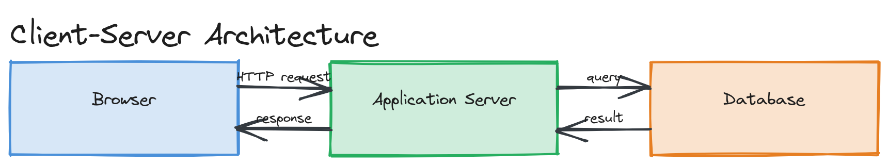
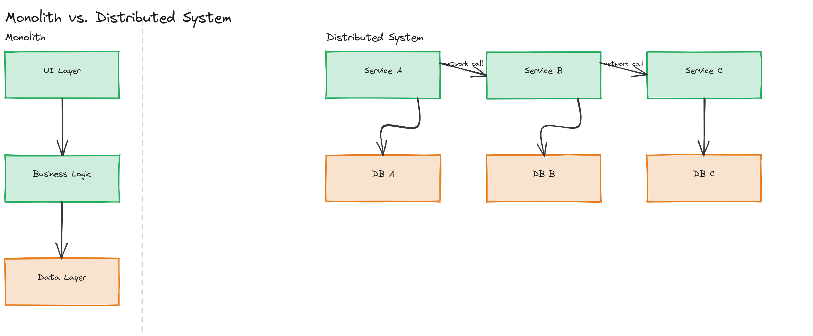
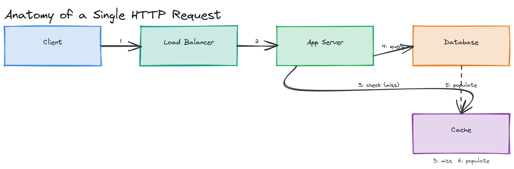

# Module 01 — Concepts: Foundations of System Design

## Why This Matters

Imagine you're handed a whiteboard and asked: "Design Instagram." If you've never been taught a vocabulary for talking about systems, you'll either freeze or start drawing random boxes. System design is the discipline that gives you that vocabulary — a shared set of concepts (clients, servers, databases, caches, queues) and a shared set of properties to reason about (availability, latency, consistency) so that two engineers who have never met can collaborate on a system neither of them could build alone. Every module after this one is a deep dive into one piece of that vocabulary. This module is the map.

---

## What Is System Design?

**System design** is the process of defining the architecture, components, modules, interfaces, and data for a system to satisfy a set of requirements — both *functional* (what it does) and *non-functional* (how well it does it, at what scale, with what reliability).

It sits at a different altitude than two related disciplines people often conflate it with:

- **Software design** is about the internals of a single application: class structure, design patterns (Factory, Observer), function decomposition. It answers "how is this codebase organized?"
- **Software architecture** is about the structure of a single software system: layering, modules, how components within *one deployable unit* talk to each other.
- **System design** is about the structure of a system that may span many machines, many services, and many failure domains: how do a client, a load balancer, ten application servers, a cache layer, a primary database, and three read replicas work together to serve 50,000 requests per second with a 200ms p99 latency budget?

> 💡 **Note:** In practice these terms blur at the edges, and that's fine — what matters is that you can operate at the right altitude for the question being asked. "Should this be a class or two classes?" is software design. "Should this be one service or three?" is system design.

---

## The Anatomy of a System

Nearly every system you'll design is some arrangement of a small set of building blocks:

- **Clients** — browsers, mobile apps, other services — that originate requests
- **Servers** — processes that receive requests and produce responses (web servers, application servers)
- **Databases** — durable storage for state that must survive a restart
- **Networks** — the wires (physical or virtual) and protocols that connect all of the above

Later modules add more vocabulary to this list — caches, queues, load balancers, CDNs — but every one of them exists to solve a problem that arises from this base architecture: a server is too slow, a database can't take the write load, a client is too far from the data center. Learning system design is largely learning *why* each additional component earns its place in the architecture, and what it costs to add it.

*A basic client/server/database diagram showing a browser sending an HTTP request to an application server, which queries a database and returns a response, with arrows labeled for request and response direction.*

---

## Types of Systems

- **Monolithic** — a single deployable unit contains all functionality (UI, business logic, data access). Simple to build and deploy early on; becomes a coordination and scaling bottleneck as the team and codebase grow.
- **Distributed** — functionality is split across multiple independently deployable services running on multiple machines. Enables independent scaling and team autonomy; introduces network calls, partial failure, and consistency challenges that don't exist in a monolith.
- **Event-driven** — components communicate by producing and consuming events asynchronously, rather than by calling each other directly. Decouples producers from consumers in time; introduces eventual consistency and makes "what happened, and in what order" a harder question to answer.

*Side-by-side comparison: a monolith as one large box containing UI/logic/data layers, versus a distributed system as several smaller boxes (services) connected by network calls, each with its own data store.*

None of these is "the right one" in the abstract — they're trade-offs against team size, traffic, and how fast requirements are changing. A two-person startup that reaches for microservices on day one is usually solving a scaling problem it doesn't have yet, at the cost of a coordination problem it didn't need to take on.

---

## Key Properties Every System Designer Must Reason About

These seven properties recur in every module of this repository. Learn to name them explicitly — interviewers and teammates alike will trust your design more when you state which property you're optimizing for and which you're consciously trading away.

| Property | Definition | Example Question It Answers |
|---|---|---|
| **Availability** | The proportion of time the system can respond to requests | "What % of the time is the system reachable?" |
| **Reliability** | The probability the system performs its intended function correctly over time | "If it responds, can I trust the response is correct?" |
| **Scalability** | The system's ability to handle growing load by adding resources | "What happens to latency/cost as traffic grows 10×?" |
| **Maintainability** | How easily the system can be understood, modified, and operated by humans over time | "Can a new engineer safely change this in their first month?" |
| **Performance** | How fast the system responds and how much work it can do per unit time (latency + throughput) | "What's the p99 latency at peak load?" |
| **Durability** | The guarantee that committed data survives failures (crashes, power loss) | "If the server dies right now, did I lose the write?" |
| **Consistency** | Whether all readers see the same value for the same piece of data at the same time | "If I write, then immediately read, do I see my own write?" |

> ⚠️ **Warning:** Availability and reliability are often used interchangeably in casual conversation, but they're distinct. A system can be *available* (it responds) while being *unreliable* (it responds with the wrong answer). A system can also be reliable-but-unavailable: a database that's correct but currently unreachable due to a network partition hasn't given you a wrong answer — it's given you no answer.

---

## Trade-offs: The Core Skill of System Design

There is no free lunch. Every property above can usually be improved — but rarely without cost to another property, to operational complexity, or to money. A few canonical examples you'll see throughout this repository:

- More **availability** (replicating data across regions) often costs **consistency** (replicas can briefly disagree).
- More **performance** (aggressive caching) often costs **consistency** (cached data can be stale) and **maintainability** (cache invalidation bugs are notoriously hard to reason about).
- More **scalability** (splitting a monolith into microservices) often costs **maintainability** in the short term (more moving parts, more network calls to debug) in exchange for long-term team autonomy.

> 🎯 **Interview Tip:** The single fastest way to sound senior in a system design interview is to state a trade-off out loud the moment you make a decision: "I'm choosing eventual consistency here because this is a like-count, not a bank balance — staleness is acceptable, and it buys us much lower write latency." Silence about trade-offs reads as not having considered them at all.

---

## How to Read Architecture Diagrams

Architecture diagrams are the primary communication tool of system design — in interviews, in design docs, and in this repository. A few conventions to look for (and to use yourself):

- **Boxes** are components (a service, a database, a cache).
- **Arrows** show the direction requests or data flow — label them with what's flowing ("HTTP GET", "Kafka event", "SQL query").
- **Color** typically encodes component *type* (see the [color convention in CONTRIBUTING.md](../../../CONTRIBUTING.md#color-convention) used throughout this repository: blue for clients, green for services, orange for databases, purple for caches, yellow for queues, teal for load balancers).
- **Numbered steps** on arrows (1, 2, 3...) show the order of operations for a single request's journey through the system — this is the most common way to explain "walk me through what happens when a user posts a tweet."

*A numbered, step-by-step flow of a single HTTP request: client → load balancer → application server → cache (miss) → database → cache (populate), with each arrow numbered in sequence.*

### Draw.io and Excalidraw

This repository's diagrams are authored as `.drawio` (Draw.io / diagrams.net) or `.excalidraw` (Excalidraw) source files, with PNG exports for viewing directly in Markdown.

- **Draw.io** files can be opened for free at [app.diagrams.net](https://app.diagrams.net) or via the VS Code Draw.io Integration extension — no account required.
- **Excalidraw** files can be opened at [excalidraw.com](https://excalidraw.com) or the VS Code Excalidraw extension; it favors a hand-drawn aesthetic that's fast for sketching during a live discussion.

You don't need either tool installed to *read* this repository — every diagram is exported as a PNG. You'll want one of them the first time you try to *draw* your own design, including during interview practice.

---

## Key Takeaways

- System design operates at the level of multiple machines and failure domains — a different altitude than software design (one codebase) or software architecture (one deployable unit).
- Every system is built from clients, servers, databases, and networks; everything else in this repository is additional vocabulary for solving problems that arise from that base.
- Seven properties — availability, reliability, scalability, maintainability, performance, durability, consistency — give you a precise vocabulary for describing what a design optimizes for.
- There is no free lunch: naming the trade-off you just made is the single highest-leverage habit you can build as a system designer.
- Diagrams are a communication tool, not decoration — use consistent color and numbered steps so a reader can follow a request's journey without you in the room.
