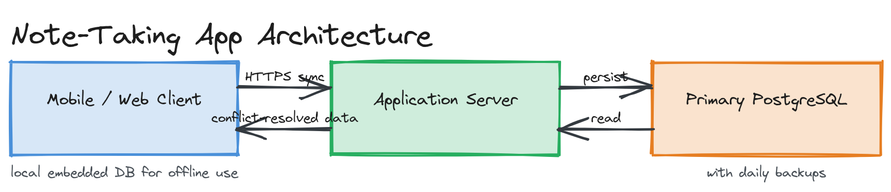

# Sample Answer: "Design a Note-Taking App"

> This is a fully worked example answer at the Module 01 level — no distributed systems machinery yet (that comes in later modules). The goal here is to demonstrate the *shape* of a complete answer: clarify, estimate, design, deep dive, wrap up.

---

## 1. Clarify (the questions I'd ask, and the answers I'll assume)

- **Who is this for?** A single user managing their own personal notes (not real-time collaborative editing — that's [Module 20's Google Docs challenge](../../module-20-advanced-patterns/04-exercises/design-challenges/challenge-01.md)).
- **What can a note contain?** Plain text and basic formatting (title, body, tags, timestamps). No images/attachments for this version.
- **Does it need to work offline?** Yes — notes should be readable and editable without network connectivity, syncing when connectivity returns.
- **Scale?** Assume 1 million users, each with ~200 notes averaging 2KB. This is explicitly a small-scale system — no sharding or caching layer is justified yet.

## 2. Functional Requirements

- Create, read, update, delete (CRUD) a note
- List a user's notes, sorted by last-modified
- Tag notes and filter by tag
- Sync notes created/edited offline once connectivity returns

## 3. Non-Functional Requirements

- Availability target: 99.9% (a personal productivity tool, not mission-critical)
- Latency: reads and writes should feel instant locally (<100ms perceived), even before server sync
- Durability: a synced note must never be lost
- Scale: 1M users × 200 notes × 2KB ≈ 400GB total stored data — comfortably fits a single well-provisioned relational database with room to grow 10x before any sharding conversation is needed

## 4. High-Level Architecture

*Shows a mobile/web client with a local embedded database (for offline support), connected over HTTPS to an application server, which persists to a single primary relational database with daily backups.*

**Components:**
- **Client** — holds a local copy of notes in an embedded store (e.g., SQLite/IndexedDB) so reads/writes work offline instantly
- **Application server** — a stateless REST API (`POST /notes`, `GET /notes`, `PATCH /notes/:id`, `DELETE /notes/:id`) handling auth and persistence
- **Database** — a single relational database (PostgreSQL) storing notes, tags, and a `last_modified` timestamp per note for sync conflict resolution

## 5. Deep Dive: Offline Sync

This is the one genuinely interesting part of an otherwise simple system. Each note carries a `last_modified` timestamp set by the client at the moment of edit. On reconnect, the client sends all locally-changed notes since the last successful sync. The server applies a simple **last-write-wins** conflict resolution: if the server's `last_modified` for a note is newer than what the client is pushing, the server's version wins and is sent back to the client; otherwise the client's write is accepted.

> ⚠️ **Warning:** Last-write-wins is a real trade-off, not a free simplification — it can silently discard a genuine edit if two devices changed the same note while both were offline. For a personal note app, this is an acceptable risk given how rarely the same user edits the same note from two offline devices simultaneously. A collaborative document (Module 20) cannot make this trade-off and needs something like CRDTs or operational transforms instead.

## 6. Trade-offs Discussed

| Decision | Choice | Trade-off |
|---|---|---|
| Conflict resolution | Last-write-wins | Simplicity, at the risk of silently dropping a rare concurrent edit |
| Storage | Single PostgreSQL instance | No sharding complexity, but a ceiling exists if user count grows 100x |
| Offline support | Local embedded DB + sync | Great UX, at the cost of needing conflict resolution logic at all |

## 7. Wrap-Up

The main weakness in this design is conflict resolution under concurrent offline edits — acceptable for a personal note app, but the first thing I'd revisit if "share a note with another user" became a requirement. At 10x scale (10M users), the single PostgreSQL primary would become the bottleneck for write throughput, and I'd introduce read replicas first, then consider sharding by `user_id` if writes alone became the constraint.
