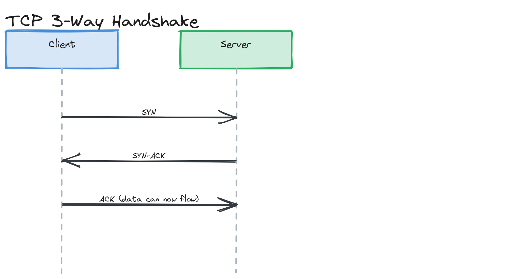

# Module 02 — Deep Dive: Latency, Connections, and Proxies

## Why This Matters

"Just add a cache" is the most common reflex answer to a slow system — but caching only helps if the bottleneck is *computation* or *repeated data fetching*. If your bottleneck is actually network round trips (TLS handshakes, connection setup, cross-region hops), no amount of caching the final answer helps if you're still paying setup costs on every new connection. This deep dive is about the network-level costs that show up regardless of how fast your application code is.

---

## Latency Numbers Every Engineer Should Know

| Operation | Latency |
|---|---|
| L1 cache reference | 1 ns |
| Main memory reference | 100 ns |
| SSD random read | 16 μs |
| Round trip within same datacenter | 0.5 ms |
| HDD seek | 4 ms |
| Cross-region round trip | ~100 ms |

The gap between "same datacenter" (0.5ms) and "cross-region" (100ms) is roughly 200x — this single fact is why CDNs ([Module 10](../../module-10-cdn/)) and multi-region architectures ([Module 20](../../module-20-advanced-patterns/)) exist. See the full reference: [`cheatsheets/numbers-every-engineer-should-know.md`](../../../cheatsheets/numbers-every-engineer-should-know.md).

---

## Bandwidth vs. Throughput vs. Latency

These three are easy to conflate but answer different questions:

- **Bandwidth** — the maximum theoretical data rate a link can carry (e.g., "this connection is 1 Gbps").
- **Throughput** — the actual achieved data rate, which is bandwidth minus overhead, contention, and inefficiency.
- **Latency** — the time for a single unit of data to make the trip, independent of how much data is flowing.

> 💡 **Note:** A classic gotcha: you can have enormous bandwidth and still feel "slow" if latency is high — a satellite link can have high bandwidth but 600ms+ latency, making it feel sluggish for interactive use even while it can stream high-bitrate video just fine.

---

## TCP Handshake Overhead

Before any HTTP request can be sent, TCP needs a 3-way handshake (SYN → SYN-ACK → ACK), and HTTPS adds a TLS handshake on top of that. At a 50ms one-way latency, a fresh TCP+TLS connection can cost 150–300ms before a single byte of actual data moves — this is exactly why **connection reuse** matters so much at scale.

*A sequence diagram showing client and server exchanging SYN, SYN-ACK, and ACK, with a timeline showing the round trips consumed before data can flow.*

## Keep-Alive and Connection Pooling

**HTTP keep-alive** reuses an already-established TCP connection for multiple sequential requests instead of paying handshake cost every time. **Connection pooling** generalizes this at the application level — instead of opening a new database connection per request (which is even more expensive than a plain TCP handshake, due to authentication and session setup), a pool of pre-established connections is shared across requests. This is covered hands-on in [Module 04's connection pool exercise](../../module-04-databases/04-exercises/coding-challenges/challenge-02/).

> ⚠️ **Warning:** Forgetting to release a pooled connection back to the pool after use ("connection leak") is one of the most common production incidents in real systems — the pool slowly exhausts, and new requests start timing out waiting for a free connection, even though the underlying database is healthy.

---

## Reverse Proxies and Forward Proxies

- A **forward proxy** sits in front of *clients*, making requests on their behalf (common for corporate network egress control, or anonymization).
- A **reverse proxy** sits in front of *servers*, receiving client requests and forwarding them to the appropriate backend (Nginx, HAProxy). It's the foundation for load balancing ([Module 07](../../module-07-load-balancing/)), TLS termination, and request routing.

## NAT (Network Address Translation)

NAT lets many devices on a private network share a single public IP address by rewriting source/destination addresses on the way in and out. It's why your home network can have a dozen devices all using private `192.168.x.x` addresses but appear as one public IP to the internet. NAT matters in system design mainly because it complicates direct peer-to-peer connections (relevant to WebRTC and some gaming architectures) and because it means "IP-based" client identification is unreliable — many users behind the same NAT share an IP.

## Anycast Routing

Anycast announces the *same* IP address from multiple physical locations; routers deliver a packet to whichever announcement is topologically closest. This is the core trick behind CDNs and large-scale DDoS mitigation: the "nearest" instance automatically receives the traffic, with no client-side logic needed, and an attack's traffic gets naturally spread across many points of presence rather than concentrated on one origin.

---

## Key Takeaways

- The order-of-magnitude gap between same-datacenter and cross-region latency (0.5ms vs ~100ms) drives the existence of CDNs and multi-region architectures.
- Bandwidth, throughput, and latency are independent axes — high bandwidth does not imply low latency.
- TCP/TLS handshake cost makes connection reuse (keep-alive, pooling) one of the highest-leverage, least-glamorous performance optimizations available.
- Reverse proxies are the foundation that load balancers, API gateways, and TLS termination are all built on top of.
- Anycast lets the network itself route a client to the nearest of many identical endpoints — no client-side logic required.
