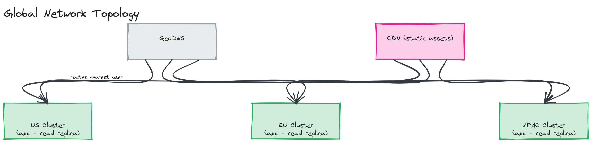

# Sample Answer: "Design the Network Topology for a Global Web Application"

> Demonstrates how to reason about networking choices end-to-end for a globally distributed audience, at the level expected after Module 02.

---

## Clarifying Questions

- Where are users located? *Assume: roughly evenly split across North America, Europe, and Asia-Pacific.*
- Is content mostly static (marketing site) or dynamic (personalized dashboard)? *Assume: a mix — static assets plus a personalized API.*
- Latency target? *Assume: p99 under 300ms for API calls, regardless of user location.*

## Design

**DNS strategy:** Use GeoDNS (or Anycast, where the provider supports it) so users resolve to the nearest regional entry point automatically, with a low-to-moderate TTL (60–300s) to allow rerouting during incidents without excessive query volume.

**Static assets:** Serve through a CDN ([Module 10](../../module-10-cdn/)) — these benefit the most from edge caching since they're identical for every user and don't need a round trip to any origin server at all once cached.

**Dynamic API traffic:** Deploy application servers in 3 regions (US, EU, APAC), each with its own regional database read replica for low-latency reads, writing back to a primary in one region (accepting some extra write latency for non-primary regions, in exchange for low read latency everywhere — see [Module 20's multi-region patterns](../../module-20-advanced-patterns/01-concepts/README.md) for how to evolve this further).

**Connections:** Use HTTP/2 (or HTTP/3 where client support allows) between clients and the edge, and persistent connection pools between application servers and databases, to avoid paying handshake costs repeatedly under load.

*Three regional clusters (US, EU, APAC), each with application servers and a local read replica, a CDN layer in front of all three for static assets, and GeoDNS routing users to their nearest region.*

## Trade-offs

| Decision | Choice | Trade-off |
|---|---|---|
| DNS routing | GeoDNS with moderate TTL | Fast regional routing, but DNS-based failover is slower than a true Anycast/BGP approach |
| Database topology | Single primary, regional read replicas | Low-latency reads everywhere; writes from non-primary regions pay extra latency |
| Static delivery | CDN edge caching | Near-zero latency for cached assets; requires cache invalidation discipline on deploys |

## Follow-Up: What Changes at 10x Scale?

Write latency to the single primary becomes the next bottleneck once user growth in non-primary regions is significant enough — that's the point where a true multi-region active-active write strategy (with conflict resolution) becomes worth its added complexity, covered in [Module 20](../../module-20-advanced-patterns/).
