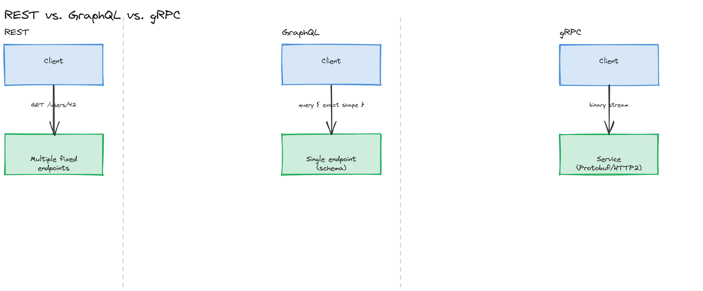

# Module 03 — Concepts: API Design

## Why This Matters

An API outlives the team that wrote it. Mobile apps in the wild may keep calling `v1` of your endpoint for years; other teams build entire products assuming your response shape never changes. Unlike most internal code, you usually can't refactor an API freely — every change is a negotiation with clients you may not control. That asymmetry (cheap to design well up front, expensive to fix later) is why API design gets its own module instead of being folded into "backend development."

---

## What Is an API?

An API (Application Programming Interface) is a contract that lets one piece of software call another without knowing its internals. APIs come in three common flavors by audience:

- **Public** — exposed to external developers (Stripe's API, Twitter's API)
- **Private/internal** — used only within your own organization, between your own services
- **Partner** — exposed to a specific set of trusted external integrators, often with different SLAs/auth than fully public APIs

---

## REST

REST (REpresentational State Transfer) is a set of architectural constraints, not a protocol:

- **Stateless** — each request contains everything needed to process it; the server holds no client session state between requests.
- **Resource-based** — URLs identify *things* (`/users/42`), not actions (`/getUser?id=42`).
- **Uniform interface** — a fixed, small set of HTTP methods means anything (proxies, caches, browsers) that understands HTTP understands the basic shape of your API.

### HTTP Methods and Status Codes

| Method | Use | Idempotent? |
|---|---|---|
| `GET` | Read a resource | Yes |
| `POST` | Create a resource (or trigger a non-idempotent action) | No |
| `PUT` | Replace a resource entirely | Yes |
| `PATCH` | Partially update a resource | Not necessarily |
| `DELETE` | Remove a resource | Yes |

| Status Code | Meaning |
|---|---|
| `200 OK` | Success, with a body |
| `201 Created` | Resource successfully created (include `Location` header) |
| `204 No Content` | Success, no body (common for DELETE) |
| `400 Bad Request` | Malformed request — client's fault |
| `401 Unauthorized` | No/invalid credentials |
| `403 Forbidden` | Authenticated, but not allowed |
| `404 Not Found` | Resource doesn't exist |
| `409 Conflict` | Request conflicts with current state (e.g., duplicate create) |
| `429 Too Many Requests` | Rate limited |
| `500 Internal Server Error` | Server's fault |

> ⚠️ **Warning:** Returning `200 OK` with `{ "error": "not found" }` in the body is a common anti-pattern — it forces every client to parse the body to know if a request even succeeded, defeating the purpose of having status codes at all.

### RESTful Design Best Practices

- **Naming**: plural nouns for collections (`/posts`, not `/post` or `/getPosts`), nesting for relationships (`/posts/42/comments`).
- **Idempotency**: `PUT`, `DELETE`, and `GET` should be safe to retry; `POST` typically is not, unless paired with an [idempotency key](#) (see deep dive).
- **Pagination**: offset-based (`?page=2&limit=20`) is simple but degrades at scale and can skip/duplicate items if data changes between pages; cursor-based (`?after=<opaque-id>&limit=20`) is stable under concurrent writes and scales better — see the deep-dive example.
- **Filtering & sorting**: query parameters (`?status=active&sort=-created_at`), kept consistent across endpoints.

---

## GraphQL

GraphQL exposes a single endpoint with a strongly-typed schema; clients specify exactly which fields they want in a query, and the server returns exactly that shape — no more, no less.

- **Queries** — read operations
- **Mutations** — write operations
- **Subscriptions** — long-lived, real-time updates

**Advantages**: clients avoid over-fetching (REST returning a whole user object when you needed just the name) and under-fetching (needing several REST calls to assemble one screen). **Costs**: the server now does more work per request (resolving an arbitrary query shape), caching is harder (no fixed URLs to cache by), and a poorly-designed query can cause expensive nested resolution (the "N+1" problem, shared with [Module 04](../../module-04-databases/02-deep-dive/README.md)).

---

## gRPC

gRPC uses **Protocol Buffers** (a compact binary serialization format) over HTTP/2, making it significantly faster and smaller on the wire than JSON-over-REST. It supports streaming (client, server, or bidirectional) natively. Its cost is reduced human-readability (you can't `curl` it and read the response) and a steeper setup (schema compilation step). This makes it the default choice for internal service-to-service communication at companies operating many microservices, and a poor choice for a public API consumed by arbitrary third-party developers.

---

## REST vs. GraphQL vs. gRPC

| | REST | GraphQL | gRPC |
|---|---|---|---|
| Format | JSON (typically) | JSON | Protocol Buffers (binary) |
| Best for | Public APIs, simplicity, cacheability | Complex client data needs, avoiding over/under-fetching | Internal service-to-service, performance-critical paths |
| Caching | Easy (HTTP caching by URL) | Hard (single endpoint) | N/A typically (request/response, not cache-friendly) |
| Human-debuggable | Yes (`curl`, browser) | Yes (GraphiQL/Playground) | No (needs tooling) |
| Streaming | Limited (SSE/WebSocket bolted on) | Subscriptions | Native, bidirectional |

*Three side-by-side panels: REST showing multiple fixed endpoints returning fixed shapes, GraphQL showing one endpoint with a client-specified query resolving to an exact shape, and gRPC showing a binary payload over HTTP/2.*

> 🎯 **Interview Tip:** Don't present this as "gRPC is just better/faster." The right answer names the *audience*: "if this API has external third-party consumers, REST's debuggability and ubiquitous tooling usually wins even though gRPC is faster — the audience matters more than raw performance here."

---

## Webhooks

A webhook is an inverted API call: instead of a client polling for updates, the server calls a URL the client registered, when an event happens (`payment.succeeded`, `order.shipped`). Because the delivery itself happens over an unreliable network, real webhook systems need **retry logic** (with backoff) and **idempotent receivers** (the same event might be delivered more than once) — covered further in [Module 08](../../module-08-message-queues/).

---

## OpenAPI / Swagger

OpenAPI is a specification format (YAML/JSON) for describing a REST API's endpoints, request/response schemas, and authentication — machine-readable enough to generate client SDKs, server stubs, and interactive documentation automatically from a single source of truth.

---

## Key Takeaways

- An API is a long-lived contract — design mistakes are expensive precisely because you can't always refactor freely once clients depend on a shape.
- REST's value is in its constraints (statelessness, resource orientation, uniform interface), which make it cacheable and universally tooling-friendly.
- GraphQL trades server-side complexity and harder caching for precise client-driven data fetching.
- gRPC trades human-debuggability for speed and native streaming — the right default for internal microservice communication, not public APIs.
- Webhooks invert the request direction and inherit all the reliability problems of asynchronous delivery — retries and idempotent receivers are not optional.
