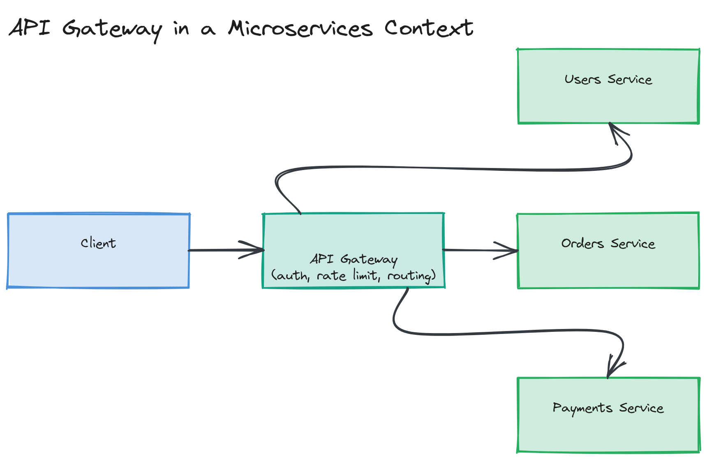
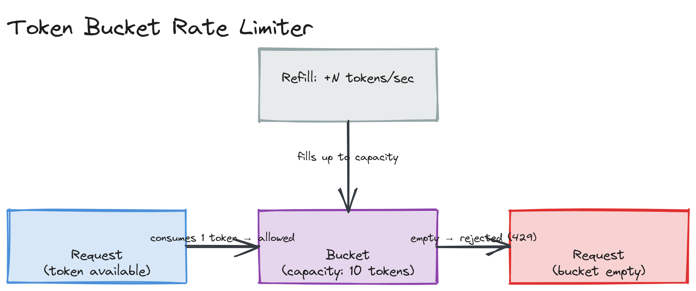
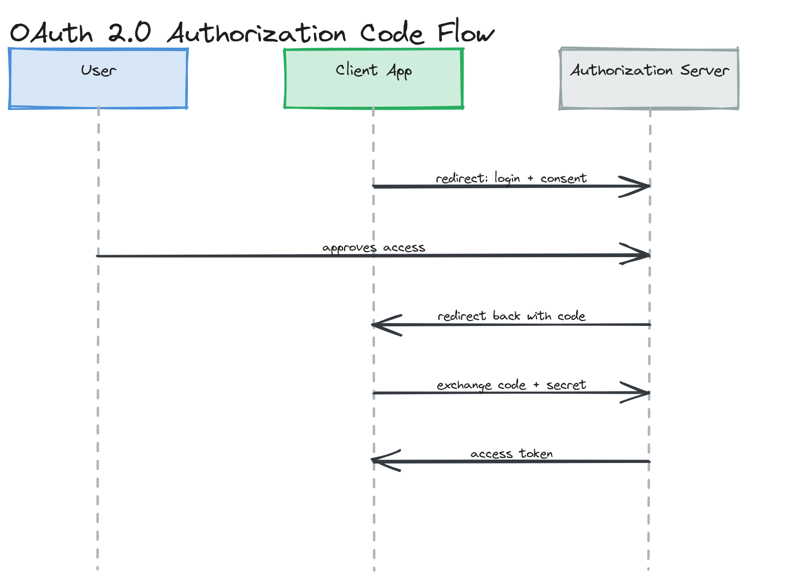

# Module 03 — Deep Dive: Versioning, Gateways, Rate Limiting, and Auth

## Why This Matters

An API's first version is the easy part. The hard part is everything that happens after you have real clients depending on it: how do you change it without breaking them, how do you stop one client from overwhelming it, and how do you know who's calling it at all? This deep dive covers the operational machinery that separates a weekend-project API from a production one.

---

## API Versioning Strategies

| Strategy | Example | Trade-off |
|---|---|---|
| URL versioning | `/v1/posts`, `/v2/posts` | Most explicit and cache-friendly; clutters URLs, and "which version is this route" becomes a maintenance question |
| Header versioning | `Api-Version: 2` | Keeps URLs clean; less discoverable (you can't see the version by looking at a URL or in browser history) |
| Content negotiation | `Accept: application/vnd.myapp.v2+json` | Most "RESTfully pure"; least common in practice, more friction for API consumers |

> 🎯 **Interview Tip:** Whichever you pick, state how long old versions stay supported. "We version in the URL, and support N-1 versions for 12 months after a new version ships" is a complete answer; "we version in the URL" alone leaves the actual operational policy unstated.

---

## API Gateway

An API gateway is the single entry point in front of a set of backend services, commonly handling:

- **Routing** — directing `/users/*` to the users service, `/orders/*` to the orders service
- **Authentication** — validating tokens once, at the edge, instead of in every service
- **Rate limiting** — enforcing per-client quotas centrally
- **Request transformation** — adapting request/response shapes between what clients expect and what backends provide
- **Logging/observability** — a single place to capture request-level metrics for every service

This is covered architecturally in [Module 11 — Microservices](../../module-11-microservices/01-concepts/README.md); here, the focus is what the gateway does to the API contract itself — it's often the layer that actually enforces your versioning and rate-limiting policy, not the backend services.

*A client request entering a single API gateway, which performs auth/rate-limiting/routing, then fans out to several backend microservices, each unaware of the gateway's cross-cutting concerns.*

---

## Rate Limiting Algorithms

| Algorithm | How It Works | Trade-off |
|---|---|---|
| **Token bucket** | Tokens refill at a fixed rate into a capped bucket; each request consumes a token | Allows bursts up to bucket capacity; simple, most commonly used (implemented hands-on in this module's exercises) |
| **Leaky bucket** | Requests queue and are processed at a fixed output rate | Smooths bursts into a constant rate; added latency for queued requests |
| **Fixed window** | Count requests in a fixed time window (e.g., per-minute); reset at window boundary | Simple, but allows up to 2x the limit in a short burst straddling a window boundary |
| **Sliding window** | Counts requests in a rolling window, not a fixed boundary | Fixes the boundary-burst problem; more state to track per client |

> ⚠️ **Warning:** Fixed-window rate limiting has a well-known edge case: a client can send the full limit in the last second of one window and the full limit again in the first second of the next, getting 2x the intended rate in a 2-second span. If this matters for your system, use sliding window or token bucket instead.

*A bucket filling with tokens at a fixed rate up to a capacity line; a request with an available token is allowed, while a request against an empty bucket is rejected until the next refill tick.*

---

## Authentication and Authorization at the API Layer

- **API Keys** — a static secret identifying the calling application (not a user). Simple, but hard to rotate safely and offers no per-user granularity.
- **OAuth 2.0** — a framework for delegated authorization ("let app X act on behalf of user Y without seeing Y's password"), via short-lived access tokens issued after a defined flow (authorization code, client credentials, etc.).
- **JWT (JSON Web Tokens)** — a signed (and optionally encrypted) token format often used to carry OAuth access tokens or session claims; the signature lets a server verify the token wasn't tampered with *without a database lookup*, at the cost of being hard to revoke before expiry (since validity is normally checked offline from the signature alone).

> 💡 **Note:** "JWT" and "OAuth" solve different problems and are often confused. OAuth is about *delegated authorization* (a flow). JWT is just a *token format* — you could use OAuth with opaque tokens instead of JWTs, and you could use JWTs without any OAuth flow at all (e.g., your own simple login system).

*OAuth 2.0 authorization code flow sequence: user approves access at the authorization server, the client receives a redirect with a code, and exchanges that code (plus its secret) for an access token directly with the authorization server.*

---

## Idempotency Keys

`POST` is not naturally idempotent — retrying a payment request because of a network timeout could double-charge a customer if the first request actually succeeded server-side before the timeout. An **idempotency key** (a client-generated unique value sent in a header) lets the server recognize "I've already processed this exact request" and return the original result instead of repeating the side effect. This requires the server to store recently-seen idempotency keys (with their results) for some retention window.

---

## Compression

`gzip` and `brotli` (via `Accept-Encoding`/`Content-Encoding` headers) reduce response payload size substantially for text-based formats like JSON, at the cost of CPU time to compress/decompress. For most APIs this is a clear win; for very small responses or extremely latency-sensitive paths, the compression CPU overhead can outweigh the bandwidth savings.

---

## Pagination Deep Dive: Cursor vs. Offset

Offset pagination (`?page=3&limit=20`, internally `OFFSET 40 LIMIT 20`) requires the database to scan and discard all preceding rows — at `OFFSET 1000000`, that's a million rows scanned just to throw them away, and pages can include duplicate or skip items if rows are inserted/deleted between page requests. Cursor pagination (`?after=<encoded-last-seen-id>&limit=20`) instead does `WHERE id > <cursor> LIMIT 20`, which uses an index seek regardless of how deep you paginate, and is stable under concurrent writes since each page is anchored to a specific value, not a row count. See the runnable comparison in [`examples/cursor-pagination.ts`](./examples/cursor-pagination.ts).

---

## Key Takeaways

- Versioning strategy matters less than stating the deprecation policy that goes with it.
- An API gateway centralizes routing, auth, and rate limiting so individual services don't reimplement them.
- Token bucket and sliding window rate limiting avoid the boundary-burst flaw inherent to fixed windows.
- JWT is a token *format*; OAuth is an authorization *flow* — they're often paired but solve different problems.
- Idempotency keys are what make retrying a `POST` safe; without them, network retries can cause duplicate side effects.
- Cursor pagination scales better and stays stable under concurrent writes; offset pagination gets slower and less correct the deeper you paginate.
