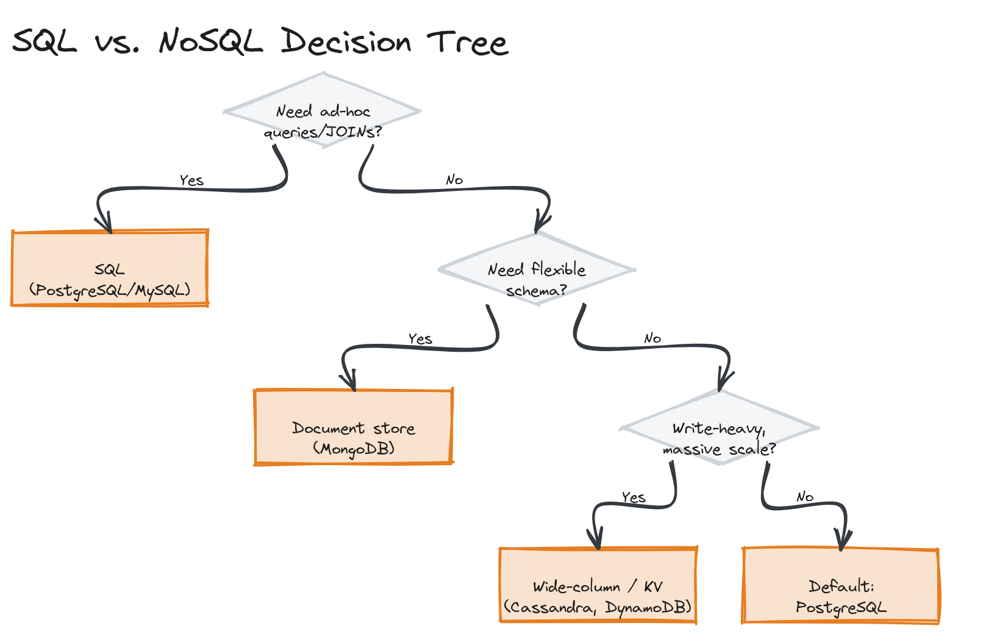

# Module 04 — Concepts: Databases

## Why This Matters

You can swap a caching layer, a load balancer, or a message queue with a weekend of work and a careful migration. Swapping your primary database after you've built a few years of features on top of it is one of the most expensive mistakes a team can make — schema assumptions, query patterns, and consistency expectations end up woven through the entire codebase. Getting the database decision right early is disproportionately valuable, which is why this module is the longest in the repository.

---

## Relational Databases

A relational database organizes data into **tables** (rows and columns), with relationships expressed via **foreign keys** referencing **primary keys** in other tables. Relational databases give you **ACID** guarantees:

- **Atomicity** — a transaction either fully completes or fully fails; there's no partial state visible to others.
- **Consistency** — a transaction can only bring the database from one valid state to another, per its defined constraints (foreign keys, unique constraints, etc.).
- **Isolation** — concurrent transactions don't see each other's uncommitted intermediate states (with degrees of strictness — see the deep dive).
- **Durability** — once committed, a transaction's effects survive a crash.

> 💡 **Note:** The "C" in ACID (consistency) is a different concept from the "C" in CAP theorem (covered in [Module 13](../../module-13-consistency-consensus/)). ACID consistency is about respecting *your own declared constraints*; CAP consistency is about *all readers seeing the same value*. They're related in spirit but not the same property.

### SQL Fundamentals for System Designers

- **JOINs** combine rows from multiple tables based on a related column — powerful, but expensive at scale if not backed by the right indexes.
- **Indexes** are auxiliary data structures that let the database find rows without scanning the whole table (see the deep dive for how B-tree indexes actually work).
- **Transactions** group multiple statements into one atomic unit.
- **Constraints** (`UNIQUE`, `NOT NULL`, `FOREIGN KEY`, `CHECK`) let the database itself enforce invariants instead of trusting application code to never violate them.

---

## NoSQL Database Types

"NoSQL" is an umbrella term for several genuinely different data models, each suited to different access patterns:

| Type | Examples | Use Case | Data Model |
|---|---|---|---|
| **Key-Value** | Redis, DynamoDB | Caching, session storage, simple lookups | Opaque value behind a key; fastest, least query flexibility |
| **Document** | MongoDB, CouchDB | Content with nested/variable structure (user profiles, product catalogs) | JSON-like documents; flexible schema, supports querying into nested fields |
| **Column-family / Wide-column** | Cassandra, HBase | Massive write throughput, time-series | Rows with dynamic columns, grouped by partition key; optimized for sequential writes |
| **Graph** | Neo4j | Relationship-heavy data (social graphs, fraud rings, recommendations) | Nodes and edges; fast traversal of relationships that would require many JOINs in SQL |

---

## SQL vs. NoSQL: The Real Trade-offs

The honest framing isn't "SQL doesn't scale" (it does, further than most people assume) — it's about which property you need most:

- **Schema flexibility**: NoSQL document stores let you evolve a record's shape without a migration; SQL requires a schema change, which is safer but slower to iterate on.
- **Query flexibility**: SQL's JOINs let you ask questions you didn't anticipate when designing the schema; most NoSQL stores require you to design your access patterns into the data model upfront (denormalization, duplication).
- **Write scaling**: Wide-column stores like Cassandra are built from the ground up for very high write throughput across many nodes; a single PostgreSQL primary has a write-scaling ceiling that requires real engineering effort (sharding) to push past.
- **Consistency guarantees**: traditional SQL databases default to strong consistency within a single node/cluster; many NoSQL stores default to eventual consistency in exchange for availability (see [Module 13](../../module-13-consistency-consensus/)).

> ⚠️ **Warning:** "NoSQL scales, SQL doesn't" is the most common oversimplification in system design discussions. Companies run PostgreSQL/MySQL at enormous scale (with read replicas, sharding, and careful query design); the real question is which trade-offs (schema rigidity vs. query power, consistency vs. availability) fit your access patterns.

> 🎯 **Interview Tip:** When asked "SQL or NoSQL?", lead with the access pattern, not the technology: "this data is read by primary key 99% of the time and never needs ad-hoc queries, so a key-value store fits — but if we expect analysts to run arbitrary reports against it later, that argues for SQL even at some write-scaling cost."

---

## CAP Theorem (Introduction)

Briefly: in a distributed database, during a network partition, you must choose between staying fully **consistent** (every read sees the latest write, but some nodes become unavailable) or staying fully **available** (every node responds, but some may return stale data). This is covered in full in [Module 13](../../module-13-consistency-consensus/) — for now, know that this is *why* different databases default to different consistency models, not an arbitrary vendor choice.

*A flowchart starting from "do you need ad-hoc queries / JOINs?" branching through schema flexibility and write-throughput needs down to a recommended database type.*

---

## Key Takeaways

- ACID gives you atomicity, consistency (of your own constraints), isolation, and durability — the guarantees that make a relational database trustworthy for transactional data.
- NoSQL is four distinct data models (key-value, document, wide-column, graph), not one alternative to SQL — each fits different access patterns.
- The real SQL vs. NoSQL question is about access patterns and which property (query flexibility, schema flexibility, write throughput, consistency) you need most — not which one "scales."
- CAP theorem explains why different databases default to different consistency/availability trade-offs; full treatment is in Module 13.
- A database choice is one of the most expensive decisions to reverse later — it's worth the extra time to get the access-pattern analysis right upfront.
