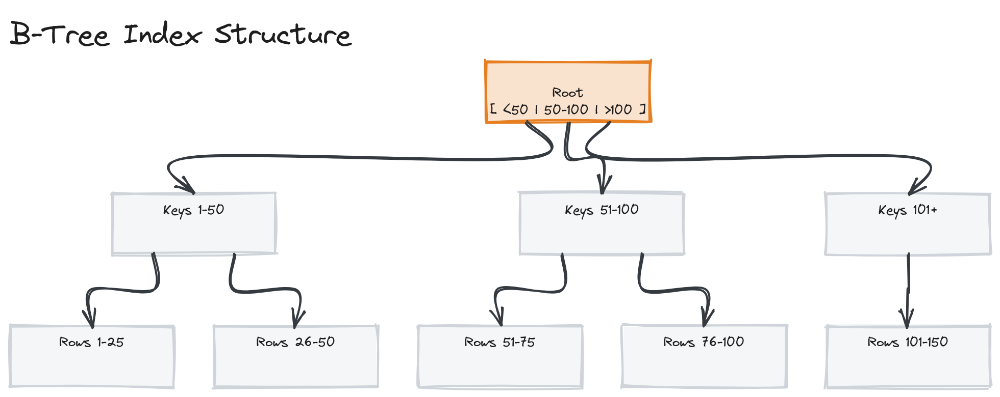
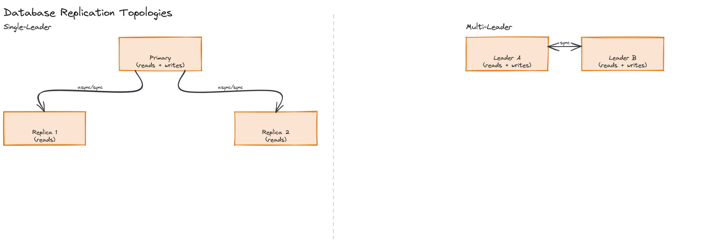
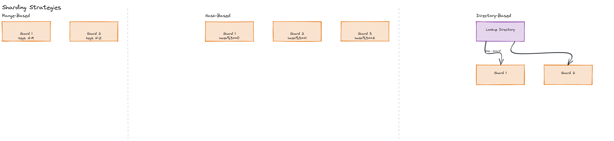

# Module 04 — Deep Dive: Indexing, Replication, and Sharding

## Why This Matters

A correctly normalized schema with zero indexes will be correct and catastrophically slow. A well-indexed, replicated, sharded database is what separates "works in the demo" from "works at 50 million rows and 10,000 writes a second." This deep dive is about the mechanisms that make a database fast and keep it available as data and traffic grow past what one machine can hold.

---

## Database Indexing

An index is a separate data structure that lets the database find rows without scanning the entire table.

- **B-tree indexes** — the default in PostgreSQL/MySQL; a balanced tree structure where lookups, range scans, and sorted iteration are all efficient (`O(log n)`). Good for equality and range queries (`WHERE age > 30`).
- **Hash indexes** — faster for pure equality lookups (`WHERE id = 5`), but can't support range queries at all (a hash gives you no ordering information).
- **Composite indexes** — an index over multiple columns `(a, b)`; useful for queries filtering on both, or on just `a` alone (leftmost-prefix rule), but not for queries filtering on `b` alone.
- **Covering indexes** — an index that includes all columns a query needs, letting the database answer entirely from the index without touching the underlying table at all.
- **Partial indexes** — an index over only a subset of rows (`WHERE status = 'active'`), smaller and faster when most queries only care about that subset.

*A balanced tree showing a root node with key ranges, internal nodes, and leaf nodes pointing to actual row locations — illustrating why a lookup takes O(log n) comparisons instead of scanning every row.*

> ⚠️ **Warning:** Indexes aren't free — every additional index slows down writes (each insert/update must also update every index on the table) and consumes storage. "Just add an index" is good advice for a slow read query; it's not a free action to take on every column reflexively.

---

## Query Optimization

- **EXPLAIN plans** show you what the database actually intends to do for a query — whether it's using an index or falling back to a full table scan. Reading an `EXPLAIN` output is the single most useful database debugging skill.
- **The N+1 problem** — running one query to get a list, then one additional query per item to get related data (common with naive ORMs). The fix is usually a JOIN or a batched `WHERE id IN (...)` query instead of a loop of individual queries. This pattern recurs in [Module 03's GraphQL discussion](../../module-03-apis/01-concepts/README.md) as well.
- **Avoiding table scans** — ensure your `WHERE` clauses use indexed columns, and watch for cases where a function applied to a column (`WHERE LOWER(email) = ...`) silently defeats a plain index on that column.

---

## Normalization

- **1NF** — no repeating groups; each column holds atomic values.
- **2NF** — 1NF, plus every non-key column depends on the whole primary key (relevant for composite keys).
- **3NF** — 2NF, plus no non-key column depends on another non-key column (eliminate transitive dependencies).

Normalizing reduces redundancy and update anomalies; **denormalizing** (intentionally duplicating data) trades that redundancy for read performance — fewer JOINs needed at query time. Most real systems normalize their source-of-truth schema, then denormalize specific read paths (via caching or materialized views) once a particular query becomes a bottleneck.

---

## Replication

- **Single-leader (primary-replica)** — one node accepts writes, others replicate and serve reads. Simple to reason about; the leader is a single point of write-availability failure unless you have automated failover.
- **Multi-leader** — multiple nodes accept writes, replicating to each other; needs conflict resolution when the same data is written in two places concurrently.
- **Leaderless** — any node can accept a write, reconciled via quorum reads/writes (covered in [Module 12](../../module-12-distributed-systems/02-deep-dive/README.md)).
- **Synchronous vs. asynchronous replication** — synchronous guarantees a replica is up to date before acknowledging the write (safer, slower); asynchronous acknowledges immediately and replicates in the background (faster, risks losing the most recent writes on a leader failure, and introduces **replication lag**).

*Side-by-side: a single-leader topology (one primary, arrows fanning out to replicas) and a multi-leader topology (multiple primaries with bidirectional sync arrows between them).*

---

## Sharding (Horizontal Partitioning)

When a dataset outgrows a single node's capacity (storage or write throughput), it gets split across multiple nodes ("shards"):

| Strategy | How It Works | Trade-off |
|---|---|---|
| **Range-based** | Shard by key ranges (`A-M` → shard 1, `N-Z` → shard 2) | Simple, supports efficient range queries; can create hot shards if data/traffic isn't evenly distributed across ranges |
| **Hash-based** | Shard by `hash(key) % N` | Even distribution; loses the ability to do efficient range scans across shards |
| **Directory-based** | A lookup service maps each key to its shard explicitly | Maximum flexibility (can rebalance individual keys); the directory itself becomes a critical, must-scale component |

*Three side-by-side panels showing range-based (contiguous key blocks per shard), hash-based (scattered by hash%N), and directory-based (an explicit lookup table mapping each key to a shard) sharding strategies.*

> ⚠️ **Warning:** The **resharding problem** — when you add or remove shards, naive `hash(key) % N` remaps almost every key to a new shard, requiring a massive data migration. [Consistent hashing](#) (implemented hands-on in this module's exercises) solves exactly this problem by minimizing how many keys move when the shard count changes.

## Vertical Partitioning

Distinct from sharding: vertical partitioning splits a table by *columns* rather than rows — e.g., separating rarely-accessed large text/blob columns into their own table, so the frequently-queried columns stay in a smaller, faster-to-scan table.

---

## Connection Pooling

Opening a new database connection is expensive (TCP handshake, authentication, session setup) — see [Module 02's deep dive](../../module-02-networking/02-deep-dive/README.md). A connection pool maintains a set of already-open connections that requests borrow and return, instead of opening one per request. **PgBouncer** is the canonical example for PostgreSQL, sitting between application servers and the database to multiplex many client connections onto fewer actual database connections.

---

## Transaction Isolation Levels

| Level | Prevents | Still Allows |
|---|---|---|
| Read Uncommitted | Nothing | Dirty reads (seeing another transaction's uncommitted changes) |
| Read Committed | Dirty reads | Non-repeatable reads (a row changes between two reads in the same transaction) |
| Repeatable Read | Dirty + non-repeatable reads | Phantom reads (new rows matching a query appear on re-run) |
| Serializable | All of the above | Nothing — transactions behave as if executed one at a time |

Stricter isolation costs more (more locking, more aborted/retried transactions under contention) — most applications default to **Read Committed** and only reach for stricter levels for specific operations that truly need it.

---

## Database Migrations at Scale

Changing a schema on a live, large table without downtime typically uses the **expand-contract pattern**: add the new column/table alongside the old one (expand), migrate writes and backfill data to use both, then remove the old structure once nothing depends on it anymore (contract). This avoids the all-or-nothing risk of a single blocking schema change on a multi-billion-row table.

---

## Key Takeaways

- B-tree indexes make range and equality queries fast at the cost of slower writes and extra storage — add them deliberately, not reflexively.
- The N+1 query problem is the most common ORM-induced performance bug; batch or JOIN instead of looping queries.
- Synchronous replication trades latency for durability guarantees; asynchronous replication trades some durability risk for speed, and introduces replication lag.
- Consistent hashing (covered hands-on in this module's exercises) solves the resharding problem that naive `hash(key) % N` sharding creates.
- Stricter transaction isolation levels prevent more anomalies at the cost of more contention — Read Committed is a common practical default.
