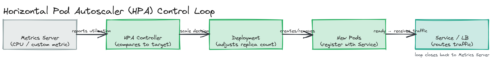

# Module 06 — Deep Dive: Bottlenecks, Auto-Scaling, and Scaling Patterns

## Why This Matters

Knowing that "horizontal scaling" exists doesn't tell you what to do when a service starts timing out under load. This deep dive is the diagnostic and operational reality — how to find out *what* is actually limiting a system, how to add capacity automatically instead of paging a human at 3 a.m., and how the database and processing layers specifically scale once caching and more app servers aren't enough.

---

## Identifying Bottlenecks: CPU, I/O, and Memory-Bound Systems

Before scaling anything, you need to know what's actually saturated — adding app servers does nothing if the real bottleneck is a single database connection pool.

- **CPU-bound** — most time spent actively computing (image resizing, encryption, JSON serialization at high volume). Symptom: CPU near 100%, I/O wait low. **Fix:** horizontal scaling, algorithmic optimization, or moving the work off the request path (async processing, below).
- **I/O-bound** — most time spent waiting on disk, network, or a downstream service (database queries, external API calls). Symptom: CPU low, latency high, connections mostly "waiting." **Fix:** more concurrency (CPU is idle anyway), caching to avoid the I/O entirely, or connection pooling sized via Little's Law.
- **Memory-bound** — the process runs out of RAM before CPU or I/O capacity, often from holding too much in memory (large in-process caches, big result sets, leaks). Symptom: rising latency from GC pressure, or OOM crashes. **Fix:** stream data instead of loading it all at once, paginate large result sets, or scale memory vertically as a stopgap while fixing the retention.

> 💡 **Note:** Always profile before optimizing. "Add more servers" is the right fix for a CPU-bound system, the wrong fix for an I/O-bound one waiting on a single slow downstream dependency, and irrelevant to a memory leak that will eventually crash every instance regardless of how many you run.

---

## Auto-Scaling

Manually adding/removing servers as load changes doesn't scale (pun intended) past a small team watching dashboards. Auto-scaling automates the decision.

### Reactive vs. Predictive Scaling

- **Reactive scaling** reacts to a real-time metric crossing a threshold (e.g., "if average CPU > 70% for 3 minutes, add 2 instances"). Simple, no forecasting required, but there's inherent lag — by the time new instances finish booting, load may have already degraded service for those minutes.
- **Predictive scaling** forecasts upcoming load from historical patterns (traffic reliably spikes at 9 a.m. on weekdays) and scales *ahead* of the spike. Avoids the reactive lag, but is only as good as the forecast — a genuinely novel spike isn't predictable from history.

> ⚠️ **Warning:** Reactive auto-scaling has a subtle failure mode — **scaling thrash**. If the scale-out and scale-in thresholds are too close together, the system can oscillate (add instances, load drops as a result, remove instances, load rises again, repeat), wasting cost and causing instability. Use a cooldown period and asymmetric thresholds (scale out fast, scale in slowly) to avoid it.

### Horizontal Pod Autoscaler (Kubernetes)

Kubernetes' HPA is the most common concrete implementation of reactive auto-scaling. It watches a metric (CPU by default; custom metrics like queue depth are also supported) against a **target value** you configure, and adjusts pod replica count to keep the observed metric near the target — e.g., "keep average CPU at 50%; if higher, add pods; if lower, remove pods" — within a configured min/max range.

*The HPA control loop: metrics server reports current utilization → HPA controller compares to target → HPA adjusts the Deployment's replica count → new pods register with the Service and begin receiving traffic, closing the loop back to the metrics server.*

> 🎯 **Interview Tip:** If asked how a system handles a traffic spike, naming auto-scaling alone is incomplete — mention the boot/warm-up lag, that scaling is reactive by default unless you've built predictive scaling, and that stateless services ([01-concepts](../01-concepts/README.md)) are what make adding/removing instances safe in the first place.

---

## Database Scaling Patterns

### Read Replicas

A primary database handles writes; one or more read replicas receive an asynchronous (or semi-synchronous) copy of every write and serve read traffic. This scales read capacity roughly linearly with replica count, since most systems are read-heavy. The trade-off is **replication lag** — a replica may be milliseconds to seconds behind the primary, so a read immediately following a write can return stale results unless that specific read is routed to the primary instead.

### CQRS (Command Query Responsibility Segregation)

CQRS takes the read/write split further: instead of one schema serving both reads and writes, the write path (commands) and read path (queries) use **separate models** — often separate data stores entirely, such as a normalized relational store optimized for writes feeding a denormalized, query-shaped store (or a different technology, like Elasticsearch) kept in sync asynchronously. This lets each side scale and evolve independently, at the cost of eventual consistency between them and real added complexity.

> 💡 **Note:** CQRS is not "just add a read replica" — a replica is the same schema, copied. CQRS can mean a genuinely different schema or technology, specifically shaped for the query patterns it serves.

---

## Async Processing to Decouple and Scale

Not every unit of work needs to happen inside a request-response cycle. Offloading work that doesn't need an immediate answer — sending an email, resizing an image, updating a search index — onto a **message queue** consumed by separate workers accomplishes two things: the original request returns fast (the slow work isn't on its critical path), and the worker fleet scales independently of the API fleet, sized to actual processing load rather than request rate. It's the same idea as the CPU-bound fix above, generalized: move expensive work off the synchronous path so it can be parallelized on its own terms. [Module 08](../../module-08-message-queues/) covers queueing infrastructure in depth.

---

## Geo-Distribution

Once users are global, a single-region deployment imposes a latency floor defined by speed of light — a user in Singapore talking to a server in Virginia pays ~200ms+ of round-trip network latency before any processing even starts. **Multi-region architectures** deploy the system (or parts of it) in multiple geographic regions, routing each user to the nearest one.

This introduces real complications beyond "deploy it twice":
- **Data residency** — jurisdictions like the EU (GDPR) legally restrict where certain user data may be stored or processed, forcing a *specific* region for a *specific* user's data rather than "nearest available."
- **Cross-region consistency** — if the same data can be written in two regions, you need a conflict strategy (last-write-wins, application-level merge, or routing all writes for a given record to one "home" region).
- **Cost** — cross-region transfer and replication isn't free, and redundant infrastructure multiplies operational cost.

---

## The Cost of Consistency at Scale

Strong consistency — every read sees the latest write, everywhere, immediately — gets harder and more expensive as a system spans more nodes and geography, because guaranteeing it requires coordination (consensus protocols, locking, synchronous replication) that adds latency to every write and creates availability risk if nodes can't reach each other.

**Eventual consistency** relaxes this: a write is accepted quickly, and replicas converge to the same value *eventually*, without blocking on global agreement first. This isn't a reluctant compromise — at large scale it's often what makes scaling possible at all. A system that insisted on strong consistency for every write would pay a synchronous cross-region round-trip per write, slow and fragile (one unreachable region blocks writes everywhere). Accepting eventual consistency where brief staleness is tolerable (a "likes" counter, a follower count) is what lets the rest of the system scale without that synchronous tax.

> ⚠️ **Warning:** Eventual consistency is not a free pass to ignore consistency entirely — it must be a deliberate choice made per piece of data, based on whether brief staleness is actually tolerable for that specific data. A bank balance and a "like count" do not have the same tolerance for staleness, and treating them identically is a real interview red flag.

---

## Key Takeaways

- Diagnose before scaling: CPU-bound, I/O-bound, and memory-bound systems each need a different fix, and "add more servers" only helps the CPU-bound case directly.
- Reactive auto-scaling responds to real-time metrics but lags behind sudden spikes; predictive scaling forecasts ahead of load but only works for patterns that resemble history.
- Read replicas scale read capacity at the cost of replication lag; CQRS goes further by giving reads and writes genuinely separate models, at the cost of more architectural complexity.
- Offloading non-urgent work to async queues gets it off the request's critical path and lets worker capacity scale independently of API capacity.
- Eventual consistency isn't a shortcut — it's frequently the mechanism that makes scaling across nodes and regions possible at all, applied deliberately per piece of data based on actual staleness tolerance.
