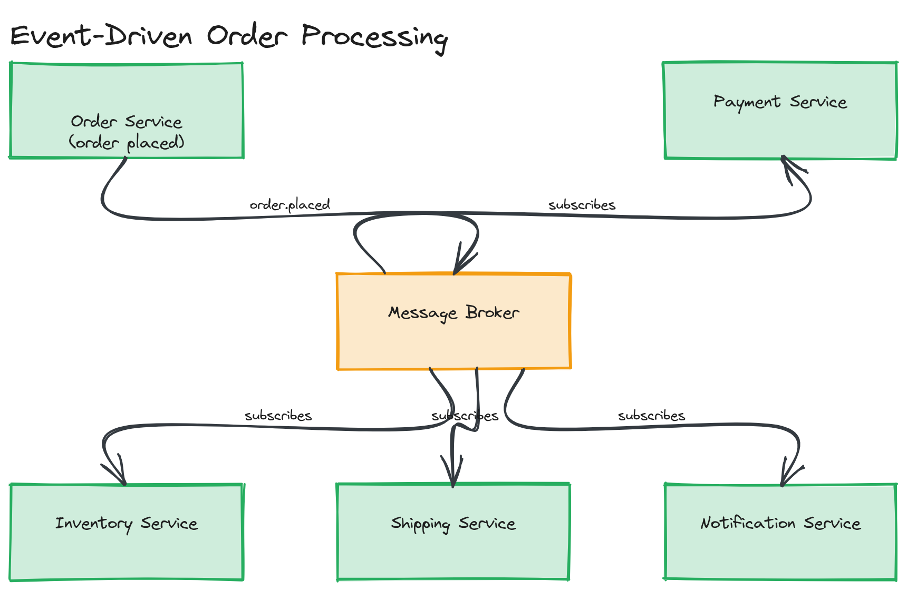

# Design Challenge 01: Event-Driven Order Processing System

**Difficulty:** Medium

## Prompt

Design an order processing system using event-driven architecture. The flow: **order placed → payment → inventory → shipping → notification**. Each step should react to the previous step's outcome rather than the entire chain being one synchronous call sequence.

## What to Produce

1. Identify which step(s), if any, must remain synchronous from the user's perspective, and justify why.
2. Design the event flow: name each event (e.g., `OrderPlaced`, `PaymentAuthorized`), what publishes it, and what consumes it.
3. Choose message queue vs. event stream for the backbone, and justify the choice for this specific system (not just "Kafka is good for events").
4. State your delivery semantics explicitly and how you keep at least one consumer (your choice) idempotent.
5. Design for the failure case: payment succeeds but inventory reservation fails. What happens to the order, the customer's charge, and which compensating action(s) fire?
6. At least 2 trade-offs.

*The order placed → payment → inventory → shipping → notification flow as named events flowing through a message broker, with each consuming service independent of the others.*

A full worked solution is in [`03-interview-prep/sample-answer.md`](../../03-interview-prep/sample-answer.md), which answers this exact prompt in depth.
