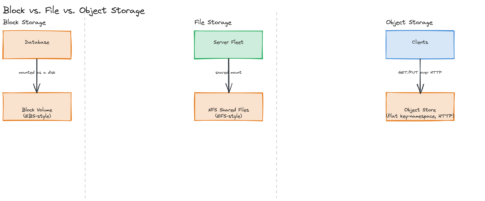

# Module 09 — Concepts: Storage Systems

## Why This Matters

A database tells you *how to query* your data; storage tells you *where the bytes actually live*. Every photo on Instagram, every video on YouTube, every log file your observability stack ingests, and every row your database writes to disk eventually comes down to a storage decision: block, object, or file. Pick the wrong one and you end up either re-engineering a homegrown CDN on top of a filesystem that was never meant to serve billions of public reads, or paying for low-latency block storage to hold petabytes of write-once archival video that nobody reads twice. This module is about building the vocabulary and judgment to make that decision deliberately — and about what's actually happening inside the systems (S3, HDFS, RocksDB, PostgreSQL) that make those decisions for you once you've picked a category.

---

## Block Storage vs. Object Storage vs. File Storage

These three models solve the same underlying problem — persisting bytes — with very different interfaces, guarantees, and ideal use cases.

| | Block Storage | File Storage | Object Storage |
|---|---|---|---|
| **Unit** | Fixed-size blocks (raw disk sectors) | Files in a hierarchical directory tree | Immutable objects + metadata, flat namespace |
| **Access pattern** | Mounted as a raw volume; OS/filesystem sits on top | POSIX file operations (open, read, seek, append) | HTTP API (PUT/GET/DELETE), no in-place edits |
| **Example** | AWS EBS, a SAN, a local SSD | AWS EFS, NFS, Google Filestore | AWS S3, Google Cloud Storage, MinIO |
| **Best for** | Databases, boot volumes — anything needing low-latency random reads/writes at the block level | Shared file access across many servers (config files, shared home directories, ML training datasets) | Large numbers of immutable or rarely-mutated files at massive scale (images, videos, backups, logs) |
| **Scaling model** | Attached to one instance at a time (mostly); scales by provisioning more/larger volumes | Scales to many concurrent clients via a network filesystem protocol | Scales near-infinitely; horizontally distributed across many machines by design |

**Block storage** is the lowest-level abstraction: a volume of fixed-size blocks that an operating system formats with its own filesystem, exactly like a virtual hard drive. A database engine wants block storage underneath it because it needs to control exactly how and when bytes hit disk — a database's own storage engine (covered later in this module) is *also* a layer that manages blocks, just at the application level instead of the OS level.

**File storage** adds a hierarchical namespace and POSIX semantics (directories, file handles, partial writes, locking) on top of block storage, exposed over the network so multiple machines can mount the same filesystem simultaneously. It's the right choice when multiple servers need POSIX-style shared access to the same mutable files — a render farm reading/writing intermediate frames, or app servers sharing uploaded files before they move to permanent storage.

**Object storage** throws away the hierarchical directory tree and POSIX semantics entirely in exchange for massive horizontal scalability. An object is an immutable blob (the bytes) plus metadata (content-type, custom tags, timestamps) addressed by a key in a flat namespace — there's no real "directory," just keys containing `/` that UIs render as if they were folders. You can't seek into the middle of an object and overwrite ten bytes; you replace the whole object. That constraint is exactly what makes object storage horizontally scalable: removing in-place mutation and POSIX locking removes the hardest distributed-systems problems a filesystem has to solve.

> 🎯 **Interview Tip:** When asked "where would you store user-uploaded images?", the strong answer is object storage (S3), justified by the access pattern: images are written once, read many times, never partially modified, and need to scale to billions of objects — exactly the shape object storage is built for. Naming *why* block/file storage would be a worse fit (no need for POSIX semantics, no need for low-latency random writes) is what separates a memorized answer from a reasoned one.

---

## Object Storage Deep Dive

Object storage systems like S3 expose a deceptively simple API — `PUT`, `GET`, `DELETE`, `HEAD` over HTTP — but that simplicity is what enables the scale. Three properties matter most for system design:

- **S3-compatible APIs**: S3's REST API became a de facto standard — MinIO, Google Cloud Storage, Backblaze B2, and Cloudflare R2 all implement S3-compatible APIs, so code written against "an S3 bucket" is often portable across providers with minimal changes. This matters when designing for multi-cloud or avoiding vendor lock-in.
- **Eventual consistency (historically)**: object storage is distributed across many machines for durability and scale, and historically this meant a write might not be immediately visible to a read from a different node for a brief window. (S3 itself moved to strong read-after-write consistency for all operations in December 2020 — but eventual consistency is still the default mental model for many object stores, and is *the* defining trade-off discussed in the deep dive.)
- **Rich metadata**: every object carries metadata (content-type, cache-control headers, custom tags) that's queryable and usable for lifecycle rules — e.g., "move any object tagged `tier: cold` and untouched for 90 days to Glacier" — without touching the object's bytes at all.

> 💡 **Note:** Object storage scales by sharding objects across many nodes based on key, similar in spirit to the consistent hashing covered in [Module 04](../../module-04-databases/04-exercises/coding-challenges/challenge-03/) — there is no single node that owns "the bucket."

---

## Blob Storage and CDN Integration

"Blob storage" is largely a synonym for object storage (the term Azure prefers), and the two are almost always paired with a CDN in production: the object store is the durable origin holding every image/video ever uploaded, while a CDN caches the popular subset at edge locations close to users so that most reads never reach the origin at all. This separation is deliberate — object storage is optimized for durability and infinite scale, not for serving millions of reads/second with sub-10ms latency to users worldwide; a CDN is optimized for exactly that. (Full treatment of CDN edge caching, cache invalidation at the edge, and origin shielding is in [Module 10](../../module-10-cdn/).)

*Side-by-side comparison: a database mounted on a block volume, a fleet of servers sharing files over NFS, and clients hitting an object store's flat key-namespace over HTTP — highlighting the differing access patterns.*

---

## Distributed File Systems: HDFS and GFS

Before object storage existed, large-scale data processing needed a way to store files too big for one machine. **GFS (Google File System)**, described in Google's 2003 paper, pioneered the model: split each file into large fixed-size chunks (64MB in GFS), replicate each chunk across multiple machines (3x by default) for fault tolerance, and use a single **master node** to track which chunks live on which **chunkservers** — metadata is centralized, but data is fully distributed. **HDFS (Hadoop Distributed File System)** is the open-source system directly modeled on GFS (NameNode = master, DataNodes = chunkservers, default 128MB blocks), built to give the Hadoop ecosystem a storage layer that could feed massively parallel jobs reading huge files sequentially.

The key design insight both share: optimize for **large sequential reads/writes of huge files**, treat **node failure as the normal case** (not an edge case) via replication, and accept a **single metadata bottleneck** in exchange for a far simpler consistency model — a trade-off this module's second design challenge asks you to interrogate directly.

---

## Database Storage Engines: LSM Trees vs. B-Trees

Underneath every database is a storage engine deciding how rows actually get written to and read from disk — and the two dominant designs make opposite trade-offs:

- **B-trees** (PostgreSQL, MySQL/InnoDB) keep data on disk in a sorted, balanced tree structure, updated **in place**. A write means finding the correct leaf page and modifying it directly. This makes reads fast (`O(log n)`, and the tree is usually already mostly cached in memory) but makes random writes relatively expensive — each write is a random-access disk operation on a page that must be located, locked, and rewritten.
- **LSM trees** (Cassandra, RocksDB, LevelDB) never modify data in place. Writes go to an in-memory **memtable**, later flushed sequentially to **SSTables** (immutable, sorted files) on disk; a background **compaction** process merges and cleans up older SSTables over time. This converts random writes into sequential writes (much faster on disk) at the cost of pricier reads (checking the memtable *and* possibly several SSTables) and recurring compaction overhead. Full mechanics are in the [deep dive](../02-deep-dive/README.md).

> ⚠️ **Warning:** "LSM trees are just faster" is a common oversimplification. They're faster **for writes**; B-trees are generally faster for point reads and range scans since there's only one place to look, not several SSTables plus a memtable. The right choice depends on whether your workload is write-heavy (time-series, logging, event ingestion — favor LSM) or read-heavy with complex queries (favor B-tree).

---

## Key Takeaways

- Block, file, and object storage solve the same problem (persisting bytes) with different interfaces and scaling models — match the choice to the access pattern, not habit.
- Object storage trades POSIX semantics and in-place mutation for near-infinite horizontal scale; that trade-off is *why* it works for images/video/backups but not for a database's primary storage.
- A CDN and an object store are complementary, not redundant: the object store is the durable origin, the CDN is the fast edge cache in front of it.
- GFS/HDFS pioneered the "split into large chunks, replicate across machines, centralize only the metadata" model that much of today's distributed storage still echoes.
- LSM trees optimize for write throughput by deferring and batching disk work (memtable → SSTable → compaction); B-trees optimize for read latency by keeping one always-current, in-place structure — pick based on your read/write ratio.
