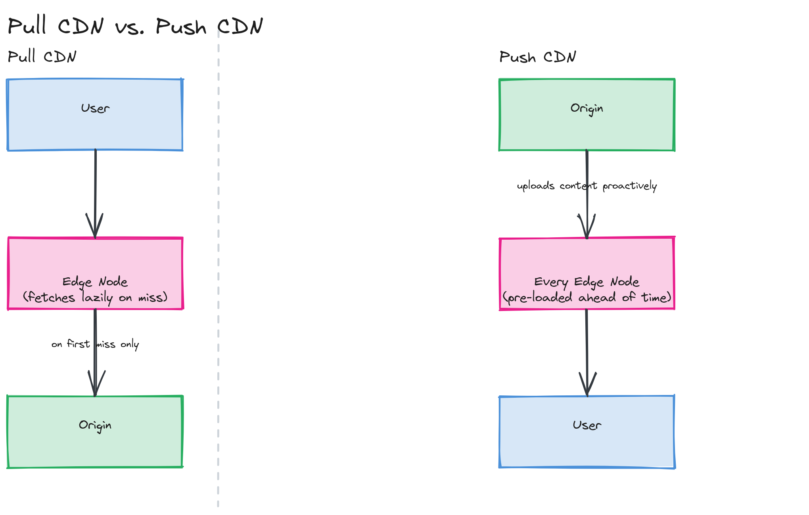
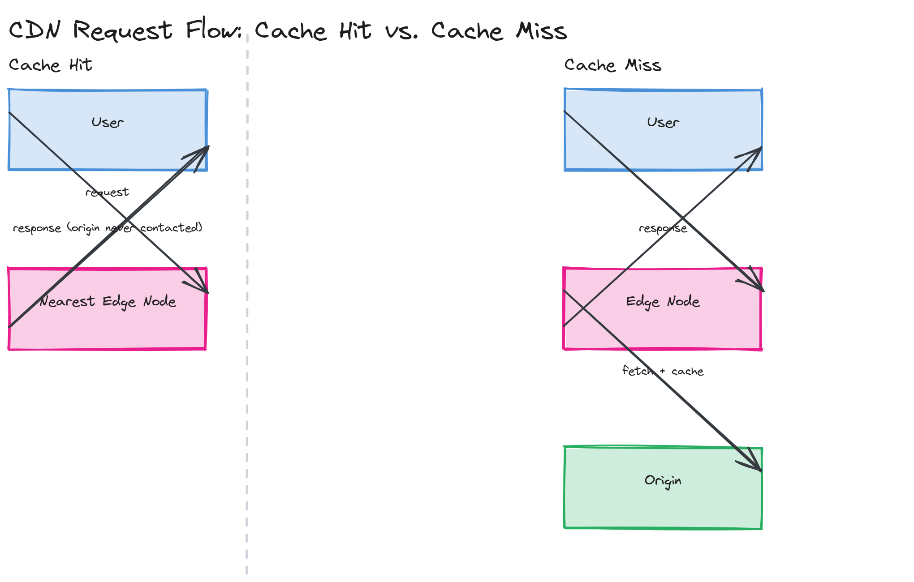
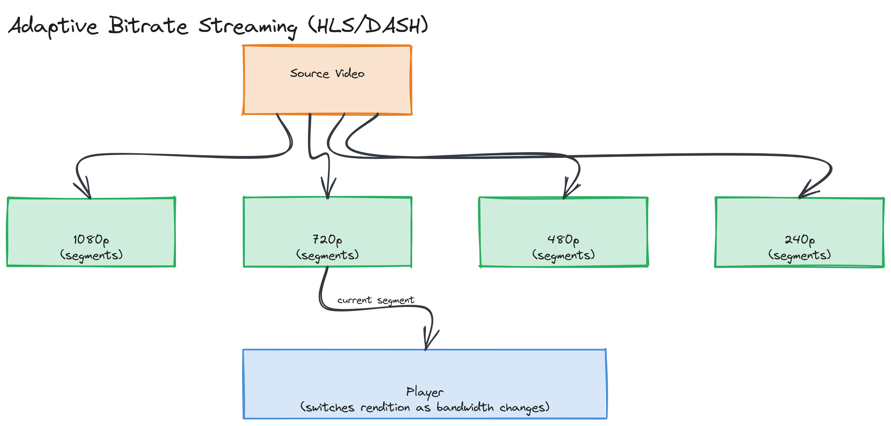

# Module 10 — Concepts: Content Delivery Networks (CDNs)

## Why This Matters

A user in Sydney requesting a product image from an origin server in Virginia pays roughly 200ms of round-trip latency before a single byte arrives — physics, not bad engineering. Multiply that by dozens of assets on a page, or by millions of concurrent video viewers, and "where is the server" stops being a deployment detail and becomes the dominant factor in how fast your product feels and whether your origin survives the load. A CDN solves this by moving copies of your content to servers physically close to your users, all over the world, so most requests never have to cross an ocean at all. It's the reason a video on YouTube starts playing in under a second regardless of which continent you're on.

---

## What Is a CDN?

A **Content Delivery Network** is a geographically distributed network of servers that cache and serve content on behalf of an **origin server** — the system that owns the canonical, authoritative copy of the data.

- **Origin server** — your application server or object store (e.g., an S3 bucket, built on the object storage concepts from [Module 09](../../module-09-storage/)) — the source of truth.
- **Edge node** — a CDN server that holds a cached copy of content and serves it directly to nearby users, avoiding a trip to the origin.
- **Point of Presence (PoP)** — a physical data center location housing one or more edge nodes. Large CDN providers operate hundreds of PoPs worldwide; a request from a user in Mumbai might be served from a PoP in Mumbai rather than wherever the origin happens to live.

> 💡 **Note:** "CDN" is often shorthand for "a network that caches static files," but modern CDNs also accelerate *dynamic* content (by keeping persistent, optimized connections to the origin) and run arbitrary code at the edge — covered in the [deep dive](../../module-10-cdn/02-deep-dive/README.md).

---

## How CDN Routing Works

The hardest problem a CDN solves invisibly is: *of hundreds of PoPs, which one should serve this particular user?* Three mechanisms, often combined, answer this:

- **Anycast** — the same IP address is announced from every PoP; BGP (the protocol routers use to exchange reachability information) delivers each user's packets to whichever announcement is topologically nearest, with zero per-request decision-making. This is the same Anycast concept introduced in [Module 02's networking deep dive](../../module-02-networking/02-deep-dive/README.md#anycast-routing) — a CDN is one of its two textbook real-world applications (the other being DDoS mitigation, covered later in this module).
- **GeoDNS** — instead of routing at the IP layer, the DNS server resolves a hostname to a *different* IP address depending on the resolver's geographic location, steering the user toward a nearby PoP before a packet is even sent. [Module 02](../../module-02-networking/01-concepts/README.md) covers the DNS resolution mechanics this builds on.
- **BGP Anycast in practice** — large CDNs combine both: Anycast gets a request to a *region*, and the receiving PoP (or a layer in front of it) can still redirect or proxy to a better-suited node if the nearest Anycast hop isn't the best choice for that specific request (e.g., due to transient congestion).

> 🎯 **Interview Tip:** If asked "how does a CDN know which server is closest to me," naming Anycast specifically (not just "magic geo-routing") signals you understand the network layer, not just the product behavior. Mentioning that this is the *same* mechanism used for DDoS mitigation is a strong follow-up.

---

## Push vs. Pull CDNs

| Model | How It Works | Best For |
|---|---|---|
| **Pull (origin-pull)** | The CDN fetches content from the origin lazily, on the first request for a given URL, then caches it for subsequent requests | The overwhelming default — low operational overhead, the CDN only ever stores what's actually being requested |
| **Push** | You proactively upload content to the CDN ahead of time, before any user requests it | Content you know in advance needs to be available instantly everywhere with zero "first request is slow" penalty — e.g., a software release artifact or a high-profile video premiere |

*Pull CDN behavior (edge node fetches from origin lazily on first miss, then serves subsequent requests from cache) side-by-side with push CDN behavior (content uploaded directly to every edge node ahead of any user request).*

> ⚠️ **Warning:** Pull CDNs mean the *first* request for any given asset after a cache miss (or after the edge cache expires) is slower — it has to round-trip to the origin. This is rarely a problem in practice because popular assets stay warm, but it's worth naming as a trade-off rather than presenting pull CDNs as strictly superior.

---

## CDN Caching

CDNs decide what to cache and for how long primarily through HTTP headers set by the origin:

- **`Cache-Control`** — the primary directive. `max-age=3600` tells the CDN (and browsers) this response is fresh for one hour. `public` allows shared caches (CDNs) to store it; `private` restricts caching to the end user's browser only. `no-store` forbids caching entirely.
- **TTL (Time-To-Live)** — the practical lifetime of a cached object, usually derived from `max-age`. After it expires, the next request triggers revalidation or a full re-fetch from the origin.
- **`Vary` header** — tells caches that the response differs based on a specific request header (commonly `Vary: Accept-Encoding` or `Vary: Accept-Language`), so the CDN must cache *separate* copies per distinct value of that header rather than serving one cached response to everyone.
- **`stale-while-revalidate`** — an extension that lets the CDN serve a *stale* cached copy immediately while it asynchronously re-fetches a fresh one in the background, trading a small staleness window for the user never waiting on a cache-miss round trip at all.

*A cache hit (user → nearest edge node → response, origin never contacted) side-by-side with a cache miss (user → edge node → origin → edge node caches and returns response) — illustrating why hit rate dominates perceived latency.*

> 💡 **Note:** This is the same fundamental caching theory from [Module 05](../../module-05-caching/01-concepts/README.md) — TTL, eviction, freshness — applied one network hop closer to the user instead of in front of a database.

---

## CDN Cache Invalidation

Because CDN edge nodes are numerous and geographically distributed, "delete this from the cache" is a harder problem than invalidating a single Redis key:

- **Purging** — explicitly telling the CDN to evict a specific URL (or a wildcard pattern) from every edge node immediately. Effective but can be slow at scale (propagating to hundreds of PoPs) and is rate-limited by most providers.
- **Surrogate keys (cache tags)** — tag cached responses with one or more logical labels at write time (e.g., `product-1234`), then purge by tag instead of by URL. One purge call invalidates every cached page, image, and API response associated with that product, even across many different URLs.
- **Versioned URLs** — embed a version or content hash into the asset's URL itself (`app.a1b2c3.js` instead of `app.js`). A new deploy simply references a new URL; the old URL's cached copy ages out naturally instead of being explicitly invalidated. This sidesteps invalidation entirely and is the dominant pattern for static build assets.

> ⚠️ **Warning:** Purging is not instantaneous globally — treat "purge" as "eventually evicted everywhere," not "everyone sees the new version within milliseconds." Versioned URLs avoid this uncertainty entirely for content that's safe to version, which is why most production static-asset pipelines prefer them over relying on purges.

---

## CDN Use Cases

- **Static assets** — JS/CSS bundles, images, fonts: the original and still most common CDN use case, almost always paired with versioned URLs and long TTLs (`max-age=31536000, immutable`).
- **Images** — often served through an image-specific CDN tier that also resizes/transcodes on the fly (e.g., serving WebP to supporting browsers via the `Vary` header), caching each derived variant separately.
- **Video** — two delivery modes: **progressive download** (a single file streamed sequentially, simple but no quality adaptation) and **adaptive streaming** (HLS/DASH), where video is pre-encoded into multiple quality "renditions" and split into short segments, letting a player switch quality mid-stream as bandwidth changes. Covered in depth in the [deep dive](../../module-10-cdn/02-deep-dive/README.md).
- **APIs** — even highly dynamic API responses can sometimes be cached for short TTLs (seconds, not hours) at the edge, absorbing traffic spikes without the origin ever seeing the duplicate requests; this only works for responses that are safe to be briefly stale and don't vary per-user in ways that defeat caching.

*A video pre-encoded into multiple bitrate renditions (1080p–240p), each split into short segments, with a player switching renditions mid-playback as its measured bandwidth changes.*

---

## Key Takeaways

- A CDN's core trick is geographic proximity: caching content at edge nodes near users so most requests never reach the origin at all.
- Anycast and GeoDNS solve "which PoP should serve this user" at the network and DNS layers respectively, building directly on Module 02's networking fundamentals.
- Pull CDNs (lazy, low-overhead) are the default; push CDNs trade upload effort for guaranteed instant availability of specific content.
- `Cache-Control`, `Vary`, and `stale-while-revalidate` together control what gets cached, how long, and how staleness is tolerated.
- Versioned URLs sidestep invalidation entirely for static assets; surrogate keys make invalidation tractable for dynamic content tied to a changing entity.
