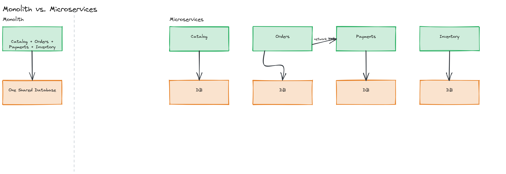
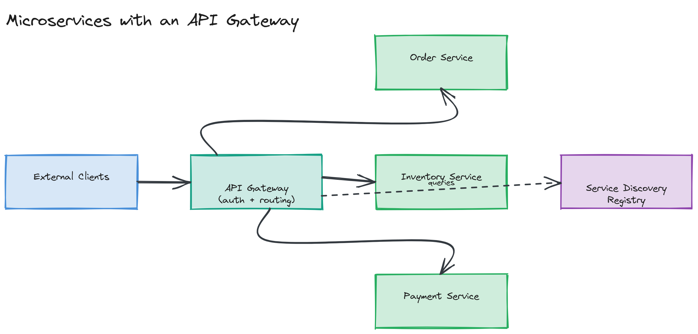

# Module 11 — Concepts: Microservices Architecture

## Why This Matters

A monolithic checkout service that takes 20 minutes to deploy because the entire e-commerce platform redeploys with it is a problem every growing engineering org eventually hits: one team's risky change blocks every other team's safe one, a memory leak in the recommendations module can take down checkout, and "the database" becomes a shared dependency nobody can safely change alone. Microservices exist to let teams ship independently and isolate failure — but they don't make complexity disappear, they relocate it from inside one process to the network between many. Understanding that trade-off precisely, instead of treating microservices as an unconditional best practice, is the point of this module.

---

## Monolith vs. SOA vs. Microservices

These three terms get used loosely; here are the real definitions.

- **Monolith** — a single deployable unit containing all of an application's functionality (UI, business logic, data access) in one codebase, one process, one deployment. Internal calls are in-process function calls. A monolith is not inherently bad — it's the right default for most systems, especially early on, because there's no network between components.
- **SOA (Service-Oriented Architecture)** — an earlier industry attempt at decomposition: independently deployable services, but typically coarse-grained, often sharing a database, and usually integrated through a centralized **Enterprise Service Bus (ESB)** that handled routing, transformation, and orchestration. The ESB itself often became a complex, centrally-owned bottleneck — the exact problem SOA was trying to avoid, just relocated.
- **Microservices** — independently deployable services, each owning its own data store, decomposed around business capabilities rather than technical layers, communicating over lightweight protocols (HTTP/REST, gRPC, or async messaging) with no shared central integration broker. The defining property isn't "small" — it's **independent deployability with no shared database**.

> 💡 **Note:** The single most important technical difference between SOA and microservices isn't size — it's data ownership. SOA services frequently shared a database; microservices treat "exclusive ownership of your own data" as close to a hard rule, because a shared database re-couples services that the network boundary was supposed to decouple.

---

## Benefits of Microservices

- **Independent deployability** — a team can ship a change to the payments service without coordinating a release with the catalog team, as long as the API contract between them doesn't break.
- **Team autonomy** — each service can be owned end-to-end by a small team, who choose their own release cadence and internal design decisions.
- **Technology flexibility (polyglot)** — the recommendations service can be Python with a model-serving stack while the order service is a strongly-typed Java/Kotlin service, because each is its own deployable process with its own runtime.
- **Fault isolation** — if the recommendations service crashes or runs out of memory, checkout can still function (assuming it doesn't synchronously depend on recommendations on the critical path) — failure is contained to a service boundary instead of taking down the whole process.

---

## Costs of Microservices

- **Network overhead** — what was an in-process function call becomes a network call: serialization, latency, and a whole new category of failure (the call can simply not come back) that a monolith never has to handle.
- **Distributed systems complexity** — you now need service discovery, distributed tracing, retries with backoff, idempotency, and an answer for partial failure (Module 12 covers this in depth).
- **Operational burden** — many more deployable units means many more things to monitor, deploy, version, and keep available; this is why microservices and container orchestration (Kubernetes) tend to appear together.
- **Data consistency challenges** — a transaction that used to be a single ACID database transaction across tables now spans multiple services with separate databases, and distributed transactions are fundamentally harder (covered in depth in [02-deep-dive](../02-deep-dive/README.md)).

> ⚠️ **Warning:** "We'll just split it into microservices" is not a free performance or scalability upgrade. A poorly decomposed set of microservices — one with chatty synchronous calls across many tightly-coupled services — can be *slower and less reliable* than the monolith it replaced, because every monolith function call became a network round trip with its own failure mode.

---

## When to Use Microservices (and When Not To)

**Use microservices when:** the organization is large enough that team coordination, not technical execution, is the bottleneck; different parts of the system have genuinely different scaling or technology needs; and you can afford the operational investment (CI/CD per service, observability, service discovery) that makes many independent deployables manageable.

**Don't reach for microservices when:** the team is small (a handful of engineers don't need organizational boundaries enforced by network boundaries); the domain boundaries aren't well understood yet (premature decomposition along the wrong boundaries is expensive to undo); or the system's actual bottleneck is something microservices don't fix (e.g., a single slow query — that's a [caching](../../module-05-caching/) or [database](../../module-04-databases/) problem, not an architecture problem).

> 🎯 **Interview Tip:** A strong interview answer to "would you use microservices here?" never says yes or no unconditionally — it names the actual forcing function (team scale, independent scaling needs, or technology heterogeneity) that would justify the operational cost, and explicitly says when a modular monolith would be the better starting point.

---

## Service Decomposition Strategies

How do you actually draw the service boundaries?

1. **By business capability** — decompose around what the business does (Order Management, Inventory, Payments, Shipping), not around technical layers (no "the database service" or "the validation service"). Each resulting service should be independently meaningful to someone outside engineering.
2. **By subdomain (Domain-Driven Design)** — identify **bounded contexts**: areas of the domain where a specific model and vocabulary apply consistently. "Product" means something subtly different to Catalog (description, images) than to Inventory (SKU, stock count) — DDD says these should likely be separate services, each with its own model of "Product," instead of one shared, increasingly bloated entity.
3. **By team (Conway's Law)** — "organizations design systems that mirror their own communication structure." Two teams that must constantly coordinate to ship a change end up coupled along that same line regardless of the diagram, so deliberately aligning service boundaries with team boundaries (the "Inverse Conway Maneuver") makes the architecture match the organization on purpose instead of by accident.

*A single monolithic deployable containing Catalog, Orders, Payments, and Inventory modules sharing one database, next to the same four capabilities as independently deployable services each with its own database, communicating over the network.*

---

## Service Communication: Synchronous vs. Asynchronous

- **Synchronous (REST/gRPC)** — the caller sends a request and blocks waiting for a response. Simple to reason about, but couples the caller's availability to the callee's: if the callee is slow or down, the caller is stuck too, unless explicitly guarded against (timeouts, circuit breakers — see [02-deep-dive](../02-deep-dive/README.md)). gRPC adds a strongly-typed contract (Protocol Buffers) and HTTP/2 multiplexing, trading human-readability for performance versus plain REST/JSON.
- **Asynchronous (events)** — the caller publishes an event (via a [message queue](../../module-08-message-queues/), e.g., "OrderPlaced") and continues immediately; one or more services consume it whenever they're ready. This decouples availability at the cost of giving up an immediate response and adding eventual-consistency reasoning.

> 🎯 **Interview Tip:** When asked to justify sync vs. async for a specific interaction, the deciding question is "does the caller need the result right now to proceed?" A payment authorization the user is waiting on is synchronous; "send a confirmation email after the order is placed" is async.

---

## Service Discovery

In a system with many service instances that scale up/down and get rescheduled (especially under Kubernetes), nothing has a fixed, predictable address — so a caller needs a way to find a healthy instance to call.

- **Client-side discovery (e.g., Netflix Eureka)** — services register themselves with a registry on startup and send periodic heartbeats; the registry prunes instances that stop heartbeating. The *calling* service queries the registry directly and picks an instance itself. [`examples/service-registry.ts`](./examples/service-registry.ts) in this module simulates exactly this.
- **Server-side discovery (e.g., HashiCorp Consul, or a load balancer in front of a registry)** — the caller always calls a fixed address; that intermediary queries the registry and forwards the request, so the caller never talks to the registry directly.
- **DNS-based discovery** — the registry is exposed as a DNS service (this is how Kubernetes Services work internally) — a caller resolves a stable DNS name and gets back a currently-healthy backend's address, with no separate discovery client library needed.

---

## API Gateway in a Microservices Context

An **API gateway** is the single entry point external clients talk to, sitting in front of the whole constellation of internal services. It commonly handles: request routing to the correct backend service, authentication/authorization, rate limiting, response aggregation (combining calls to multiple services into one client-facing response), and protocol translation (e.g., external REST/JSON to internal gRPC). This matters specifically in microservices because without it, every client would need to know about, authenticate against, and call N internal services directly — the gateway hides that internal topology and lets it change without breaking clients.

*External clients calling a single API gateway, which authenticates and routes requests to Order, Inventory, and Payment services, each registered in a service discovery registry the gateway queries.*

---

## Key Takeaways

- The line between SOA and microservices is mainly about data ownership and the absence of a centralized ESB — microservices each own their own database.
- Microservices trade a monolith's deployment bottleneck for network calls, partial failure, and cross-service data consistency — never present them as a free upgrade.
- Decompose around business capability and DDD bounded contexts, and deliberately align with team structure (Conway's Law) rather than fighting it.
- Choose synchronous communication when the caller needs the result to proceed now; choose asynchronous events when it doesn't.
- Service discovery (client-side, server-side, or DNS-based) and an API gateway are the infrastructure that makes "many independently deployable services" actually callable in practice.
