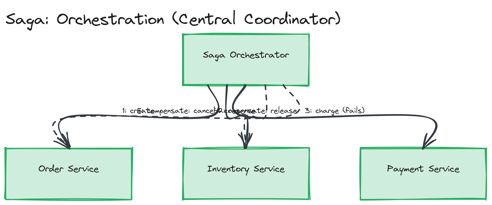

# Design Challenge 02 — Solution: Design the Saga for an E-Commerce Order

## Choreography or Orchestration?

**Orchestration.** This saga only has three steps today, where choreography would still be viable — but I'd choose orchestration anyway because (a) checkout is the single highest-stakes flow in the whole system, where being able to look at one orchestrator's state machine and answer "why didn't this order ship?" without reconstructing a timeline across three services' logs is worth the extra coupling, and (b) this flow is very likely to grow more steps over time (fraud check, tax calculation, loyalty points) and orchestration scales better as steps are added — choreography's implicit, spread-out coordination logic gets harder to reason about with every new event subscriber, exactly as described in [02-deep-dive](../../02-deep-dive/README.md#choreography-vs-orchestration).

*The Saga Orchestrator's sequential calls to Order, Inventory, and Payment, and the reverse-order compensating calls triggered when Payment fails.*

## Happy Path

1. Orchestrator calls **Order service**: create order, status `PENDING`.
2. Orchestrator calls **Inventory service**: reserve stock for the order's line items. Inventory decrements available stock and records a reservation tied to the order ID.
3. Orchestrator calls **Payment service**: charge the customer for the order total.
4. On success, orchestrator calls **Order service** again: mark order `CONFIRMED`.

## Failure and Compensation Sequence

Payment fails at step 3, after Inventory has already committed its reservation at step 2.

1. **Payment service returns failure** (card declined / provider timeout) to the orchestrator — this is a direct synchronous response, not something the orchestrator has to detect via timeout/polling, since Payment is called synchronously.
2. **Orchestrator initiates compensation, in reverse order of completed steps:**
   - **Compensate Inventory first** (most recently completed step): orchestrator calls Inventory's `releaseStock` for this order's reservation. Inventory looks up the reservation by order ID, adds the reserved quantity back to available stock, and deletes the reservation record. This is itself just a normal local transaction inside Inventory's own database — no distributed lock involved.
   - **Compensate Order last**: orchestrator calls Order's `cancelOrder`. Order transitions the order's status from `PENDING` to `CANCELLED`.
3. **Payment itself needs no compensation** — it never successfully charged the customer, so there's nothing to undo on the payment side. (If a charge succeeds but a *later* step fails, compensating Payment would mean issuing a refund — not needed in this scenario.)

This exact sequence is implemented and run end-to-end in [`../../02-deep-dive/examples/saga-pattern.ts`](../../02-deep-dive/examples/saga-pattern.ts), which logs each step and compensation as they execute.

## What If the Compensation Itself Fails?

This is a fundamentally harder problem than the original failure, because **the orchestrator can no longer simply "try the next thing"** — there is no further fallback once a compensation fails; the system is now in a state nothing in the saga's own logic can resolve. The standard answer: retry the compensating call with backoff (network blips and timeouts are often transient), and if it still doesn't succeed after a bounded number of retries, **stop retrying automatically and escalate** — write the failed compensation to a dead-letter queue or an explicit "needs manual intervention" record, and alert an on-call engineer, rather than looping forever or silently giving up. The order should be left in a clearly-flagged state (e.g., `COMPENSATION_FAILED`, not silently `CANCELLED`) so it's visibly distinguishable from a cleanly-compensated order — pretending compensation succeeded when it didn't would hide a real inventory discrepancy from anyone looking at the system.

> ⚠️ **Warning:** A saga's compensations are not guaranteed to succeed just because they're "supposed to undo" something — they are themselves ordinary calls to a service that can be down, slow, or timing out, just like the original call. Treat compensation failure as a distinct, must-handle case in any saga design; "the compensation will work" is an assumption, not a guarantee.

## Customer-Facing Consistency Model

The customer sees `PENDING` (or a "processing your order" state) from the moment checkout is submitted until the orchestrator reaches a terminal outcome — either `CONFIRMED` or `CANCELLED`. There is a real window (the time between Inventory's reservation and Payment's response) where, if anyone could inspect Inventory directly, stock would appear reduced for an order not yet guaranteed to succeed — but because the customer-facing status comes from Order's state machine, not from Inventory directly, the customer never sees a misleading "confirmed" claim; they correctly see "processing" throughout. This is precisely why the **API gateway only exposes Order's status**, never Inventory's internal reservation state, as the source of truth for the customer (see [API gateway](../../01-concepts/README.md#api-gateway-in-a-microservices-context)).

## Trade-off Accepted

| Decision | Choice | Trade-off |
|---|---|---|
| Coordination style | Orchestration over choreography | Order service (or a dedicated orchestrator) is now coupled to knowing about Inventory and Payment's APIs explicitly, and is a more central point of failure for the checkout flow — accepted in exchange for centralized visibility into saga state and straightforward debugging, which matters more for checkout than for a less critical flow |
