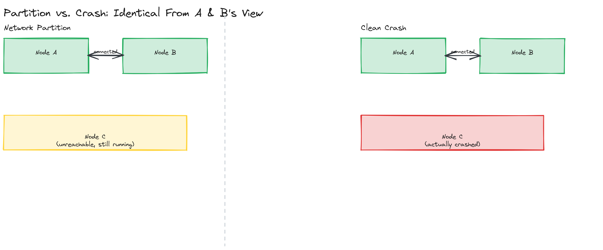
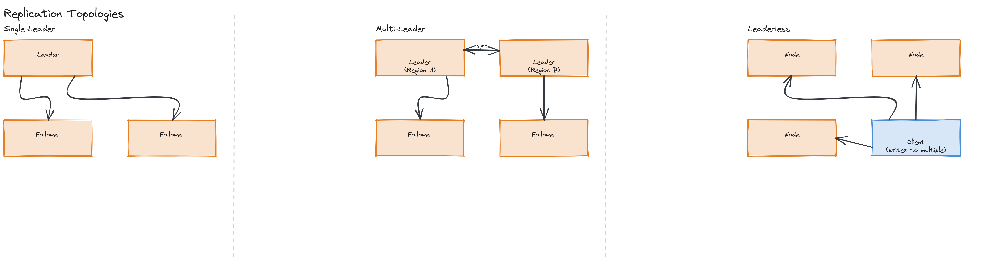

# Module 12 — Concepts: Distributed Systems Fundamentals

## Why This Matters

A single machine either works or it doesn't — when it crashes, every part of your program crashes with it, and you find out immediately. The moment you split that program across multiple machines connected by a network, you lose that simplicity forever. A request can fail because the remote machine crashed, or because the network dropped the packet, or because the machine is fine but slow, or because the response was sent but lost on the way back — and from where you're standing, **these all look identical**: silence. This single fact — that you cannot reliably distinguish "it failed" from "it's just slow" — is the root of almost every hard problem in this module, and it's why "just add more servers" is the easy part of system design while "make those servers agree on anything" is the hard part.

This isn't academic. Every system you've studied so far in this repository — load balancers picking healthy backends ([Module 07](../../module-07-load-balancing/)), message queues redelivering messages ([Module 08](../../module-08-message-queues/)), microservices calling each other over the network ([Module 11](../../module-11-microservices/)) — is quietly built on top of the problems this module names explicitly.

---

## Why Distributed Systems Are Hard

Three properties make a distributed system categorically harder to reason about than a single process, even one that's heavily multi-threaded:

### Partial Failure

In a single process, if something goes wrong, *everything* goes wrong — the whole process dies, and every caller finds out. In a distributed system, **some** nodes can fail while others keep running perfectly. Your code now has to handle a world where node A is up, node B is down, and node C is up but unreachable from A due to a network issue — simultaneously, for the same request. There is no "the system is down" anymore, only "parts of the system are down, and I'm not always sure which parts."

> 💡 **Note:** Leslie Lamport's famous (only half-joking) definition: "A distributed system is one in which the failure of a computer you didn't even know existed can render your own computer unusable." Partial failure isn't an edge case to handle later — it's the default condition you design for from the start.

### No Global Clock

On one machine, you can timestamp two events and trust their order — `event A at t=1`, `event B at t=2` means A happened first. Across machines, each with its own physical clock drifting independently, this guarantee evaporates. Two events on different machines can have timestamps that *disagree* with the order they actually happened in, because the clocks themselves disagree about what time it is. This is why distributed systems lean on **logical clocks** (covered in the [deep dive](../../module-12-distributed-systems/02-deep-dive/)) instead of trusting wall-clock time for ordering.

### Network Unreliability

Networks drop packets, duplicate packets, reorder packets, and delay packets by wildly unpredictable amounts. A message you sent might arrive instantly, arrive ten seconds late, arrive twice, or never arrive at all — and your system has no built-in way to tell which of these happened just by waiting. Timeouts are a heuristic guess, not a fact: a timeout means "I didn't hear back in time," not "the other side failed."

---

## The 8 Fallacies of Distributed Computing

In the early-to-mid 1990s, Peter Deutsch (later joined by James Gosling) at Sun Microsystems catalogued the assumptions engineers kept making that don't hold once a system is distributed. They remain exactly as true today as they were then:

1. **The network is reliable.** It isn't — packets get dropped, links go down, hardware fails.
2. **Latency is zero.** It isn't — even a same-datacenter round trip takes real, non-negligible time, and a cross-region call can take hundreds of milliseconds.
3. **Bandwidth is infinite.** It isn't — large payloads and high request volume can saturate a link.
4. **The network is secure.** It isn't — assume the network is hostile unless you've explicitly secured it.
5. **Topology doesn't change.** It does — nodes are added, removed, and rerouted around constantly, especially in cloud/autoscaled environments.
6. **There is one administrator.** There isn't — large systems span teams, organizations, and sometimes companies, each with different priorities.
7. **Transport cost is zero.** It isn't — serialization, connection setup, and data transfer all cost real time and money.
8. **The network is homogeneous.** It isn't — different hardware, protocols, and software versions coexist and must interoperate.

> ⚠️ **Warning:** Almost every one of these fallacies sounds obviously false when you read it in a list — yet engineers re-commit all eight, one at a time, the first time they write code that calls a remote service without a timeout, retry policy, or backpressure plan. Knowing the list isn't the hard part; remembering it under deadline pressure is.

> 🎯 **Interview Tip:** If an interviewer asks "what makes distributed systems hard," naming 2-3 of these fallacies with a concrete consequence ("latency isn't zero, so a chain of 5 synchronous service calls compounds tail latency — this is why Module 11 covers async communication") demonstrates real understanding, not memorization.

---

## Types of Failures

Not all failures are equal, and the type of failure a system must tolerate determines which protocols are even possible:

| Failure Type | What Happens | Example |
|---|---|---|
| **Crash failure** | A node stops entirely and never responds again | A server process is OOM-killed |
| **Omission failure** | A node sometimes fails to send or receive a message, but is otherwise functioning | A network blip drops a single request or response |
| **Byzantine failure** | A node behaves arbitrarily — sending incorrect, contradictory, or even malicious responses, while appearing to function | A compromised node, faulty hardware corrupting data, or a buggy node sending different answers to different peers |

Crash failures are the easiest to design around — a node is either fully present or fully absent, and once it's gone, it stays gone (in the simplest "fail-stop" model). Omission failures are harder because the same node might respond fine to the next request. Byzantine failures are the hardest by far, because the system can't even trust that a *responding* node is telling the truth — this is the failure model that drove the design of blockchain consensus protocols and is why "Byzantine fault tolerant" systems (tolerating up to f malicious nodes among 3f+1 total) are dramatically more complex and expensive than crash-fault-tolerant ones.

> 💡 **Note:** Most everyday business systems design only for crash and omission failures — assuming nodes are buggy or unlucky, never malicious. Byzantine fault tolerance is reserved for adversarial environments: blockchains, multi-party systems with no mutual trust, or safety-critical aerospace systems.

---

## Network Partitions

A **network partition** ("split brain") occurs when the network splits the cluster into two or more groups that can each talk internally but not to each other — node A and B can reach each other, but neither can reach node C, even though all three are otherwise healthy. From inside partition {A, B}, node C looks crashed. From inside partition {C}, nodes A and B look crashed. Nobody is actually down — the network itself is broken.

Partitions matter because they force an explicit choice that the CAP theorem makes famous (full treatment in [Module 13](../../module-13-consistency-consensus/)): during a partition, do you keep accepting writes on both sides (risking inconsistent data once they reconnect) or refuse writes on the minority side (sacrificing availability to preserve consistency)? There's no version of "just don't have this problem" — partitions are a physical-network reality, not a design oversight.

*A 3-node cluster experiencing a network partition that splits it into {A, B} and {C}, contrasted side-by-side with a clean crash failure of node C — illustrating why the two situations look identical from A and B's perspective but require different system responses.*

---

## Replication

**Why replicate?** Two independent reasons, often both at once: **fault tolerance** (if one copy of the data is lost, others survive) and **performance** (spreading read load across multiple copies, and placing copies closer to users geographically). The cost is the same in both cases — now you have multiple copies of the same data that can, even briefly, disagree with each other, and you need a strategy for how writes propagate and how disagreements are resolved.

### Single-Leader Replication

One node (the leader/primary) accepts all writes; the rest (followers/replicas) replicate the leader's write stream and serve reads. This is the most common setup (it's what most relational databases do by default — see [Module 04](../../module-04-databases/)).

- **Pro:** Simple to reason about — there's one source of truth for write ordering, so conflicts during normal operation are essentially impossible.
- **Con:** The leader is a write bottleneck and a single point of failure for writes; promoting a new leader after a failure requires **leader election** (below), and there's a window during failover where writes are unavailable.

### Multi-Leader Replication

Multiple nodes (often one per datacenter) each accept writes and replicate to each other.

- **Pro:** Each region can write locally with low latency, and the system tolerates a single region going down without losing write availability elsewhere.
- **Con:** Two leaders can accept conflicting writes to the same record at nearly the same time — now the system needs a conflict resolution strategy (last-write-wins, custom merge logic, or surfacing the conflict to the application).

### Leaderless Replication

Any node can accept a write directly from a client, which then propagates the write to other replicas (often via the [gossip protocols](../../module-12-distributed-systems/02-deep-dive/) covered in the deep dive). Made mainstream by Amazon's Dynamo and used in Cassandra and Riak.

- **Pro:** No single leader means no single point of failure for writes at all, and the system stays writable even if several nodes are down, as long as enough remain reachable.
- **Con:** Without a leader to impose ordering, the system needs **quorums** (deep dive) and conflict resolution to give clients a coherent view, and "did my write actually take effect everywhere" becomes a genuinely harder question to answer.

> 🎯 **Interview Tip:** When asked to pick a replication strategy, the right answer is rarely "leaderless is most resilient so always use it" — it's naming the actual trade-off. Single-leader is the right default for most systems needing strong consistency with acceptable write throughput; multi-leader fits multi-region write-heavy systems that can tolerate occasional conflict resolution; leaderless fits systems prioritizing availability above all else (Dynamo's original use case: the shopping cart must always accept a write, even mid-partition).

*Three side-by-side topologies: single-leader (one leader, arrows fanning out to followers), multi-leader (two leaders in different regions, syncing with each other while each fans out locally), and leaderless (a client writing directly to multiple equal nodes).*

---

## Leader Election

Single-leader replication raises an immediate question: when the leader crashes, how does the cluster agree on a *new* leader, quickly and without ending up with two nodes both believing they're the leader (a "split brain" leadership conflict, distinct from but related to the network-partition split brain above)?

At a basic level, leader election protocols rely on:
- **Heartbeats / timeouts** — followers expect periodic "I'm alive" signals from the leader; if a follower doesn't hear one within a timeout window, it suspects the leader is gone and triggers an election.
- **A majority vote** — a candidate node requests votes from peers and needs a **majority** (not just "some") to become leader, which is what prevents two simultaneous leaders: two different candidates cannot both win a majority of the same fixed set of voters.
- **Terms/epochs** — each election increments a term number, so stale messages from a deposed former leader (or a slow message that arrives late) can be identified and ignored because they carry an old term.

The mechanics of how a majority vote is actually reached safely (handling split votes, network delays during the election itself) is the subject of consensus algorithms like Raft and Paxos, covered in depth in [Module 13 — Consistency, Consensus & CAP Theorem](../../module-13-consistency-consensus/). This module's [coding and design exercises](../04-exercises/) work with the basic heartbeat/timeout/majority-vote mechanics directly so the Module 13 algorithms build on something you've already implemented by hand.

> ⚠️ **Warning:** A common but incomplete mental model is "the leader's heartbeat stops, so a new leader is elected, problem solved." The genuinely hard part is what happens when the *old* leader wasn't actually dead — just slow, or on the other side of a network partition — and comes back believing it's still in charge while a new leader has already been elected. Terms/epochs and majority quorums exist specifically to make the cluster able to reject the stale leader's messages once this happens.

---

## Key Takeaways

- Partial failure, the absence of a global clock, and network unreliability are the three structural reasons distributed systems are harder to reason about than single-process systems — not incidental complexity, but the defining condition.
- Peter Deutsch's 8 fallacies name the false assumptions ("the network is reliable," "latency is zero," etc.) that engineers keep re-making under deadline pressure; naming them explicitly is a strong interview signal.
- Crash, omission, and Byzantine failures require progressively more expensive protocols to tolerate — most business systems only need to handle the first two.
- Replication trades simplicity (single-leader) against multi-region write availability (multi-leader) against maximum write availability with weaker default consistency (leaderless) — there is no universally "best" topology.
- Leader election relies on heartbeats/timeouts to detect a missing leader and majority votes with terms/epochs to prevent two nodes from both believing they're in charge, especially when a partition (not a crash) is the real cause.
