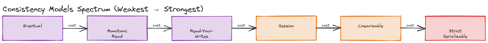
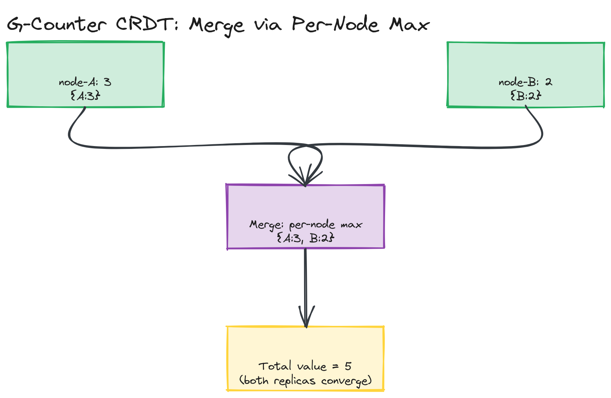
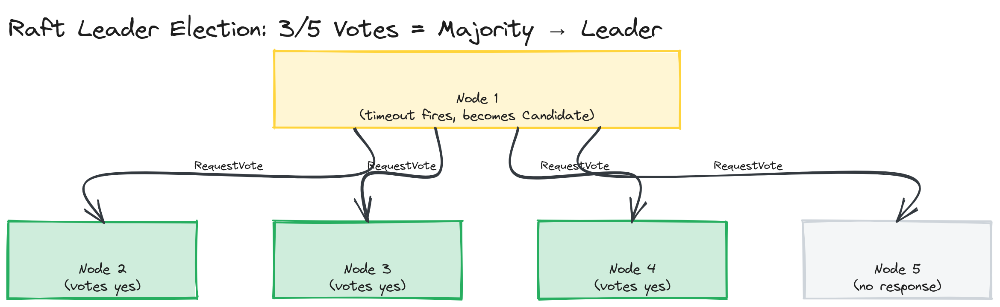
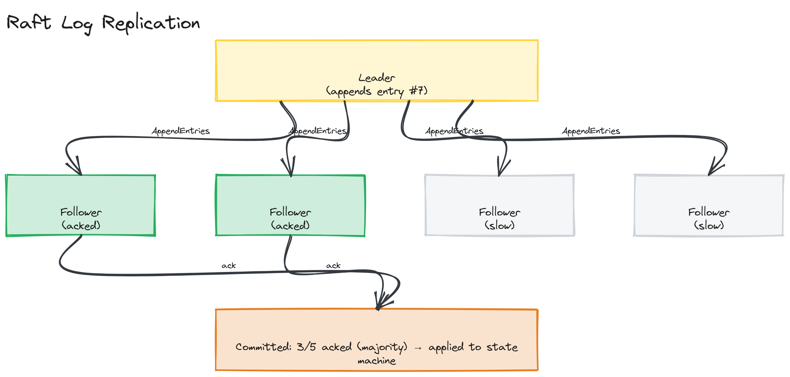

# Module 13 — Deep Dive: Consistency Models, CRDTs, and Consensus

## Why This Matters

"Eventual consistency" and "strong consistency" are not the only two options — they're two points on a much longer spectrum, and picking the wrong point either wastes latency budget you didn't need to spend or silently introduces bugs your team won't find until production. This deep dive maps that spectrum precisely, then goes one level deeper into the two mechanisms that make the weak and strong ends actually work: CRDTs (how you stay available *and* still converge to a correct answer) and consensus algorithms like Raft (how a cluster agrees on one truth without a single point of failure).

---

## The Consistency Models Spectrum

From weakest (most available, least coordination) to strongest (least available, most coordination):

| Model | Guarantee | Cost |
|---|---|---|
| **Eventual consistency** | If writes stop, all replicas *will* converge to the same value — eventually, with no bound on how long | Cheapest; readers can see any past value, including stale or out-of-order ones |
| **Monotonic reads** | Once you've read a value, you'll never read an *older* value on a subsequent read | Requires routing a client's reads to a replica at least as fresh as what it already saw |
| **Read-your-writes** | After you write a value, your own subsequent reads will see that write (or newer) | Requires routing your reads to a replica that has your write, or tracking write versions per-client |
| **Session consistency** | Read-your-writes and monotonic reads guaranteed *within a single client session*, no guarantee across sessions | A practical, common middle ground — strong enough for "did my own edit save?" UX |
| **Linearizability** | Every operation appears to happen instantaneously at some single point in time, consistent with real-world wall-clock order, for *all* clients | Requires coordination (often consensus) on every operation; the strongest single-object guarantee |
| **Strict serializability** | Linearizability extended to *multi-object transactions* — the combined effect of all transactions is equivalent to some serial (one-at-a-time) order, consistent with real time | The strongest practical guarantee; what systems like Spanner and CockroachDB advertise |

*A spectrum from "eventual" to "strict serializability," with coordination cost increasing alongside guarantee strength at every step.*

> 💡 **Note:** This spectrum is not just academic trivia — it's the precise vocabulary for what a database's consistency *setting* actually buys you. "Strong consistency" in a vendor's marketing copy could mean linearizability or could mean something weaker; knowing the spectrum lets you ask "which one, precisely?"

## Why Linearizability Is Expensive

Linearizability requires that once *any* client's write completes, *every* subsequent read from *any* client, anywhere, sees that write (or a later one) — there's no window where two clients can observe different, equally "current" answers. Enforcing this requires every operation to be ordered relative to every other operation across the whole system, which in practice means routing operations through a single point of coordination (a leader, or a consensus protocol run on every operation) so that an authoritative order can be established. That coordination point is inherently a latency cost (every operation may need a round trip to reach it, possibly across regions) and an availability risk (if it's unreachable, by CAP, you must choose to block rather than risk inconsistency). This is precisely the CP trade-off from [01-concepts](../01-concepts/README.md), now visible at the level of an individual consistency guarantee rather than a whole database's branding.

> 🎯 **Interview Tip:** If you propose linearizable reads/writes for every field in a system, expect to be asked to justify the latency cost for fields that don't need it. A strong answer scopes strong consistency to the few fields where it's load-bearing (e.g., an account balance, a unique username reservation) and uses weaker models everywhere else.

---

## Eventual Consistency in Practice

A system is eventually consistent if, given no new writes, all replicas converge to the same state. The practical questions are: how do replicas detect they disagree, and how do they decide which version wins?

- **Last-Write-Wins (LWW)** — attach a timestamp (or logical clock) to each write; on conflict, keep the write with the higher timestamp, discard the other. Simple and fast, but **silently discards data** — if two clients concurrently edit different fields of the "same" logical object and LWW operates at the whole-object granularity, one client's entire edit can vanish with no error raised to anyone.
- **Vector clocks** — each replica tracks a vector of per-replica counters, letting the system detect whether two versions are causally ordered (one is a strict descendant of the other — safe to resolve automatically) or truly **concurrent** (neither saw the other's write — a genuine conflict that needs an application-level resolution policy, such as showing the user both versions). Vector clocks tell you *that* there's a conflict; they don't resolve it for you.
- **CRDTs** — data structures specifically designed so that concurrent updates can always be merged automatically into a result everyone agrees on, with no conflict left for a human or application to resolve. Covered in depth below.

A worked example comparing LWW against a CRDT merge on the *same* concurrent-write scenario — making the data-loss difference concrete rather than theoretical — is in [`examples/lww-vs-crdt-merge.ts`](./examples/lww-vs-crdt-merge.ts).

> ⚠️ **Warning:** LWW's data loss is invisible by default — there's no error, no log line, nothing that tells either client their write was discarded. This is the single most common silent bug in systems that adopt "eventual consistency with LWW" without thinking through what concurrent writes to the same key actually look like for their specific data.

---

## CRDTs (Conflict-Free Replicated Data Types)

A CRDT is a data structure whose merge operation is mathematically guaranteed to be **commutative, associative, and idempotent** — meaning replicas can apply updates in any order, merge any number of times, and merge the same update twice, and they will all still converge to the identical correct result. This is what makes CRDTs compatible with an AP system: every replica can accept writes locally, independently, with zero coordination, and the merge logic itself guarantees eventual agreement — no consensus protocol required.

**Common CRDT types:**
- **G-Counter (grow-only counter)** — each replica tracks its own increment count; the total is the sum across replicas; merge takes the per-replica max. Built hands-on in [Coding Challenge 01](../04-exercises/coding-challenges/challenge-01/).
- **PN-Counter** — a G-Counter extended to support decrements, by tracking separate increment and decrement G-Counters per replica and taking their difference.
- **G-Set / OR-Set** — grow-only sets (union is naturally commutative); an OR-Set ("observed-remove" set) additionally supports removal by tagging each add with a unique ID, so a concurrent add and remove of the "same" logical element resolve deterministically.

**Use cases:** distributed counters (like counts, view counts) that must accept writes from many regions without a coordination round trip; collaborative text editing (the algorithms behind tools like Figma's multiplayer editing and some implementations of Google Docs-style concurrent editing build on CRDT-like structures to merge concurrent character insertions/deletions deterministically); shopping cart line items represented as an OR-Set so concurrent adds from two devices both survive the merge.

*Two G-Counter replicas (node-A: 3, node-B: 2) each incrementing independently, then merging via per-node max to converge on the same total (5) regardless of merge order.*

---

## The Consensus Problem

**Consensus** is the problem of getting a group of nodes — some of which may be slow, crashed, or network-partitioned — to agree on a single value or sequence of operations, even though they can't fully trust any single node (including themselves) to dictate the answer unilaterally. It's the mechanism that makes CP systems' "consistency" promise actually achievable: instead of one node deciding (a single point of failure and a single point of disagreement risk), a majority of nodes agree, and that majority decision is treated as final.

Consensus underlies leader election (who's allowed to accept writes right now), and replicated logs (in what order did operations happen, agreed upon by everyone) — both essential to building a CP data store that survives individual node failures.

## Paxos: High-Level Intuition

Paxos (Lamport, 1998) was the first widely adopted general solution to distributed consensus, and it works in two phases:

1. **Prepare/Promise** — a node proposing a value first asks a majority "if I propose something, will you promise not to accept anything from an earlier proposal than mine?" It needs a majority of promises before proceeding.
2. **Accept/Accepted** — having secured promises, the node proposes its actual value; nodes accept it unless they've since promised to a newer proposal.

The key insight is that requiring a **majority** at each phase guarantees that any two majorities overlap in at least one node — and that overlapping node is what prevents two *different* values from ever both being chosen. You don't need to be able to implement Paxos from memory (it's notoriously fiddly to implement correctly, which is exactly why Raft was created); you need to recognize that **majority quorum + overlap** is the core trick that all practical consensus algorithms, including Raft, build on.

---

## Raft: A Detailed Walkthrough

Raft (Ongaro & Ousterhout, 2014) was explicitly designed to be **more understandable** than Paxos while providing equivalent guarantees, by decomposing consensus into three largely independent sub-problems: leader election, log replication, and safety.

### Leader Election

Every node is in one of three states: **follower**, **candidate**, or **leader**. Each follower runs a randomized **election timeout** (e.g., 150–300ms); if it hears nothing from a leader before the timeout fires, it assumes the leader is gone, becomes a **candidate**, increments a `term` number, votes for itself, and sends `RequestVote` RPCs to every other node. A node grants its vote to the first candidate it hears from in a given term (and only one vote per term) — if a candidate collects votes from a **majority** of the cluster, it becomes leader for that term and starts sending periodic heartbeats to suppress other nodes' election timeouts.

The **randomized timeout** is the crucial detail: it makes it statistically unlikely that two followers time out simultaneously and split the vote, while still guaranteeing *some* node will eventually time out first and win cleanly if no leader currently exists. Built hands-on (election only, no log replication) in [Coding Challenge 02](../04-exercises/coding-challenges/challenge-02/).

*A 5-node cluster: one follower's election timeout fires first, it becomes a candidate, sends RequestVote to the other 4, and receives 3 votes — a majority of 5 — transitioning to leader.*

### Log Replication

Once a leader is elected, all client writes go through it. The leader appends each write to its local log as an uncommitted entry, then replicates that entry to followers via `AppendEntries` RPCs. Once a **majority** of nodes (leader included) have stored the entry, the leader considers it **committed**, applies it to its own state machine, and informs followers on the next heartbeat that they can apply it too. This majority-acknowledgment requirement is exactly the same quorum trick from Paxos — it's what guarantees a committed entry survives even if the leader crashes immediately afterward, because a majority (which always overlaps with any future election-winning majority) already has it durably stored.

*A leader appending entry #7 to its log, sending AppendEntries to 4 followers, and receiving acknowledgment from 2 of them — 3/5 total, a majority — before marking entry #7 committed and applying it to the state machine.*

### Safety Guarantees

Raft guarantees that **a committed entry will appear in the logs of all future leaders** — enforced by an election rule: a candidate can only win a vote from a follower if the candidate's log is at least as up-to-date as the follower's own log (compared by the term and index of the last log entry). This prevents a node that missed recent commits from ever becoming leader and "forgetting" already-committed work, which is what makes Raft's consistency guarantee hold even across multiple leader changes and crashes.

> ⚠️ **Warning:** A split vote (multiple candidates time out near-simultaneously, no one gets a majority) is not a safety violation — it's an expected, self-healing scenario. The term number increments, randomized timeouts reshuffle, and another election round runs. Raft tolerates this by design; it should never be presented as a "bug" in an implementation.

---

## ZooKeeper / etcd: Consensus as a Service

ZooKeeper and etcd are both CP coordination services built on top of consensus protocols (ZooKeeper uses its own protocol, Zab, conceptually similar to Raft; etcd uses Raft directly) — they exist so that *other* distributed systems don't each have to implement consensus themselves. Common uses:

- **Service discovery** — services register their network location in ZooKeeper/etcd; other services watch for changes instead of relying on stale static configuration.
- **Distributed locks** — a service acquires a lock by writing a key that only one client can hold at a time (often using etcd's lease mechanism, or ZooKeeper's ephemeral znodes that auto-release if the holder crashes), preventing two instances from concurrently performing an operation that must be exclusive (e.g., a cron job that must run on only one node).
- **Configuration management** — centralized, consistently-replicated configuration that many services read, with watch/notify semantics so services react to changes without polling.

> 💡 **Note:** Kubernetes uses etcd as its entire source of truth for cluster state — every `kubectl` action ultimately reads or writes through etcd's Raft-backed consensus, which is a concrete, large-scale example of "consensus as a service" in production.

---

## Key Takeaways

- The consistency spectrum is continuous, not binary — eventual, monotonic reads, read-your-writes, session, linearizable, and strict serializable each make a specific, named promise at a specific coordination cost.
- Linearizability is expensive because it requires ordering every operation relative to every other operation system-wide, typically via a coordination point that becomes a latency cost and (per CAP) an availability risk during a partition.
- LWW is simple but silently discards concurrent writes; vector clocks detect conflicts without resolving them; CRDTs resolve conflicts automatically by construction (commutative, associative, idempotent merge).
- Consensus (Paxos, Raft) solves "how does a majority of unreliable nodes agree on one value" via majority quorums whose overlap prevents two different values from both being chosen.
- Raft decomposes consensus into leader election (randomized timeouts, majority vote) and log replication (majority acknowledgment before commit), with a log-comparison election rule guaranteeing committed entries survive leader changes.
