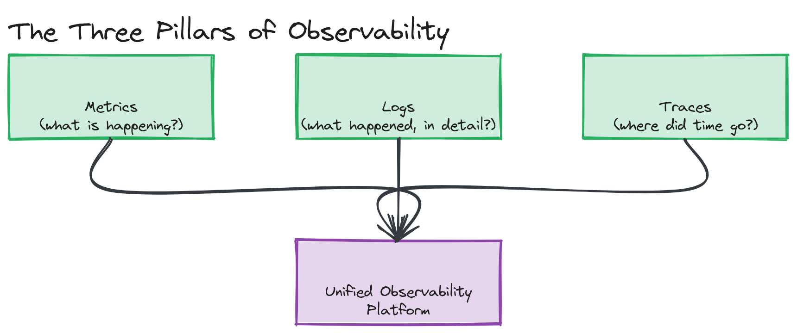
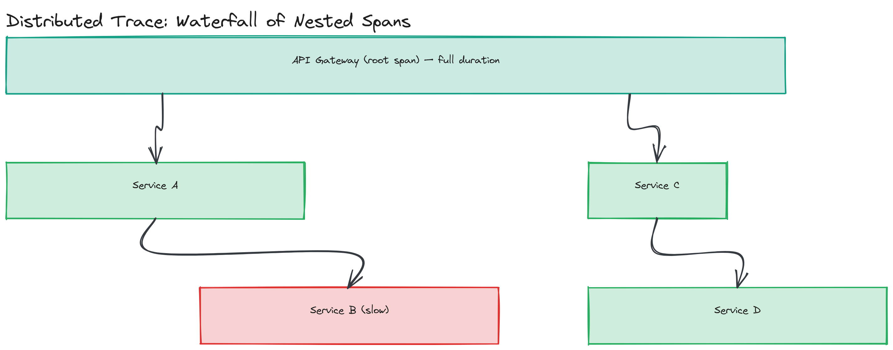

# Module 14 — Concepts: Observability

## Why This Matters

A request enters your system, bounces across a dozen microservices, and the user sees a 500 error or — worse — a slow but "successful" response. Which service was slow? Which one failed? Was it a bad deploy, a database running hot, or a downstream dependency timing out? Without observability, answering this means SSH-ing into boxes and grepping logs while the incident clock runs. With it, you have a dashboard showing exactly which service's p99 latency spiked, a trace showing exactly which downstream call ate most of the request's time, and a log line — tagged with the request's ID — explaining why. Observability isn't a nice-to-have layered on top of a system; it's the precondition for operating anything you didn't personally watch get written line by line. You can't fix what you can't see, and at scale, you will never see it all directly — you need instruments.

---

## The Three Pillars of Observability

*Metrics, logs, and traces feeding into a unified observability platform, each answering a different question about the same underlying request.*

- **Metrics** — numeric measurements aggregated over time (request rate, CPU usage, queue depth). Cheap to store and query, great for dashboards and alerting, but they tell you *that* something is wrong, not *why* for any single request.
- **Logs** — discrete, timestamped event records, often with rich context (a stack trace, a user ID, a query). Expensive to store at high volume and hard to aggregate, but they're where the actual detail of "what happened" lives.
- **Traces** — the path a single request takes across services, broken into timed spans. They answer "where did the time go, and in which service, for this one request" — something neither metrics nor logs can do well alone.

> 💡 **Note:** None of the three pillars alone is "observability." A system with beautiful dashboards but no way to drill into one slow request, or rich logs with no way to see the aggregate trend, is only partially observable. Mature systems correlate all three — e.g., a metric spike that links to example trace IDs that link to the exact log lines for those requests.

---

## Metrics and the Prometheus Data Model

Prometheus popularized a metric model built on four core types, each suited to a different shape of measurement:

| Type | What It Measures | Example | Key Property |
|---|---|---|---|
| **Counter** | A value that only goes up (or resets to 0 on restart) | Total HTTP requests served | Use `rate()` over it to get requests/sec — never read the raw value alone |
| **Gauge** | A value that goes up and down | Current memory usage, active connections | Read at any instant; no aggregation trick needed |
| **Histogram** | Observations bucketed by size, with a running count and sum | Request latency distribution | Server-side bucketing; lets you compute approximate percentiles (p50, p95, p99) after the fact, and aggregate across instances |
| **Summary** | Like a histogram, but computes configured quantiles client-side before export | Request latency, with exact quantiles | Quantiles can't be aggregated across instances after the fact — a histogram is almost always the better choice for anything you'll sum across replicas |

> ⚠️ **Warning:** A Summary's pre-computed quantiles look more precise than a Histogram's bucket-derived approximation, but that precision is a trap: you cannot average or combine summary quantiles from multiple service instances into a correct fleet-wide p99. Histograms can be combined (their buckets simply add), which is why Histogram is the default choice for latency in almost every real Prometheus setup, despite being "only approximate."

Prometheus works by **pulling** — it scrapes a `/metrics` HTTP endpoint on each service on a fixed interval, rather than services pushing metrics to it. This is implemented hands-on in [`examples/metric-types-demo.ts`](./examples/metric-types-demo.ts), which builds minimal Counter/Gauge/Histogram implementations and prints Prometheus-text-format-style output, and in this module's [Coding Challenge 01](../04-exercises/coding-challenges/challenge-01/), which wires real `prom-client` metrics into an Express app.

---

## Logging: Structured Logs, Levels, and Centralization

A log line like `"User login failed"` is nearly useless at scale — useless to search, useless to aggregate, useless to correlate with anything else. **Structured logging** emits each log entry as a JSON object with consistent fields (`timestamp`, `level`, `message`, `service`, and critically, a `correlationId` tying it to one request) instead of a free-text sentence. This turns logs into queryable data: "show me every `error`-level log for `correlationId=abc123` across every service" becomes a simple query instead of grepping a dozen hosts.

**Log levels** exist to let you control volume without losing information: `DEBUG` (verbose, dev-only detail), `INFO` (normal operational events), `WARN` (recoverable but noteworthy), `ERROR` (something failed), `FATAL`/`CRITICAL` (the process can't continue). Production systems typically run at `INFO` or `WARN` and turn on `DEBUG` temporarily while investigating.

At any real scale, logs from many service instances need to land somewhere centralized and searchable rather than on individual disks:
- **ELK stack** (Elasticsearch, Logstash, Kibana) — logs are shipped (often via Logstash or a lighter agent like Filebeat), indexed into Elasticsearch for full-text search, and visualized in Kibana.
- **Loki** (Grafana's log aggregation system) — indexes only metadata labels (not full text), storing log content compressed — cheaper at scale than ELK, and designed to pair naturally with Grafana dashboards and Prometheus-style label queries.

This module's [Coding Challenge 02](../04-exercises/coding-challenges/challenge-02/) implements structured JSON logging with a correlation ID propagated via an `x-correlation-id` header — the exact mechanism that makes "find every log line for this one request, across every service it touched" possible.

---

## Distributed Tracing

A single user request to an e-commerce checkout might touch an API gateway, an auth service, an inventory service, a payment service, and a notification service. **Distributed tracing** records this entire journey as one **trace**, made up of **spans** — each span representing one unit of work (e.g., "inventory-service: check stock") with a start time, duration, and parent-child relationship to other spans.

*A single trace as a waterfall of nested spans across five services, with the root span (API gateway) spanning the full duration and child spans showing where time was actually spent downstream.*

The mechanism that makes this possible across service and even process boundaries is **trace context propagation**: a trace ID (and the current span's ID, as its parent) is attached to outgoing requests — typically as HTTP headers — so the next service can continue the same trace instead of starting a disconnected one. **OpenTelemetry** is the vendor-neutral standard (instrumentation API + propagation format) for emitting this data; **Jaeger** and **Zipkin** are open-source backends that store and visualize traces once collected. In practice, teams instrument with OpenTelemetry's SDKs and point the exporter at whichever backend (Jaeger, Zipkin, or a commercial APM) they've standardized on — the instrumentation code doesn't need to change if the backend does.

> 🎯 **Interview Tip:** If asked "how would you debug a slow request across microservices," the strong answer names tracing specifically and explains *why* metrics and logs alone fall short: metrics show you the aggregate p99 went up, logs show you isolated events per service, but only a trace shows you the full causal chain for one specific slow request — which span, in which service, ate the time.

---

## Why Observability Matters

Beyond debugging, observability data answers questions that have nothing to do with outages: Is this new feature flag slowing down checkout? Is database connection pool exhaustion approaching, days before it becomes an outage? Did the last deploy regress error rate even slightly? Without instrumentation, every one of these questions requires guessing or waiting for a complaint. The trade-off is real, though: instrumentation has a cost — CPU/memory overhead for collecting metrics and traces, storage cost for logs and trace data at volume, and engineering time to maintain it all. The right amount of observability is "enough to answer the questions you'll actually be asked," not "log and trace everything possible" — over-instrumentation can itself become a performance and cost problem.

---

## SLIs, SLOs, SLAs, and Error Budgets

- **SLI (Service Level Indicator)** — an actual measured value, e.g., "the percentage of requests served in under 300ms over the last 5 minutes."
- **SLO (Service Level Objective)** — an internal target for an SLI, e.g., "99.9% of requests under 300ms, measured over a rolling 30 days."
- **SLA (Service Level Agreement)** — an external, often contractual promise to customers, usually a looser version of the SLO with financial or other consequences for missing it.

The gap between 100% and your SLO is your **error budget** — e.g., a 99.9% availability SLO permits roughly 43 minutes of downtime per month. This reframes reliability from "never fail" (impossible and not worth the engineering cost) to "stay within a budget of acceptable failure," and gives teams a principled way to decide whether to ship a risky feature (spend budget) or freeze and stabilize (budget exhausted). Alerting should be built around SLOs — page a human when the error budget is being burned fast enough to threaten the period's target, not on every transient blip that metrics happen to cross a static threshold.

> ⚠️ **Warning:** Static threshold alerts ("page if CPU > 80%") are a common anti-pattern because they don't connect to user impact — 80% CPU might be completely fine at one traffic level and already user-visibly degraded at another. SLO-based burn-rate alerting ties the alert directly to "are we going to violate our promise to users," which is the question that actually matters.

---

## Key Takeaways

- The three pillars — metrics, logs, traces — each answer a different question (aggregate trend, detailed event, per-request path) and are most powerful correlated together, not used in isolation.
- Use Counters for monotonically increasing totals, Gauges for point-in-time values, and Histograms (not Summaries) for anything you'll need to aggregate across instances, like latency.
- Structured (JSON) logging with a correlation ID is what makes "trace one request across every service" possible from logs alone.
- Distributed tracing needs explicit trace context propagation across service boundaries — OpenTelemetry is the standard instrumentation layer, Jaeger/Zipkin are common backends.
- SLOs and error budgets turn "be reliable" into a measurable, negotiable target that should directly drive what gets alerted on.
