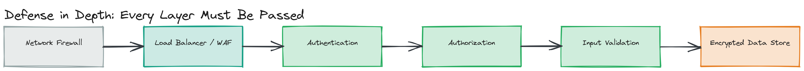

# Module 15 — Concepts: Security in System Design

## Why This Matters

A system that's fast, scalable, and consistent but insecure isn't a system you can ship — it's a liability with a UI. Security failures don't degrade gracefully like a slow query or a cache miss; a single leaked credential, an unpatched injection point, or an over-permissioned service account can turn into a headline, a regulatory fine, or a company-ending breach overnight. Equifax lost 147 million people's data to an unpatched Apache Struts vulnerability. Capital One lost 100 million records to a misconfigured firewall and an over-privileged IAM role. Neither company lacked smart engineers — they lacked systems designed with security as a first-class architectural concern rather than something bolted on at the end. This module treats security the way the rest of this repository treats latency or availability: as a set of trade-offs you make deliberately at design time, not a checklist you run afterward.

> 💡 **Note:** This module assumes you've already seen JWTs, OAuth 2.0, and API keys at the *API design* level in [Module 03 — API Design](../../module-03-apis/02-deep-dive/README.md#authentication-and-authorization-at-the-api-layer). Here we go deeper: how these mechanisms actually work, how they compare against alternatives like SAML and sessions, and how authorization, network security, and the broader attack surface fit around them at the architecture level.

---

## Security Principles

Three principles recur throughout every secure system design, and naming them explicitly in an interview signals you think about security architecturally, not just as a list of technologies:

- **Least privilege** — every user, service, and process should have the minimum access required to do its job, no more. A reporting service that only reads sales data should not have write access to the user database, even if it's "more convenient" to share one set of credentials. When (not if) a component is compromised, least privilege limits the blast radius.
- **Defense in depth** — no single control is trusted to be perfect, so multiple independent layers of protection are stacked: network firewalls, authentication, authorization, input validation, encryption, monitoring. If one layer fails or is bypassed, the next layer still has to be defeated. A WAF blocking SQL injection doesn't mean you skip parameterized queries — both exist because either one alone can fail.
- **Zero trust** — "never trust, always verify," regardless of network location. The old model assumed anything inside the corporate network (or inside the VPC) was safe; zero trust assumes the network is hostile by default and verifies every request — service-to-service included — on its own merits, every time.

> 🎯 **Interview Tip:** When asked "how would you secure this system?", naming these three principles up front gives the interviewer a structure to follow, and signals you're not just going to say "add HTTPS and a login page." Then walk through specific mechanisms as *implementations* of these principles.

**Analogy:** think of an airport. Least privilege is why a baggage handler's badge doesn't open the cockpit. Defense in depth is the sequence of ticket check, ID check, X-ray, and gate boarding pass scan — any single check failing doesn't compromise the whole system. Zero trust is why your boarding pass is checked again at the gate even though you already cleared security — being "inside the building" never that you're cleared for the next step.

---

## Authentication vs. Authorization

These two words get used interchangeably in casual conversation and conflated in careless system designs, but they answer different questions:

- **Authentication (AuthN)** — *who are you?* Verifying an identity claim (a password, a biometric, a valid token).
- **Authorization (AuthZ)** — *what are you allowed to do?* Given a verified identity, deciding whether this specific action on this specific resource is permitted.

A system can authenticate you perfectly (it knows for certain you're `user-42`) and still be insecure if its authorization logic is wrong (e.g., it lets `user-42` read `user-43`'s private data because an endpoint forgot to check resource ownership — a vulnerability class called **broken object-level authorization**, the single most common API vulnerability in OWASP's API Security Top 10). Always design and reason about these as two separate steps, even when a framework merges them into one middleware call.

---

## Authentication Mechanisms at Scale

> 💡 **Note:** Module 03 already introduced JWTs and OAuth 2.0 as token formats/flows at the API layer. The comparison below goes deeper into *how* each mechanism behaves at scale — particularly around revocation, statefulness, and cross-domain identity — which is the part system design interviews actually probe.

| Mechanism | How It Works | Statefulness | Revocation | Best Fit |
|---|---|---|---|---|
| **Session tokens** | Server creates a session on login, stores it (DB/Redis), gives the client an opaque session ID in a cookie | Stateful — server must look up the session on every request | Instant — delete the session row | Traditional web apps, single backend, when instant revocation matters |
| **JWT (JSON Web Token)** | Server signs a token containing claims (`user_id`, `roles`, `exp`); client presents it; server verifies the signature, no DB lookup needed | Stateless — the token itself carries everything needed to verify it | Hard — valid until `exp` unless you add a deny-list (which reintroduces state) | Distributed systems, microservices, mobile clients, anywhere a DB round-trip per request is too expensive |
| **OAuth 2.0** | A *delegated authorization framework* — a user grants a third-party app limited access to their resources on another service, via an access token issued through a defined flow (authorization code, client credentials, etc.) | Depends on token type issued (often JWT-backed) | Depends on implementation — short-lived access tokens + revocable refresh tokens is the standard mitigation | "Sign in with Google," third-party API access, delegated permissions |
| **OIDC (OpenID Connect)** | An identity layer built on top of OAuth 2.0 — adds a standardized `id_token` (a JWT) that proves *who the user is*, not just what they're authorized to access | Same as OAuth 2.0 underneath | Same as OAuth 2.0 | Federated login ("Sign in with Google/Microsoft"), single sign-on for consumer apps |
| **SAML (Security Assertion Markup Language)** | An older XML-based protocol where an Identity Provider (IdP) sends a signed XML assertion to a Service Provider (SP) asserting the user's identity and attributes | Typically session-based once established | Centralized via IdP session termination | Enterprise SSO, especially where the IdP is something like Okta/ADFS/Azure AD and the org already has SAML-speaking infrastructure |

**The core trade-off: statelessness vs. revocability.** Session tokens give you instant revocation at the cost of a database/cache lookup on every single request — at high scale, that lookup has to be extremely fast (hence why sessions are usually backed by Redis, not a relational DB). JWTs eliminate that lookup entirely, which is why they dominate microservice and mobile architectures, but that same property means a stolen JWT remains valid until it expires — there's no clean way to "delete" a signature-verified token early without reintroducing the state you were trying to avoid (a revocation list defeats the purpose).

> ⚠️ **Warning:** "Just use short expiry on the JWT" is a real mitigation, not a complete one. Short-lived access tokens (5–15 minutes) paired with a revocable, rotating refresh token (covered in the [deep dive](../02-deep-dive/README.md)) is the standard pattern precisely because it bounds the damage of a stolen access token without giving up statelessness for the common case.

**OAuth 2.0 + OIDC vs. SAML**, side by side:

| | OAuth 2.0 + OIDC | SAML |
|---|---|---|
| Format | JSON (JWT) | XML |
| Designed for | Mobile + modern web, API access delegation | Enterprise web SSO |
| Token size | Smaller, mobile-friendly | Larger, more verbose |
| Ecosystem | Dominant in consumer/modern SaaS | Still dominant in large enterprise IT (often a hard requirement from enterprise customers) |

> 🎯 **Interview Tip:** If you're asked to design SSO for an enterprise SaaS product, the correct answer is often "support both" — OIDC for modern API/mobile clients, SAML because large enterprise customers' IT departments often mandate it as a vendor requirement regardless of its technical merits relative to OIDC. This shows up directly in [Design Challenge 01](../04-exercises/design-challenges/challenge-01.md).

---

## Authorization Models

Once you know *who* someone is, you need a model for deciding *what they can do*:

- **ACL (Access Control List)** — a list directly attached to each resource, naming which subjects have which permissions on it (`document-42: {alice: read, bob: read+write}`). Simple and precise for fine-grained, per-resource sharing (think Google Docs' "share with specific people" model), but doesn't scale well as an organizing principle across thousands of resources and users — you end up managing permissions one resource at a time.
- **RBAC (Role-Based Access Control)** — permissions are attached to *roles*, and users are assigned roles (`admin`, `editor`, `viewer`). Scales far better organizationally than ACLs — onboarding a new employee is "assign them the `support-agent` role," not enumerating permissions resource by resource. The trade-off is granularity: RBAC struggles to express conditions like "editors can edit posts they authored, but not posts authored by others" without proliferating roles (`editor-own-posts`, `editor-any-post`, …).
- **ABAC (Attribute-Based Access Control)** — permissions are computed dynamically from attributes of the user, the resource, and the context (`allow if user.department == resource.department AND time.hour BETWEEN 9 AND 17`). Far more expressive than RBAC or ACLs — it can express exactly the "edit only your own posts" rule RBAC struggles with — at the cost of being harder to reason about and audit ("who can access X?" requires evaluating a policy against every possible attribute combination, not reading a static list).

> 💡 **Note:** These aren't mutually exclusive in real systems. A common pattern is RBAC for coarse-grained access ("is this user an admin at all?") combined with an ABAC-style ownership check for fine-grained resource access ("...and is this specifically *their* resource?"). [`01-concepts/examples/rbac-engine.ts`](./examples/rbac-engine.ts) implements a working RBAC permission-check engine and shows exactly where that ownership check would be layered on top.

*Security layers a request must pass through in sequence — network firewall → load balancer/WAF → authentication → authorization → input validation → encrypted data store — illustrating that compromising one layer alone doesn't compromise the system.*

---

## Common Attacks and System-Level Defenses

| Attack | What It Is | System-Level Defense |
|---|---|---|
| **SQL Injection** | Untrusted input is concatenated directly into a SQL query, letting an attacker inject their own SQL (`' OR '1'='1`) | Parameterized queries / prepared statements (never string-concatenate user input into SQL); least-privilege DB accounts; input validation as a second layer |
| **XSS (Cross-Site Scripting)** | Untrusted input is rendered as executable script in another user's browser, letting an attacker run JavaScript in that user's session | Output encoding/escaping by default (most modern frameworks do this automatically); a strict Content-Security-Policy header; never use `innerHTML`/`dangerouslySetInnerHTML` with unsanitized input |
| **CSRF (Cross-Site Request Forgery)** | A malicious site tricks a logged-in user's browser into making an unwanted authenticated request to your site, riding on their existing session cookie | CSRF tokens (a per-session secret the legitimate frontend includes and the server verifies); `SameSite=Strict`/`Lax` cookies, which stop the browser from attaching cookies to cross-site requests in the first place |
| **SSRF (Server-Side Request Forgery)** | An attacker tricks the *server* into making a request to an internal-only URL on its behalf (e.g., a "fetch this image URL" feature pointed at `http://169.254.169.254/` — a cloud metadata endpoint) | Allowlist outbound destinations; block requests to private/internal IP ranges from any server-side fetch; never let user input directly determine an internal request's destination |
| **DDoS (Distributed Denial of Service)** | Overwhelming a system with traffic from many sources so legitimate requests can't get through | CDN/edge absorption of volumetric traffic; rate limiting; auto-scaling for capacity; IP reputation filtering (deep dive covers this fully) |
| **Man-in-the-Middle (MITM)** | An attacker intercepts traffic between two parties, potentially reading or altering it in transit | TLS everywhere (no unencrypted HTTP, ever); certificate pinning for especially sensitive clients (mobile apps talking to your own API); HSTS to prevent protocol downgrade |

> ⚠️ **Warning:** SQL injection is decades old and still appears in OWASP's Top 10 every cycle — not because developers don't know about it, but because it resurfaces anywhere raw queries are built by string concatenation, including in ORMs misused with raw query escapes. "We use an ORM" is not automatically a defense; "we use parameterized queries everywhere, including raw query escapes" is.

---

## HTTPS Everywhere

There is essentially no legitimate reason for any production traffic — internal or external — to travel unencrypted in a modern system.

- **TLS 1.3** is the current standard: it cuts the handshake to one round trip (down from two in TLS 1.2), removes legacy weak ciphers entirely (no more negotiating down to something breakable), and encrypts more of the handshake itself, leaking less metadata to an observer.
- **Certificate management** at scale means automating issuance and renewal — manually renewing certificates does not scale past a handful of services and is a classic cause of self-inflicted outages (an expired cert silently taking down a service at 2 a.m.). Tools like **Let's Encrypt** combined with **ACME** automation, or a managed certificate service from your cloud provider, are the standard answer. In service-to-service communication, this extends to automated **mTLS** certificate issuance and rotation (covered in the [deep dive](../02-deep-dive/README.md)).
- **Certificate pinning** hardcodes (or restricts to a small known set) the expected certificate or public key a client will accept, rather than trusting any certificate signed by any of the hundreds of CAs trusted by the OS/browser by default. This defends against a compromised or coerced CA issuing a fraudulent certificate for your domain. The trade-off: if you rotate your certificate without updating the pinned value first, you lock out your own legitimate clients — which is exactly why pinning is reserved for high-stakes, fully-controlled clients (your own mobile app) rather than general web traffic, and why pinning *backup* keys, not just the active certificate, is standard practice.

> 🎯 **Interview Tip:** If asked "is TLS enough?", the strong answer is: TLS protects data *in transit* between two points, but says nothing about what happens to the data once it arrives — encryption at rest, authorization checks, and input validation are independent layers TLS doesn't replace. This is defense in depth in miniature.

---

## Key Takeaways

- Least privilege, defense in depth, and zero trust are the three principles every other security mechanism in this module is an implementation of — name them explicitly when reasoning about a design.
- Authentication (who you are) and authorization (what you can do) are separate concerns; most real breaches are authorization bugs (e.g., broken object-level access) on top of correct authentication.
- The deep trade-off across session tokens, JWTs, OAuth/OIDC, and SAML is statelessness vs. revocability — stateless tokens scale better but are harder to revoke early, which is why short-lived access tokens plus rotating refresh tokens exist.
- RBAC scales organizationally but struggles with fine-grained conditions; ABAC handles those conditions but is harder to audit; real systems often combine both.
- Common attacks (SQLi, XSS, CSRF, SSRF, DDoS, MITM) each have a well-known, specific system-level defense — naming the defense, not just the attack, is what interviews are actually testing for.
