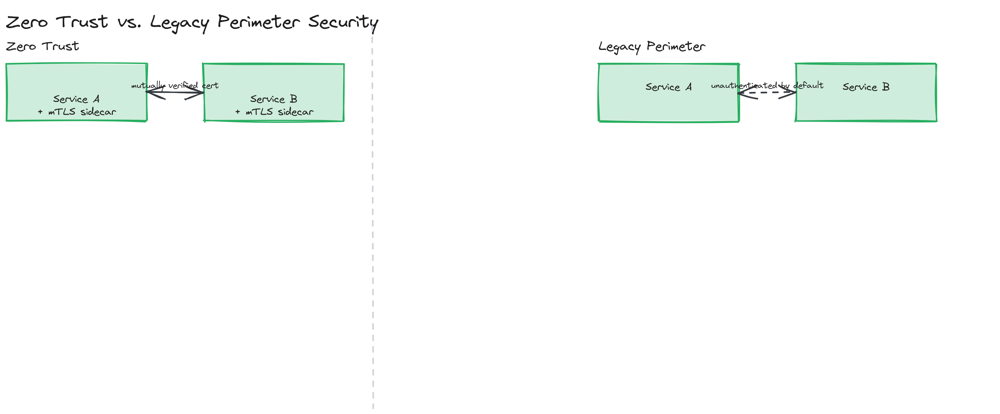
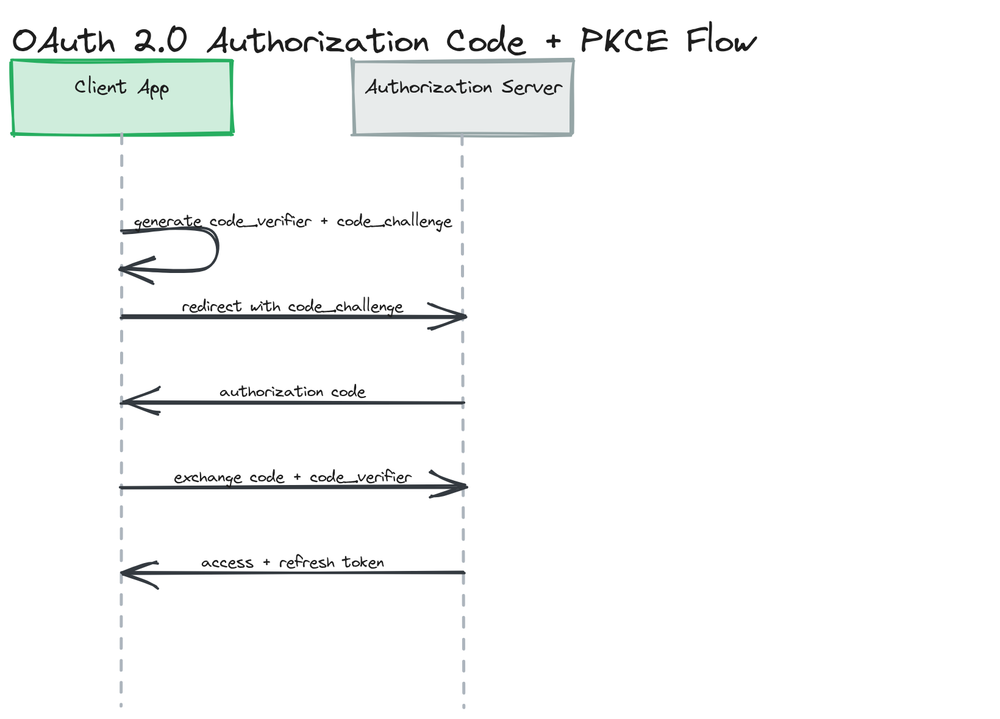

# Module 15 — Deep Dive: Secrets, Encryption, Zero Trust, and Compliance

## Why This Matters

The concepts module covered principles and well-known attack/defense pairs — the part of security every interview touches. This deep dive covers what shows up once you actually *operate* a secure system: where secrets live, what gets encrypted and who holds the keys, how "trusted" internal services verify each other, how a stolen OAuth token gets contained, how you survive a DDoS attack, and what a regulator actually requires. This is the gap between "we added auth" and "we run this in production without it becoming the next headline."

---

## Secrets Management

A secret (database password, API key, encryption key, third-party credential) has exactly one safe home: **not in source code, and not in a plaintext config file checked into git.** The question is which alternative fits your scale.

| Approach | How It Works | Pros | Cons |
|---|---|---|---|
| **Environment variables** | Secrets injected into the process environment at deploy time, read via `process.env` | Simple, supported everywhere, zero extra infrastructure | No rotation mechanism, no audit trail of who accessed what, often leaks into logs/crash dumps/`/proc` if you're not careful, no fine-grained access control |
| **HashiCorp Vault** | A dedicated secrets server: clients authenticate, request a secret, get one back — often a short-lived, dynamically generated credential rather than a static one | Centralized audit log, fine-grained policies per client identity, dynamic secrets (e.g., a database credential minted per-request and auto-expired), built-in rotation | Operational overhead — Vault itself is a critical-path service you now have to run, secure, and keep highly available |
| **AWS Secrets Manager / GCP Secret Manager / Azure Key Vault** | Managed equivalent of Vault, integrated with the cloud provider's IAM | No infrastructure to operate yourself, automatic rotation for supported services (e.g., RDS passwords), tight IAM integration | Vendor lock-in, cost scales with secret count and API calls, less flexible than Vault for multi-cloud setups |

> ⚠️ **Warning:** Environment variables are *acceptable* for low-sensitivity config and beat hardcoding, but as your entire secrets strategy they mean no rotation, no per-secret audit trail, and a credential that — once leaked (a stack trace, a `docker inspect`, a misconfigured logging pipeline) — stays valid until someone manually notices.

> 💡 **Note:** The real upgrade from "environment variables" to "a secrets manager" isn't the storage — it's **dynamic, short-lived credentials**. A static database password valid for a year is a far bigger blast radius than one Vault mints fresh every hour and auto-revokes. Rotation frequency, not storage location, is the security property you're buying.

---

## Encryption: At Rest vs. In Transit

These protect against different threats and neither substitutes for the other:

- **Encryption in transit** (TLS, covered in concepts) protects data *while it moves* between two points — defeats network eavesdropping and MITM. It does nothing once data lands on disk.
- **Encryption at rest** protects data *while stored* — on a database disk, a backup, an S3 object. It defeats an attacker who reaches the storage medium directly (a stolen backup, a misconfigured public bucket, a decommissioned disk) without ever touching your application or network.

**What to encrypt at rest:** PII, payment data, health records, credentials, and auth tokens, at minimum. Most teams default to full-disk/volume encryption (cheap, removes the "did we forget a field?" risk), then add **field-level encryption** for the most sensitive columns (a social security number) so that even a database operator with broad read access, or an attacker who achieves SQL injection, sees ciphertext for those fields specifically.

**Key management is the actual hard part** — encrypting data is easy; what determines whether it means anything is *where the keys live and who can use them*.

- **Envelope encryption** is the standard pattern at scale: each piece of data is encrypted with a unique **data encryption key (DEK)**, and the DEK itself is encrypted with a **key encryption key (KEK)** held in a separate, hardened service (AWS KMS, GCP Cloud KMS, Vault's transit engine). You never store a usable key next to the data it protects — compromising the data store alone gets an attacker encrypted DEKs, useless without the KEK.
- **Key rotation** then only requires re-wrapping the (small) DEKs with a new KEK, not re-encrypting the entire dataset — what makes rotation operationally feasible at scale.

> 🎯 **Interview Tip:** If asked "how do you handle encryption keys?", naming envelope encryption specifically signals you understand that key management, not the encryption algorithm, is where real systems get this wrong.

---

## Zero Trust Networking and mTLS

The old security model drew a hard perimeter — a firewall, a VPN — and trusted everything inside it implicitly. Once a single internal service or employee laptop is compromised, that model collapses: the attacker is now "inside," and every internal call was, by design, unauthenticated.

**Zero trust networking** replaces the perimeter assumption with continuous, per-request verification — every call, including service-to-service calls entirely inside your own VPC, authenticates and is authorized on its own merits.

**mTLS (mutual TLS)** is the core mechanism making zero trust practical between services: in ordinary TLS, only the server presents a certificate (the client verifies the server, but the server takes the client's word for who it is). In **mutual** TLS, both sides present and verify certificates — the server confirms the client is a specific known service, not just *some* TLS-speaking caller. In microservices, this is usually transparent via a **service mesh** (Istio, Linkerd) sidecar, so individual services don't implement certificate handling themselves — the mesh issues, rotates, and verifies short-lived certificates for every service identity automatically.

*Two internal services communicating via mTLS sidecar proxies inside a service mesh, each presenting and verifying a short-lived certificate, contrasted with a legacy perimeter model where internal traffic is unauthenticated by default.*

> 💡 **Note:** Zero trust doesn't mean "no network security" — it means the network boundary is no longer the *only* security boundary, or even the primary one. You still have firewalls and VPCs; you just stop trusting them as sufficient on their own.

---

## API Security: Scopes, Token Rotation, and PKCE

Module 03 covers OAuth 2.0's flows at the API design level; here's what running it securely in production specifically requires.

**OAuth scopes** narrow what an access token can actually do, independent of what the user could theoretically authorize. A token issued with `read:profile` should be rejected by any endpoint requiring `write:billing`, even if the user owns the resource — scopes are a least-privilege mechanism applied to tokens themselves, not just to users.

**Refresh token rotation** bounds the damage of a stolen long-lived refresh token: instead of one refresh token staying valid for its entire lifetime, the server issues a brand-new refresh token *every time the old one is used*, and immediately invalidates the old one. If a refresh token is ever used twice, that's a strong signal it was stolen and someone else now has a copy — the second use is treated as **refresh-token-reuse**, triggering revocation of the entire token family (every token descended from that refresh chain), not just denial of the one request. [`02-deep-dive/examples/token-rotation.ts`](./examples/token-rotation.ts) implements exactly this detection.

**PKCE (Proof Key for Code Exchange)**, pronounced "pixy," closes a specific hole in the OAuth Authorization Code flow for public clients (mobile apps, SPAs) that can't safely hold a client secret. Without PKCE, an attacker who intercepts the authorization code mid-redirect (e.g., via a malicious app registered for the same custom URL scheme) can exchange it for tokens themselves. With PKCE:

1. The client generates a random `code_verifier` and derives a `code_challenge = SHA256(code_verifier)`.
2. The authorization request includes the `code_challenge` (not the verifier).
3. When exchanging the authorization code for tokens, the client must also send the original `code_verifier`.
4. The authorization server checks that hashing the supplied verifier reproduces the challenge it stored — only the client that initiated the flow has the verifier, so an intercepted *code* alone is useless to an attacker.

> 🎯 **Interview Tip:** PKCE is now recommended for *all* OAuth public clients, not just mobile — if asked to design "Sign in with Google" for a single-page app, mentioning PKCE by name (and that it replaced the older implicit flow, which exposed tokens directly in the URL fragment) is a strong signal.

*The full Authorization Code + PKCE sequence: the client generates a `code_verifier`/`code_challenge` pair, redirects with the challenge, receives an authorization code, then exchanges the code plus the original verifier for an access and refresh token.*

---

## DDoS Mitigation

Defending against a Distributed Denial of Service attack is layered, matching the principle of defense in depth from the concepts module:

- **CDN / edge layer** — absorbs volumetric traffic (massive request floods, network-layer floods) far from your origin servers, across a globally distributed edge network with capacity orders of magnitude larger than any single origin could provision. This is the first and most important layer — traffic that never reaches your origin can't overwhelm it.
- **Rate limiting** — caps how many requests a single client (by IP, API key, or user) can make in a window, protecting against application-layer abuse that's too targeted or low-volume to look like a classic volumetric attack (e.g., credential-stuffing login attempts).
- **IP reputation filtering** — blocks or challenges (CAPTCHA) traffic from IP ranges with a known history of abuse, botnets, or anonymizing proxies, before it consumes application resources.
- **Auto-scaling** — absorbs legitimate traffic spikes that look similar to early-stage attack traffic, buying time for the layers above to fully kick in, though scaling alone is not a DDoS defense (an attacker can usually generate traffic faster than you can provision capacity to absorb it).

> ⚠️ **Warning:** Rate limiting alone, applied only at your application layer, is not DDoS defense — by the time a request reaches your application to be counted and rejected, it has already consumed connection-handling and network capacity. The CDN/edge layer absorbing volume *before* it reaches your infrastructure is what actually prevents an outage; application-layer rate limiting is the next layer down, for abuse that gets through.

---

## Compliance Considerations: GDPR and HIPAA

Compliance requirements aren't abstract legal text — they translate into specific, concrete architecture decisions:

- **GDPR (EU)** — **data residency** requirements can mandate that EU user data physically stays within EU data centers, directly shaping your multi-region architecture decisions (not just "where's it fastest," but "where are we legally allowed to put it"). The **right to erasure** ("right to be forgotten") means your data model needs an actual deletion path for a given user across every system that stores their data — including backups and any downstream analytics pipelines, which is a much harder architectural problem than it sounds once data has fanned out across a dozen services.
- **HIPAA (US healthcare)** — mandates encryption (at rest and in transit) for PHI (Protected Health Information), strict access controls (least privilege isn't optional, it's audited), and **audit logs** of every access to patient data — who accessed what record, when, and from where, retained and tamper-evident.
- **Audit logs as a shared requirement** — both regimes converge on needing an immutable, queryable record of who did what to sensitive data. Architecturally, this usually means an append-only log (often a separate datastore from your primary application database, so a compromised application can't also erase its own tracks) capturing actor, action, resource, and timestamp for every sensitive operation.

> 💡 **Note:** "We'll add audit logging later" is a common and costly mistake — retrofitting audit logs onto an existing system means you have *no record* of everything that happened before the retrofit, which is exactly the gap an auditor or regulator will ask about. Designing the audit log path in from the start, even as a simple structured log shipped to immutable storage, is far cheaper than bolting it on after a compliance review fails.

---

## Key Takeaways

- A dedicated secrets manager (Vault, AWS/GCP/Azure equivalents) beats plain environment variables primarily because of rotation and audit trails, not just "more secure storage" — dynamic, short-lived credentials are the real upgrade.
- Encryption at rest and in transit defend against different threats and are both required; envelope encryption (DEK encrypted by a KEK) is the standard pattern that makes key rotation operationally feasible at scale.
- Zero trust replaces "trusted because it's inside the network" with per-request verification everywhere, including internal service-to-service calls — mTLS via a service mesh is the practical mechanism.
- Refresh token rotation bounds the damage of a stolen refresh token, and detecting reuse of an already-rotated token is a strong signal of theft that should revoke the entire token family, not just deny one request.
- PKCE closes the authorization-code-interception hole for public clients that can't hold a secret, and is now recommended for all OAuth public clients, not only mobile apps.
