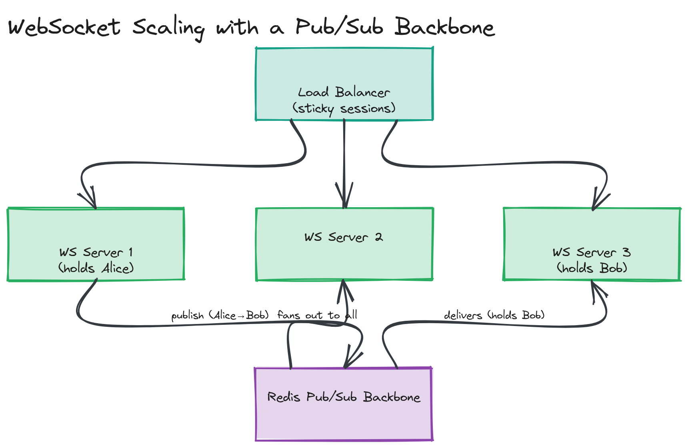
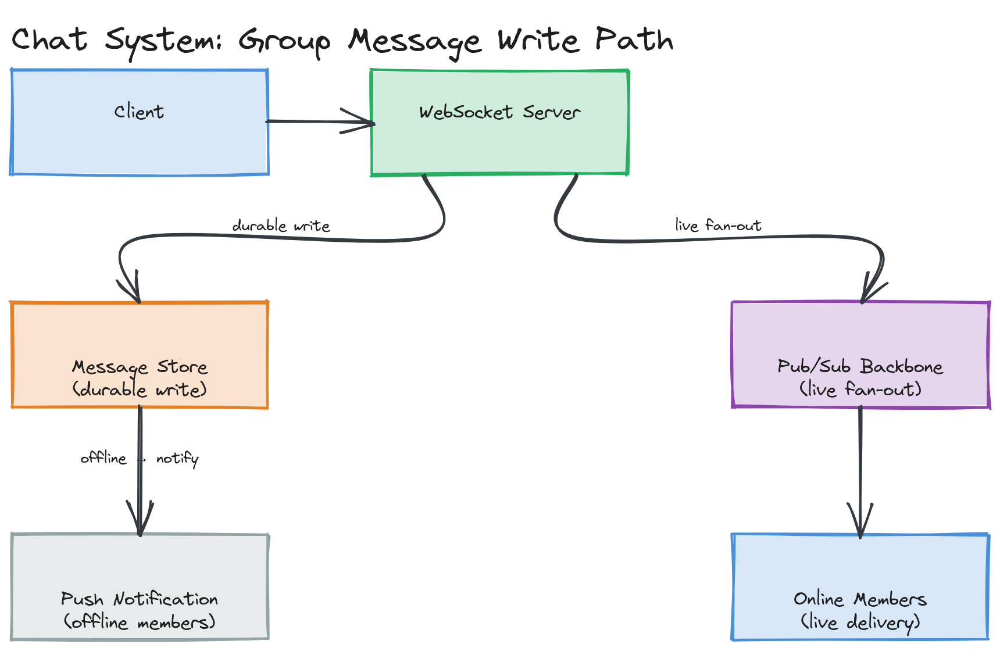

# Module 16 — Deep Dive: Scaling Real-Time Systems

## Why This Matters

Holding one WebSocket connection open is a five-minute tutorial. Holding ten million of them open, reliably, while a message sent by one user reaches everyone who needs it within a few hundred milliseconds, is one of the harder operational problems in backend engineering — and it's exactly the part of "build a chat app" that separates a toy project from a system design interview answer worth a senior hire. This deep dive covers the four problems that show up the moment a real-time system has to leave a single process: connection scaling, fan-out, ordering/delivery guarantees in chat, and the handful of recurring patterns (live sports, tickers, collaborative editing) built from the same primitives.

---

## Scaling WebSocket Servers

### The Sticky Sessions Problem

A WebSocket connection is **stateful** — once a client connects to server instance B, every message for that client must be handled by server instance B specifically, because that's the process holding the actual open TCP socket and the in-memory record of who's in which room. A standard load balancer that round-robins each new request to a different backend (the right behavior for stateless HTTP) would break this immediately: a client's *connection* goes to one server, but if the load balancer doesn't remember that, it has no way to route a *new* request from that same client back to the server that's actually holding their socket.

The straightforward fix is **sticky sessions**: the load balancer pins a client to the same backend instance for the lifetime of its connection (commonly via a cookie, or hashing the client's IP/connection ID to a consistent backend). This solves routing, but doesn't solve the deeper issue below.

### The Stateful Connection Challenge

Even with sticky sessions routing correctly, a fundamental problem remains: **server B has no idea what's happening on server A.** If user Alice is connected to server A and user Bob is connected to server B, and Alice sends Bob a message, server A's process has no direct way to deliver that message to a socket that physically lives in server B's memory. Scaling a WebSocket fleet horizontally is therefore not just a load-balancing problem — it's a problem of getting servers that don't share memory to communicate about events relevant to connections they don't own.

> ⚠️ **Warning:** A common interview mistake is proposing horizontal scaling for a WebSocket server and stopping there, as if adding more instances were the whole answer. More instances *alone* makes the cross-server delivery problem worse, not better — you've now got N processes each blind to what the others are holding. The interesting part of the answer is what comes next.

### Horizontal Scaling with a Pub/Sub Backbone

The standard solution: every WebSocket server instance also subscribes to a shared **pub/sub backbone** (Redis Pub/Sub, or a proper message broker as covered in [Module 08](../../module-08-message-queues/)). When server A needs to deliver a message to Bob, it doesn't try to find Bob's socket directly — it publishes the message to a channel (e.g., `user:bob` or `room:general`), and *every* server instance subscribed to that channel receives it. The one instance that happens to actually hold Bob's open socket (server B) checks its local connection map, finds Bob, and writes to his socket. Every other instance receives the same message and simply does nothing, since none of their local connections match.

This converts "deliver to a specific socket somewhere in the fleet" into "broadcast to everyone, let the instance that owns the connection act on it" — at the cost of every server processing every message, even ones irrelevant to any connection it holds. That overhead is the trade-off accepted for not needing a separate discovery layer that tracks exactly which server holds which connection.

*Three WebSocket server instances behind a load balancer with sticky sessions, all subscribed to a shared Redis Pub/Sub backbone — a message published by the instance holding Alice's connection fans out to all instances, but only the instance holding Bob's connection actually delivers it.*

> 💡 **Note:** At larger scale, some systems add a connection-registry layer (e.g., "user X's socket lives on server instance Y," stored in a fast key-value store) so a message can be routed directly to the one instance that needs it, instead of broadcasting to all instances unconditionally. This trades a small amount of registry-lookup latency and an extra moving part for a large reduction in wasted message processing — worth naming as a further-scaling refinement once the basic pub/sub backbone is established.

---

## The Fan-Out Problem

Fan-out is the problem of delivering **one** event to a very large number of subscribers efficiently — a celebrity's live stream chat, a breaking-news push to millions of app instances, a viral post's like-count ticking up in real time for everyone currently viewing it.

Two structurally different approaches, the same trade-off seen in feed design (Module 04/05's fan-out-on-write vs. fan-out-on-read) reappears here:

- **Fan-out-on-write (push)**: the instant the event happens, immediately push it to every subscriber's connection. Lowest latency per recipient, but the work scales with the number of subscribers *at the moment of the event* — a sudden spike of a million simultaneous viewers means a million simultaneous writes have to happen right now.
- **Fan-out-on-read (pull-adjacent)**: subscribers poll or long-poll for the latest state rather than being actively pushed to individually; the server just maintains "the current value" and many readers converge on reading the same thing. Cheaper to scale (reads of the same value can be cached/batched) but adds latency and reintroduces some of the inefficiency real-time push was meant to avoid.

In practice, large-scale fan-out for live events uses a **hierarchical/tree-based broadcast** rather than one server trying to write to a million sockets directly: an event is published once to a pub/sub backbone (as above), which fans out to N "edge" server instances, each of which then fans out to the (much smaller) number of sockets it personally holds. This bounds the fan-out factor any single process has to handle to "however many connections one server instance holds," not "the entire global subscriber count."

> 🎯 **Interview Tip:** If asked to estimate fan-out load, always do the arithmetic out loud: "1M concurrent viewers, evenly spread across, say, 50 server instances behind the pub/sub backbone, is 20K sockets per instance — that's the real per-process number that matters, not the global 1M." Interviewers want to see you decompose the scary global number into the actually-relevant per-instance number.

[`examples/fanout-simulator.ts`](./examples/fanout-simulator.ts) simulates exactly this: one published event, fanned out through an in-memory pub/sub backbone to N simulated subscriber connections, with delivery timing measured.

---

## Chat System Design Deep Dive

### 1:1 Chat

The simplest case: a message from Alice to Bob needs to reach Bob if he's online (deliver over his open connection via the pub/sub backbone above) and be durably stored regardless (so it's there when Bob next opens the app, even if he was offline when it was sent). Every chat message therefore has two destinations on write: a message store (the source of truth, almost always a database optimized for time-ordered writes per conversation) and, conditionally, a live socket if the recipient happens to be connected right now.

### Group Chat

Group chat is 1:1 chat's fan-out problem at a small scale: one message needs to reach every member of the group who's currently online, plus be durably stored for members who are offline. The complexity that 1:1 doesn't have: **per-user read state**. Each group member has their own "last read message" position, so unread counts and read receipts (below) become genuinely per-user bookkeeping rather than a single shared flag.

### Message Ordering

Messages need a stable order *per conversation* (not necessarily a single global order across the whole system). The naive approach — order by server-received timestamp — breaks down under clock skew and concurrent sends from different servers. The standard fix is a **per-conversation monotonically increasing sequence number**, assigned by whichever single source of truth owns that conversation's ordering (commonly the database, via an auto-incrementing column or a dedicated sequence service) — clients then render messages by sequence number, not wall-clock time, and can deterministically detect gaps (a message they're missing) by watching for a non-contiguous sequence.

> ⚠️ **Warning:** Don't rely on each client's local wall-clock timestamp for ordering — clock drift between devices means "client-reported send time" can produce a visibly wrong order (a reply appearing to arrive before the message it's replying to). Timestamps are fine for *display* ("sent at 3:42 PM"); they are not safe for *ordering*.

### Read Receipts

A read receipt is per-(user, conversation, message) state: "user X has seen up through message sequence N." The efficient implementation tracks only the *high-water mark* (the latest sequence number seen) per user per conversation, rather than a boolean per individual message — "read through message #482" implies every message at or before #482 is also read, with no need to store 482 separate flags. Delivering the read receipt itself to the other participant(s) is just another real-time event over the same connection/pub-sub infrastructure used for messages.

---

## Live Sports / Stock Ticker / Collaborative Editing — Design Patterns

These three look different on the surface but share a structure: **one frequently-changing piece of shared state, broadcast to many simultaneous viewers, where individual updates matter less than the viewer always converging on the current value quickly.**

- **Live sports score / stock ticker**: a single authoritative value (score, price) updated frequently, broadcast via the fan-out mechanism above. Because viewers only care about the *current* value, not necessarily *every* intermediate value, these systems can safely coalesce updates under extreme load (if the price changed 10 times in 100ms, it's acceptable to broadcast only the latest value rather than all 10) — a relaxation that chat (where every individual message matters) cannot make.
- **Collaborative editing** (e.g., Google Docs–style): the hardest of the three, because unlike a score or price, *every* individual edit matters and concurrent edits from different users must be merged into one consistent document rather than one simply overwriting another. This requires either **Operational Transformation (OT)** or **CRDTs (Conflict-free Replicated Data Types)** — both are algorithms for merging concurrent edits deterministically so every collaborator's view converges to the same final document regardless of the order updates were received in. Full coverage of CRDTs belongs to a distributed-systems-focused treatment; the system-design-relevant takeaway here is that collaborative editing is fundamentally a *conflict resolution* problem layered on top of the same WebSocket transport already covered in this module, not a transport problem itself.

*The full write path for a group chat message: client → WebSocket server → message store (durable write) and pub/sub backbone (live fan-out) in parallel, then delivery to online members' sockets and a push notification to offline members.*

---

## Key Takeaways

- Sticky sessions solve *routing* a client back to the server holding its connection; they do not solve the deeper problem of one server delivering a message to a connection held by a different server.
- A pub/sub backbone (Redis Pub/Sub or a message broker) is the standard mechanism that lets stateless-feeling horizontal scaling work for stateful WebSocket connections — publish once, let the instance that owns the relevant socket act on it.
- Fan-out at scale is handled hierarchically — one publish event fans out to N server instances, each of which fans out only to the (much smaller) set of sockets it personally holds — bounding the real per-process load.
- Chat message ordering must use a per-conversation sequence number, not client wall-clock timestamps, which are vulnerable to clock skew.
- Live tickers can coalesce rapid updates since only the latest value matters; collaborative editing cannot, because every concurrent edit must be merged via OT/CRDTs rather than dropped or overwritten.
