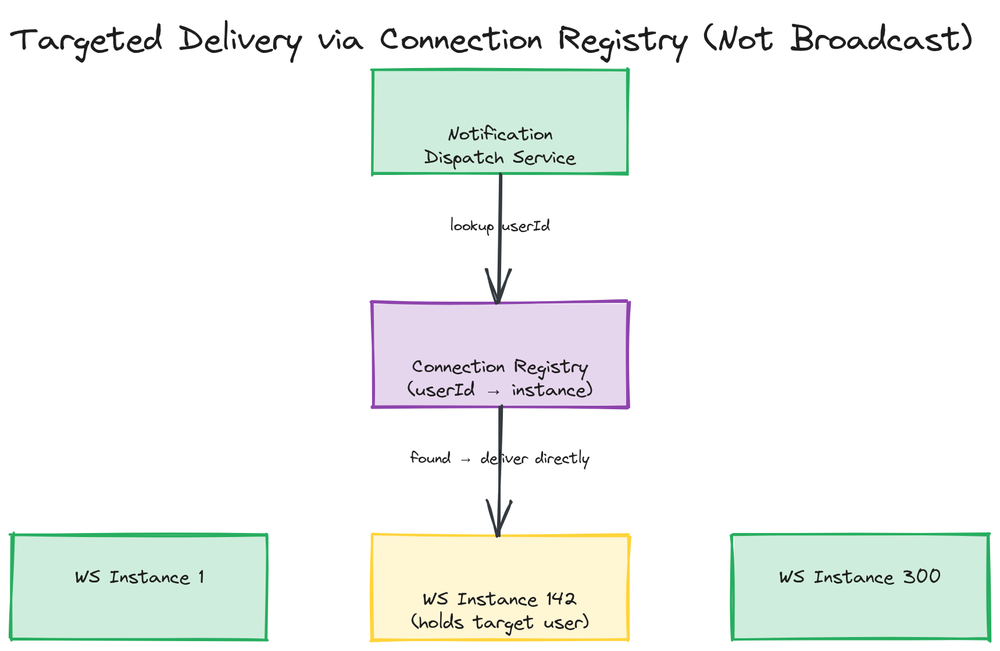

# Sample Answer: "How Would You Scale a WebSocket-Based Notification System to 10 Million Concurrent Connections?"

> A fully worked deep-dive answer. ("Design WhatsApp's 1:1 and group messaging" is covered separately as the module's [design challenge](../04-exercises/design-challenges/challenge-01.md) — this answer deliberately takes a different angle: a notification fan-out system at extreme connection scale.)

---

## Clarify the Requirement

Before reaching for any architecture, pin down what's actually being delivered: server-initiated, mostly one-directional notifications (a new comment, a price alert, a friend request) to up to 10 million simultaneously connected clients, where each client just needs to receive events relevant to *it* — not a shared broadcast every client receives identically. This shapes everything that follows: it's a fan-out and connection-scaling problem first, and a delivery-guarantee problem second.

## Connection Layer Choice

Since clients only need to *receive* (acknowledging or marking-as-read can go over an ordinary separate HTTP call), this is a textbook case where **SSE would be sufficient** — but for this answer, since the prompt specifies WebSockets, I'll note the trade-off explicitly: WebSockets are justified here if there's a *secondary* requirement (e.g., the same connection also carries presence heartbeats or read-receipt acks at low latency) that benefits from a single bidirectional channel rather than splitting transport. If that secondary requirement didn't exist, I'd push back and recommend SSE for the simpler operational model. Assuming WebSockets are justified, the design proceeds as follows.

## Connection Tier Sizing

10 million connections is the number that decides everything else. Budgeting roughly 20,000–50,000 sockets per server instance (a realistic, tunable figure based on memory per connection and file descriptor limits, not a hard ceiling), that's **roughly 200–500 WebSocket server instances** needed just to hold the connections — before any message processing. This is the number I'd say out loud immediately, because it's what makes the next two decisions (sticky sessions, pub/sub backbone) non-optional rather than nice-to-haves.

## Routing and Cross-Instance Delivery

- **Sticky sessions** at the load balancer (consistent hashing on a connection/client identifier) ensure a client's reconnects land back on roughly the instance holding its prior state, and more importantly route *new* connections deterministically.
- **A pub/sub backbone** (Redis Pub/Sub at this scale would likely need to be Redis Cluster, or a dedicated broker like Kafka/NATS, given the message volume) is the only way for the service that *decides* "user X should get notification Y" to actually reach whichever of the 200–500 instances happens to be holding user X's socket. Rather than broadcasting every notification to all 200–500 instances (wasteful at this scale — each instance would process every message regardless of relevance), I'd add a **connection registry**: a fast key-value lookup (`user:X -> instance:N`) updated on connect/disconnect, so the notification dispatch service can publish directly to the one channel/instance that actually holds that user's connection, rather than broadcasting to the full fleet.

*A notification dispatch service looking up a connection registry to find which of ~300 WebSocket instances holds a target user's socket, then delivering directly to that instance's channel rather than broadcasting to the full fleet.*

## Handling Offline Recipients

A user not currently connected (registry lookup misses) needs the durable fallback chain from the concepts section: write the notification to a durable store regardless of connection state, then if no live delivery occurred, queue a mobile push via APNs/FCM. This is also where I'd note that "10 million concurrent connections" implies a comparable or larger number of *registered* users who are sometimes offline — the durable store and push fallback aren't an edge case, they're the majority path for any given user across a full day.

## Presence as a Side Effect of This Infrastructure

Since connections are already tracked in the registry for routing purposes, presence ("is user X online") becomes close to free — the registry entry's existence (and a heartbeat-refreshed TTL on it) doubles as the presence signal, rather than building a separate presence subsystem from scratch.

## Failure Modes Addressed

- **Instance crash**: the registry entries for that instance's connections go stale; a heartbeat/TTL on registry entries (not just on presence, on the routing entries themselves) bounds how long a "ghost" entry can misroute a notification before it's cleaned up and the client's next reconnect re-registers it against a healthy instance.
- **Pub/sub backbone overload**: at 10M connections, broadcasting every message to every instance unconditionally would mean 200–500x message amplification — this is exactly why the connection registry's targeted delivery, not blind broadcast, is load-bearing at this scale rather than a minor optimization.

## Trade-offs Discussed

| Decision | Choice | Trade-off |
|---|---|---|
| Connection tier sizing | ~300 instances at ~30K connections each | Operationally simpler per-instance, but means 300 things to keep healthy instead of fewer, larger ones |
| Cross-instance delivery | Connection registry + targeted publish, not blind broadcast | Extra moving part (registry) and lookup latency, in exchange for avoiding 300x message amplification |
| Transport | WebSocket (per the prompt) vs. SSE | WebSocket justified only if a genuine bidirectional need (e.g., low-latency acks) exists on the same channel; otherwise SSE is the simpler, equally effective choice for this specific requirement |
