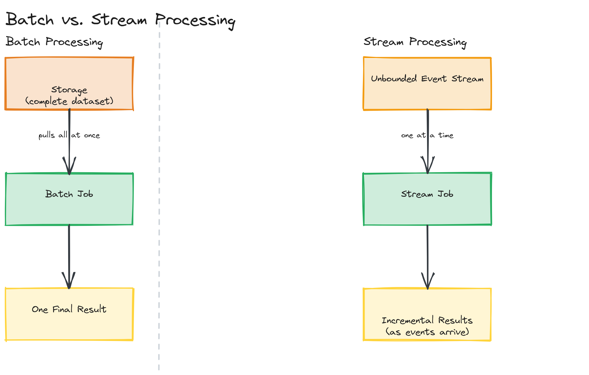
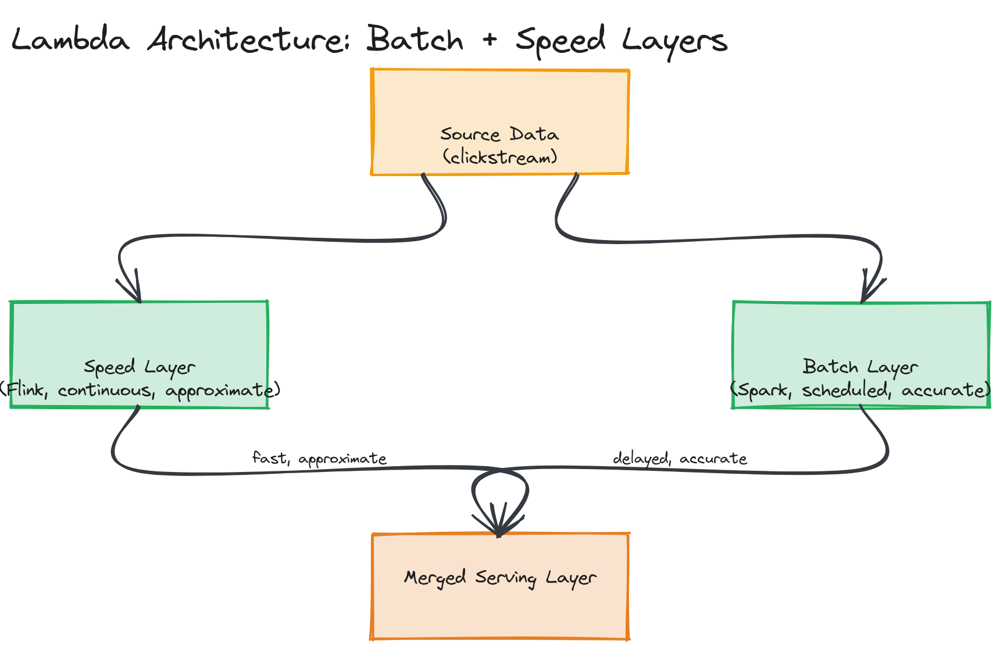

# Module 17 — Concepts: Data Pipelines & Stream Processing

## Why This Matters

A credit card swipe needs a fraud check in under half a second. A monthly board report needs accurate revenue numbers across a billion rows. Both are "process the data and produce an answer" problems, but they need fundamentally different machinery — one is a *stream* problem, the other is a *batch* problem. Companies that bolt a fraud check onto a nightly batch job ship a fraud detector that catches fraud the day after it happened; companies that try to run a billion-row financial reconciliation through a low-latency streaming engine burn enormous cost solving a problem that latency never needed solving for. This module is about recognizing which shape of problem you actually have, and which architecture (Lambda, Kappa, ETL/ELT, warehouse) fits it.

---

## Batch Processing

**Batch processing** takes a large, bounded set of data that already exists at rest (yesterday's logs, last month's transactions) and runs a computation over the whole set, producing a result when the job finishes — minutes to hours later, not milliseconds.

**Use cases:** end-of-day financial reconciliation, monthly billing runs, training a machine learning model on a year of historical data, generating a weekly analytics report, reindexing a search engine from a full data dump.

**MapReduce**, the model popularized by Google's 2004 paper, is the conceptual ancestor of almost all batch frameworks. It splits a job into two phases:
- **Map**: apply a function to every input record independently and in parallel (e.g., emit `(word, 1)` for every word in a document), producing key-value pairs.
- **Reduce**: group all values sharing a key and aggregate them (e.g., sum the `1`s per word to get a word count).

The genius of MapReduce wasn't the map/reduce abstraction itself — it was that the *framework* handled splitting data across hundreds of machines, scheduling tasks, retrying failed workers, and shuffling intermediate data between map and reduce phases, so an engineer only had to write the map and reduce functions. **Apache Spark** is the modern successor: it generalizes MapReduce's two rigid phases into an arbitrary directed acyclic graph (DAG) of transformations (`map`, `filter`, `join`, `groupBy`, and more), and — crucially — keeps intermediate data **in memory** between steps instead of writing to disk after every phase the way classic Hadoop MapReduce did. That single change made Spark commonly 10–100x faster than Hadoop MapReduce for iterative workloads (like machine learning training loops that repeatedly scan the same dataset).

> 💡 **Note:** "Batch" describes the *data boundedness* (a finite, known dataset), not a speed requirement by itself. A batch job *can* run in seconds on a small dataset — what makes it "batch" is that it processes a complete, already-collected set rather than reacting to events as they arrive.

---

## Stream Processing

**Stream processing** treats data as an unbounded sequence of events arriving continuously, and computes results incrementally as each event (or small micro-batch of events) arrives — producing output in milliseconds to seconds, not after a job "finishes," because the input never finishes.

**Use cases:** fraud detection on live transactions, real-time dashboards (trips per minute, active users), alerting on anomalies as they happen, real-time personalization (next-best-action), sensor/IoT telemetry monitoring.

**Kafka Streams** is a Java library (not a separate cluster — it's a client library your application embeds) that reads from and writes to Kafka topics, providing a DSL for filtering, mapping, windowing, and joining streams. Its appeal is operational simplicity: if you already run Kafka, Kafka Streams adds no new infrastructure, just a library inside your existing services.

**Apache Flink** is a dedicated, general-purpose stream processing engine with its own cluster (JobManager + TaskManagers), built around **true event-at-a-time processing** with sophisticated support for event-time windowing, out-of-order event handling (via watermarks), and exactly-once state consistency through periodic distributed checkpoints. Flink also runs batch jobs (it treats batch as "a stream that ends"), making it one of the few engines that genuinely unifies both models under one execution engine.

> 🎯 **Interview Tip:** If asked "Kafka Streams or Flink?", the strong answer compares operational footprint against processing sophistication: Kafka Streams is the right call when your team already runs Kafka and the transformations are straightforward (filter, map, simple aggregation) — no new cluster to operate. Flink is the right call when you need complex event-time semantics, large stateful joins/windows, or want one engine for both batch and streaming workloads, and you're willing to operate a dedicated cluster for it.

> ⚠️ **Warning:** Stream processing doesn't make data "more correct" than batch — it makes it *available sooner*, often at the cost of approximation. Streaming aggregates over a window can be revised as late-arriving events trickle in, and many streaming systems explicitly trade a small amount of accuracy (or emit "best effort so far" results) for low latency. Don't present streaming as a strictly superior upgrade from batch; it's a different point on the latency/completeness trade-off curve.

A concrete, runnable comparison of the same dataset processed both ways is in [`examples/batch-vs-stream.ts`](./examples/batch-vs-stream.ts).

*Side-by-side flow: a batch job pulling a complete dataset from storage and emitting one final result, versus a stream job consuming an unbounded sequence of events one at a time and emitting incremental results as they arrive.*

---

## ETL vs. ELT

Both acronyms describe moving data from a source system into an analytical destination (a warehouse or lake) — they differ in *where* transformation happens relative to loading:

| | ETL (Extract → Transform → Load) | ELT (Extract → Load → Transform) |
|---|---|---|
| **Transform happens** | Before loading, in a separate processing layer | After loading, inside the destination warehouse itself |
| **Destination receives** | Already-clean, modeled data | Raw (or lightly-cleaned) data |
| **Compute used for transform** | A dedicated ETL engine/cluster (Spark, an ETL tool) | The warehouse's own (often very powerful) query engine |
| **Best for** | Sources that need heavy cleaning/validation before they're trustworthy, or destinations with limited compute | Modern cloud warehouses (Snowflake, BigQuery) with cheap, elastic compute, where iterating on transformation logic in SQL is fast |
| **Schema flexibility** | Lower — transformation logic is fixed upstream, before load | Higher — raw data is preserved, so you can re-derive new transformations later without re-extracting from the source |

**ETL** is the traditional model: a dedicated pipeline cleans, validates, and reshapes data before it ever touches the warehouse, because historically warehouses had limited, expensive compute and couldn't afford to do that work themselves. **ELT** flipped this once cloud warehouses made storage cheap and query compute elastic: load the raw data first (cheap, fast, preserves everything), then run transformations as SQL queries inside the warehouse itself, which can now be re-run or revised without re-extracting from the source system at all.

> 💡 **Note:** ELT's "load raw data first" approach is also why it pairs naturally with data lakes and lakehouses (covered in the [deep dive](../02-deep-dive/README.md)) — the raw zone of a lake *is* the "L" in ELT, kept intact so any future transformation is possible without re-touching the original source.

---

## Data Warehouse Concepts: OLAP vs. OLTP

**OLTP (Online Transaction Processing)** systems are optimized for many small, fast read/write transactions touching few rows — a production database backing an application (placing an order, updating a user's profile). **OLAP (Online Analytical Processing)** systems are optimized for the opposite: complex queries that scan and aggregate millions or billions of rows, run far less frequently, by analysts and reporting tools rather than live user requests.

| | OLTP | OLAP |
|---|---|---|
| **Query shape** | Simple, point lookups/updates (`UPDATE orders SET status = ... WHERE id = ?`) | Complex aggregations across huge scans (`SUM(revenue) GROUP BY region, month`) |
| **Row vs. column orientation** | Row-oriented (fetch one full row efficiently) | Column-oriented (scan one column across many rows efficiently — see [deep dive](../02-deep-dive/README.md)) |
| **Example systems** | PostgreSQL, MySQL (application database) | Snowflake, BigQuery, Redshift (data warehouse) |
| **Who queries it** | The application, on behalf of one user at a time | Analysts, BI dashboards, ML feature pipelines |

This is *why* you don't run analytics queries directly against your production OLTP database: a `GROUP BY` over a year of orders would compete for the same disk/CPU/locks that real customers' checkouts need right now. Pipelines exist precisely to move data from the OLTP world into a separate OLAP world where heavy analytical queries can't hurt production traffic.

### Star Schema, Fact Tables, and Dimension Tables

A **star schema** is the classic data warehouse modeling pattern: one large **fact table** at the center, surrounded by smaller **dimension tables** it references — visually resembling a star.

- **Fact table**: holds the *measurements* of business events — one row per event (a sale, a trip, a click) — and is mostly numeric, foreign keys plus metrics (e.g., `order_id, customer_id, product_id, date_id, quantity, revenue`). This table is large and grows continuously.
- **Dimension tables**: hold the *descriptive context* around those events — `customers` (name, signup date, region), `products` (category, price, brand), `dates` (day, month, quarter, is_holiday). These tables are comparatively small and change slowly.

A query like "total revenue by product category, by month, for customers in the EU" joins the fact table against the `products` and `dates` and `customers` dimension tables — the star schema's whole purpose is making that join pattern simple and fast for a query engine to plan, at the cost of some denormalization (the same `product_category` string is duplicated across every product row rather than normalized further into its own table, which OLTP schema design would typically do).

> 🎯 **Interview Tip:** If a prompt mentions "analytics dashboard" or "reporting," naming a star schema with explicit fact/dimension tables — and explaining *why* it's denormalized compared to a textbook-normalized OLTP schema — signals real data-warehouse experience, not just database vocabulary.

---

## Lambda Architecture

**Lambda architecture** runs batch and stream processing **side by side** against the same incoming data, to get both correctness and low latency:

- **Batch layer**: processes the complete, immutable historical dataset on a schedule, producing fully accurate (but delayed) results.
- **Speed layer**: processes the same data as a stream in near-real-time, producing approximate, low-latency results to fill the gap until the batch layer catches up.
- **Serving layer**: merges both views for queries — typically serving the speed layer's fresh-but-approximate results for recent data and the batch layer's accurate results for anything old enough that batch has already processed it.

The motivating idea (Nathan Marz, who coined the term while building Storm at Twitter/BackType) is that the speed layer's output is allowed to be wrong in the short term because the batch layer will eventually recompute the correct answer over the same data and overwrite it — batch is the source of truth, stream is a temporary, low-latency stand-in.

> ⚠️ **Warning:** Lambda's biggest real-world complaint is that you must write and maintain **two separate codebases** implementing essentially the same business logic — one in your batch framework (Spark), one in your stream framework (Flink/Kafka Streams) — which inevitably drift apart in subtle ways (a bug fixed in one, forgotten in the other) and double the operational surface area.

---

## Kappa Architecture

**Kappa architecture**, proposed by Jay Kreps (Kafka's co-creator) as a direct response to Lambda's dual-codebase pain, asks: what if there were no batch layer at all? Treat **everything as a stream**, including historical reprocessing — if you need to recompute results from scratch (a bug fix, a new aggregation), replay the stream from the beginning (Kafka retains a configurable history, or all of it) through the *same* streaming job, rather than maintaining a separate batch pipeline.

This works because durable, replayable log-based message systems like Kafka made "replay the whole history through a stream processor" a practical reality — something that wasn't true when Lambda was conceived. Kappa trades Lambda's two-codebases problem for a single streaming codebase, at the cost of needing your stream processor to be capable enough (state management, throughput) to handle a full historical reprocessing run when one is needed, and needing your log retention to actually cover however far back you might need to replay.

> 💡 **Note:** Kappa isn't "Lambda done right" in every case — it's a simplification that fits when your transformation logic is genuinely the same for historical and live data. If batch and real-time genuinely need *different* logic (e.g., a nightly batch ML training job vs. a real-time feature lookup), Lambda's two explicit layers may still be the more honest design.

*The same source data feeding both a batch layer (scheduled, accurate, delayed) and a speed layer (continuous, approximate, fast) into a merged serving layer.*

*A single stream processing layer reading from a durable, replayable log, with historical reprocessing modeled as simply replaying the log from an earlier offset through the same job.*

---

## Key Takeaways

- Batch processing handles a complete, bounded dataset and trades latency for completeness; stream processing handles an unbounded sequence and trades some completeness/accuracy for low latency — neither is "better," they fit different problems.
- ETL transforms before loading (fits limited-compute destinations or heavy upstream cleaning); ELT loads raw data first and transforms inside the warehouse (fits cheap, elastic cloud warehouse compute and preserves raw data for future re-derivation).
- OLTP optimizes for many small transactional reads/writes; OLAP optimizes for large analytical scans — this is why production databases and data warehouses are always separate systems, connected by a pipeline.
- A star schema's fact table (events/measurements) plus dimension tables (descriptive context) is the standard warehouse modeling pattern, deliberately denormalized for query simplicity.
- Lambda architecture runs batch and stream side by side for correctness plus speed at the cost of two codebases; Kappa simplifies to stream-only, replaying history through the same pipeline, when the same logic genuinely applies to both.
