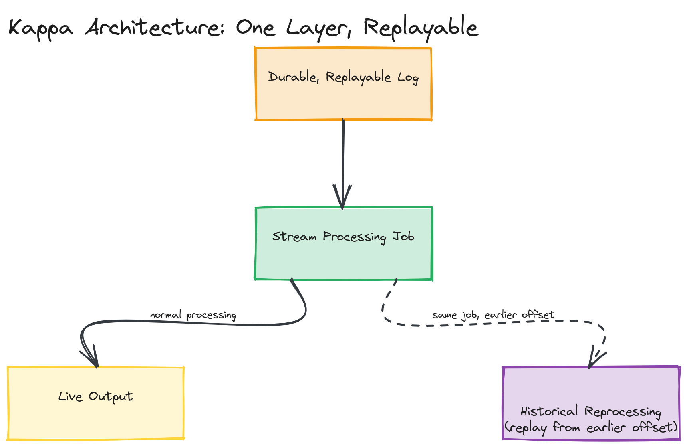

# Design Challenge 01 — Solution: Real-Time Analytics Pipeline for a Ride-Sharing App

## Latency Requirements Per Feature

All three features sound "real-time," but they have meaningfully different tolerances:

- **Trips per minute**: needs to update within roughly a minute — it's an operations dashboard, not a control loop. A few seconds of staleness changes nothing operationally.
- **Surge pricing triggers**: needs to react within single-digit seconds. If supply/demand imbalance takes two minutes to translate into a price change, the surge mechanism has already failed at its actual purpose (incentivizing more drivers into an underserved zone *while* the imbalance exists).
- **Driver availability heatmap**: needs sub-10-second freshness for the visualization to feel "live," but unlike surge pricing, it's not gating a financial decision — momentary staleness has low cost.

These are different enough in *consequence of staleness* (surge pricing materially affects revenue and rider trust; the heatmap is cosmetic) that the design should treat surge pricing as the feature with the strictest correctness bar, even though all three have similar raw latency numbers.

## Architecture Decision: Kappa-Leaning, Single Stream Source

Given that all three features ultimately need fresh, continuously-updated numbers (none of them has a "by tomorrow morning" batch-tolerant requirement), this is a strong fit for a **Kappa-style architecture**: one durable event log, one streaming processing layer, with different consumers/jobs reading the same stream for their own aggregation. There's no feature here that needs a separate, more-accurate-but-delayed batch recomputation the way the clickstream example's exact conversion funnel did — trip counts, surge ratios, and driver positions are all inherently "current state" problems, not "exact historical total" problems, so Lambda's second, slower-but-exact layer would add operational cost without a feature that actually needs it.

*Driver and rider app events landing in a single durable event log, with three independent stream processing jobs (trip counter, surge calculator, heatmap aggregator) each consuming the same log for their own purpose.*

## Ingestion Path

Two event sources, both streamed into a partitioned event log (Kafka):

- **Driver app events**: periodic GPS pings (location + timestamp, every few seconds while online), status changes (`available`, `on_trip`, `offline`).
- **Rider app events**: ride requests (pickup location, timestamp), trip lifecycle events (`requested`, `matched`, `started`, `completed`, `cancelled`).

Both are partitioned by **geographic zone ID** (a coarse grid cell, not raw lat/long) rather than by user/driver ID — this is the key ingestion decision, because every downstream consumer (surge calculation, heatmap) needs to aggregate *by zone*, and partitioning by zone means a single zone's events are processed in order by a single consumer instance, avoiding a cross-partition merge step for the most common query shape.

## Processing Path: Surge Pricing in Detail

The surge calculator is a stream processing job (Flink, for its stateful windowing) that, per zone, maintains:
- A sliding count of **active ride requests** in the last N minutes (requested but not yet matched/completed).
- A current count of **available drivers** physically located in that zone (derived from the latest GPS ping per driver, filtered to `status = available`).

Every few seconds, for each zone, the job computes `demandSupplyRatio = activeRequests / availableDrivers` and compares it to a threshold curve (not a single cutoff — a continuous function avoids the multiplier jumping discontinuously at a boundary). If the ratio crosses into a new pricing tier, a new surge multiplier is published to a fast key-value store keyed by zone, and both rider and driver apps read the current multiplier for their zone before a ride is requested/accepted.

> ⚠️ **Warning:** A naive implementation recomputes from scratch on every event, which doesn't scale at ride-sharing volume. A real implementation maintains the active-request count and available-driver count as incrementally-updated running state (increment on a new event, decrement when a request is matched/cancelled or a driver goes offline) rather than re-scanning history per zone on every tick.

## Storage and Serving Layer (Different Stores for Different Features)

- **Trips per minute**: the counting job writes per-minute, per-city counts into a small time-series-friendly store (or even just an in-memory aggregate behind the dashboard's API) — this never needs to be queried by anything except "give me the last N minutes," so it doesn't need a general-purpose warehouse.
- **Surge multiplier**: written to a low-latency key-value store (Redis) keyed by zone ID — both the pricing-display path and the matching algorithm need to read "what's the current multiplier for this zone" with single-digit-millisecond latency, on the hot path of every ride request.
- **Driver heatmap**: the latest known position per driver, grouped by zone, also lives in a fast key-value/geospatial store (Redis with geospatial indexes, or a dedicated geospatial cache) that the map-rendering API queries directly — this is explicitly NOT routed through a data warehouse, since the warehouse path is for historical analysis, not "render this map right now."
- A **separate, lower-priority batch path** (not asked for explicitly but worth mentioning) still archives raw events into a data lake/warehouse for offline analysis (e.g., "what was our actual surge accuracy last quarter") — this is the one place a Lambda-style batch layer earns its keep here, for retrospective analysis rather than serving any of the three live features.

## Failure Modes

1. **Out-of-order GPS pings**: a driver's app on a flaky connection can deliver pings out of timestamp order, or duplicate one after a retry. The processing job must key on the event's own timestamp (not arrival time) when deciding which ping is "latest" for a driver, and deduplicate by a client-generated event ID — otherwise a stale, late-arriving ping could incorrectly overwrite a driver's true current position.
2. **Driver app loses connectivity mid-trip**: no pings arrive for an extended period. The processing job needs an explicit staleness rule (e.g., "if no ping in 60 seconds, drop this driver from the available-drivers count for their zone") rather than treating "last known position" as still valid indefinitely — otherwise the heatmap and surge calculation both silently overcount supply.
3. **Zone boundary flapping**: a driver sitting near a zone boundary can rapidly toggle between two zones due to GPS noise, causing the surge calculation to flicker. A practical mitigation is small hysteresis (require a driver to be inside a new zone for a minimum dwell time before re-counting them there) rather than reacting to every single ping's raw zone assignment.

## Trade-offs

| Decision | Choice | Trade-off |
|---|---|---|
| Kappa over Lambda | Single stream pipeline for all three live features | Simpler, one codebase; gives up a separate, more-accurate offline recomputation path — acceptable here since none of the three features has a "must eventually be exact" requirement the way a billing or funnel report would |
| Partition by zone, not by user/driver ID | Per-zone aggregation needs no cross-partition merge | A single very dense zone (e.g., a stadium after an event) becomes a hot partition, requiring either finer-grained zones in dense areas or a secondary fan-out strategy |
| Continuous surge curve vs. discrete tiers | Avoids price discontinuities at a threshold boundary | More complex to reason about and communicate to riders/drivers than a simple "1.5x / 2x / 3x" tier system |
| Staleness-based driver dropout (60s rule) | Prevents overcounting supply from disconnected drivers | A driver who is genuinely still available but has a brief connectivity gap is incorrectly excluded for that window — a false negative traded for avoiding a worse false positive |
