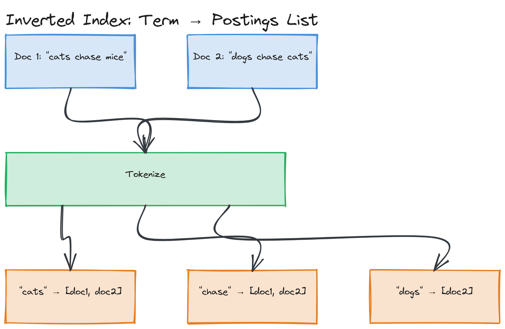
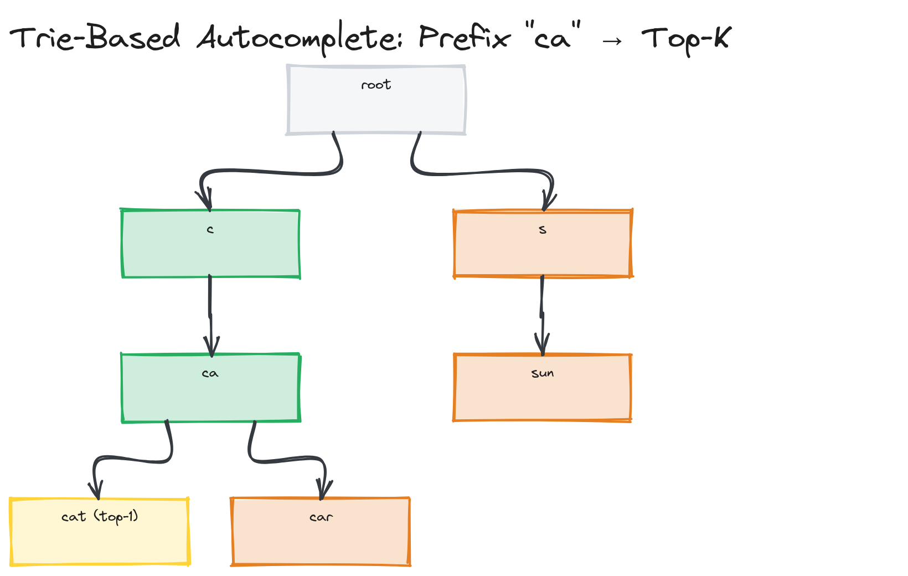

# Module 18 — Concepts: Full-Text Search and Relevance Ranking

## Why This Matters

A `SELECT * FROM products WHERE name LIKE '%running shoes%'` query feels like search until you use it: it can't handle typos, can't rank "best match" above "first match," can't understand that "shoes for running" and "running shoes" mean the same thing, and gets catastrophically slow as the table grows since no index helps a leading-wildcard scan. Real search — the kind that makes Amazon, Google, and Airbnb feel instant and forgiving — is a different data structure and a different problem entirely: not "does this row match," but "out of millions of documents, which 10 are the *best* answer, ranked by relevance, in under 100ms." This module covers the inverted index that makes that lookup fast, the scoring math that makes the ranking good, and the infrastructure (Elasticsearch) that productionizes both at scale.

---

## The Inverted Index

A relational database index maps a column value to the rows that contain it. An **inverted index** does the same thing for text: it maps each unique *term* (word) to the list of documents that contain it, called a **postings list**.

**Forward index (what you'd build naively):** `doc1 → "the quick brown fox"`, `doc2 → "the lazy dog"` — to find documents containing "fox," you'd scan every document.

**Inverted index (what search engines actually build):**

```
"quick"  → [doc1]
"brown"  → [doc1]
"fox"    → [doc1]
"lazy"   → [doc2]
"dog"    → [doc2]
"the"    → [doc1, doc2]
```

Now finding documents containing "fox" is a single hashmap lookup, not a scan. Multi-term queries ("quick fox") become **set intersection** or **union** of postings lists — intersection for AND semantics, union for OR semantics. This is exactly the data structure you'll build by hand in [Coding Challenge 02](../04-exercises/coding-challenges/challenge-02/).


*Two source documents tokenized into terms, and the resulting inverted index mapping each unique term to its postings list of document IDs.*

Building the index applies a pipeline to every document first:
1. **Tokenization** — split text into terms ("Running shoes!" → `["running", "shoes"]`)
2. **Lowercasing / normalization** — so "Shoes" and "shoes" match
3. **Stop word removal** (optional) — drop high-frequency, low-information words like "the," "a," "is"
4. **Stemming/lemmatization** — reduce words to a root form ("running," "runs," "ran" → "run") so a query matches documents using a different form

> ⚠️ **Warning:** Aggressive stemming/stop-word removal improves recall but can break exact-phrase intent — searching for "The Who" with naive stop-word removal on "the" loses half the query. Elasticsearch lets you configure or disable these per-field.

---

## TF-IDF: Scoring Term Importance

Knowing *which* documents contain a term isn't enough — you need to rank them by relevance. **TF-IDF (Term Frequency–Inverse Document Frequency)** is the classical scoring formula:

- **TF (Term Frequency)** — how often the term appears in *this* document. Mentioning "kubernetes" 8 times suggests a document is more about Kubernetes than one mentioning it once.
- **IDF (Inverse Document Frequency)** — how rare the term is *across all documents*: `idf = log(N / df)`, where `N` is total documents and `df` is documents containing the term. Common terms (like "the") get pushed toward zero weight; rare terms get amplified.
- **TF-IDF score** = `tf * idf`, summed across all query terms present in the document.

The intuition: a document scores high for a term that's *frequent here* and *rare everywhere else* — the signal that distinguishes "specifically about X" from "merely mentions X in passing." A working scorer over a tiny document set is implemented in [`examples/tfidf-scorer.ts`](./examples/tfidf-scorer.ts).

---

## BM25: What Production Search Engines Actually Use

TF-IDF has a flaw: term frequency contributes *linearly and unboundedly* — a document repeating "shoes" 100 times scores 10x higher than one repeating it 10 times, though neither is "10x more about shoes" to a human. **BM25** — the default ranking algorithm in Elasticsearch and Lucene — fixes this with two refinements:

1. **Term frequency saturation** — via parameter `k1` (~1.2), additional occurrences contribute diminishing returns instead of linear growth. The 100th occurrence of "shoes" barely moves the score; the 2nd moves it a lot.
2. **Document length normalization** — via parameter `b` (~0.75), BM25 penalizes long documents that rack up term frequency simply by containing more words, normalizing against average document length.

The formula for a single term:

```
BM25(term, doc) = IDF(term) × [ tf × (k1 + 1) ] / [ tf + k1 × (1 - b + b × |doc| / avgDocLength) ]
```

> 💡 **Note:** You don't need to memorize the formula — you need to say *why* BM25 beats raw TF-IDF: it saturates term frequency and normalizes for document length (a 50-word doc and a 5,000-word doc both mentioning a term 5 times shouldn't score identically). That's what interviewers listen for.

---

## Elasticsearch Architecture

Elasticsearch (and its open-source fork, OpenSearch) is the dominant production search engine, built on Apache Lucene, which implements the inverted index and BM25 scoring under the hood.

| Concept | What It Is |
|---|---|
| **Index** | A collection of documents with a similar structure — roughly analogous to a "table" in a relational database, though schema is far more flexible |
| **Document** | A single JSON record being indexed (e.g., one product, one listing) — analogous to a "row" |
| **Mapping** | The schema for an index — defines each field's type (`text`, `keyword`, `geo_point`, etc.) and how it should be analyzed/tokenized |
| **Shard** | An index is split into shards (each shard is an independent Lucene index) so the index can scale horizontally across multiple nodes and parallelize query execution |
| **Replica** | A copy of a shard on a different node, for both fault tolerance and read throughput (replicas can serve read queries too) |

A query like "running shoes" is sent to every shard of the relevant index in parallel; each shard scores and returns its own top candidates, and the coordinating node merges and re-ranks those candidate sets into the final top-K result — a scatter-gather pattern also used for distributed aggregation in other systems.

> 🎯 **Interview Tip:** "Why shards?" has the same answer as sharding anywhere else in this repository (see [Module 04](../../module-04-databases/)) — a single node can't hold the whole index or serve all the query load. The Elasticsearch-specific detail worth adding: each shard *is* a complete, independent Lucene index capable of answering a query on its own slice of the data, which is why queries fan out to all shards and results get merged centrally.

`text` vs. `keyword` is the single most consequential mapping decision: a `text` field is analyzed (tokenized, lowercased, stemmed) for full-text matching, while a `keyword` field is stored as-is for exact matching, sorting, and aggregations. Mapping a `status` field as `text`, for example, silently breaks exact filtering on the literal value "in_progress" — one of the most common real-world Elasticsearch mistakes.

---

## Search Relevance: Ranking Factors and Function Score

BM25 gives a baseline textual-relevance score, but real search usually layers more signals on top:

- **Field boosting** — weight matches in some fields higher (a match in `title` should usually outrank one buried in `description`)
- **Recency boosting** — newer documents often deserve a bump independent of text match quality
- **Popularity/business signals** — sales rank, click-through rate, ratings, sponsored placement
- **Geo-proximity** — for location-aware search, distance from the user is itself a relevance signal, not just a filter

Elasticsearch's **function score query** combines the base BM25 score with these signals via custom functions (decay curves for recency/distance, a multiplier from a popularity field, etc.), producing a final blended score — the mechanism behind "why does this less-textually-relevant result outrank a perfect text match" (almost always a non-text signal pulling rank).

> ⚠️ **Warning:** It's tempting to keep adding boost signals until results "look right" by eyeballing them — but without measuring relevance quantitatively (click-through rate, A/B testing boost weights, human relevance judgments), tuning becomes guesswork that silently degrades for queries you never manually checked.

---

## Autocomplete / Type-Ahead

Autocomplete predicts what the user is typing before they finish, both to save keystrokes and to guide them toward queries the system actually has good results for. Three common approaches, in increasing order of production sophistication:

- **Prefix trees (Tries)** — a tree where each path from root to a node spells out a prefix; walking down the tree by the characters typed so far instantly narrows to all words sharing that prefix. Simple, exact-prefix-only, and the foundation of [Coding Challenge 01](../04-exercises/coding-challenges/challenge-01/), where you'll implement one with weighted top-K suggestions.
- **Edge n-grams** — instead of a tree, index every *prefix* of a term as a separate token at indexing time ("shoes" → `s`, `sh`, `sho`, `shoe`, `shoes`). A query for "sho" becomes a normal exact-term lookup against the `sho` token — how Elasticsearch implements prefix matching using its standard inverted index machinery, no special tree structure needed.
- **Completion suggester** — Elasticsearch's purpose-built autocomplete structure, an in-memory finite state transducer (FST) far more memory-efficient than edge n-grams at scale, with native fuzzy (typo-tolerant) prefix matching.


*A Trie built from a small weighted word list, with the traversal path for a sample prefix highlighted and the top-K highest-weighted completions under that node called out.*

> 🎯 **Interview Tip:** Separate two different "top-K" problems: top-K *by prefix match* (what completions exist) and top-K *by weight* among those matches (which to actually show, ranked). A trie alone gives you the first; an additional weight per word plus an efficient way to retrieve the top-K weighted completions under a node gives you the second. This is exactly what you'll implement in Coding Challenge 01 and revisit at internet-scale in [Design Challenge 02](../04-exercises/design-challenges/challenge-02.md).

---

## Key Takeaways

- An inverted index maps terms → postings lists of documents, turning "find documents with this word" into a hashmap lookup instead of a full scan; multi-term queries become postings-list intersection (AND) or union (OR).
- TF-IDF scores relevance by rewarding terms that are frequent in a document but rare across the corpus; BM25 improves on it with term-frequency saturation and document-length normalization, and is what Elasticsearch/Lucene actually use.
- Elasticsearch indices are split into shards (for horizontal scale) with replicas (for fault tolerance and read throughput); queries fan out to all shards and results are merged centrally.
- Real-world relevance blends BM25's text score with non-text signals — recency, popularity, geo-proximity — via a function score; tuning these without measurement is guesswork.
- Autocomplete ranges from tries (exact prefix, simple) to edge n-grams (prefix matching via the standard inverted index) to completion suggesters (FST-based, typo-tolerant, memory-efficient at scale).
