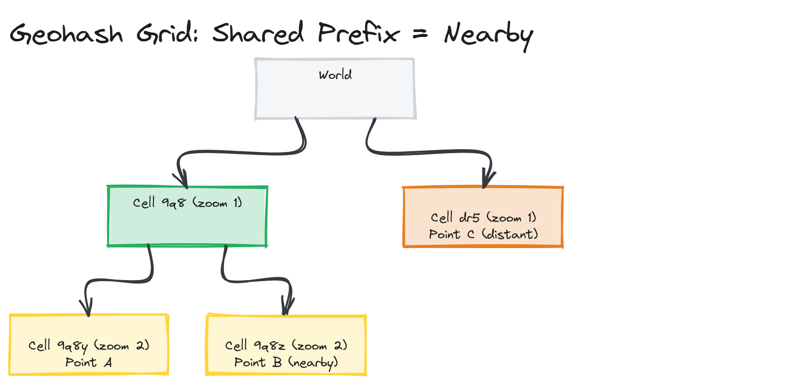

# Module 18 — Deep Dive: Geo-Search, Faceted Search, and Keeping Indexes in Sync

## Why This Matters

A text search index that's accurate the moment you build it and never touches a database again is a toy. Real search systems sit in front of a constantly-changing source of truth (products get re-priced, listings get booked, posts get edited), need to filter and aggregate on structured fields alongside free text ("4-star hotels under $200, sorted by distance"), and increasingly need to answer "what's near me" as a first-class query, not an afterthought. This deep dive covers what goes beyond "rank documents by text relevance": location, filters, and the plumbing that keeps a search index from silently drifting out of sync with the database it mirrors.

---

## Geo-Search: Geohashing and S2 Cells

Searching "restaurants near me" is a fundamentally different question than text relevance: which documents fall within (or are closest to) a geographic radius? Computing the distance from the query point to every document's coordinates doesn't scale. Two real techniques turn 2D location into something indexable:

**Geohashing** encodes a (latitude, longitude) pair into a single string by recursively subdividing the world into a grid: each additional character narrows the area by roughly a factor of 32. Geohashes sharing a long common prefix are usually nearby — `9q8yy` and `9q8yz` are close together, since subdividing a region preserves locality within it. "Find things near this point" becomes "find documents whose geohash shares a prefix with mine" — a prefix lookup against a normal inverted index, no special spatial structure required. A simplified encoder/decoder demonstrating this is in [`examples/geohash.ts`](./examples/geohash.ts).

*The world recursively subdivided into a geohash grid across two zoom levels: two nearby points share a common cell prefix, while a third, distant point falls under a completely different prefix.*

> ⚠️ **Warning:** Two points can be geographically adjacent but fall on opposite sides of a grid cell boundary, ending up with completely different geohash prefixes despite being meters apart (worst near the equator and prime meridian, where grid cells flip). Production systems search neighboring cells too, not just the exact match, to compensate.

**S2 cells** (Google's S2 Geometry library) solve the same problem more robustly: instead of a flat lat/lon grid, S2 projects the sphere onto a cube and recursively subdivides each face, avoiding the lat/lon distortion near the poles and handling cell-boundary adjacency more gracefully. Uber and Google use S2 in production for exactly this reason — a geometrically correct version of the same prefix-locality idea.

**PostGIS** (a PostgreSQL extension) takes a third approach: real geometric/geographic types (`POINT`, `POLYGON`) and spatial indexes (GiST-based R-trees) directly in the relational database, supporting "points within this polygon" or "nearest 10 to this location" natively in SQL — fitting when search needs are primarily geospatial.

**Elasticsearch geo queries** combine both worlds: `geo_point` supports `geo_distance` (radius) and `geo_bounding_box` (rectangle) queries natively, using internal structures similar to geohashing/quad-trees, while letting you combine geo filtering with full-text relevance and other filters in one query.

> 🎯 **Interview Tip:** For location-based search (delivery, ride-hailing, Airbnb-style listings), naming "geohash or S2 cell as the indexing structure, proximity as a hard filter (radius) or a ranking signal (distance decay via function score)" early signals you know this isn't solved by "just store lat/lon and compute distance per row."

---

## Faceted Search

Faceted search is the "filter sidebar" pattern — checkboxes for brand, price, rating, color — letting a user narrow results along multiple structured dimensions while seeing *how many results each facet value would produce* before clicking it.

Implemented in Elasticsearch as two features in the same query:
1. **Filtering** — a `bool` query's `filter` clauses (price $50-$100 AND brand = "Nike") narrow the result set. Filters don't affect scoring — strict yes/no per document — and are cacheable, unlike scored `must` clauses.
2. **Aggregations** — computed alongside the filtered query, a `terms` aggregation on `brand` returns counts per value *within the current filtered set* — the "Nike (412) Adidas (289)" counts next to checkboxes.

> 💡 **Note:** Facet counts are usually computed against the result set *before* the facet being counted is itself applied — otherwise selecting "Nike" would zero out every other brand's count, which isn't what users expect. Elasticsearch handles this with aggregations as siblings of the filter, not nested inside it, for "global" per-facet counts.

Facets require fields mapped as `keyword` (exact, not analyzed) — aggregating a `text` field aggregates individual tokens, not whole values, almost never what a filter sidebar wants (the same `text` vs. `keyword` distinction from [01-concepts](../01-concepts/README.md)).

---

## Search Indexing Pipeline

A search index is a derived view — the database (or event log) is the source of truth, and the search index is a denormalized, search-optimized copy built for fast querying, not transactional correctness. Getting from "row updated in the database" to "document updated in the search index" requires a pipeline:

1. **Extraction** — read relevant records from the source database, typically denormalizing joins here (a "product" document might combine the product row with its category name and aggregate review rating, fields living in separate source tables)
2. **Transformation** — apply tokenization rules, compute derived fields (a popularity score, a geohash from lat/lon), and shape the document into the index's mapping
3. **Loading** — bulk-index transformed documents (Elasticsearch's `_bulk` API — batching is far more efficient than one document at a time)

*The flow from a source database, through an extraction/transformation stage that denormalizes joined data and computes derived fields, to a bulk-load step into Elasticsearch shards.*

The first full index build (millions of documents) is typically a one-time **batch reindex**; afterward, the system needs an ongoing mechanism for keeping the index current as the database keeps changing.

---

## Keeping Search Indexes in Sync with the Database

Once the initial index exists, every subsequent database write must eventually be reflected in it too. Two fundamentally different strategies:

**Polling (batch sync)** — periodically query the database for rows changed since the last sync (an `updated_at` timestamp or change-tracking column) and re-index just those. Simple, but introduces a staleness window equal to the polling interval — a price change won't show up until the next poll runs.

**Event-driven indexing (CDC — Change Data Capture)** — every database write emits an event (a message queue, or tailing the write-ahead log/binlog with a tool like Debezium) that triggers an immediate, targeted re-index. Covered in depth in [Module 17 — Data Pipelines](../../module-17-data-pipelines/) and [Module 08 — Message Queues](../../module-08-message-queues/); applied here, results reflect a write within seconds rather than minutes, at the cost of a CDC pipeline as additional infrastructure.

| | Polling | Event-driven (CDC) |
|---|---|---|
| Staleness | Bounded by poll interval (minutes) | Near-real-time (seconds) |
| Complexity | Low — a scheduled job and a timestamp column | Higher — requires a CDC pipeline or message queue |
| Database load | Periodic batch queries | Continuous but small, change-by-change |
| Failure mode | A failed poll just delays the next poll | A lost or out-of-order event can silently skip a document, with no obvious symptom |

> ⚠️ **Warning:** "Dual writes" — the application writing to the database and search index directly, in the same request handler, without a CDC layer — is common but fragile: if the index write fails after the database write succeeds (or vice versa), the two silently diverge with no automatic recovery. CDC tailing the actual write log is more robust because it derives the index from the same durable source of truth already committed, instead of trusting the application to write to two places atomically.

A robust production setup typically combines both: event-driven indexing for low-latency freshness, plus periodic reconciliation as a safety net catching anything the event pipeline missed (a dropped message, a CDC connector bug, a manual database fix bypassing the normal write path).

---

## Key Takeaways

- Geohashing and S2 cells both turn 2D location into a string/integer where shared prefixes imply geographic proximity, making "near me" a prefix-lookup problem instead of a per-row distance computation; S2 handles sphere distortion and cell-boundary edge cases more robustly than flat geohashing.
- Faceted search combines a filtering clause (narrows results, doesn't affect scoring) with aggregations computed over that same filtered set (the per-facet counts) — and facet fields must be mapped as `keyword`, not `text`.
- A search index is a derived, denormalized view built for query speed — not the source of truth — populated via an extract/transform/bulk-load pipeline.
- Polling-based sync is simple but bounds freshness to the poll interval; event-driven (CDC) sync is near-real-time but requires more infrastructure and has subtler failure modes (lost/out-of-order events).
- Production systems typically combine event-driven sync for freshness with periodic reconciliation as a safety net, rather than trusting either mechanism alone to never miss an update.
