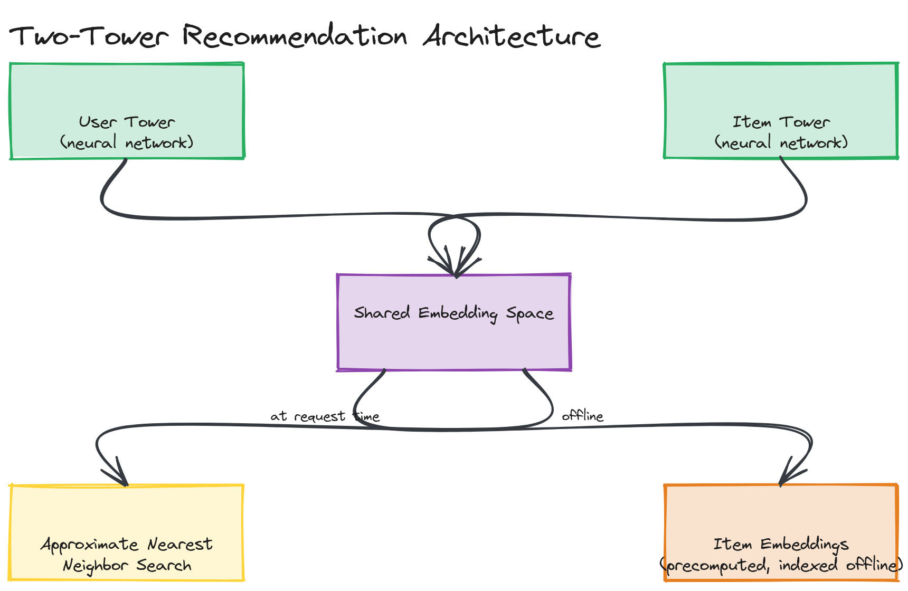
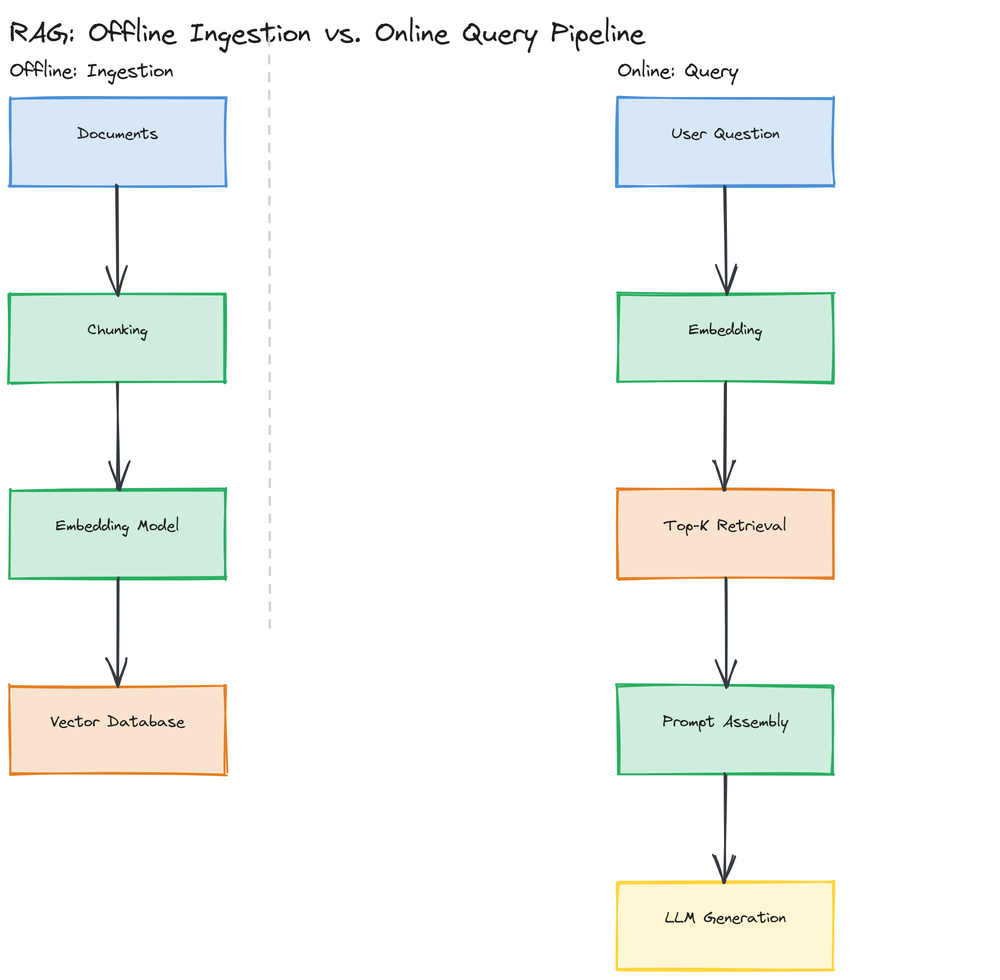

# Module 19 — Deep Dive: Recommendation Systems, Monitoring, and LLM Infrastructure

## Why This Matters

"Design Netflix's recommendation system" and "design a RAG system" are now two of the most common senior/staff system design prompts, and they reward exactly the kind of layered reasoning this module builds: knowing that "recommend things" decomposes into candidate generation (find a few hundred plausible items out of millions) and ranking (precisely order those few hundred), that "search for similar vectors" at scale requires approximate — not exact — nearest neighbor search, and that "the model works in the demo" is not the same claim as "the model will still work in three months." This deep dive is about the internals that separate a memorized vocabulary list (FAISS, HNSW, drift, KV cache) from the ability to explain *why* each piece exists and what breaks without it.

---

## Recommendation Systems

Production recommenders almost universally use a **two-stage funnel** rather than scoring every item for every user directly, because scoring tens of millions of items per request is computationally infeasible within a real-time latency budget:

1. **Candidate generation** — cheaply narrow millions of items down to a few hundred plausible candidates per user.
2. **Ranking** — apply a much more expensive, precise model to just those few hundred candidates to produce the final ordered list.

### Collaborative Filtering

Collaborative filtering recommends based on **behavioral similarity**, not item content: "users who liked what you liked also liked this." Classically implemented via matrix factorization — decomposing a giant, extremely sparse user-item interaction matrix (most users haven't interacted with most items) into two much smaller dense matrices, a user-embedding matrix and an item-embedding matrix, such that their product approximates the original interactions. The appeal is that it requires no understanding of *why* items are similar — pure behavioral signal is enough. The weakness is the **cold-start problem**: a brand-new user or item has no interaction history yet, so there's nothing to factorize, and the model has nothing to go on.

### Content-Based Filtering

Content-based filtering recommends based on **item attributes** — genre, cast, director, text description, tags — matched against a profile of what a specific user has previously engaged with. This directly solves collaborative filtering's cold-start problem for new items (a brand-new movie still has genre/cast metadata, even with zero views yet) but has the opposite weakness: it tends to over-recommend more of the same, and can't capture the kind of surprising cross-genre affinity collaborative filtering picks up purely from behavior. Most production systems blend both signals rather than picking one exclusively.

### Two-Tower Models

A **two-tower model** is the modern, scalable architecture used for candidate generation at companies like YouTube and Netflix: two separate neural networks ("towers") independently encode the user (from their history, demographics, context) and the item (from its content/metadata) into embedding vectors of the *same* dimensionality, trained so that a user's embedding is close (by dot product or cosine similarity) to the embeddings of items they engaged with. The key system-design property: because the two towers are independent, **all item embeddings can be precomputed offline** and indexed once, and at serving time you only need to compute the *user's* embedding (one forward pass) and then search the precomputed item index for the nearest vectors — turning "rank millions of items" into "one embedding computation plus one nearest-neighbor search."

*A user tower and an item tower as separate neural networks producing embeddings in the same vector space — item embeddings precomputed and indexed offline, with a single user embedding at request time queried against that index via approximate nearest neighbor search.*

> 🎯 **Interview Tip:** Naming the two-stage funnel (cheap candidate generation, expensive ranking) unprompted is one of the strongest signals in a recommendation-system interview — it shows you understand *why* the system is structured this way (latency and cost at scale), not just that "there's an ML model somewhere."

### Approximate Nearest Neighbor Search: FAISS and HNSW

Once items are embedded as vectors, "find similar items" becomes "find the nearest vectors in high-dimensional space" — and doing this *exactly* (brute-force comparing a query vector against every item vector) does not scale past a few hundred thousand items at real-time latency. **Approximate Nearest Neighbor (ANN)** search trades a small amount of recall (occasionally missing the true nearest neighbor) for massive speed gains:

- **FAISS** (Facebook AI Similarity Search) is a library, not a single algorithm — it implements multiple ANN strategies, most notably **IVF (Inverted File Index)**, which clusters the vector space into partitions ("cells") at index-build time, then at query time only searches the handful of cells closest to the query vector instead of the whole dataset; often paired with **product quantization** to compress vectors and shrink memory footprint at large scale.
- **HNSW (Hierarchical Navigable Small World graphs)** builds a multi-layer graph where each vector is a node connected to its approximate nearest neighbors; search starts at a sparse top layer and greedily descends through denser layers, converging on the true nearest neighbors in roughly logarithmic steps. HNSW is generally the better default for low-latency, high-recall search on a single machine; FAISS's IVF-based indexes tend to win on raw scale and tunable memory/speed/recall trade-offs across distributed shards.

A hands-on, brute-force-vs-concept illustration of this nearest-neighbor search step (the same primitive both libraries optimize) is in [`examples/ann-search.ts`](./examples/ann-search.ts).

> ⚠️ **Warning:** "Approximate" means approximate — an ANN index can return the 2nd or 3rd closest vector instead of the true closest one. This is an acceptable, deliberate trade-off for recommendation/retrieval (missing the single best candidate out of hundreds returned is harmless), but it is a real correctness trade-off you should name explicitly in an interview, not gloss over.

---

## Model Monitoring: Drift Detection

A model that was 95% accurate at launch can become steadily less accurate with zero code changes and zero new deployments — because the real world it makes predictions about keeps moving while the model's learned parameters stay frozen. Three distinct things can drift, and distinguishing them is a precise, frequently-tested concept:

| Drift Type | What Changes | Example |
|---|---|---|
| **Data drift** (a.k.a. feature drift / covariate shift) | The distribution of input features changes | A fraud model trained on pre-pandemic spending patterns sees a sudden shift toward online grocery spending |
| **Concept drift** | The relationship between inputs and the true label changes, even if input distributions look the same | The same transaction pattern that was "normal" last year is now indicative of a new fraud technique — same inputs, different correct answer |
| **Prediction drift** | The distribution of the model's *output* predictions shifts | The model starts flagging a much higher (or lower) percentage of transactions as fraud than it used to, which may be the visible symptom of either of the above |

Detecting drift typically means continuously comparing a statistical summary of recent live input/output distributions against the training-time distribution — using metrics like **population stability index (PSI)** or **KL divergence** for numeric/categorical feature distributions, and tracking the live prediction distribution and any delayed ground-truth labels (when available) for prediction and concept drift respectively.

> 💡 **Note:** Concept drift is the hardest of the three to detect, because the inputs can look completely unchanged — you genuinely need new ground-truth labels (which often arrive late, e.g., "was this transaction actually fraud" confirmed weeks later via a chargeback) to notice the input-output relationship itself has shifted. Data drift, by contrast, can be detected immediately from input distributions alone, with no labels required — which is why most real-time drift dashboards lead with data drift, even though concept drift is often the more dangerous failure.

> 🎯 **Interview Tip:** If asked "how would you know your model needs retraining?", naming data drift, concept drift, and prediction drift as three distinct, separately-monitored signals — rather than a single vague "monitor performance" — is what separates a strong answer. Pair it with the practical caveat that concept drift detection is bottlenecked on label latency.

---

## LLM Infrastructure

Serving large language models in production introduces infrastructure problems classical ML serving didn't have, almost entirely driven by model size and the autoregressive (one-token-at-a-time) generation process:

- **GPU clusters and model parallelism**: a large LLM's weights often don't fit in a single GPU's memory, so the model must be split across multiple GPUs. **Tensor parallelism** splits individual weight matrices across GPUs (each GPU computes a slice of every layer, requiring fast interconnects since GPUs must communicate within every layer's forward pass); **pipeline parallelism** instead assigns different *layers* to different GPUs, passing activations between them like a relay — different trade-offs between communication overhead and GPU utilization, and real deployments often combine both.
- **KV cache**: generating each new token in an autoregressive model technically requires re-attending to every previous token — naively, this means recomputing attention over the entire growing sequence for every single new token, which is quadratically wasteful. The **KV cache** stores the key/value attention vectors for all previously-processed tokens so each new token only needs one incremental computation, not a full recompute. The trade-off: the KV cache itself consumes substantial GPU memory, and that memory footprint grows with both sequence length and batch size, directly capping how many concurrent requests a GPU can serve — KV cache memory is one of the central capacity-planning numbers in LLM serving.
- **Quantization**: reducing the numeric precision of model weights (e.g., from 16-bit to 8-bit or 4-bit) shrinks memory footprint and increases inference throughput, at some cost to output quality — usually a favorable trade since modern quantization techniques preserve most quality while roughly halving (or better) memory use per precision step down.
- **Batching**: grouping multiple concurrent requests into a single GPU forward pass dramatically improves throughput (GPUs are throughput-oriented hardware; running many small requests one-at-a-time wastes most of the chip's parallelism). The complication unique to LLMs is that requests in a batch finish generating at different times (some sequences are short, some long) — **continuous batching** (used by serving frameworks like vLLM) solves this by dynamically adding new requests into a batch as soon as any sequence in it finishes, instead of waiting for the entire batch to complete before accepting new work.

> ⚠️ **Warning:** Quantization and batching are both throughput/latency optimizations with a real quality or fairness cost: aggressive quantization can measurably degrade output quality on harder prompts, and naive (non-continuous) batching can let one long-running request in a batch hold up latency for every other request batched alongside it. Mention the cost side, not just the speedup, when discussing these in an interview.

---

## Retrieval-Augmented Generation (RAG) System Design

RAG addresses a specific LLM limitation: a language model's knowledge is frozen at training time and it can confidently fabricate ("hallucinate") facts it doesn't actually know. RAG fixes this by retrieving relevant real documents at query time and inserting them into the model's prompt as grounding context, so the model generates an answer *from* supplied evidence rather than from parametric memory alone. A production RAG pipeline has four stages:

1. **Chunking** — source documents are split into smaller passages (typically a few hundred tokens each, often with some overlap between consecutive chunks) before embedding, because embedding an entire long document into one vector loses too much fine-grained detail for precise retrieval, and because the retrieved chunk has to fit inside the LLM's context window alongside the user's question.
2. **Embedding pipeline** — each chunk is passed through an embedding model (a much smaller, specialized neural network than the LLM itself) to produce a dense vector representing its semantic content; this runs once per document at ingestion time, not per query.
3. **Vector database** — chunk embeddings are stored in a database built for fast ANN search at scale (the same FAISS/HNSW techniques from the recommendation section above, productized as managed or embeddable systems): **Pinecone** (fully managed, purpose-built vector DB), **Weaviate** (open-source, supports hybrid vector+keyword search), and **pgvector** (a PostgreSQL extension adding vector similarity search to an existing relational database — the right choice when you don't want to operate a whole separate system just for vectors and your scale doesn't yet demand one).
4. **Retrieval and generation** — at query time, the user's question is embedded with the same embedding model, the vector database returns the top-k most similar chunks, and those chunks are concatenated into the LLM's prompt alongside the original question, instructing the model to answer using the supplied context.

*The two distinct pipelines in RAG: an offline ingestion pipeline (documents → chunking → embedding model → vector database) and an online query pipeline (question → embedding → top-k retrieval → prompt assembly → LLM generation).*

> 💡 **Note:** The choice between Pinecone, Weaviate, and pgvector is a classic build-vs-buy-vs-extend trade-off, not a quality ranking: Pinecone trades operational simplicity for being a new, dedicated piece of infrastructure and vendor dependency; Weaviate gives you open-source control and hybrid search at the cost of operating it yourself; pgvector minimizes new infrastructure by reusing a database you likely already run, at the cost of less specialized performance at very large vector-search scale.

> ⚠️ **Warning:** Chunk size and overlap are not minor tuning details — too-large chunks dilute the embedding's semantic precision (a 2,000-token chunk's embedding is a blurry average of everything in it), while too-small chunks lose surrounding context the LLM needs to use the retrieved passage correctly. This trade-off, plus the retrieval step's ANN approximate-recall limitation discussed earlier in this deep dive, is exactly what [Design Challenge 02](../04-exercises/design-challenges/challenge-02.md) asks you to reason through concretely.

---

## Key Takeaways

- Production recommenders use a two-stage funnel (cheap candidate generation, expensive ranking) because scoring every item for every user directly does not scale — two-tower models make this practical by letting item embeddings be precomputed offline.
- Approximate nearest neighbor search (FAISS, HNSW) trades a small, deliberate amount of recall for the speed needed to search millions of vectors within a real-time latency budget.
- Data drift, concept drift, and prediction drift are three distinct, separately-detected phenomena — concept drift is the hardest to catch because it requires new ground-truth labels, not just input distribution monitoring.
- LLM serving infrastructure (model parallelism, KV cache, quantization, continuous batching) exists almost entirely to fit huge models into finite GPU memory and squeeze more throughput out of expensive accelerators, each with a real quality or latency-fairness cost.
- RAG's ingestion pipeline (chunking → embedding → vector DB) runs offline and once per document; its query pipeline (embed question → retrieve top-k → generate) runs online per request — keeping these two pipelines conceptually separate is the foundation of a correct RAG design.
