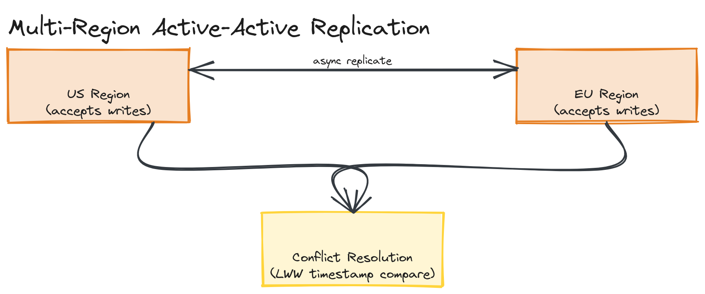
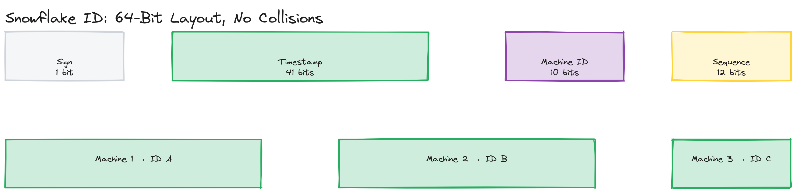

# Module 20 — Concepts: Multi-Region, Global IDs, Rate Limiting & Resilience at Scale

## Why This Matters

Everything up to this point in the course has mostly assumed a single region, a single source of truth, and a system small enough that "just retry it" or "just add an instance" is a sufficient answer. At FAANG scale, those assumptions break down one at a time: a single region becomes a single point of geographic failure, a single auto-increment ID becomes a single point of write contention, a per-node rate limiter becomes trivially bypassable by spreading requests across nodes, and a naive retry becomes the thing that takes your own dependency down. This module is about the patterns that hold once a system has outgrown "one of everything."

---

## Multi-Region Architectures

A multi-region system runs in more than one geographic location, for two reasons: **latency** (serve users from the region closest to them) and **availability** (survive the loss of an entire region — a real failure mode, not a hypothetical one).

### Active-Active vs. Active-Passive

| | Active-Active | Active-Passive |
|---|---|---|
| **How it works** | Every region accepts both reads and writes simultaneously | One region (primary) accepts writes; others (standbys) are read-only replicas, promoted only on failover |
| **Latency** | Best — users write to their nearest region | Writes always travel to the primary region, regardless of user location |
| **Failover** | Often seamless — other regions are already serving live traffic | Requires a failover step (promote a standby), which takes time and can lose the most recent un-replicated writes |
| **Complexity** | High — must resolve conflicts when the same data is written in two regions concurrently | Lower — single writer means no concurrent-write conflicts to resolve |
| **Cost** | Higher — every region runs full read/write capacity | Lower — standby regions can run reduced capacity |

> 🎯 **Interview Tip:** Don't default to "active-active, obviously, it's more available" — that's the kind of buzzword-without-trade-off answer that costs senior candidates points. Active-passive is the right, simpler answer for a huge number of systems (anything where write volume is modest and a failover RTO of a minute or two is acceptable). Reach for active-active when you can name the specific reason: extremely latency-sensitive global writes, or an availability target that can't tolerate even a brief failover window.

### Data Replication Across Regions

Cross-region replication is fundamentally constrained by the speed of light — a round trip between, say, US-East and Europe is on the order of 70–100ms no matter how good your network is. This single fact drives most multi-region design decisions:

- **Synchronous cross-region replication** (wait for the other region to acknowledge before confirming a write) gives strong consistency but adds that full round-trip latency to every write — usually a non-starter for latency-sensitive paths.
- **Asynchronous cross-region replication** (acknowledge locally, replicate in the background) keeps writes fast but means a region can be behind, and a regional failure can lose the most recent un-replicated writes.

Most production multi-region systems pick asynchronous replication for the general case and reserve synchronous replication for a small number of fields where losing the latest value is unacceptable (e.g., a ledger balance), echoing the same consistency-vs-latency trade-off covered for single-region replicas in [Module 04 — Databases](../../module-04-databases/01-concepts/README.md) and formalized in [Module 13 — Consistency, Consensus & CAP Theorem](../../module-13-consistency-consensus/01-concepts/README.md) — multi-region is that same trade-off, just with a much larger speed-of-light penalty.

### Conflict Resolution

In active-active systems, the same record can be written in two regions before either write has replicated to the other — a genuine conflict, not a bug. Common resolution strategies:

- **Last-write-wins (LWW)** — attach a timestamp (or hybrid logical clock) to every write; the latest timestamp wins. Simple, but can silently discard a legitimate concurrent write.
- **Vector clocks / version vectors** — track causality explicitly so the system can detect "these two writes were truly concurrent" rather than guessing from wall-clock time, at the cost of more bookkeeping.
- **CRDTs (Conflict-free Replicated Data Types)** — data structures (counters, sets, sequences) specifically designed so concurrent updates always merge deterministically without any conflict resolution step at all. Powerful, but only available for the specific data shapes that have a known CRDT design.
- **Application-level merge** — push the conflict up to domain logic (e.g., merge two concurrently-edited shopping carts by union of items) when neither LWW nor a CRDT fits the semantics.

*Two regions (US and EU) both accepting writes for the same logical record, async-replicating to each other, with a conflict-resolution step (LWW timestamp comparison) reconciling both regions' writes for the same key.*

> ⚠️ **Warning:** "We'll just use last-write-wins" is a real answer, but say out loud what it costs: a legitimate update can be silently overwritten with no error, no merge, and no record that data was lost. That's an acceptable trade-off for a user's "last viewed" timestamp; it's not acceptable for an inventory count or a financial balance.

---

## Global Transaction IDs and Distributed ID Generation

A single auto-increment column works fine on one database. The moment you have multiple writers (multiple regions, multiple shards, multiple nodes), you need IDs that are unique *without* a single node coordinating every assignment.

| Scheme | Structure | Sortable by Time? | Size | Coordination Needed |
|---|---|---|---|---|
| **UUID (v4)** | 128 bits, fully random | No | 128 bits / 36-char string | None |
| **UUID (v7)** | 128 bits, leading timestamp + random | Yes | 128 bits / 36-char string | None |
| **Twitter Snowflake** | 64 bits: timestamp + machine/worker ID + per-ms sequence | Yes | 64 bits (fits in a `bigint`) | Each worker needs a unique, pre-assigned machine ID |
| **ULID** | 128 bits: 48-bit timestamp + 80-bit randomness, base32-encoded | Yes | 128 bits / 26-char string | None |

- **UUID v4** is the simplest possible answer — fully random, no coordination, globally unique with astronomically low collision probability. The cost: it's not sortable by creation time, and as a primary key it causes random-order B-tree inserts (page splits all over the index) rather than the append-friendly sequential inserts a time-ordered key gives you — directly relevant to the indexing discussion in [Module 04](../../module-04-databases/02-deep-dive/README.md).
- **Twitter Snowflake** packs a millisecond timestamp, a machine ID, and a per-millisecond sequence counter into a single 64-bit integer. It's compact (fits in a native `bigint`/`long`, unlike a 128-bit UUID), naturally sortable by generation time, and — critically — generated **without any network round trip or shared coordinator**, because each worker only needs to know its own pre-assigned machine ID and the current time. The cost: that machine ID has to be assigned and kept unique somehow (typically via a small coordination service like ZooKeeper or a config value at deploy time), and Snowflake IDs leak rough creation time and originating machine, which can be an information-disclosure concern.
- **ULID** is a middle ground: still time-sortable like Snowflake, still no coordination needed like UUID, but pays for that with a larger 128-bit size (versus Snowflake's compact 64 bits) — there's no free lunch, you trade size for the ability to skip machine-ID coordination entirely.

> 🎯 **Interview Tip:** If asked to design an ID generator, lead with the requirement that actually matters for the system at hand — "do downstream consumers need IDs sortable by creation time?" is usually the deciding question, not raw uniqueness (every scheme above is unique enough). A worked Snowflake-style generator, with the bit-packing made explicit, is in [`examples/snowflake-id-generator.ts`](./examples/snowflake-id-generator.ts).

> 💡 **Note:** A common mistake is reaching for a centralized ID-generation *service* (a single service everyone calls to get the next ID) "to be safe." That reintroduces exactly the single-writer bottleneck and single point of failure that distributed ID schemes exist to avoid. Snowflake's whole point is that no network call is needed at all — each node computes its own next ID locally and it's still guaranteed unique.

---

## Rate Limiting at Scale

[Module 03's API deep dive](../../module-03-apis/02-deep-dive/README.md) covers the token bucket algorithm on a single node: a bucket with a capacity, refilling at a fixed rate, where each request consumes a token. That implementation (built hands-on in [Module 03's coding challenge](../../module-03-apis/04-exercises/coding-challenges/challenge-03/)) works perfectly — as long as every request for a given client lands on the same node, so the bucket's in-memory state is consistent.

That assumption breaks the moment you have more than one application server behind a load balancer: a client's requests get spread across N nodes, each with its **own** independent token bucket. The client's effective limit becomes (single-node limit) × N — the rate limiter is technically running, and technically wrong.

### Distributed Rate Limiting

The fix is to move the bucket's state out of any individual node and into a **shared store** — almost always Redis, because the operation needs to be both fast (sub-millisecond) and atomic.

- **Why atomicity matters**: "check remaining tokens, then decrement" is two operations. If two requests from the same client hit two different application nodes at the same instant, both can read "1 token remaining" before either writes back the decrement — both get allowed, and the limit is silently violated by a classic race condition (the same class of bug covered generally in [Module 12 — Distributed Systems](../../module-12-distributed-systems/01-concepts/README.md)).
- **Why Lua scripts**: Redis executes a Lua script as a single atomic operation — no other client's command can interleave with it. A token bucket's "compute elapsed time, refill, check, decrement, return result" logic, written as one Lua script and executed via `EVAL`, becomes a single atomic round trip instead of multiple round trips with a race condition window between them.

*The 64-bit Snowflake layout (sign bit, 41-bit timestamp, 10-bit machine ID, 12-bit sequence) and three machines independently generating IDs in the same millisecond without collision.*

> ⚠️ **Warning:** A naive "distributed" rate limiter built as `GET` (read counter) followed by a separate `SET` (write counter) from application code is not actually atomic — there's a window between the two Redis round trips where another node's request can interleave. This is a frequently-missed detail in interviews: stating "we'll use Redis" for distributed rate limiting is necessary but not sufficient; you need to say *how* you make the check-and-decrement atomic (a Lua script, or Redis's built-in `INCR`-based patterns for simpler counters). The full worked design, including the actual Lua script, is in [`03-interview-prep/sample-answer.md`](../03-interview-prep/sample-answer.md).

---

## Idempotency at Scale

[Module 08's message queue deep dive](../../module-08-message-queues/02-deep-dive/README.md) introduces idempotent consumers: under at-least-once delivery, the same message can arrive twice, and a correct consumer must treat reprocessing the same message as a no-op rather than double-applying its effect (implemented hands-on in [`idempotent-consumer.ts`](../../module-08-message-queues/02-deep-dive/examples/idempotent-consumer.ts)). At scale, this same problem shows up beyond message queues, on the synchronous request path:

- **Idempotency keys** — the client generates a unique key (often a UUID) for a logical operation (e.g., "charge this card for this order") and sends it with the request. If the client's request times out and it retries, it sends the **same** idempotency key. The server checks whether it has already processed that key; if so, it returns the original result without re-executing the operation — critical for "exactly-once-feeling" operations like payments, where a network timeout on a request that actually succeeded server-side must not result in a double charge on retry.
- **Deduplication storage** — the server needs somewhere to record "this idempotency key has been seen, here's the result" — typically a database table with a unique constraint on the key (so a concurrent duplicate request fails the insert rather than racing), often with a TTL so the dedup table doesn't grow forever.
- **Scope of the key** — an idempotency key is only meaningful in combination with *what* it's keying (the same key with different request bodies should be rejected as an error, not silently processed as either request) — a detail that's easy to get wrong and worth stating explicitly in an interview.

> 💡 **Note:** Idempotency keys and the message-queue idempotent-consumer pattern are solving the same underlying problem — "the same logical operation might be attempted more than once, make repetition harmless" — at two different layers: idempotency keys at the synchronous client-to-server request layer, idempotent consumers at the asynchronous message-delivery layer. Recognizing they're the same pattern at different layers is itself a senior-level observation worth making explicitly in an interview.

---

## Backoff and Retry Strategies

Retrying a failed request is correct and necessary — networks are unreliable, dependencies have transient blips. Retrying **badly** is how a small transient failure becomes a cascading outage.

- **Fixed-interval retry** — retry every N seconds. Simple, but if a downstream service is overwhelmed and recovers, every client retrying at the exact same fixed interval hits it with a synchronized wave of traffic the instant it comes back up, potentially knocking it back down immediately — a self-inflicted **retry storm**.
- **Exponential backoff** — double the wait time after each failed attempt (1s, 2s, 4s, 8s, ...), capped at some maximum. Reduces total retry traffic over time, but doesn't by itself solve the synchronization problem: if every client started failing at the same moment (e.g., all of them, because the dependency just went down), they're all still retrying in lockstep at 1s, 2s, 4s, ... together.
- **Jitter** — add randomness to the backoff delay so clients that failed at the same moment don't retry at the same moment. "Full jitter" (pick a random delay between 0 and the computed exponential backoff value, rather than using that value exactly) is the most effective variant: it spreads retries across the widest window and empirically produces both the lowest total retry volume and the fastest successful recovery, per AWS's own analysis of this exact problem.

> 🎯 **Interview Tip:** "Exponential backoff" alone is an incomplete answer in a senior-level interview — the candidate who adds "...with jitter, because otherwise every client retries in a synchronized wave" is demonstrating they understand *why* the pattern works, not just that it exists. A working simulation contrasting retry-storm behavior with and without jitter, across many simulated clients, is in [`examples/exponential-backoff-jitter.ts`](./examples/exponential-backoff-jitter.ts) — run it and look at how much the peak concurrent-retry count differs between the two strategies.

> ⚠️ **Warning:** Backoff and retry without a cap on attempts (or a circuit breaker, covered in [Module 12](../../module-12-distributed-systems/02-deep-dive/README.md)) can keep a client retrying a permanently-failed request forever, holding resources (connections, threads, queue slots) the whole time. Always pair retry logic with a maximum attempt count or an overall deadline.

---

## Key Takeaways

- Active-active multi-region maximizes latency and availability but forces you to handle write conflicts; active-passive is simpler and is the right default unless you can name a specific reason to need active-active.
- Cross-region replication is bounded by the speed of light — synchronous replication trades latency for consistency across regions; most systems use asynchronous replication except for a small set of fields that truly can't tolerate losing the latest write.
- Snowflake-style IDs pack a timestamp, machine ID, and sequence into one integer, giving sortable, collision-free, coordination-free generation — at the cost of needing unique machine IDs assigned up front.
- Distributed rate limiting requires moving counter state into a shared store (Redis) and making the check-and-decrement atomic (a Lua script), or the limit becomes silently multiplied by the number of nodes.
- Exponential backoff alone doesn't prevent retry storms — random jitter is what actually desynchronizes clients that failed at the same moment, and is the detail that separates a correct retry strategy from one that looks correct.
