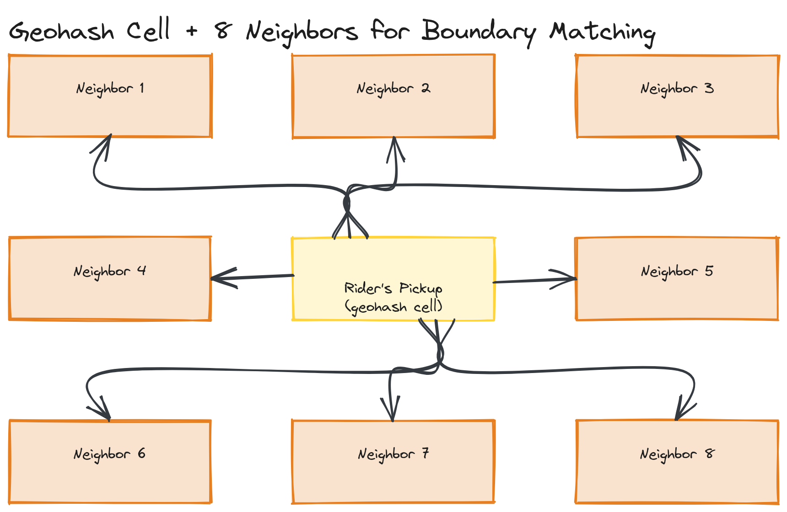

# Design Challenge 03 — Solution: Uber

## 1. Functional Requirements

- Rider requests a ride from a pickup to a destination location.
- System matches the rider with a nearby, available driver.
- Driver's location is tracked in real time, both for matching and for the rider's live map view during the ride.
- Ride is priced, including a surge multiplier under high demand relative to available supply.
- Ride state progresses through a lifecycle (requested → matched → in-progress → completed).
- **Out of scope:** payments processing, driver onboarding/ratings — real product surfaces, excluded to focus on the geospatial/real-time/matching problem that makes this prompt architecturally distinct from the other two capstones.

## 2. Non-Functional Requirements (Estimated, Stated as Assumptions)

- **Scale:** 5 million concurrent active drivers globally at peak, each sending a location update every 4 seconds while on-shift.
- **Ride requests:** 200,000 requests/sec globally at peak (highly concentrated in dense urban areas, not uniform — this geographic skew matters for sharding, noted explicitly).
- **Matching latency:** a rider should see a matched driver in **well under 10 seconds** — this is a hard product requirement, since waiting noticeably longer directly damages the product's core value proposition.
- **Consistency:** driver-to-rider matching must be strongly consistent in one specific sense — **a single driver must never be matched to two riders simultaneously** — while location data freshness can tolerate a few seconds of staleness without any real product harm. This split is the single most important consistency decision in the whole design, and I'm stating it explicitly up front because it determines which parts of the system need coordination and which don't.

## 3. Capacity Estimation

- **Location update throughput:** 5M drivers × 1 update / 4 sec ≈ **~1.25M location updates/sec** globally. This number alone tells me the location-update path needs to be cheap per-update and horizontally scalable — there is no database design that comfortably accepts 1.25M synchronous writes/sec to a single strongly-consistent store, which directly motivates treating location data as a high-throughput, loosely-consistent stream rather than a transactional record.
- **Matching latency budget:** with a 10-second target and needing to (a) find nearby candidate drivers, (b) rank/select one, (c) confirm with that driver, a reasonable budget is **~1–2 seconds for the geospatial candidate search itself**, leaving the remainder for driver app round-trip confirmation — this budget is what rules out any matching approach involving a full scan of all 5M drivers' positions.
- **Geographic skew:** ride requests and driver density cluster heavily by city/region — this directly motivates **geospatially-partitioned sharding** (next section) rather than a uniform hash-based shard key, since uniform hashing would scatter a single city's drivers across many shards for no benefit.

## 4. Geospatial Indexing Strategy

Finding "available drivers within ~2km of this rider" without scanning all 5M drivers requires a spatial index, not a regular database index (which only helps with equality/range queries on non-spatial columns).

**Chosen approach: geohashing.** A geohash encodes a (latitude, longitude) pair into a short string where geographically nearby points share string prefixes — e.g., truncating a geohash to 6 characters gives roughly a 1.2km × 0.6km cell. This converts "find nearby drivers" into "find drivers whose geohash shares this prefix" — a simple prefix/range query that an ordinary index (or a Redis sorted-set-based structure, e.g., Redis's native geospatial commands, which are geohash-based internally) handles efficiently, sidestepping a full scan entirely.

- Each driver's current location is stored keyed by geohash cell.
- A ride request's pickup location is converted to the same geohash precision, and the system queries that cell plus its immediate neighbors (to handle riders/drivers near a cell boundary) for available drivers.
- **Alternative considered: quadtrees** — a tree structure that recursively subdivides space, denser where there are more points (more drivers). Quadtrees adapt better to wildly uneven driver density (dense in Manhattan, sparse in rural areas) than fixed-size geohash cells, at the cost of more complex tree-maintenance code as drivers move. Given the geographic skew already established in capacity estimation, this is a reasonable alternative I'd mention, while still defaulting to geohashing for its simplicity and direct fit with Redis's built-in geospatial support.

*A city divided into geohash cells, a rider's pickup point in one cell, and the search expanding to that cell's 8 neighbors to find candidate drivers near a cell boundary.*

## 5. Real-Time Location Updates

Driver apps need to push location updates frequently and receive ride-matching/state notifications instantly — this is precisely the bidirectional, server-can-push-anytime communication pattern that [Module 16's concepts](../../../module-16-real-time-systems/01-concepts/README.md) build the case for **WebSockets** around, rather than the rider/driver app polling on a fixed interval (which would either be too slow for a 10-second matching budget, or wastefully frequent).

- Each driver app holds one open WebSocket connection to the backend for the duration of their shift, sending location updates over it.
- At 5M concurrent drivers, no single server holds all these connections — per [Module 16's deep dive on scaling WebSocket connections](../../../module-16-real-time-systems/02-deep-dive/README.md), this requires horizontal scaling of connection-handling servers plus a pub/sub backbone so a match notification can reach the right driver regardless of which specific server holds that driver's connection.
- Rider apps similarly hold a WebSocket connection during an active ride to receive live driver location updates for the in-app map.

## 6. Matching Algorithm (High-Level)

1. Rider requests a ride; pickup location converted to a geohash cell.
2. Query that cell and neighboring cells for available (not currently on a ride) drivers — bounded by the geospatial index, not a full scan, per Step 4.
3. Rank candidates (distance, ETA considering road network — not pure straight-line distance, in a real system) and select the best candidate.
4. **Attempt to reserve that driver** — this is the one step in the entire system that must be strongly consistent, per the NFR stated in Step 2: a single driver must never be reserved by two concurrent ride requests. This is implemented as an atomic conditional update ("mark driver as reserved, but only if they're currently unreserved") against the driver's status record — the same atomicity requirement, for the same underlying reason, as the rate-limiter's atomic check-and-decrement covered in [this module's sample answer](../../03-interview-prep/sample-answer.md).
5. Push a ride offer to that driver over their WebSocket connection; on accept, confirm the match to the rider; on timeout/decline, release the reservation and retry with the next candidate.

## 7. Surge Pricing (High-Level)

Surge pricing detects an imbalance between ride requests and available drivers within a geographic area over a short rolling time window, and applies a price multiplier to bring demand and supply back toward balance (some riders decide the higher price isn't worth it; the higher fare also incentivizes more drivers to go online in that area).

- Each geohash cell (or a coarser aggregation of cells) maintains a rolling count of open ride requests vs. available drivers.
- A surge multiplier is computed as a function of that ratio (e.g., requests-to-drivers ratio above some threshold scales the multiplier up) and is attached to ride price quotes for that area.
- This is a clear instance of **eventual consistency being not just acceptable but actively fine** — the surge multiplier doesn't need to be perfectly, instantaneously accurate system-wide; a multiplier that's a few seconds stale relative to the absolute latest supply/demand snapshot has no real product impact, unlike the driver-double-booking case in Step 6, which genuinely cannot tolerate any staleness.

## 8. Consistency Considerations (Summary)

| Data | Consistency Requirement | Why |
|---|---|---|
| Driver reservation during matching | **Strong** (atomic conditional update) | Double-booking a driver to two riders simultaneously is a direct, visible correctness failure with real-world consequences |
| Driver location updates | **Eventual** (a few seconds of staleness acceptable) | A map marker being a couple seconds behind the driver's true position has no meaningful product impact |
| Surge multiplier | **Eventual** | Same reasoning — a slightly stale supply/demand snapshot doesn't materially change the outcome |
| Ride state (requested/matched/in-progress/completed) | **Strong**, per-ride | Both rider and driver apps need a single, authoritative view of what stage a specific ride is in — disagreement here directly confuses both parties mid-ride |

This split is a direct application of [Module 13's CAP theorem framing](../../../module-13-consistency-consensus/01-concepts/README.md): rather than picking one consistency model for the whole system, identify per-data-type which side of the trade-off the specific consequence of being wrong actually justifies.

## Trade-offs

| Decision | Choice | Trade-off |
|---|---|---|
| Geospatial index | Geohashing (vs. quadtree) | Simple, maps directly onto Redis's built-in geo commands; less adaptive to extreme density variation than a quadtree |
| Driver location transport | WebSocket (vs. polling) | Enables sub-10-second matching latency budget; requires holding millions of persistent connections, a real infrastructure cost per Module 16 |
| Driver reservation consistency | Strong (atomic conditional update) | Prevents double-booking entirely; this one operation can't be horizontally scaled away the same freely as the rest of the system — it's a deliberate, narrow consistency bottleneck |
| Location data consistency | Eventual | Enables the 1.25M updates/sec throughput target; map positions are a few seconds stale, which is an explicitly accepted, harmless trade-off |
| Surge pricing computation | Per-cell rolling window, eventually consistent | Cheap to compute at scale; a perfectly real-time global view of supply/demand isn't needed and isn't worth its cost |
